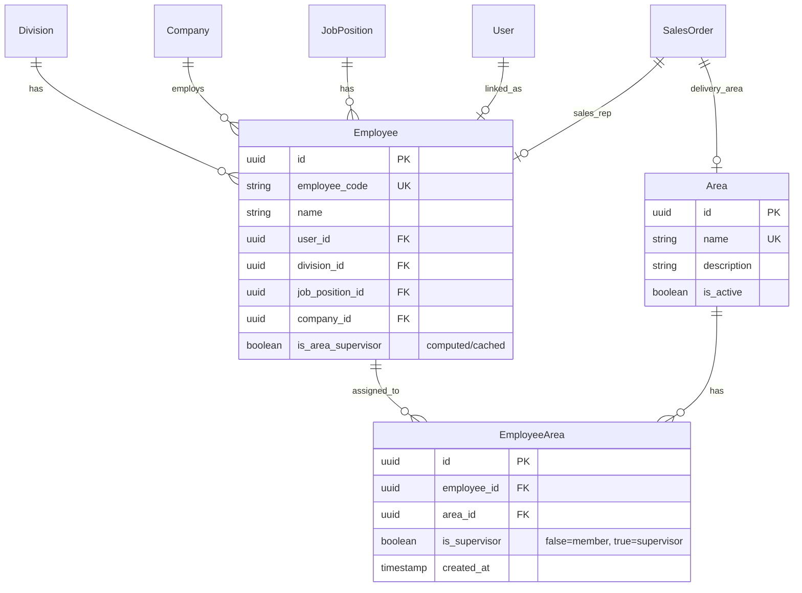
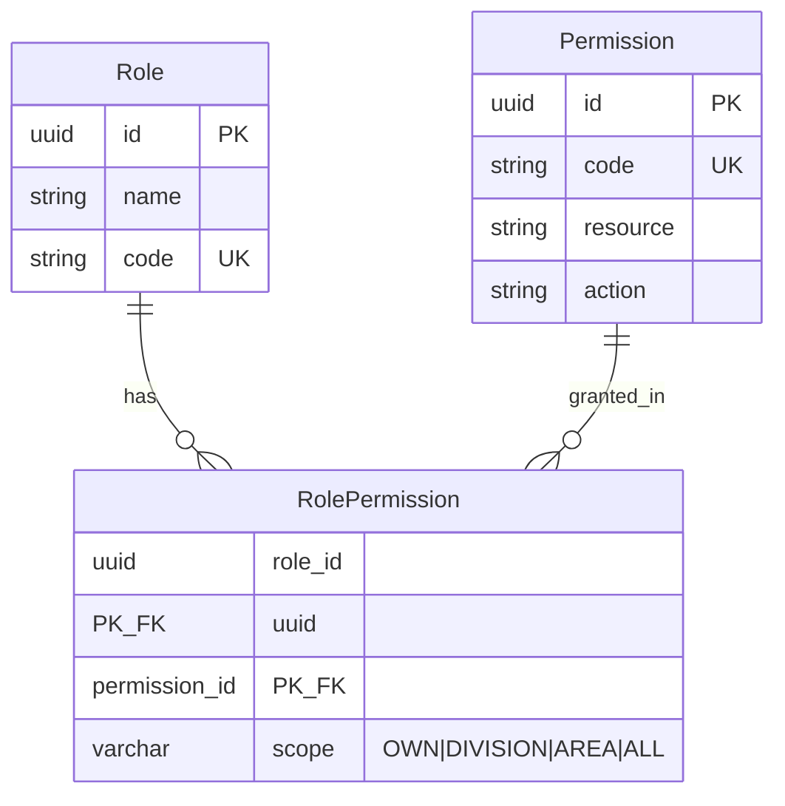

# GIMS ERP — Authorization & Data Relations Overhaul

> **Objective:** Membangun fondasi enterprise-grade authorization (RBAC + Scoped Data Access) dan memperbaiki relasi data organisasi (Division, Area, AreaSupervisor, Employee) agar siap untuk multi-team, multi-territory, dan hierarchical approval.
>
> **Reference:** [erp-sprint-planning.md](erp-sprint-planning.md) (Sprint 1–16), [erp-database-relations.mmd](erp-database-relations.mmd)
>
> **Architectural Decision:** Mengadopsi ABAC-lite (Attribute-Based Access Control) di atas RBAC — setiap permission memiliki **scope** per role yang menentukan data visibility:
> | Scope | Deskripsi |
> |-------|-----------|
> | `OWN` | Hanya data milik sendiri (assigned_to / created_by) |
> | `DIVISION` | Data dalam divisi yang sama (team-based) |
> | `AREA` | Data dalam area yang sama (territory-based) |
> | `ALL` | Semua data tanpa batasan |

---

## Milestone Overview

| Sprint | Focus | Priority |
|--------|-------|----------|
| 17 | Data Relations — Division, Area, Employee, AreaSupervisor | P0 |
| 18 | Area UI Redesign — Supervisor & Member Visibility | P0 |
| 19 | Employee Form Enhancement — User Dropdown & Area Assignment | P0 |
| 20 | Scoped Permission System — RBAC + Data-Level Authorization | P0 |
| 21 | Sales Module — Scoped Access Control Integration | P1 |
| 22 | Purchase, Stock, Finance, HRD — Scoped Access Rollout | P1 |

---

## Sprint 17: Data Relations — Division, Area, Employee, AreaSupervisor

### Goals

Memperbaiki relasi data organisasi agar:
1. **AreaSupervisor** bukan entity standalone — menjadi role/flag pada **Employee**
2. **Employee** terintegrasi penuh dengan **Area** (M:N) dan **Division**
3. **Seeder** menggunakan referensi yang benar (AreaSupervisor → Employee, Employee → Area)

### Current State (Masalah)

| Entity | Masalah |
|--------|---------|
| `AreaSupervisor` | Entity standalone dengan `Name`, `Email`, `Phone` hardcoded — **TIDAK terhubung ke Employee** |
| `AreaSupervisorArea` | Junction table ke `Area`, tapi supervisor bukan employee |
| `Employee` | Punya `EmployeeArea` M:N tapi **seeder tidak assign area** |
| `Employee` | Punya `UserID` FK tapi **form tidak ada user dropdown** |
| Seeder | `AreaSupervisor` seeder hardcode nama "Budi Santoso", "Siti Rahma" — bukan dari Employee |
| Seeder | `Employee` seeder tidak buat `EmployeeArea` records |

### Deliverables

- [x] **API:** Remove `AreaSupervisor` entity, add `is_area_supervisor` flag + `supervised_areas` to Employee
- [x] **API:** Update seeders — Employee assigns areas, supervisor references employee
- [x] **API:** Update Area endpoints to return supervisor & member info
- [x] **Frontend:** Update types & services for new structure

### API Tasks

#### Model Changes

- [x] **Remove** `AreaSupervisor` model (`area_supervisor.go`)
- [x] **Remove** `AreaSupervisorArea` model (`area_supervisor_area.go`)
- [x] **Add** to `Employee` model:
  ```go
  IsAreaSupervisor bool           `gorm:"default:false;index" json:"is_area_supervisor"`
  SupervisedAreas  []EmployeeArea `gorm:"foreignKey:EmployeeID" json:"supervised_areas,omitempty"`
  // Note: supervised_areas reuses EmployeeArea but with is_supervisor flag
  ```
- [x] **Update** `EmployeeArea` model — add supervisor flag:
  ```go
  type EmployeeArea struct {
      ID           string    `gorm:"type:uuid;primary_key" json:"id"`
      EmployeeID   string    `gorm:"type:uuid;not null;index;uniqueIndex:idx_employee_area_role" json:"employee_id"`
      AreaID       string    `gorm:"type:uuid;not null;index;uniqueIndex:idx_employee_area_role" json:"area_id"`
      IsSupervisor bool      `gorm:"default:false;uniqueIndex:idx_employee_area_role" json:"is_supervisor"`
      CreatedAt    time.Time `json:"created_at"`
      // Relations
      Employee *Employee `gorm:"foreignKey:EmployeeID" json:"employee,omitempty"`
      Area     *Area     `gorm:"foreignKey:AreaID" json:"area,omitempty"`
  }
  ```
- [x] **Update** `Area` model — add reverse relations:
  ```go
  type Area struct {
      // ... existing fields ...
      // Reverse relations (loaded via Preload)
      Members     []EmployeeArea `gorm:"foreignKey:AreaID" json:"members,omitempty"`
      Supervisors []EmployeeArea `gorm:"foreignKey:AreaID" json:"supervisors,omitempty"`
  }
  ```
- [x] **Update** migration (`migrate.go`):
  - Remove `&organization.AreaSupervisor{}`, `&organization.AreaSupervisorArea{}`
  - Ensure `EmployeeArea` has the new `is_supervisor` column
- [x] **Database migration**: Create migration to move data from `area_supervisors` + `area_supervisor_areas` → `employee_areas` with `is_supervisor=true`

#### Repository Changes

- [x] **Remove** `AreaSupervisorRepository` entirely
- [x] **Update** `EmployeeRepository`:
  - `FindAll` preloads `Areas.Area` (include `is_supervisor` flag)
  - `FindByID` preloads `Areas.Area`
  - Add `FindAreaSupervisors(ctx, areaID)` → returns employees where `is_supervisor=true` for given area
  - Add `FindAreaMembers(ctx, areaID)` → returns employees assigned to area
  - Add `AssignArea(ctx, employeeID, areaID, isSupervisor)` and `RemoveArea(ctx, employeeID, areaID)`
- [x] **Update** `AreaRepository`:
  - `FindAll` optionally preloads member/supervisor counts
  - `FindByID` preloads `Members.Employee` and `Supervisors.Employee` (filtered by `is_supervisor`)
  - Add `FindByEmployeeID(ctx, employeeID)` → areas where employee is assigned

#### DTO Changes

- [x] **Remove** all `AreaSupervisor` DTOs
- [x] **Update** `EmployeeResponseDTO` — include `areas` with `is_supervisor` flag
- [x] **Update** `AreaResponseDTO` — include `supervisor_count`, `member_count`, optional `supervisors[]`, `members[]`
- [x] **Update** `CreateEmployeeDTO` / `UpdateEmployeeDTO` — keep `area_ids` and add `supervised_area_ids`

#### Usecase & Handler Changes

- [x] **Remove** `AreaSupervisorUsecase` and `AreaSupervisorHandler`
- [x] **Remove** `AreaSupervisor` router registration
- [x] **Update** `EmployeeUsecase`:
  - `Create` / `Update` handles `area_ids` and `supervised_area_ids`
  - Add `AssignAsAreaSupervisor(ctx, employeeID, areaIDs)` method
  - Add `RemoveAsAreaSupervisor(ctx, employeeID, areaIDs)` method
- [x] **Update** `AreaUsecase`:
  - `GetByID` returns supervisors and members
  - Add `AssignSupervisor(ctx, areaID, employeeID)` endpoint
  - Add `AssignMembers(ctx, areaID, employeeIDs)` endpoint
- [x] **Update** Employee router — add area assignment endpoints
- [x] **Update** Area router — add supervisor/member assignment endpoints

#### Seeder Changes

- [x] **Remove** AreaSupervisor seeding from `organization_seeder.go`
- [x] **Update** `employee_seeder.go`:
  - Assign areas to employees via `EmployeeArea`
  - Mark specific employees as area supervisors (`is_supervisor=true`)
  - Example: Admin employee → supervisor of Area Jabodetabek, Area Jawa Barat
  - Example: Staff employee → member of Area Jabodetabek

#### Permission Changes

- [x] **Remove** `area_supervisor.*` permissions from `permission_seeder.go`
- [x] **Add/Update** `employee.assign_area` and `area.assign_supervisor` permissions

### Frontend Tasks

- [x] **Update** organization types — remove `AreaSupervisor`, update `Area` with counts
- [x] **Remove** area-supervisor components folder entirely
- [x] **Remove** area-supervisor hooks, services, schemas, i18n
- [x] **Update** sidebar/navigation — remove "Area Supervisors" menu item
- [x] **Update** Employee types — add `is_area_supervisor`, `supervised_areas`
- [x] **Update** route validator — remove area-supervisor route

### Table Relations (After Changes)



### Business Logic

- Employee dapat di-assign ke **multiple areas** (M:N via `EmployeeArea`)
- Employee dapat menjadi **supervisor** dari satu atau lebih area (`is_supervisor=true` di `EmployeeArea`)
- Satu Area dapat memiliki **multiple supervisors** dan **multiple members**
- `is_area_supervisor` pada Employee model adalah **computed field** (`true` jika ada `EmployeeArea` dengan `is_supervisor=true`)
- Saat Employee di-delete (soft), `EmployeeArea` records tetap ada untuk audit trail
- Area supervisor assignment bisa dilakukan dari **halaman Employee** maupun **halaman Area**

### Success Criteria

- [x] `AreaSupervisor` entity dan tabel terhapus dari codebase
- [x] Employee bisa di-assign ke area sebagai member atau supervisor
- [x] Area endpoint mengembalikan jumlah supervisor dan member
- [x] Seeder membuat employee dengan area assignments yang benar
- [x] Frontend tidak ada broken reference ke AreaSupervisor
- [x] Semua existing tests tetap pass

### Integration Requirements

- [x] Permission integration — remove `area_supervisor.*`, add `employee.assign_area`, `area.assign_supervisor`
- [x] Migration — data dari `area_supervisors` + `area_supervisor_areas` dipindahkan ke `employee_areas`
- [x] i18n — remove area-supervisor translations, update area & employee translations

---

## Sprint 18: Area UI Redesign — Supervisor & Member Visibility

### Goals

Redesign halaman Area agar menampilkan informasi supervisor dan member secara jelas, memudahkan admin melihat area mana yang sudah/belum memiliki supervisor dan anggota.

### Deliverables

- [x] **Frontend:** Redesign Area list dengan supervisor & member visibility
- [x] **Frontend:** Area detail page/modal dengan tabs (Info, Supervisors, Members)
- [x] **Frontend:** Quick-assign supervisor & member dari halaman Area

### UI Wireframe — Area List (Redesigned)

```
┌──────────────────────────────────────────────────────────────────────────────┐
│  Areas                                                    [+ Create Area]   │
├──────────────────────────────────────────────────────────────────────────────┤
│  🔍 Search areas...                        Filter: [All ▾] [Active ▾]      │
├──────────────────────────────────────────────────────────────────────────────┤
│                                                                              │
│  ┌─────────────────────────────────────────────────────────────────────────┐ │
│  │ Name          │ Description     │ Supervisors    │ Members  │ Status   │ │
│  ├─────────────────────────────────────────────────────────────────────────┤ │
│  │ Jakarta Barat │ Area penjualan  │ 👤 Budi S. (+1)│ 👥 5     │ ● Active │ │
│  │               │ Jakarta Barat   │                │          │          │ │
│  ├─────────────────────────────────────────────────────────────────────────┤ │
│  │ Semarang      │ Area penjualan  │ ⚠ No Supervisor│ 👥 3     │ ● Active │ │
│  │               │ Semarang        │                │          │          │ │
│  ├─────────────────────────────────────────────────────────────────────────┤ │
│  │ Bandung       │ Area penjualan  │ 👤 Siti R.     │ ⚠ 0     │ ● Active │ │
│  │               │ Bandung         │                │ No member│          │ │
│  ├─────────────────────────────────────────────────────────────────────────┤ │
│  │ Surabaya      │ Area penjualan  │ ⚠ No Supervisor│ ⚠ 0     │ ○ Inact. │ │
│  │               │ Surabaya Raya   │                │ No member│          │ │
│  └─────────────────────────────────────────────────────────────────────────┘ │
│                                                                              │
│  Showing 1-4 of 5 areas                              [< 1 >]               │
└──────────────────────────────────────────────────────────────────────────────┘
```

### UI Wireframe — Area Detail Modal (Tabs)

```
┌──────────────────────────────────────────────────────────────────────────────┐
│  Area: Jakarta Barat                                              [✕]      │
├──────────────────────────────────────────────────────────────────────────────┤
│  [ Info ]  [ Supervisors (2) ]  [ Members (5) ]                            │
├──────────────────────────────────────────────────────────────────────────────┤
│                                                                              │
│  === Tab: Info ===                                                           │
│  ┌────────────────────────────────────────────────────────────────────────┐  │
│  │  Name          : Jakarta Barat                                        │  │
│  │  Description   : Area penjualan wilayah Jakarta Barat                 │  │
│  │  Status        : ● Active                                             │  │
│  │  Created       : 2025-01-15                                           │  │
│  └────────────────────────────────────────────────────────────────────────┘  │
│                                                                              │
│  === Tab: Supervisors (2) ===                                                │
│  ┌────────────────────────────────────────────────────────────────────────┐  │
│  │  [+ Assign Supervisor]                                                │  │
│  │                                                                        │  │
│  │  ┌──────────────────────────────────────────────────────────────────┐  │  │
│  │  │ 👤 EMP-001  Budi Santoso     │ Sales Division  │ [Remove]      │  │  │
│  │  │ 👤 EMP-005  Ahmad Sudirman   │ Sales Division  │ [Remove]      │  │  │
│  │  └──────────────────────────────────────────────────────────────────┘  │  │
│  └────────────────────────────────────────────────────────────────────────┘  │
│                                                                              │
│  === Tab: Members (5) ===                                                    │
│  ┌────────────────────────────────────────────────────────────────────────┐  │
│  │  [+ Assign Members]                                                   │  │
│  │                                                                        │  │
│  │  ┌──────────────────────────────────────────────────────────────────┐  │  │
│  │  │ 👤 EMP-002  Siti Rahma       │ Sales Division  │ [Remove]      │  │  │
│  │  │ 👤 EMP-003  Rudi Hartono     │ Marketing Div.  │ [Remove]      │  │  │
│  │  │ 👤 EMP-004  Dewi Anggraini   │ Sales Division  │ [Remove]      │  │  │
│  │  │ 👤 EMP-006  Joko Widodo      │ Sales Division  │ [Remove]      │  │  │
│  │  │ 👤 EMP-007  Putri Lestari    │ Marketing Div.  │ [Remove]      │  │  │
│  │  └──────────────────────────────────────────────────────────────────┘  │  │
│  └────────────────────────────────────────────────────────────────────────┘  │
│                                                                              │
│  [Edit Area]  [Delete Area]                                                 │
└──────────────────────────────────────────────────────────────────────────────┘
```

### UI Wireframe — Assign Supervisor/Members Dialog

```
┌──────────────────────────────────────────────────┐
│  Assign Supervisor to Jakarta Barat        [✕]  │
├──────────────────────────────────────────────────┤
│                                                   │
│  🔍 Search employees...                          │
│                                                   │
│  ┌─────────────────────────────────────────────┐ │
│  │ [x] EMP-001  Budi Santoso   (Sales Div.)   │ │
│  │ [ ] EMP-002  Siti Rahma     (Sales Div.)   │ │
│  │ [x] EMP-005  Ahmad Sudirman (Sales Div.)   │ │
│  │ [ ] EMP-008  Rina Wulandari (Marketing)    │ │
│  └─────────────────────────────────────────────┘ │
│                                                   │
│  Selected: 2 employees                            │
│                                                   │
│  [Cancel]                          [Assign (2)]  │
└──────────────────────────────────────────────────┘
```

### Frontend Tasks

- [x] **Redesign** `area-list.tsx` — add Supervisors & Members columns with warning indicators
- [x] **Create** `area-detail-modal.tsx` — tabbed view (Info, Supervisors, Members)
- [x] **Create** `assign-employee-dialog.tsx` — unified employee multi-select for supervisor/member assignment
- [x] **Create** `assign-employee-dialog.tsx` — (merged supervisor + member into single reusable component with `role` prop)
- [x] **Add** filters: "No Supervisor", "No Members", "Has Supervisor", "Has Members"
- [x] **Update** `area-form.tsx` — keep simple (name, description, is_active)
- [x] **Update** i18n — add area supervisor/member related translations (en + id)
- [x] **Update** area hooks — add `useAssignSupervisors`, `useAssignMembers`, `useRemoveAreaEmployee`, `useAreaDetail` hooks

### API Tasks

- [x] `GET /areas` — return `supervisor_count`, `member_count` per area (+ `has_supervisor`/`has_members` filter support)
- [x] `GET /areas/:id/detail` — return full supervisors[] and members[] with employee details
- [x] `POST /areas/:id/supervisors` — assign employee(s) as supervisor (body: `{ employee_ids: [...] }`)
- [x] `DELETE /areas/:id/employees/:emp_id` — remove employee assignment (unified route)
- [x] `POST /areas/:id/members` — assign employee(s) as member (body: `{ employee_ids: [...] }`)
- [x] `DELETE /areas/:id/employees/:emp_id` — (same unified route for both supervisor/member removal)

### Success Criteria

- [x] Area list menampilkan jumlah supervisor dan member per area
- [x] Warning icon muncul saat area belum punya supervisor atau member
- [x] Supervisor dan member bisa di-assign/remove dari halaman Area detail
- [x] Filter berdasarkan status supervisor/member berfungsi
- [x] Responsive design untuk mobile

### Integration Requirements

- [x] Permission: `area.assign_supervisor`, `area.assign_member` (baru)
- [x] i18n: translations untuk semua label baru (en + id)

---

## Sprint 19: Employee Form Enhancement — User Dropdown & Area Assignment

### Goals

Memperbaiki form Employee agar:
1. Bisa memilih **User** dari dropdown (link Employee ↔ User)
2. Bisa assign **Area** langsung dari form Employee
3. Bisa menandai Employee sebagai **Area Supervisor**

### Current State (Masalah)

| Field | Status di Form | Status di Type/API |
|-------|---------------|-------------------|
| `user_id` | **Tidak ada** di form UI | Ada di type + API |
| `area_ids` | **Tidak ada** di form UI | Ada di type + API |
| `supervised_area_ids` | **Tidak ada** | Belum ada |
| `village_id` | **Tidak ada** di form UI | Ada di type + API |
| `replacement_for_id` | **Tidak ada** di form UI | Ada di type + API |
| `place_of_birth` | **Tidak ada** di form UI | Ada di schema |

### UI Wireframe — Employee Form (Enhanced)

```
┌──────────────────────────────────────────────────────────────────────────────┐
│  Create Employee                                                     [✕]   │
├──────────────────────────────────────────────────────────────────────────────┤
│  [ Basic Info ]  [ Employment ]  [ Contract ]  [ Areas ]                   │
├──────────────────────────────────────────────────────────────────────────────┤
│                                                                              │
│  === Tab: Basic Info ===                                                     │
│  ┌────────────────────────────┐  ┌────────────────────────────┐             │
│  │ Employee Code *            │  │ Name *                     │             │
│  │ [EMP-004           ]       │  │ [                    ]     │             │
│  └────────────────────────────┘  └────────────────────────────┘             │
│  ┌────────────────────────────┐  ┌────────────────────────────┐             │
│  │ Email                      │  │ Phone                      │             │
│  │ [                    ]     │  │ [                    ]     │             │
│  └────────────────────────────┘  └────────────────────────────┘             │
│  ┌────────────────────────────┐  ┌────────────────────────────┐             │
│  │ Gender                     │  │ Date of Birth              │             │
│  │ [Male             ▾]      │  │ [📅 Select date     ]     │             │
│  └────────────────────────────┘  └────────────────────────────┘             │
│  ┌──────────────────────────────────────────────────────────────┐           │
│  │ 🔗 Link to User Account (optional)                          │           │
│  │ [Select user...                                        ▾]   │           │
│  │  ℹ️ Only users not yet linked to another employee are shown  │           │
│  └──────────────────────────────────────────────────────────────┘           │
│                                                                              │
│  === Tab: Employment === (existing fields)                                   │
│  Division, Job Position, Company, Is Active                                 │
│                                                                              │
│  === Tab: Contract === (existing fields)                                     │
│  Contract Status, Leave Quota, Dates, PTKP, Disability                      │
│                                                                              │
│  === Tab: Areas (NEW) ===                                                    │
│  ┌──────────────────────────────────────────────────────────────┐           │
│  │ Assigned Areas                                    [+ Add]   │           │
│  │                                                              │           │
│  │  ┌────────────────────────────────────────────────────────┐  │           │
│  │  │ Area             │ Role          │ Action              │  │           │
│  │  ├────────────────────────────────────────────────────────┤  │           │
│  │  │ Jakarta Barat    │ ⭐ Supervisor  │ [Change] [Remove]  │  │           │
│  │  │ Semarang         │ 👤 Member     │ [Change] [Remove]  │  │           │
│  │  │ Bandung          │ 👤 Member     │ [Change] [Remove]  │  │           │
│  │  └────────────────────────────────────────────────────────┘  │           │
│  │                                                              │           │
│  │  Select Area: [Choose area...  ▾]  Role: [Member ▾]  [Add] │           │
│  └──────────────────────────────────────────────────────────────┘           │
│                                                                              │
│  [Cancel]                                              [Save Employee]      │
└──────────────────────────────────────────────────────────────────────────────┘
```

### Deliverables

- [x] **API:** Add `GET /users/available` endpoint (users not linked to employee)
- [x] **API:** Employee form-data endpoint includes available users, areas
- [x] **Frontend:** Add User dropdown to employee form (Tab: Basic Info)
- [x] **Frontend:** Add Areas tab to employee form with role selection
- [x] **Frontend:** Update employee detail modal to show areas & user link
- [ ] **Frontend:** Area page — add "Assign Employee" button (bidirectional assignment)

### API Tasks

- [x] `GET /users/available` — returns users where `id NOT IN (SELECT user_id FROM employees WHERE user_id IS NOT NULL AND deleted_at IS NULL)`
- [x] `GET /employees/form-data` — returns `{ users: [...], areas: [...], divisions: [...], positions: [...], companies: [...] }`
- [x] `PUT /employees/:id/areas` — bulk update area assignments with roles:
  ```json
  {
    "assignments": [
      { "area_id": "uuid", "is_supervisor": false },
      { "area_id": "uuid", "is_supervisor": true }
    ]
  }
  ```
- [x] `POST /employees/:id/areas` — add single area assignment
- [x] `DELETE /employees/:id/areas/:area_id` — remove area assignment

### Frontend Tasks

- [x] **Add** Tab "Areas" to `employee-form.tsx` with area assignment table
- [x] **Add** User dropdown (combobox with search) to Basic Info tab
- [x] **Create** `use-available-users.ts` hook — queries available users
- [x] **Update** `employee-form.tsx` schema — add `user_id`, `area_assignments[]`
- [x] **Update** `employee-detail-modal.tsx` — show linked User info + area assignments
- [x] **Add** i18n keys for new fields (user link, area assignment, role labels)
- [x] **Update** Employee types — add `supervised_area_ids`, `area_assignments`

### Business Logic

- Satu User hanya bisa di-link ke satu Employee (1:1 via `user_id FK`)
- User dropdown hanya menampilkan users yang **belum** di-link ke employee lain
- Saat edit, user yang sudah di-link ke employee ini tetap muncul di dropdown
- Area assignment bisa dilakukan dari **halaman Employee** (form tab) maupun **halaman Area** (assign dialog)
- Kedua flow update tabel `employee_areas` yang sama

### Success Criteria

- [x] User dropdown muncul di form Employee dengan search/filter
- [x] Hanya available users yang muncul di dropdown
- [x] Tab Areas menampilkan assigned areas dengan role (supervisor/member)
- [x] Area bisa di-add/remove/change-role dari form Employee
- [x] Assignment dari halaman Area (Sprint 18) & halaman Employee (Sprint 19) sinkron
- [x] Employee detail modal menampilkan info User + Areas

### Integration Requirements

- [x] Permission: `employee.assign_area` (existing from Sprint 17)
- [x] i18n: translations untuk user link, area assignment, role labels (en + id)

---

## Sprint 20: Scoped Permission System — RBAC + Data-Level Authorization

### Goals

Membangun sistem permission dengan **scope** (OWN / DIVISION / AREA / ALL) per role, sehingga setiap role bisa memiliki tingkat akses data yang berbeda untuk permission yang sama.

### Architecture Decision

**Pendekatan: Scope di junction table `role_permissions`** (seperti SAP & Odoo)

```
┌──────────┐       ┌──────────────────┐       ┌──────────────┐
│  Role     │──M:N──│ role_permissions  │──M:N──│  Permission  │
│           │       │                  │       │              │
│ id        │       │ role_id (FK)     │       │ id           │
│ name      │       │ permission_id(FK)│       │ code         │
│ code      │       │ scope (NEW)      │       │ resource     │
│           │       │                  │       │ action       │
└──────────┘       └──────────────────┘       └──────────────┘
```

**Mengapa junction table?**
- Role A bisa punya `sales_order.update` dengan scope `OWN`
- Role B bisa punya `sales_order.update` dengan scope `DIVISION`
- Role C bisa punya `sales_order.update` dengan scope `ALL`
- Satu permission, beda scope per role — **paling fleksibel untuk enterprise**

### Scope Definitions

| Scope | Logic | Use Case |
|-------|-------|----------|
| `OWN` | `resource.assigned_to == current_user OR resource.created_by == current_user` | Sales Rep hanya lihat order sendiri |
| `DIVISION` | `resource.sales_rep.division_id == current_user.employee.division_id` | Sales Manager lihat order timnya |
| `AREA` | `resource.area_id IN current_user.employee.area_ids` | Area Supervisor lihat order di areanya |
| `ALL` | No restriction | Admin, Director |

### Scope Applicability per Module

| Module | Scope Basis | Fields Used |
|--------|-------------|-------------|
| **Sales** | OWN / DIVISION / AREA / ALL | `sales_rep_id`, `delivery_area_id`, `created_by` |
| **Purchase** | OWN / DIVISION / ALL | `created_by`, `requester.division_id` |
| **Stock** | OWN / ALL | `warehouse_id` (future: warehouse-based scope) |
| **Finance** | OWN / ALL | `created_by` (journals, payments) |
| **HRD** | OWN / DIVISION / ALL | `employee_id`, `employee.division_id` |
| **Master Data** | ALL only | Static data, admin-managed |
| **Reports** | Follows module scope | Aggregated based on module |

### Deliverables

- [x] **API:** Update `role_permissions` junction table — add `scope` column
- [x] **API:** Update permission middleware — resolve scope and inject into context
- [x] **API:** Update auth flow — include scope info in permission map
- [x] **API:** Create `ScopeResolver` service — resolves user's data access boundaries
- [x] **Frontend:** Update role management UI — scope selector per permission
- [x] **Frontend:** Update permission assignment dialog — show scope options

### API Tasks

#### Database Schema Change

- [x] **Migration**: Add `scope` column to `role_permissions`:
  ```sql
  ALTER TABLE role_permissions ADD COLUMN scope VARCHAR(20) DEFAULT 'ALL';
  -- Valid values: 'OWN', 'DIVISION', 'AREA', 'ALL'
  ```
- [x] **Update** Role model — change from `many2many` to explicit junction:
  ```go
  // New explicit junction model
  type RolePermission struct {
      RoleID       string `gorm:"type:uuid;not null;primaryKey" json:"role_id"`
      PermissionID string `gorm:"type:uuid;not null;primaryKey" json:"permission_id"`
      Scope        string `gorm:"type:varchar(20);default:'ALL'" json:"scope"`
      // Relations
      Role       *Role       `gorm:"foreignKey:RoleID" json:"role,omitempty"`
      Permission *Permission `gorm:"foreignKey:PermissionID" json:"permission,omitempty"`
  }
  ```

#### Middleware Changes

- [x] **Update** `AuthMiddleware` — load permissions WITH scope:
  ```go
  // Change from map[string]bool to map[string]string (code → scope)
  // e.g. {"sales_order.read": "DIVISION", "sales_order.update": "OWN"}
  ```
- [x] **Update** `RequirePermission` — now also sets scope in context:
  ```go
  func RequirePermission(code string) gin.HandlerFunc {
      // ... existing checks ...
      scope := permMap[code] // "OWN", "DIVISION", "AREA", "ALL"
      c.Set("permission_scope", scope)
      c.Next()
  }
  ```
- [x] **Create** `ScopeMiddleware` — resolves user's employee, division, areas:
  ```go
  func ScopeMiddleware(employeeRepo EmployeeRepository) gin.HandlerFunc {
      // Fetches user's employee record (with division + areas)
      // Sets "user_employee_id", "user_division_id", "user_area_ids" in context
  }
  ```
- [x] **Create** `ScopeResolver` utility:
  ```go
  type ScopeFilter struct {
      Scope       string   // OWN, DIVISION, AREA, ALL
      UserID      string
      EmployeeID  string
      DivisionID  string
      AreaIDs     []string
  }
  
  func (sf *ScopeFilter) ApplyToQuery(db *gorm.DB, opts ScopeQueryOptions) *gorm.DB {
      switch sf.Scope {
      case "OWN":
          return db.Where("created_by = ? OR sales_rep_id = (SELECT id FROM employees WHERE user_id = ?)", sf.UserID, sf.UserID)
      case "DIVISION":
          return db.Where("sales_rep_id IN (SELECT id FROM employees WHERE division_id = ?)", sf.DivisionID)
      case "AREA":
          return db.Where("delivery_area_id IN ?", sf.AreaIDs)
      default: // ALL
          return db
      }
  }
  ```

#### Seeder Changes

- [x] **Update** `permission_seeder.go` — seed with scope per role:
  ```go
  // Admin: ALL scope for everything
  // Manager: DIVISION scope for sales/purchase
  // Staff: OWN scope for sales/purchase
  // Viewer: OWN scope (read-only)
  ```
- [x] **Update** `role_seeder.go` — add more roles:
  ```go
  // Existing: Admin, Manager, Staff, Viewer
  // New: Area Supervisor, Sales Director, Finance Manager
  ```

### Frontend Tasks

#### UI Wireframe — Assign Permissions Dialog (with Scope)

```
┌──────────────────────────────────────────────────────────────────────────────┐
│  Assign Permissions to Role: Sales Manager                         [✕]     │
├──────────────────────────────────────────────────────────────────────────────┤
│  🔍 Search permissions...                                                   │
│                                                                              │
│  ┌────────────────────────────────────────────────────────────────────────┐  │
│  │ ▼ Sales                                                               │  │
│  │   ┌────────────────────────────────────────────────────────────────┐   │  │
│  │   │ Permission           │ Action  │ Scope                        │   │  │
│  │   ├────────────────────────────────────────────────────────────────┤   │  │
│  │   │ [x] sales_order.read │ VIEW    │ [OWN ▾] [DIVISION ▾] [✓]    │   │  │
│  │   │ [x] sales_order.create│ CREATE │ [── N/A ──]                  │   │  │
│  │   │ [x] sales_order.update│ EDIT   │ [OWN ▾] [DIVISION ✓] [AREA] │   │  │
│  │   │ [x] sales_order.delete│ DELETE │ [OWN ✓] [DIVISION] [AREA]   │   │  │
│  │   │ [ ] sales_order.approve│APPROVE│ [── disabled ──]             │   │  │
│  │   └────────────────────────────────────────────────────────────────┘   │  │
│  │                                                                        │  │
│  │ ▼ Purchase                                                            │  │
│  │   ┌────────────────────────────────────────────────────────────────┐   │  │
│  │   │ [x] purchase_order.read│ VIEW  │ [DIVISION ✓]                 │   │  │
│  │   │ [x] purchase_order.update│EDIT │ [OWN ✓]                      │   │  │
│  │   └────────────────────────────────────────────────────────────────┘   │  │
│  │                                                                        │  │
│  │ ▶ Master Data (click to expand)                                       │  │
│  │ ▶ HRD (click to expand)                                              │  │
│  │ ▶ Finance (click to expand)                                          │  │
│  └────────────────────────────────────────────────────────────────────────┘  │
│                                                                              │
│  ℹ️ Scope: OWN = own data only, DIVISION = team data, AREA = territory,     │
│     ALL = unrestricted. CREATE actions don't need scope.                     │
│                                                                              │
│  [Cancel]                                                 [Save Changes]    │
└──────────────────────────────────────────────────────────────────────────────┘
```

#### Frontend Tasks (Continued)

- [x] **Update** `assign-permissions-dialog.tsx` — add scope selector per permission
- [x] **Update** role types — add `scope` field to role-permission relationship
- [x] **Update** permission service — handle scope in assign/unassign APIs
- [x] **Update** role hooks — mutations for scope changes
- [x] **Add** scope explanation tooltip/info in the UI
- [x] **Update** i18n — scope-related translations (en + id)
- [x] **Update** auth store/context — store scope info from login response

### Table Relations



### Business Logic

- **Scope `ALL`** adalah default — backward compatible dengan sistem permission yang ada
- **Scope `OWN`** untuk actions: READ, UPDATE, DELETE, APPROVE
- **Scope tidak berlaku** untuk actions: CREATE (karena belum ada resource)
- **Admin role** tetap bypass semua permission check (termasuk scope)
- **Scope resolution order**: User → Employee → Division + Areas
- **Cache**: Permission+scope map di-cache di Redis per session (invalidate on role change)
- **Backward compatibility**: Semua existing `RequirePermission()` calls tetap work — scope `ALL` jika tidak ada scope check

### Success Criteria

- [x] `role_permissions` table memiliki kolom `scope`
- [x] Middleware menginjeksi scope ke context untuk setiap request
- [x] Assign permissions dialog menampilkan scope selector
- [x] Seeder membuat role dengan scope yang sesuai (Admin=ALL, Staff=OWN, etc.)
- [x] Existing permission checks backward compatible
- [ ] Unit test untuk ScopeResolver dengan semua scope variants
- [x] Auth response includes scope info in permissions

### Integration Requirements

- [x] Database migration yang safe (add column with default `ALL`)
- [x] Permission seeder update (idempotent)
- [x] Auth DTO update — permissions response includes scope
- [x] i18n — scope labels, descriptions (en + id)

---

## Sprint 21: Sales Module — Scoped Access Control Integration

### Goals

Mengintegrasikan scoped permission system (Sprint 20) ke seluruh modul Sales:
- Sales Estimation, Quotation, Order, Delivery Order, Invoice
- Replace hardcoded role checks (`checkAccess`) dengan scope-based filtering
- Data visibility berdasarkan scope

### Current State (Masalah)

```go
// sales_order_usecase.go — checkAccess() saat ini:
// - Admin/Manager → bypass (hardcoded)
// - Others → check created_by OR sales_rep (hardcoded)
// - Returns ErrSalesOrderNotFound (obfuscated 404)

// Masalah:
// 1. Tidak ada DIVISION-based filtering
// 2. Tidak ada AREA-based filtering
// 3. Manager selalu bypass → tidak territory-aware
// 4. List endpoint filter SalesRepID is hardcoded for non-admin
```

### Deliverables

- [ ] **API:** Replace `checkAccess()` with scope-based authorization across all Sales usecases
- [ ] **API:** Update List endpoints — apply scope filter to queries
- [ ] **API:** Update GetByID endpoints — verify scope-based access
- [ ] **Frontend:** Sales list conditionally shows data based on user scope

### API Tasks

#### Refactor Sales Authorization

- [ ] **Create** `internal/sales/domain/authorization/scope_authorizer.go`:
  ```go
  type SalesAuthorizer struct {
      employeeRepo organization.EmployeeRepository
  }
  
  // BuildScopeFilter creates a scope filter from the current request context
  func (a *SalesAuthorizer) BuildScopeFilter(ctx context.Context, scope string) (*ScopeFilter, error)
  
  // ApplyListFilter applies scope to a list query
  func (a *SalesAuthorizer) ApplyListFilter(db *gorm.DB, filter *ScopeFilter) *gorm.DB
  
  // CheckAccess verifies access to a specific resource
  func (a *SalesAuthorizer) CheckAccess(ctx context.Context, filter *ScopeFilter, resource SalesResource) error
  ```

- [ ] **Update** `SalesOrderUsecase` — replace `checkAccess()`:
  ```go
  func (u *salesOrderUsecase) GetByID(ctx context.Context, id string) (*dto.SalesOrderResponse, error) {
      order, err := u.repo.FindByID(ctx, id)
      if err != nil { return nil, err }

      scope := ctx.Value("permission_scope").(string)
      filter, _ := u.authorizer.BuildScopeFilter(ctx, scope)
      if err := u.authorizer.CheckAccess(ctx, filter, order); err != nil {
          return nil, ErrSalesOrderNotFound // Still obfuscated for security
      }
      // ...
  }
  ```
- [ ] **Update** `SalesOrderUsecase.List()` — remove hardcoded `SalesRepID` filter:
  ```go
  func (u *salesOrderUsecase) List(ctx context.Context, params *dto.ListParams) (...) {
      scope := ctx.Value("permission_scope").(string)
      filter, _ := u.authorizer.BuildScopeFilter(ctx, scope)
      // filter automatically applies OWN/DIVISION/AREA/ALL to the query
      query := u.authorizer.ApplyListFilter(baseQuery, filter)
      // ...
  }
  ```
- [ ] **Apply same pattern** to:
  - `SalesEstimationUsecase`
  - `SalesQuotationUsecase`
  - `DeliveryOrderUsecase`
  - `CustomerInvoiceUsecase`

#### Per-Entity Scope Mapping

| Entity | OWN Field | DIVISION Field | AREA Field |
|--------|-----------|----------------|------------|
| SalesEstimation | `sales_rep_id` / `created_by` | `SalesRep.DivisionID` | `area_id` |
| SalesQuotation | `sales_rep_id` / `created_by` | `SalesRep.DivisionID` | (via estimation) |
| SalesOrder | `sales_rep_id` / `created_by` | `SalesRep.DivisionID` | `delivery_area_id` |
| DeliveryOrder | `SalesOrder.sales_rep_id` / `created_by` | via SalesOrder | via SalesOrder |
| CustomerInvoice | `SalesOrder.sales_rep_id` / `created_by` | via SalesOrder | via SalesOrder |

### Frontend Tasks

- [ ] **Update** sales list hooks — pass scope-aware params (backend handles filtering)
- [ ] **Remove** client-side role-based visibility hacks (if any)
- [ ] **Add** visual indicator showing current user's data scope (optional tooltip)
- [ ] **Test** all sales pages with different role/scope combinations

### Scope Behavior Matrix

| Role | Scope | Sales Order List | Sales Order Detail | Create | Update | Delete |
|------|-------|------------------|--------------------|--------|--------|--------|
| Admin | ALL | See all | Access all | Yes | Yes | Yes |
| Sales Director | ALL | See all | Access all | Yes | Yes | Yes |
| Area Supervisor | AREA | Orders in their areas | Access if in area | Yes | Area orders | Area orders |
| Sales Manager | DIVISION | Orders from their division | Access if same division | Yes | Division orders | Division orders |
| Sales Rep | OWN | Own orders only | Own orders only | Yes | Own orders | Own orders |
| Viewer | OWN | Own orders (read) | Own orders (read) | No | No | No |

### Business Logic

- **403 vs 404**: Tetap return 404 (ErrNotFound) untuk access denied — OWASP best practice, no information leakage
- **DIVISION scope**: `SalesRep.DivisionID == CurrentUser.Employee.DivisionID`
- **AREA scope**: `DeliveryAreaID IN CurrentUser.Employee.AreaIDs` (includes supervised areas)
- **OWN scope**: `SalesRepID == CurrentUser.EmployeeID OR CreatedBy == CurrentUser.ID`
- **Fallback**: Jika user tidak punya employee record, default scope = `OWN` (based on `created_by` only)

### Success Criteria

- [ ] Sales Rep hanya bisa lihat/edit order sendiri (OWN scope)
- [ ] Sales Manager bisa lihat/edit order divisinya (DIVISION scope)
- [ ] Area Supervisor bisa lihat/edit order di areanya (AREA scope)
- [ ] Admin bisa akses semua (ALL scope)
- [ ] 404 returned for unauthorized access (not 403)
- [ ] No regression — existing CRUD still works
- [ ] Performance: scope filter uses indexed columns

### Integration Requirements

- [ ] Depends on Sprint 17 (Employee-Area relations)
- [ ] Depends on Sprint 20 (Scoped permission system)
- [ ] Migration: none (pure logic change)
- [ ] Seeder: update sales seeders to use diverse SalesRep assignments for testing

---

## Sprint 22: Purchase, Stock, Finance, HRD — Scoped Access Rollout

### Goals

Roll out scoped authorization ke modul-modul remaining:
- **Purchase**: OWN / DIVISION / ALL
- **Stock**: OWN / ALL (warehouse-based scope future)
- **Finance**: OWN / ALL (highly restricted)
- **HRD**: OWN / DIVISION / ALL

### Scope Matrix per Module

#### Purchase

| Role | Scope | Behavior |
|------|-------|----------|
| Procurement Staff | OWN | Own requisitions/orders only |
| Procurement Manager | DIVISION | Division requisitions/orders |
| Finance | ALL (read) | View all for payment |
| Admin | ALL | Full access |

**Scope fields**: `created_by`, `requester.division_id`

#### Stock / Inventory

| Role | Scope | Behavior |
|------|-------|----------|
| Warehouse Staff | OWN | Own transactions only |
| Warehouse Manager | ALL | All warehouse transactions |
| Admin | ALL | Full access |

**Scope fields**: `created_by` (future: `warehouse_id` based)

#### Finance

| Role | Scope | Behavior |
|------|-------|----------|
| Finance Staff | OWN | Own journals/payments (draft) |
| Finance Manager | ALL | All financial data |
| Admin | ALL | Full access |

**Scope fields**: `created_by`

> **Note**: Finance modul harus **extra ketat** — salary data, journal entries, payment info harus strongly isolated.

#### HRD

| Role | Scope | Behavior |
|------|-------|----------|
| Employee | OWN | Own records only (attendance, leave, contracts) |
| HR Staff | DIVISION | Division employees |
| HR Manager | ALL | All employees |
| Admin | ALL | Full access |

**Scope fields**: `employee_id`, `employee.division_id`

### Deliverables

- [ ] **API:** Apply ScopeResolver to Purchase usecases
- [ ] **API:** Apply ScopeResolver to Stock usecases
- [ ] **API:** Apply ScopeResolver to Finance usecases
- [ ] **API:** Apply ScopeResolver to HRD usecases
- [ ] **API:** Update seeders — diverse user assignments for testing scope
- [ ] **Frontend:** Verify all module lists respect scope (backend-driven)

### API Tasks

- [ ] **Purchase**: Update `PurchaseRequisitionUsecase`, `PurchaseOrderUsecase`, `GoodsReceiptUsecase`, `SupplierInvoiceUsecase` — apply scope filter
- [ ] **Stock**: Update `InventoryUsecase`, `StockMovementUsecase`, `StockOpnameUsecase` — apply scope filter
- [ ] **Finance**: Update all Finance usecases — apply scope filter (default: highly restricted)
- [ ] **HRD**: Update `LeaveRequestUsecase`, `AttendanceUsecase`, `EmployeeContractUsecase`, etc. — apply scope filter

### Success Criteria

- [ ] All modules use ScopeResolver (no hardcoded role checks)
- [ ] Each module's scope works as per matrix above
- [ ] No regression on existing functionality
- [ ] Employee can only see own HRD data (attendance, leave, contracts)
- [ ] Finance data properly isolated
- [ ] Seeder data covers all scope scenarios for testing

### Integration Requirements

- [ ] Depends on Sprint 20 (permission scope infrastructure)
- [ ] Depends on Sprint 21 (ScopeResolver pattern from Sales)
- [ ] Permission seeder update — scope assignments for all roles across all modules

---

## Development Priorities

| Priority | Sprint | Rationale |
|----------|--------|-----------|
| **P0** | 17 | Foundation — semua sprint lain depend on data relations |
| **P0** | 18 | UX critical — admin harus bisa manage areas properly |
| **P0** | 19 | UX critical — employee-user link diperlukan untuk authorization |
| **P0** | 20 | Infrastructure — scoped permission sistem diperlukan sebelum integration |
| **P1** | 21 | Integration — Sales adalah modul pertama dan paling kompleks |
| **P1** | 22 | Rollout — extend ke remaining modules |

---

## Risk Assessment

| Risk | Impact | Mitigation |
|------|--------|------------|
| Breaking change on AreaSupervisor removal | Existing seeded data hilang | Migration script pindahkan data sebelum drop table |
| Performance hit dari scope resolution (extra JOINs) | Query lambat di list endpoints | Index pada `division_id`, `area_id`, `sales_rep_id` + query caching |
| Backward compatibility middleware change | Existing endpoint error | Default scope = `ALL` — backward compatible |
| Complex frontend changes on permission dialog | UI complexity increase | Progressive enhancement — scope hidden jika role hanya punya ALL |

---

## Technical Notes

### Permission Map Format Change

**Before (Sprint 1–16):**
```go
// map[string]bool
{"sales_order.read": true, "sales_order.update": true}
```

**After (Sprint 20+):**
```go
// map[string]string (permission_code → scope)
{"sales_order.read": "DIVISION", "sales_order.update": "OWN", "area.read": "ALL"}
```

### ScopeResolver Cache Strategy

```
Login → Load permissions + scope from DB → Cache in Redis (TTL = session lifetime)
Role change → Invalidate cache → Force re-login or hot-reload permissions
```

### Migration Safety

All migrations will be **additive** (add columns, add tables) rather than destructive:
1. Sprint 17: Add `is_supervisor` to `employee_areas`, copy data from `area_supervisor_areas` → then drop old tables in separate migration
2. Sprint 20: Add `scope` column to `role_permissions` with `DEFAULT 'ALL'` — zero downtime

---

## References

- [SAP Authorization Concept](https://help.sap.com/docs/SAP_S4HANA_ON-PREMISE/4299d0be4d224af2baab43e73f25e1de) — Role + Organization Level + Data Level
- [Odoo Record Rules](https://www.odoo.com/documentation/17.0/developer/reference/backend/security.html) — RBAC + Object-Level Restrictions
- [OWASP ABAC](https://cheatsheetseries.owasp.org/cheatsheets/Authorization_Cheat_Sheet.html) — Attribute-Based Access Control
- [NIST ABAC Guide SP 800-162](https://csrc.nist.gov/publications/detail/sp/800-162/final)
