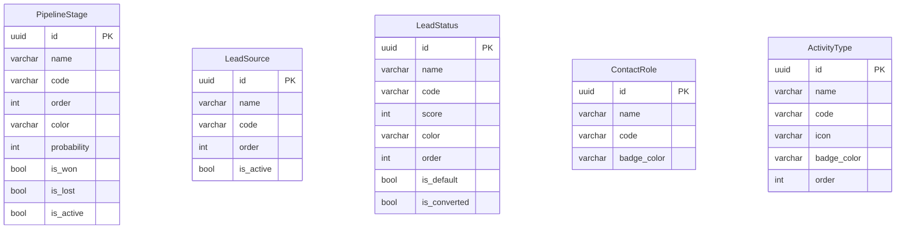
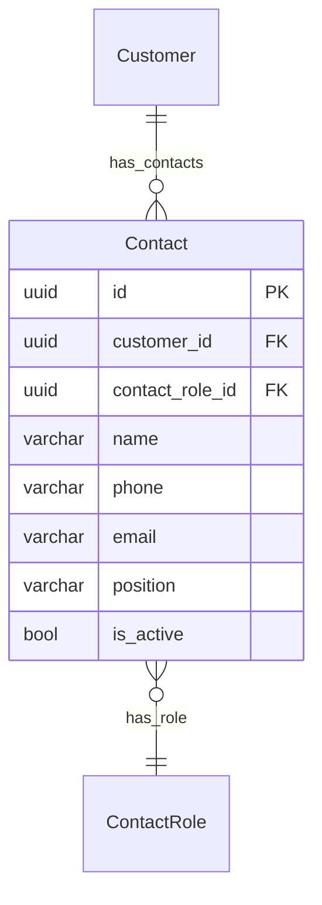
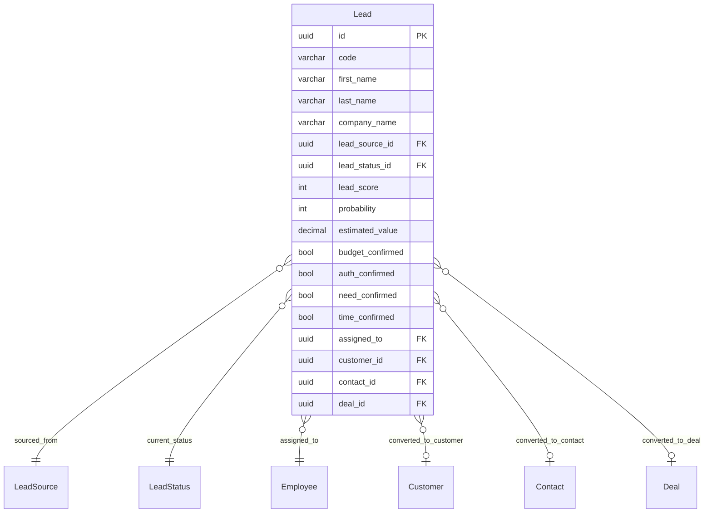
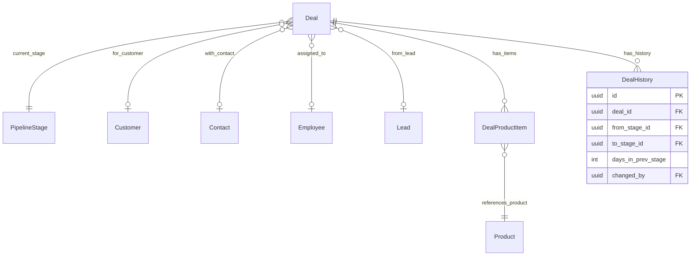
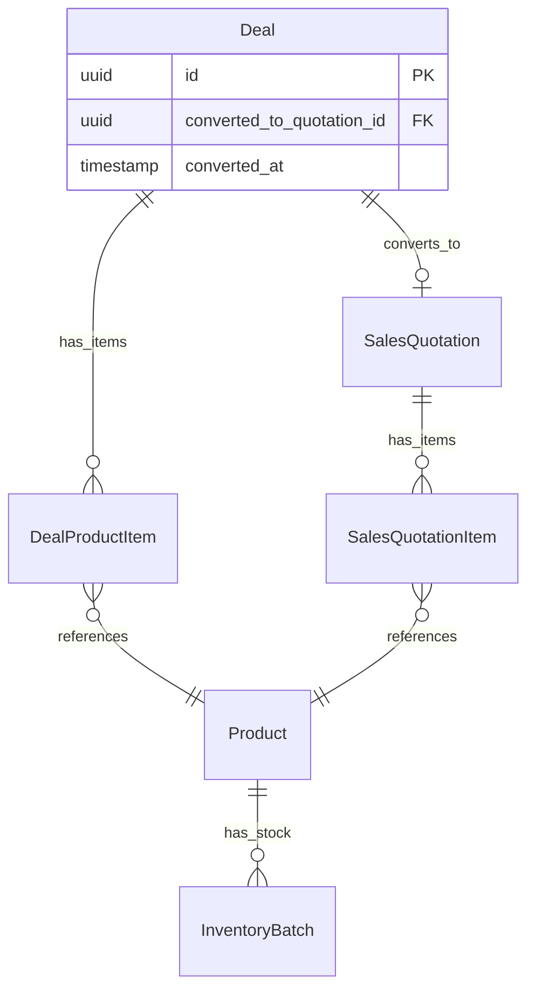
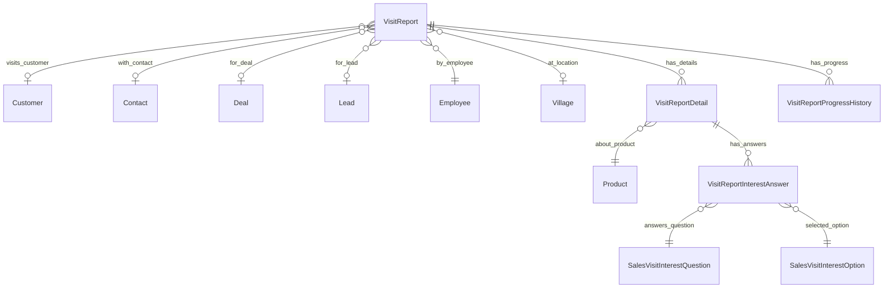
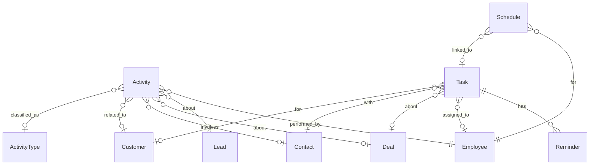
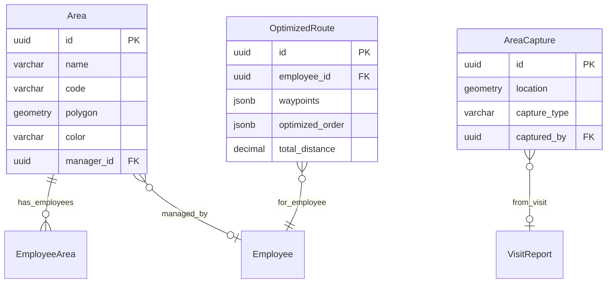
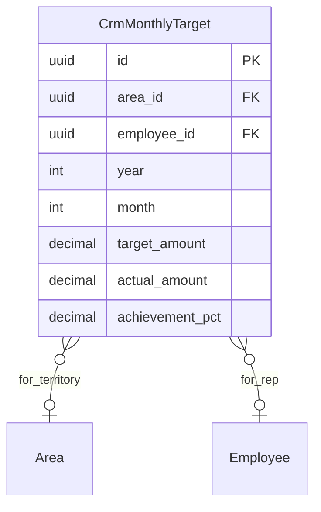

# GIMS ERP - CRM Module Integration Sprint Planning

> **Source:** CRM SalesView standalone (`apps/api-crm/`) diintegrasikan ke ERP (`apps/api/`) sebagai modul CRM baru.
>
> **Reference:** [erp-sprint-planning.md](erp-sprint-planning.md) | [erp-database-relations.mmd](erp-database-relations.mmd) | [api-standart/README.md](api-standart/README.md)

---

## Ringkasan Integrasi

CRM SalesView adalah aplikasi standalone untuk field sales CRM. Integrasi ini menyatukan CRM ke dalam ERP sebagai modul `crm` baru di `apps/api/internal/crm/`, sehingga menjadi **satu sistem ERP-CRM terpadu** yang:

- **Sales pipeline** (Lead → Deal → Quotation → Order → Delivery → Invoice) menjadi end-to-end
- **Deal won** bisa otomatis membuat Sales Quotation dan mengecek ketersediaan stock inventory
- **Customer** menjadi single source of truth, Contact menjadi child dari Customer
- **Area** (Master Data) diperbarui dengan tambahan map polygon outline, color, dan area manager — konsep Brick dari CRM digabung ke Area
- **Visit Reports** merged — fitur terbaik dari ERP (interest survey) dan CRM (approval, photos) digabung

### Modul CRM yang TIDAK Dimigrasi (sudah ada di ERP)

| Modul CRM | Alasan Skip | Pakai Modul ERP |
|-----------|-------------|-----------------|
| AI/Chatbot | Sudah ada di ERP | `internal/ai/` |
| Division | Sudah ada di ERP | `internal/organization/` (Division) |
| Group | Fungsionalitas serupa | `internal/organization/` (BusinessUnit) |
| Roles & Permissions | Sudah ada di ERP | `internal/role/`, `internal/permission/` |
| User Management | Sudah ada di ERP | `internal/user/` |
| Reports | Akan dibangun khusus CRM | Sprint 26 |
| Products | Sudah ada di ERP (lebih lengkap) | `internal/product/` (8 entity) |

### Modul ERP yang Perlu Di-update

| Modul ERP | Update | Alasan |
|-----------|--------|--------|
| Customer | Tambah tab Contacts | Contact jadi child dari Customer |
| Area (Organization) | Tambah field map polygon, color, manager | Merge konsep Brick + Area |
| Sales Estimation | Deprecate → redirect ke Pipeline | Pipeline CRM menggantikan |
| Sales Visit | Deprecate → redirect ke Visit Reports CRM | Merged jadi 1 entitas |
| Sales Menu | Remove Estimation & Visit links | Pindah ke CRM module |

---

## Milestone Overview

| Sprint | Module | Focus |
|--------|--------|-------|
| 17 | CRM | Foundation & Settings (Pipeline Stages, Lead Sources/Statuses, Contact Roles, Activity Types) |
| 18 | CRM | Contact Management + Customer Integration |
| 19 | CRM | Lead Management (BANT, Scoring, Conversion) |
| 20 | CRM | Pipeline & Deal Management (Kanban, Product Items, History) |
| 21 | CRM | Integration — Deal Won → Sales Quotation + Stock Check |
| 22 | CRM | Visit Reports (Merged ERP + CRM) |
| 23 | CRM | Activity, Task & Schedule Management |
| 24 | CRM | Area Enhancement (Master Data) + Area Mapping + Route Optimization |
| 25 | CRM | Sales Performance, Product Analytics & CRM Targets |
| 26 | CRM | Notifications, Events, Reports & Polish |

---

## Menu Structure CRM

```
CRM                                → /crm
├── Leads                          → /crm/leads
├── Pipeline                       → /crm/pipeline
├── Activities                     → /crm/activities
├── Tasks                          → /crm/tasks
├── Schedules                      → /crm/schedules
├── Visit Reports                  → /crm/visits
├── Area Mapping                   → /crm/area-mapping
├── Route Optimization             → /crm/routes
├── Sales Performance              → /crm/sales-performance
├── Product Analytics              → /crm/product-analytics
├── CRM Targets                    → /crm/targets
└── CRM Settings                   → /crm/settings
    ├── Pipeline Stages            → /crm/settings/pipeline
    ├── Lead Sources               → /crm/settings/lead-sources
    ├── Lead Statuses              → /crm/settings/lead-statuses
    ├── Contact Roles              → /crm/settings/contact-roles
    └── Activity Types             → /crm/settings/activity-types
```

**Total: 14 menu items** (1 parent + 13 children/sub-children)

> **Note:** **Contacts** bukan menu CRM terpisah — Contact adalah tab di dalam Customer side panel (Master Data → Customers). **Area Management** bukan menu CRM — diperbarui di Master Data → Organization → Areas.

---

## Sprint 17: CRM - Foundation & Settings

### Deliverables

- [x] **API:** CRM domain structure + Settings CRUD endpoints
- [x] **Frontend:** CRM Settings pages (5 sub-pages)

### API Tasks

#### Domain Setup
- [x] Create domain folder: `apps/api/internal/crm/`
- [x] Create vertical slice structure: `data/models/`, `data/repositories/`, `domain/dto/`, `domain/mapper/`, `domain/usecase/`, `presentation/handler/`, `presentation/router/`

#### Pipeline Stage
- [x] `PipelineStage` - Model, Repository, DTO, Mapper, Usecase, Handler, Router

```go
// PipelineStage — Configurable pipeline stages for deal management
type PipelineStage struct {
    ID          string  `gorm:"type:uuid;primary_key;default:gen_random_uuid()"`
    Name        string  `gorm:"type:varchar(100);not null;uniqueIndex"`
    Code        string  `gorm:"type:varchar(50);not null;uniqueIndex"`
    Order       int     `gorm:"not null;index"`
    Color       string  `gorm:"type:varchar(20)"`
    Probability int     `gorm:"type:int;default:0"` // 0-100
    IsWon       bool    `gorm:"default:false"`
    IsLost      bool    `gorm:"default:false"`
    IsActive    bool    `gorm:"default:true;index"`
    Description string  `gorm:"type:text"`
    // timestamps + soft delete
}
```

#### Lead Source
- [x] `LeadSource` - Model, Repository, DTO, Mapper, Usecase, Handler, Router

```go
// LeadSource — Origin of leads (Website, Referral, Cold Call, etc.)
type LeadSource struct {
    ID          string `gorm:"type:uuid;primary_key;default:gen_random_uuid()"`
    Name        string `gorm:"type:varchar(100);not null;uniqueIndex"`
    Code        string `gorm:"type:varchar(50);not null;uniqueIndex"`
    Description string `gorm:"type:text"`
    Order       int    `gorm:"default:0"`
    IsActive    bool   `gorm:"default:true;index"`
    // timestamps + soft delete
}
```

#### Lead Status
- [x] `LeadStatus` - Model, Repository, DTO, Mapper, Usecase, Handler, Router

```go
// LeadStatus — Lead lifecycle states (New, Contacted, Qualified, Converted, Lost)
type LeadStatus struct {
    ID          string `gorm:"type:uuid;primary_key;default:gen_random_uuid()"`
    Name        string `gorm:"type:varchar(100);not null;uniqueIndex"`
    Code        string `gorm:"type:varchar(50);not null;uniqueIndex"`
    Description string `gorm:"type:text"`
    Score       int    `gorm:"default:0"`           // Weight for lead scoring
    Color       string `gorm:"type:varchar(20)"`
    Order       int    `gorm:"default:0"`
    IsActive    bool   `gorm:"default:true;index"`
    IsDefault   bool   `gorm:"default:false"`       // Default status for new leads
    IsConverted bool   `gorm:"default:false"`        // Marks conversion endpoint
    // timestamps + soft delete
}
```

#### Contact Role
- [x] `ContactRole` - Model, Repository, DTO, Mapper, Usecase, Handler, Router

```go
// ContactRole — Role classification for contacts (Director, PIC, Manager, etc.)
type ContactRole struct {
    ID          string `gorm:"type:uuid;primary_key;default:gen_random_uuid()"`
    Name        string `gorm:"type:varchar(100);not null;uniqueIndex"`
    Code        string `gorm:"type:varchar(50);not null;uniqueIndex"`
    Description string `gorm:"type:text"`
    BadgeColor  string `gorm:"type:varchar(20)"`
    IsActive    bool   `gorm:"default:true;index"`
    // timestamps + soft delete
}
```

#### Activity Type
- [x] `ActivityType` - Model, Repository, DTO, Mapper, Usecase, Handler, Router

```go
// ActivityType — Dynamic activity classification (Visit, Call, Email, Meeting, etc.)
type ActivityType struct {
    ID          string `gorm:"type:uuid;primary_key;default:gen_random_uuid()"`
    Name        string `gorm:"type:varchar(100);not null;uniqueIndex"`
    Code        string `gorm:"type:varchar(50);not null;uniqueIndex"`
    Description string `gorm:"type:text"`
    Icon        string `gorm:"type:varchar(50)"`
    BadgeColor  string `gorm:"type:varchar(20)"`
    Order       int    `gorm:"default:0"`
    IsActive    bool   `gorm:"default:true;index"`
    // timestamps + soft delete
}
```

#### Infrastructure
- [x] Register semua models di `internal/core/infrastructure/database/migrate.go`
- [x] Create `presentation/routers.go` domain aggregator
- [x] Register CRM routes di main router
- [x] Seeder: default pipeline stages (Qualification → Proposal → Negotiation → Closed Won → Closed Lost)
- [x] Seeder: default lead sources (Website, Referral, Cold Call, Exhibition, Social Media)
- [x] Seeder: default lead statuses (New, Contacted, Qualified, Proposal Sent, Converted, Lost)
- [x] Seeder: default contact roles (Director, Manager, PIC, Purchasing, Finance)
- [x] Seeder: default activity types (Visit, Call, Email, Meeting, Follow Up)
- [x] Seeder: CRM menu items (parent + all children)
- [x] Seeder: CRM permissions (`crm_pipeline_stage.read|create|update|delete`, `crm_lead_source.*`, `crm_lead_status.*`, `crm_contact_role.*`, `crm_activity_type.*`)

### Frontend Tasks

- [x] Create feature folder: `apps/web/src/features/crm/`
- [x] CRM Settings - Pipeline Stages CRUD page
- [x] CRM Settings - Lead Sources CRUD page
- [x] CRM Settings - Lead Statuses CRUD page (with color picker, score input)
- [x] CRM Settings - Contact Roles CRUD page (with badge color)
- [x] CRM Settings - Activity Types CRUD page (with icon selector)
- [x] i18n translations (per-entity `i18n/en.ts` & `i18n/id.ts` for all 5 entities)
- [x] Register i18n in `src/i18n/request.ts`
- [x] Route pages: `app/[locale]/(dashboard)/crm/settings/{pipeline-stages,lead-sources,lead-statuses,contact-roles,activity-types}/page.tsx` + `loading.tsx`
- [x] Register routes di `src/lib/route-validator.ts`

### Success Criteria

- [x] Semua 5 settings entity CRUD berfungsi (create, read, update, delete)
- [x] Pipeline stages bisa di-reorder (order field di form; drag-and-drop bisa ditambahkan sebagai enhancement)
- [x] Lead statuses memiliki color badge dan score
- [x] Default data tersedia via seeder
- [x] Permission RBAC terpasang untuk setiap endpoint
- [x] i18n tersedia (en/id)

### Integration Requirements

- [x] Permission integration check (RBAC) — seeder permissions terdaftar
- [x] i18n integration check (request.ts) — translations registered
- [x] Menu seeder — CRM parent menu + children terdaftar

### Table Relations



### Business Logic

- PipelineStage `Order` menentukan urutan di Kanban board — harus unique
- Hanya boleh 1 stage dengan `IsWon = true` dan 1 dengan `IsLost = true`
- LeadStatus dengan `IsDefault = true` otomatis di-assign ke lead baru — hanya boleh 1 default
- LeadStatus dengan `IsConverted = true` menandakan status akhir konversi — hanya boleh 1 converted
- Semua settings entity tidak boleh dihapus jika masih direferensikan oleh data aktif
- Semua settings memiliki soft delete

---

## Sprint 18: CRM - Customer Contact Integration (Customer Tab)

### Deliverables

- [ ] **API:** Contact CRUD + Customer-Contact relation endpoints
- [ ] **Frontend:** Customer side panel — tambah tab Contacts (bukan page terpisah di CRM)

### API Tasks

#### Contact
- [ ] `Contact` - Model, Repository, DTO, Mapper, Usecase, Handler, Router

```go
// Contact — Person associated with a Customer, child of Customer
type Contact struct {
    ID            string  `gorm:"type:uuid;primary_key;default:gen_random_uuid()"`
    CustomerID    string  `gorm:"type:uuid;not null;index"`          // FK → customers
    Customer      *customerModels.Customer `gorm:"foreignKey:CustomerID"`
    ContactRoleID *string `gorm:"type:uuid;index"`                   // FK → crm contact_roles
    ContactRole   *ContactRole `gorm:"foreignKey:ContactRoleID"`
    Name          string  `gorm:"type:varchar(200);not null;index"`
    Phone         string  `gorm:"type:varchar(30)"`
    Email         string  `gorm:"type:varchar(100)"`
    Position      string  `gorm:"type:varchar(100)"`                 // Job title
    Notes         string  `gorm:"type:text"`
    IsActive      bool    `gorm:"default:true;index"`
    CreatedBy     *string `gorm:"type:uuid"`
    // timestamps + soft delete
}
```

- [ ] `GET /api/v1/crm/contacts` — List contacts (filterable by customer_id, contact_role_id, search)
- [ ] `GET /api/v1/crm/contacts/:id` — Get contact detail
- [ ] `POST /api/v1/crm/contacts` — Create contact (requires valid customer_id)
- [ ] `PUT /api/v1/crm/contacts/:id` — Update contact
- [ ] `DELETE /api/v1/crm/contacts/:id` — Soft delete contact
- [ ] `GET /api/v1/crm/contacts/form-data` — Returns: customers list, contact roles list
- [ ] Register model di `migrate.go`
- [ ] Seeder: sample contacts linked to existing customers
- [ ] Permission seeder: `crm_contact.read|create|update|delete`

#### Customer Module Update
- [ ] `GET /api/v1/customers/:id/contacts` — List contacts per customer (new endpoint di customer handler)
- [ ] Update customer detail response — include `contacts` count

### Frontend Tasks

- [ ] **Update Customer side panel** (`/master-data/customers`) — tambah tab "Contacts"
  - Tab shows list of contacts for the customer
  - Quick-add contact button di dalam tab (opens contact side panel form)
  - Click contact → open contact side panel (create/edit/view)
- [ ] Contact side panel form (create/edit/view) — pola `supplier-side-panel.tsx`, bisa dibuka dari Customer tab, Lead, Deal, atau Visit
- [ ] i18n: contact translations (en/id)

> **Note:** Tidak ada halaman `/crm/contacts` — Contact diakses hanya via tab di Customer side panel.

### Success Criteria

- [ ] Contact CRUD berfungsi penuh (via API)
- [ ] Contact wajib memiliki valid Customer reference
- [ ] Customer side panel menampilkan tab Contacts
- [ ] Quick-add contact dari Customer tab berfungsi
- [ ] Contact form side panel bisa dibuka dari Customer, Lead, Deal, dan Visit

### Integration Requirements

- [ ] Permission integration check (RBAC)
- [ ] i18n integration check (request.ts)
- [ ] Customer module dependency — import customer models, no circular dependency

### Table Relations



### Business Logic

- Contact **wajib** memiliki `CustomerID` yang valid — parent-child relationship
- Contact bisa memiliki optional `ContactRoleID`
- Saat Customer dihapus (soft delete), contact tetap ada tapi tidak bisa diakses via customer
- Satu Customer bisa memiliki banyak Contacts
- Contact name harus unique dalam satu Customer (prevent duplicate)
- `Position` adalah jabatan di perusahaan customer (berbeda dari `ContactRole` yang adalah klasifikasi CRM)

---

## Sprint 19: CRM - Lead Management

### Deliverables

- [ ] **API:** Lead CRUD + BANT + Analytics + Conversion
- [ ] **Frontend:** Lead pages + conversion dialog

### API Tasks

#### Lead
- [ ] `Lead` - Model, Repository, DTO, Mapper, Usecase, Handler, Router

```go
// Lead — Sales prospect with BANT qualification scoring
type Lead struct {
    ID              string  `gorm:"type:uuid;primary_key;default:gen_random_uuid()"`
    Code            string  `gorm:"type:varchar(50);uniqueIndex;not null"`
    FirstName       string  `gorm:"type:varchar(100);not null;index"`
    LastName        string  `gorm:"type:varchar(100);index"`
    CompanyName     string  `gorm:"type:varchar(200);index"`
    Email           string  `gorm:"type:varchar(100)"`
    Phone           string  `gorm:"type:varchar(30)"`
    JobTitle        string  `gorm:"type:varchar(100)"`
    Address         string  `gorm:"type:text"`
    City            string  `gorm:"type:varchar(100)"`
    Province        string  `gorm:"type:varchar(100)"`
    // Classification
    LeadSourceID    *string `gorm:"type:uuid;index"` // FK → crm lead_sources
    LeadSource      *LeadSource `gorm:"foreignKey:LeadSourceID"`
    LeadStatusID    *string `gorm:"type:uuid;index"` // FK → crm lead_statuses
    LeadStatus      *LeadStatus `gorm:"foreignKey:LeadStatusID"`
    // Scoring
    LeadScore       int     `gorm:"type:int;default:0"`    // 0-100
    Probability     int     `gorm:"type:int;default:0"`    // 0-100
    EstimatedValue  float64 `gorm:"type:decimal(15,2);default:0"`
    // BANT Qualification
    BudgetConfirmed bool    `gorm:"default:false"`
    BudgetAmount    float64 `gorm:"type:decimal(15,2);default:0"`
    AuthConfirmed   bool    `gorm:"default:false"`
    AuthPerson      string  `gorm:"type:varchar(200)"`
    NeedConfirmed   bool    `gorm:"default:false"`
    NeedDescription string  `gorm:"type:text"`
    TimeConfirmed   bool    `gorm:"default:false"`
    TimeExpected    *time.Time `gorm:"type:date"`
    // Assignment
    AssignedTo      *string `gorm:"type:uuid;index"` // FK → employees
    AssignedEmployee *orgModels.Employee `gorm:"foreignKey:AssignedTo"`
    // Conversion (populated after conversion)
    CustomerID      *string `gorm:"type:uuid;index"` // FK → customers (post-conversion)
    ContactID       *string `gorm:"type:uuid;index"` // FK → crm contacts (post-conversion)
    DealID          *string `gorm:"type:uuid;index"` // FK → crm deals (post-conversion)
    ConvertedAt     *time.Time
    ConvertedBy     *string `gorm:"type:uuid"`
    // Metadata
    Notes           string  `gorm:"type:text"`
    CreatedBy       *string `gorm:"type:uuid"`
    // timestamps + soft delete
}
```

- [ ] `GET /api/v1/crm/leads` — List leads (filterable by status, source, assigned_to, score range, date range)
- [ ] `GET /api/v1/crm/leads/:id` — Get lead detail with relations
- [ ] `POST /api/v1/crm/leads` — Create lead (auto-assign default LeadStatus)
- [ ] `PUT /api/v1/crm/leads/:id` — Update lead
- [ ] `DELETE /api/v1/crm/leads/:id` — Soft delete lead
- [ ] `GET /api/v1/crm/leads/form-data` — Returns: employees, lead sources, lead statuses, customers
- [ ] `GET /api/v1/crm/leads/analytics` — Stats by status, source, conversion rate, avg score
- [ ] `POST /api/v1/crm/leads/:id/convert` — **Lead Conversion** (see Business Logic)
- [ ] Register model di `migrate.go`
- [ ] Seeder: sample leads with varied statuses and scores
- [ ] Permission seeder: `crm_lead.read|create|update|delete|convert`

### Frontend Tasks

- [ ] Lead list page `/crm/leads` — DataTable with advanced filters (status, source, assigned, score range)
- [ ] Lead side panel form (create/edit/view) — includes BANT section
- [ ] Lead detail page `/crm/leads/[id]` — full detail with activity timeline
- [ ] Lead conversion dialog — mapping fields ke Customer + Contact + Deal
- [ ] Lead analytics cards (di atas list atau di dashboard CRM)
- [ ] i18n: lead translations (en/id)
- [ ] Route: `app/[locale]/(dashboard)/crm/leads/page.tsx` + `loading.tsx`
- [ ] Route: `app/[locale]/(dashboard)/crm/leads/[id]/page.tsx` + `loading.tsx`

### Success Criteria

- [ ] Lead CRUD berfungsi penuh dengan semua filter
- [ ] Lead Score dihitung berdasarkan BANT fields + LeadStatus score
- [ ] Lead conversion membuat Customer (jika baru) + Contact + Deal
- [ ] Lead yang sudah di-convert tidak bisa di-convert lagi
- [ ] Analytics endpoint mengembalikan data by status dan source
- [ ] Default LeadStatus otomatis di-assign saat create

### Integration Requirements

- [ ] Permission integration check (RBAC)
- [ ] i18n integration check (request.ts)
- [ ] Customer module dependency — create customer saat conversion
- [ ] Contact dependency — create contact saat conversion
- [ ] Deal dependency (Sprint 20) — create deal saat conversion (defer jika Sprint 20 belum selesai, buat tanpa deal dulu)

### Table Relations



### Business Logic

- **Auto-code**: Lead code auto-generated format `LEAD-YYYYMM-XXXXX`
- **Default status**: Saat create, jika `LeadStatusID` tidak diisi, assign status dengan `IsDefault = true`
- **Lead Score calculation**: `score = LeadStatus.Score + (BudgetConfirmed ? 15 : 0) + (AuthConfirmed ? 15 : 0) + (NeedConfirmed ? 15 : 0) + (TimeConfirmed ? 15 : 0)` — max 100
- **Lead Conversion** (`POST /leads/:id/convert`):
  1. Validate lead belum pernah di-convert (`ConvertedAt` must be nil)
  2. Validate lead status bukan "Lost"
  3. Buat Customer baru dari lead data (atau link ke existing customer jika `customer_id` provided di request)
  4. Buat Contact baru dari lead data, linked ke customer
  5. Buat Deal baru di pipeline stage pertama (lowest Order), linked ke customer + contact
  6. Update lead: set `CustomerID`, `ContactID`, `DealID`, `ConvertedAt`, `ConvertedBy`
  7. Update lead status ke status dengan `IsConverted = true`
  8. Log Activity: "Lead converted"
- Lead yang sudah di-convert (`ConvertedAt != nil`) tidak boleh dihapus
- Lead bisa di-reassign ke employee lain kapan saja

### Error Codes

| Code | HTTP | Condition |
|------|------|-----------|
| `LEAD_NOT_FOUND` | 404 | Lead with given ID not found |
| `LEAD_ALREADY_CONVERTED` | 409 | Attempt to convert already-converted lead |
| `LEAD_CANNOT_CONVERT_LOST` | 422 | Attempt to convert lead with "Lost" status |
| `LEAD_INVALID_STATUS` | 422 | Invalid lead status transition |
| `LEAD_SCORE_OUT_OF_RANGE` | 422 | Lead score must be 0-100 |

---

## Sprint 20: CRM - Pipeline & Deal Management

### Deliverables

- [ ] **API:** Deal CRUD + Kanban + Stage Move + History + Product Items
- [ ] **Frontend:** Pipeline Kanban board + Deal form + History timeline

### API Tasks

#### Deal
- [ ] `Deal` - Model, Repository, DTO, Mapper, Usecase, Handler, Router

```go
// Deal — Sales opportunity tracked through pipeline stages
type Deal struct {
    ID                string    `gorm:"type:uuid;primary_key;default:gen_random_uuid()"`
    Code              string    `gorm:"type:varchar(50);uniqueIndex;not null"`
    Title             string    `gorm:"type:varchar(255);not null;index"`
    Description       string    `gorm:"type:text"`
    // Relations
    CustomerID        *string   `gorm:"type:uuid;index"`    // FK → customers
    Customer          *customerModels.Customer `gorm:"foreignKey:CustomerID"`
    ContactID         *string   `gorm:"type:uuid;index"`    // FK → crm contacts
    Contact           *Contact  `gorm:"foreignKey:ContactID"`
    PipelineStageID   string    `gorm:"type:uuid;not null;index"` // FK → crm pipeline_stages
    PipelineStage     *PipelineStage `gorm:"foreignKey:PipelineStageID"`
    // Financial
    Value             float64   `gorm:"type:decimal(15,2);default:0"`
    Probability       int       `gorm:"type:int;default:0"` // 0-100, inherited from stage
    ExpectedCloseDate *time.Time `gorm:"type:date"`
    ActualCloseDate   *time.Time `gorm:"type:date"`
    // Assignment
    AssignedTo        *string   `gorm:"type:uuid;index"` // FK → employees
    AssignedEmployee  *orgModels.Employee `gorm:"foreignKey:AssignedTo"`
    // Source
    LeadID            *string   `gorm:"type:uuid;index"` // FK → crm leads (if converted)
    // Status
    Status            string    `gorm:"type:varchar(20);default:'open';index"` // open, won, lost
    CloseReason       string    `gorm:"type:text"`
    // BANT (inherited from lead or filled manually)
    BudgetConfirmed   bool      `gorm:"default:false"`
    BudgetAmount      float64   `gorm:"type:decimal(15,2);default:0"`
    AuthConfirmed     bool      `gorm:"default:false"`
    AuthPerson        string    `gorm:"type:varchar(200)"`
    NeedConfirmed     bool      `gorm:"default:false"`
    NeedDescription   string    `gorm:"type:text"`
    TimeConfirmed     bool      `gorm:"default:false"`
    TimeExpected      *time.Time `gorm:"type:date"`
    // Metadata
    Notes             string    `gorm:"type:text"`
    CreatedBy         *string   `gorm:"type:uuid"`
    // timestamps + soft delete
    Items             []DealProductItem `gorm:"foreignKey:DealID;constraint:OnDelete:CASCADE"`
    History           []DealHistory     `gorm:"foreignKey:DealID;constraint:OnDelete:CASCADE"`
}
```

#### Deal Product Item
- [ ] `DealProductItem` - Model (nested CRUD via Deal)

```go
// DealProductItem — Product line items in a deal (snapshot pricing)
type DealProductItem struct {
    ID              string  `gorm:"type:uuid;primary_key;default:gen_random_uuid()"`
    DealID          string  `gorm:"type:uuid;not null;index"`
    ProductID       string  `gorm:"type:uuid;not null;index"`  // FK → products (ERP)
    Product         *productModels.Product `gorm:"foreignKey:ProductID"`
    ProductName     string  `gorm:"type:varchar(255);not null"` // Snapshot
    ProductSKU      string  `gorm:"type:varchar(100)"`          // Snapshot
    UnitPrice       float64 `gorm:"type:decimal(15,2);not null"`
    Quantity        float64 `gorm:"type:decimal(15,3);not null"`
    DiscountPercent float64 `gorm:"type:decimal(5,2);default:0"`
    DiscountAmount  float64 `gorm:"type:decimal(15,2);default:0"`
    Subtotal        float64 `gorm:"type:decimal(15,2);not null"`
    Notes           string  `gorm:"type:text"`
    // timestamps + soft delete
}
```

#### Deal History
- [ ] `DealHistory` - Model (auto-created on stage move)

```go
// DealHistory — Audit trail of pipeline stage transitions
type DealHistory struct {
    ID              string    `gorm:"type:uuid;primary_key;default:gen_random_uuid()"`
    DealID          string    `gorm:"type:uuid;not null;index"`
    FromStageID     *string   `gorm:"type:uuid"`
    FromStageName   string    `gorm:"type:varchar(100)"`
    ToStageID       string    `gorm:"type:uuid;not null"`
    ToStageName     string    `gorm:"type:varchar(100);not null"`
    FromProbability int       `gorm:"type:int;default:0"`
    ToProbability   int       `gorm:"type:int;not null"`
    DaysInPrevStage int       `gorm:"default:0"`
    ChangedBy       *string   `gorm:"type:uuid"`
    ChangedAt       time.Time `gorm:"not null"`
    Reason          string    `gorm:"type:text"`
    Notes           string    `gorm:"type:text"`
}
```

#### Endpoints
- [ ] `GET /api/v1/crm/deals` — List deals (filterable by stage, status, customer, assigned_to, date range, value range)
- [ ] `GET /api/v1/crm/deals/by-stage` — Deals grouped by pipeline stage (for Kanban)
- [ ] `GET /api/v1/crm/deals/:id` — Get deal detail with items + history
- [ ] `POST /api/v1/crm/deals` — Create deal (with product items)
- [ ] `PUT /api/v1/crm/deals/:id` — Update deal (with product items sync)
- [ ] `DELETE /api/v1/crm/deals/:id` — Soft delete deal
- [ ] `POST /api/v1/crm/deals/:id/move-stage` — Move deal to stage (creates history, updates probability)
- [ ] `GET /api/v1/crm/deals/:id/history` — Get stage change history
- [ ] `GET /api/v1/crm/deals/form-data` — Returns: customers, contacts, pipeline stages, employees, products
- [ ] `GET /api/v1/crm/pipeline/summary` — Value per stage, count, avg days
- [ ] `GET /api/v1/crm/pipeline/forecast` — Revenue forecast (weighted probability)
- [ ] Register models di `migrate.go`
- [ ] Seeder: sample deals with product items across pipeline stages
- [ ] Permission seeder: `crm_deal.read|create|update|delete|move_stage`

### Frontend Tasks

- [ ] **Pipeline Kanban board** `/crm/pipeline` — drag-and-drop deals between stages
  - Columns = pipeline stages (ordered)
  - Cards = deals (show title, customer, value, probability, assigned rep)
  - Drag deal card → trigger `move-stage` API
  - Stage summary at column header (total value, deal count)
- [ ] Deal side panel form (create/edit/view) — with product items table
  - Product items: add/remove products, set quantity, price, discount
  - Auto-calculate deal value from items subtotal
  - BANT section (collapsible)
- [ ] Deal detail page `/crm/pipeline/[id]` — full detail with history timeline
- [ ] Pipeline summary dashboard cards (value funnel, forecast)
- [ ] i18n: deal/pipeline translations (en/id)
- [ ] Route: `app/[locale]/(dashboard)/crm/pipeline/page.tsx` + `loading.tsx`
- [ ] Route: `app/[locale]/(dashboard)/crm/pipeline/[id]/page.tsx` + `loading.tsx`

### Success Criteria

- [ ] Kanban board render stages sebagai kolom, deals sebagai cards
- [ ] Drag-and-drop memindahkan deal ke stage baru + auto-create history
- [ ] Deal value auto-calculated dari product items jika ada items
- [ ] Deal probability auto-sync dari stage probability saat move
- [ ] History timeline menampilkan semua stage transitions
- [ ] Product items bisa add/remove/edit di dalam deal form
- [ ] Pipeline summary dan forecast menampilkan data aggregate yang benar
- [ ] Won/Lost stage move mengubah deal status + set ActualCloseDate

### Integration Requirements

- [ ] Permission integration check (RBAC)
- [ ] i18n integration check (request.ts)
- [ ] Product module dependency — reference `products.id` dari ERP
- [ ] Customer & Contact dependency — FK relations

### Table Relations



### Business Logic

- **Auto-code**: Deal code format `DEAL-YYYYMM-XXXXX`
- **Deal Value**: Jika ada `DealProductItem`, value = SUM(items.Subtotal). Jika tidak ada items, value diisi manual
- **Move Stage**:
  1. Validate stage transition valid (stage must be active)
  2. Calculate `DaysInPrevStage` dari waktu di stage sebelumnya
  3. Create `DealHistory` record
  4. Update deal `PipelineStageID` dan `Probability` dari stage baru
  5. Jika stage `IsWon = true`: set `Status = "won"`, `ActualCloseDate = now`
  6. Jika stage `IsLost = true`: set `Status = "lost"`, `ActualCloseDate = now`, require `CloseReason`
- **Product Item Snapshot**: Saat add product item, snapshot `ProductName` dan `ProductSKU` agar tetap konsisten meski product di-update
- **Subtotal calculation**: `Subtotal = (UnitPrice * Quantity) - DiscountAmount`
- **Forecast**: `WeightedValue = Deal.Value * (Deal.Probability / 100)` — only for open deals
- Deal yang sudah won/lost tidak bisa di-move stage lagi (reopen not supported in first iteration)

### Error Codes

| Code | HTTP | Condition |
|------|------|-----------|
| `DEAL_NOT_FOUND` | 404 | Deal with given ID not found |
| `DEAL_INVALID_STAGE` | 422 | Target stage does not exist or is inactive |
| `DEAL_ALREADY_CLOSED` | 409 | Attempt to move stage on won/lost deal |
| `DEAL_CLOSE_REASON_REQUIRED` | 422 | Moving to lost stage without close reason |
| `DEAL_PRODUCT_NOT_FOUND` | 404 | Product ID in items does not exist in ERP products |

---

## Sprint 21: CRM - Integration (Deal → Sales Quotation + Stock Check)

### Deliverables

- [ ] **API:** Deal conversion to Sales Quotation + Stock availability check
- [ ] **Frontend:** Conversion UI + Stock indicator
- [ ] **Migration:** Deprecate Sales Estimation, data migration script

### API Tasks

#### Deal → Sales Quotation Conversion
- [ ] `POST /api/v1/crm/deals/:id/convert-to-quotation` — Auto-create Sales Quotation dari Deal

```
Request Body (optional overrides):
{
    "payment_terms_id": "uuid",       // optional, override
    "business_unit_id": "uuid",       // optional, override
    "business_type_id": "uuid",       // optional, override
    "notes": "string"                 // optional, additional notes
}

Response:
{
    "success": true,
    "data": {
        "deal_id": "uuid",
        "quotation_id": "uuid",
        "quotation_code": "QUO-202602-00001"
    }
}
```

#### Stock Availability Check
- [ ] `GET /api/v1/crm/deals/:id/stock-check` — Query ERP inventory per deal product items

```
Response:
{
    "success": true,
    "data": {
        "deal_id": "uuid",
        "items": [
            {
                "product_id": "uuid",
                "product_name": "Product A",
                "requested_quantity": 10,
                "available_stock": 25,         // from inventory_batches
                "reserved_stock": 5,
                "is_sufficient": true
            }
        ],
        "all_sufficient": true
    }
}
```

#### Sales Estimation Deprecation
- [ ] Create migration script: `cmd/tools/migrate-estimations/main.go`
  - Convert existing `SalesEstimation` records ke `Deal` records
  - Map fields: CustomerID, Items → DealProductItems, Probability, ExpectedCloseDate
  - Set pipeline stage based on estimation status (draft → Qualification, submitted → Proposal, approved → Negotiation, converted → Closed Won)
  - Preserve original estimation data (soft archive, not delete)
- [ ] Update `menu_seeder.go` — set Sales Estimation menu IsActive = false
- [ ] Add redirect endpoint: `GET /api/v1/sales/estimations` → returns 301 with redirect info to `/crm/pipeline`

### Frontend Tasks

- [ ] "Convert to Quotation" button di Deal detail page (visible saat `status = "won"`)
  - Confirmation dialog with optional overrides (payment terms, business unit, etc.)
  - Success: show link ke quotation yang dibuat
- [ ] Stock availability indicator di Deal form — per product item
  - Green badge: stock sufficient
  - Red badge: stock insufficient with available/requested counts
- [ ] "Check Stock" button di deal detail yang memanggil stock-check API
- [ ] **Update Sales menu**: remove/hide "Sales Estimation" link
- [ ] **Add redirect**: `/sales/estimations` → redirect ke `/crm/pipeline`
- [ ] Notification toast saat deal di-convert ke quotation

### Success Criteria

- [ ] Deal won → convert to quotation: creates valid Sales Quotation with correct items, prices, customer data
- [ ] Stock check menampilkan available vs requested per product item
- [ ] Migration script berhasil convert existing estimations ke deals
- [ ] Sales Estimation menu tersembunyi
- [ ] `/sales/estimations` redirect ke `/crm/pipeline`
- [ ] Quotation yang dibuat dari deal memiliki link balik ke deal

### Integration Requirements

- [ ] Permission integration check: `crm_deal.convert_quotation` permission
- [ ] Sales module dependency — create SalesQuotation + SalesQuotationItems
- [ ] Inventory module dependency — query InventoryBatch for stock check
- [ ] Product module dependency — get current pricing for snapshot

### Table Relations



### Business Logic

- **Convert to Quotation**:
  1. Validate deal status = "won"
  2. Validate deal belum pernah di-convert (`ConvertedToQuotationID` must be nil)
  3. Create SalesQuotation:
     - `Code`: auto-generate format `QUO-YYYYMM-XXXXX`
     - `QuotationDate`: now
     - `CustomerID`: from deal
     - `CustomerName/Contact/Phone/Email`: snapshot dari Customer
     - `SalesRepID`: from deal.AssignedTo
     - `Status`: "draft"
  4. Create SalesQuotationItems dari DealProductItems:
     - Map: ProductID, Quantity, Price (UnitPrice), Discount
     - Calculate Subtotal per item
  5. Calculate totals: Subtotal, TaxAmount (11% PPN), TotalAmount
  6. Update deal: set `ConvertedToQuotationID`, `ConvertedAt`
  7. Log Activity: "Deal converted to quotation"
- **Stock Check**: Query `inventory_batches` WHERE `product_id` IN (deal product IDs) AND `is_active = true`, SUM(`current_quantity - reserved_quantity`) as available per product
- Deal hanya bisa di-convert ke quotation **satu kali** (idempotent check)

### Error Codes

| Code | HTTP | Condition |
|------|------|-----------|
| `DEAL_NOT_WON` | 422 | Attempt to convert non-won deal |
| `DEAL_ALREADY_CONVERTED` | 409 | Deal already converted to quotation |
| `DEAL_NO_ITEMS` | 422 | Deal has no product items for quotation |
| `DEAL_CUSTOMER_REQUIRED` | 422 | Deal must have customer before conversion |
| `STOCK_CHECK_FAILED` | 500 | Failed to query inventory |

---

## Sprint 22: CRM - Visit Reports (Merged)

### Deliverables

- [ ] **API:** VisitReport CRUD + Approval + GPS + Photos + Interest Survey
- [ ] **Frontend:** Visit report pages + approval interface
- [ ] **Migration:** Deprecate existing SalesVisit

### API Tasks

#### Visit Report (Merged Entity)
- [ ] `VisitReport` - Model, Repository, DTO, Mapper, Usecase, Handler, Router

```go
// VisitReport — Merged entity from ERP SalesVisit + CRM VisitReport
// Combines: interest survey (ERP) + approval workflow + photos (CRM)
type VisitReport struct {
    ID              string    `gorm:"type:uuid;primary_key;default:gen_random_uuid()"`
    Code            string    `gorm:"type:varchar(50);uniqueIndex;not null"`
    // Relations
    CustomerID      *string   `gorm:"type:uuid;index"`   // FK → customers (replaces CompanyID)
    Customer        *customerModels.Customer `gorm:"foreignKey:CustomerID"`
    ContactID       *string   `gorm:"type:uuid;index"`   // FK → crm contacts
    Contact         *Contact  `gorm:"foreignKey:ContactID"`
    DealID          *string   `gorm:"type:uuid;index"`   // FK → crm deals (optional)
    Deal            *Deal     `gorm:"foreignKey:DealID"`
    LeadID          *string   `gorm:"type:uuid;index"`   // FK → crm leads (optional)
    Lead            *Lead     `gorm:"foreignKey:LeadID"`
    EmployeeID      string    `gorm:"type:uuid;not null;index"` // FK → employees (sales rep)
    Employee        *orgModels.Employee `gorm:"foreignKey:EmployeeID"`
    // Visit timing
    VisitDate       time.Time `gorm:"type:date;not null;index"`
    ScheduledTime   *time.Time `gorm:"type:time"`
    ActualTime      *time.Time `gorm:"type:time"`
    // GPS Check-in/Check-out (from CRM)
    CheckInAt       *time.Time
    CheckOutAt      *time.Time
    CheckInLocation  *string  `gorm:"type:jsonb"` // {"lat": x, "lng": y, "accuracy": z}
    CheckOutLocation *string  `gorm:"type:jsonb"` // {"lat": x, "lng": y, "accuracy": z}
    // Location
    Address         string    `gorm:"type:text"`
    VillageID       *string   `gorm:"type:uuid;index"`
    Village         *geoModels.Village `gorm:"foreignKey:VillageID"`
    Latitude        *float64  `gorm:"type:decimal(10,8)"`
    Longitude       *float64  `gorm:"type:decimal(11,8)"`
    // Content
    Purpose         string    `gorm:"type:text"`
    Notes           string    `gorm:"type:text"`
    Result          string    `gorm:"type:text"`
    Outcome         string    `gorm:"type:varchar(20)"` // positive, neutral, negative, very_positive
    NextSteps       string    `gorm:"type:text"`
    ContactPerson   string    `gorm:"type:varchar(200)"`
    ContactPhone    string    `gorm:"type:varchar(20)"`
    // Photos (from CRM)
    Photos          *string   `gorm:"type:jsonb"` // ["url1", "url2"]
    // Approval Workflow (from CRM)
    Status          string    `gorm:"type:varchar(20);default:'draft';index"` // draft, submitted, approved, rejected
    ApprovedBy      *string   `gorm:"type:uuid"`
    ApprovedAt      *time.Time
    RejectedBy      *string   `gorm:"type:uuid"`
    RejectedAt      *time.Time
    RejectionReason string    `gorm:"type:text"`
    // Metadata
    CreatedBy       *string   `gorm:"type:uuid"`
    CancelledBy     *string   `gorm:"type:uuid"`
    CancelledAt     *time.Time
    // timestamps + soft delete
    Details          []VisitReportDetail          `gorm:"foreignKey:VisitReportID;constraint:OnDelete:CASCADE"`
    ProgressHistory  []VisitReportProgressHistory `gorm:"foreignKey:VisitReportID;constraint:OnDelete:CASCADE"`
}
```

#### Visit Report Detail (Product Interest — from ERP SalesVisitDetail)
- [ ] `VisitReportDetail` - Model

```go
// VisitReportDetail — Product interest tracking per visit (from ERP SalesVisitDetail)
type VisitReportDetail struct {
    ID              string `gorm:"type:uuid;primary_key;default:gen_random_uuid()"`
    VisitReportID   string `gorm:"type:uuid;not null;index"`
    ProductID       string `gorm:"type:uuid;not null;index"` // FK → products (ERP)
    Product         *productModels.Product `gorm:"foreignKey:ProductID"`
    InterestLevel   int    `gorm:"default:0"`  // 1-5 scale
    Notes           string `gorm:"type:text"`
    Quantity        *float64 `gorm:"type:decimal(15,3)"`
    Price           *float64 `gorm:"type:decimal(15,2)"`
    // Survey answers (from ERP SalesVisitInterestAnswer)
    Answers         []VisitReportInterestAnswer `gorm:"foreignKey:VisitReportDetailID;constraint:OnDelete:CASCADE"`
    // timestamps + soft delete
}
```

#### Visit Report Progress History
- [ ] `VisitReportProgressHistory` - Model

```go
type VisitReportProgressHistory struct {
    ID             string `gorm:"type:uuid;primary_key;default:gen_random_uuid()"`
    VisitReportID  string `gorm:"type:uuid;not null;index"`
    FromStatus     string `gorm:"type:varchar(20)"`
    ToStatus       string `gorm:"type:varchar(20);not null"`
    Notes          string `gorm:"type:text"`
    ChangedBy      *string `gorm:"type:uuid"`
    CreatedAt      time.Time
}
```

#### Interest Survey (reuse dari ERP)
- [ ] Reuse existing `SalesVisitInterestQuestion`, `SalesVisitInterestOption` models
- [ ] `VisitReportInterestAnswer` — links to survey questions/options per visit detail

#### Endpoints
- [ ] `GET /api/v1/crm/visits` — List visit reports (filterable by status, customer, employee, date range, outcome)
- [ ] `GET /api/v1/crm/visits/:id` — Get detail with details + history
- [ ] `POST /api/v1/crm/visits` — Create visit report
- [ ] `PUT /api/v1/crm/visits/:id` — Update visit report (only if draft)
- [ ] `DELETE /api/v1/crm/visits/:id` — Soft delete (only if draft)
- [ ] `POST /api/v1/crm/visits/:id/check-in` — GPS check-in (sets CheckInAt + CheckInLocation)
- [ ] `POST /api/v1/crm/visits/:id/check-out` — GPS check-out (sets CheckOutAt + CheckOutLocation)
- [ ] `PATCH /api/v1/crm/visits/:id/submit` — Submit for approval (draft → submitted)
- [ ] `POST /api/v1/crm/visits/:id/approve` — Approve visit report (submitted → approved)
- [ ] `POST /api/v1/crm/visits/:id/reject` — Reject visit report (submitted → rejected, requires reason)
- [ ] `POST /api/v1/crm/visits/:id/photos` — Upload photos (multipart)
- [ ] `GET /api/v1/crm/visits/form-data` — Returns: customers, contacts, employees, deals, leads, interest questions
- [ ] Register models di `migrate.go`
- [ ] Seeder: sample visit reports with varied statuses
- [ ] Permission seeder: `crm_visit.read|create|update|delete|approve`

#### SalesVisit Deprecation
- [ ] Create migration script: `cmd/tools/migrate-sales-visits/main.go`
  - Convert existing `SalesVisit` records ke `VisitReport` records
  - Map: CompanyID → CustomerID (lookup company → customer mapping), Details, ProgressHistory
  - Preserve original data (soft archive)
- [ ] Update `menu_seeder.go` — set Sales Visit menu IsActive = false
- [ ] Add redirect: `GET /api/v1/sales/visits` → 301 redirect info to `/crm/visits`

### Frontend Tasks

- [ ] Visit report list page `/crm/visits` — DataTable with filters (status, customer, employee, date range, outcome)
- [ ] Visit report form (create/edit) — multi-section:
  - Basic info: customer, contact, employee, date, purpose
  - GPS: check-in/check-out buttons with map display
  - Product Interest: product selector + interest level slider (1-5) + survey questions
  - Photos: upload area with preview
  - Notes & result: outcome selector, notes, next steps
- [ ] Visit report detail page `/crm/visits/[id]` — full detail with photos gallery, progress history
- [ ] Approval interface — approve/reject buttons with rejection reason dialog
- [ ] **Update Sales menu**: remove/hide "Visit Reports" link
- [ ] **Add redirect**: `/sales/visits` → redirect ke `/crm/visits`
- [ ] i18n: visit report translations (en/id)
- [ ] Route: `app/[locale]/(dashboard)/crm/visits/page.tsx` + `loading.tsx`
- [ ] Route: `app/[locale]/(dashboard)/crm/visits/[id]/page.tsx` + `loading.tsx`

### Success Criteria

- [ ] Visit report CRUD berfungsi dengan semua relation
- [ ] GPS check-in/check-out merekam location + timestamp
- [ ] Approval workflow: draft → submitted → approved/rejected
- [ ] Product interest survey berfungsi (questions + options + scoring)
- [ ] Photo upload dan gallery display berfungsi
- [ ] Migration script berhasil convert SalesVisit → VisitReport
- [ ] Sales Visit menu tersembunyi, redirect berfungsi

### Integration Requirements

- [ ] Permission integration check (RBAC)
- [ ] i18n integration check (request.ts)
- [ ] Customer module — FK reference
- [ ] Product module — FK reference untuk interest details
- [ ] File upload — photos via existing upload infrastructure
- [ ] SalesVisitInterestQuestion/Option — reuse existing models atau migrate ke CRM

### Table Relations



### Business Logic

- **Auto-code**: Visit code format `VISIT-YYYYMM-XXXXX`
- **Approval Workflow**: `draft → submitted → approved/rejected`
  - Only creator can submit (draft → submitted)
  - Only users with `crm_visit.approve` permission can approve/reject
  - Rejected visits bisa di-edit dan re-submit
  - Approved visits are immutable
- **GPS Check-in/out**:
  - CheckIn hanya bisa dilakukan sekali per visit
  - CheckOut hanya bisa setelah CheckIn
  - Location disimpan sebagai JSONB `{"lat": -6.2088, "lng": 106.8456, "accuracy": 10}`
- **Product Interest**: InterestLevel scale 1-5 (1 = Not Interested, 5 = Very Interested)
- **Outcome**: `positive`, `neutral`, `negative`, `very_positive`
- **Photos**: Max 5 photos per visit, auto-convert to WebP via existing upload handler
- Visit yang sudah approved tidak bisa dihapus atau di-edit
- Activity auto-logged saat visit dibuat, checked-in, checked-out, submitted, approved

### Error Codes

| Code | HTTP | Condition |
|------|------|-----------|
| `VISIT_NOT_FOUND` | 404 | Visit report not found |
| `VISIT_NOT_DRAFT` | 422 | Attempt to edit non-draft visit |
| `VISIT_ALREADY_CHECKED_IN` | 409 | Already checked in |
| `VISIT_NOT_CHECKED_IN` | 422 | Attempt to check-out without check-in |
| `VISIT_CANNOT_APPROVE_OWN` | 403 | Cannot approve own visit |
| `VISIT_REJECTION_REASON_REQUIRED` | 422 | Rejection without reason |
| `VISIT_MAX_PHOTOS_EXCEEDED` | 422 | More than 5 photos |

---

## Sprint 23: CRM - Activity, Task & Schedule

### Deliverables

- [ ] **API:** Activity logging + Task CRUD + Schedule CRUD + Reminders
- [ ] **Frontend:** Activity timeline + Task management + Schedule calendar

### API Tasks

#### Activity
- [ ] `Activity` - Model, Repository, DTO, Mapper, Usecase, Handler, Router

```go
// Activity — Immutable log of all CRM interactions
type Activity struct {
    ID              string    `gorm:"type:uuid;primary_key;default:gen_random_uuid()"`
    Type            string    `gorm:"type:varchar(30);not null;index"` // visit, call, email, task, deal, lead
    ActivityTypeID  *string   `gorm:"type:uuid;index"` // FK → crm activity_types
    ActivityType    *ActivityType `gorm:"foreignKey:ActivityTypeID"`
    // Polymorphic references (all optional)
    CustomerID      *string   `gorm:"type:uuid;index"` // FK → customers
    ContactID       *string   `gorm:"type:uuid;index"` // FK → crm contacts
    DealID          *string   `gorm:"type:uuid;index"` // FK → crm deals
    LeadID          *string   `gorm:"type:uuid;index"` // FK → crm leads
    VisitReportID   *string   `gorm:"type:uuid;index"` // FK → crm visit_reports
    EmployeeID      string    `gorm:"type:uuid;not null;index"` // FK → employees (who performed)
    // Content
    Description     string    `gorm:"type:text;not null"`
    Timestamp       time.Time `gorm:"not null;index"`
    Metadata        *string   `gorm:"type:jsonb"` // Flexible extra data
    // timestamps (no soft delete — activities are immutable)
}
```

#### Task
- [ ] `Task` - Model, Repository, DTO, Mapper, Usecase, Handler, Router

```go
// Task — Actionable items with assignment and priority
type Task struct {
    ID            string     `gorm:"type:uuid;primary_key;default:gen_random_uuid()"`
    Title         string     `gorm:"type:varchar(255);not null;index"`
    Description   string     `gorm:"type:text"`
    Type          string     `gorm:"type:varchar(30);default:'general'"` // general, call, email, meeting, follow_up
    Status        string     `gorm:"type:varchar(20);default:'pending';index"` // pending, in_progress, completed, cancelled
    Priority      string     `gorm:"type:varchar(10);default:'medium';index"` // low, medium, high, urgent
    DueDate       *time.Time `gorm:"type:date;index"`
    CompletedAt   *time.Time
    // Assignment
    AssignedTo    *string    `gorm:"type:uuid;index"` // FK → employees
    AssignedFrom  *string    `gorm:"type:uuid"`       // FK → employees (assigner)
    // Relations (all optional)
    CustomerID    *string    `gorm:"type:uuid;index"` // FK → customers
    ContactID     *string    `gorm:"type:uuid;index"` // FK → crm contacts
    DealID        *string    `gorm:"type:uuid;index"` // FK → crm deals
    // Metadata
    CreatedBy     *string    `gorm:"type:uuid"`
    // timestamps + soft delete
    Reminders     []Reminder `gorm:"foreignKey:TaskID;constraint:OnDelete:CASCADE"`
}
```

#### Reminder
- [ ] `Reminder` - Model (nested CRUD via Task)

```go
// Reminder — Notification triggers for tasks
type Reminder struct {
    ID           string     `gorm:"type:uuid;primary_key;default:gen_random_uuid()"`
    TaskID       string     `gorm:"type:uuid;not null;index"`
    RemindAt     time.Time  `gorm:"not null;index"`
    ReminderType string     `gorm:"type:varchar(20);default:'in_app'"` // in_app, email
    IsSent       bool       `gorm:"default:false"`
    SentAt       *time.Time
    Message      string     `gorm:"type:text"`
    CreatedBy    *string    `gorm:"type:uuid"`
    // timestamps
}
```

#### Schedule
- [ ] `Schedule` - Model, Repository, DTO, Mapper, Usecase, Handler, Router

```go
// Schedule — Calendar entries for planned activities
type Schedule struct {
    ID                    string     `gorm:"type:uuid;primary_key;default:gen_random_uuid()"`
    TaskID                *string    `gorm:"type:uuid;index"` // FK → crm tasks (optional link)
    EmployeeID            string     `gorm:"type:uuid;not null;index"` // FK → employees
    Title                 string     `gorm:"type:varchar(255);not null"`
    Description           string     `gorm:"type:text"`
    ScheduledAt           time.Time  `gorm:"not null;index"`
    EndAt                 *time.Time
    Status                string     `gorm:"type:varchar(20);default:'pending'"` // pending, confirmed, completed, cancelled
    ReminderMinutesBefore int        `gorm:"default:30"`
    CreatedBy             *string    `gorm:"type:uuid"`
    // timestamps + soft delete
}
```

#### Endpoints
- [ ] `GET /api/v1/crm/activities` — List activities (filterable by type, customer, employee, date range)
- [ ] `GET /api/v1/crm/activities/:id` — Get activity detail
- [ ] `POST /api/v1/crm/activities` — Create activity manually (rate-limited: 60/min)
- [ ] `GET /api/v1/crm/activities/timeline` — Activity timeline (chronological, paginated)
- [ ] `GET /api/v1/crm/tasks` — List tasks (filterable by status, priority, assigned_to, due_date range)
- [ ] `GET /api/v1/crm/tasks/:id` — Get task detail with reminders
- [ ] `POST /api/v1/crm/tasks` — Create task
- [ ] `PUT /api/v1/crm/tasks/:id` — Update task
- [ ] `DELETE /api/v1/crm/tasks/:id` — Soft delete task
- [ ] `POST /api/v1/crm/tasks/:id/assign` — Assign task to employee
- [ ] `POST /api/v1/crm/tasks/:id/complete` — Mark task as completed
- [ ] `POST /api/v1/crm/tasks/:id/in-progress` — Mark task as in progress
- [ ] Task Reminders: nested CRUD (`GET|POST|PUT|DELETE /api/v1/crm/tasks/:id/reminders`)
- [ ] `GET /api/v1/crm/schedules` — List schedules (filterable by employee, date range, status)
- [ ] `GET /api/v1/crm/schedules/:id` — Get schedule detail
- [ ] `POST /api/v1/crm/schedules` — Create schedule
- [ ] `PUT /api/v1/crm/schedules/:id` — Update schedule
- [ ] `DELETE /api/v1/crm/schedules/:id` — Soft delete schedule
- [ ] `GET /api/v1/crm/tasks/form-data` — Returns: employees, customers, contacts, deals
- [ ] Register models di `migrate.go`
- [ ] Seeder: sample activities, tasks, schedules
- [ ] Permission seeder: `crm_activity.read|create`, `crm_task.read|create|update|delete|assign`, `crm_schedule.read|create|update|delete`

### Frontend Tasks

- [ ] Activity timeline page `/crm/activities` — chronological feed with entity filters
  - Each activity shows: icon (by type), description, timestamp, linked entities (customer, deal, lead)
  - Filter by type, customer, employee, date range
- [ ] Task list page `/crm/tasks` — DataTable with status/priority filters
  - Task status badge (color-coded by priority)
  - Quick actions: assign, complete, in-progress
  - Overdue indicator for past-due tasks
- [ ] Task form (side panel) — with reminder setup
- [ ] Schedule calendar page `/crm/schedules` — week/month view
  - Calendar grid showing scheduled activities
  - Click to create new schedule
  - Color-coded by status
- [ ] i18n: activity/task/schedule translations (en/id)
- [ ] Routes: `app/[locale]/(dashboard)/crm/activities/page.tsx` + `loading.tsx`
- [ ] Routes: `app/[locale]/(dashboard)/crm/tasks/page.tsx` + `loading.tsx`
- [ ] Routes: `app/[locale]/(dashboard)/crm/schedules/page.tsx` + `loading.tsx`

### Success Criteria

- [ ] Activity timeline menampilkan semua CRM activities secara kronologis
- [ ] Task CRUD + assignment berfungsi
- [ ] Task completion mengubah status dan set CompletedAt
- [ ] Reminders tersimpan dan terkait ke tasks
- [ ] Schedule calendar menampilkan jadwal per minggu/bulan
- [ ] Activities auto-logged dari modul lain (lead, deal, visit) — Sprint sebelumnya
- [ ] Task overdue indicator tampil untuk tasks melewati due date

### Integration Requirements

- [ ] Permission integration check (RBAC)
- [ ] i18n integration check (request.ts)
- [ ] Activity auto-logging: dipanggil dari Lead, Deal, Visit usecases

### Table Relations



### Business Logic

- **Activity**: Immutable log — no update/delete. Created automatically by other modules or manually
- **Task Status Flow**: `pending → in_progress → completed` atau `pending → cancelled`
  - Completed tasks set `CompletedAt = now`
  - Cancelled tasks tidak bisa di-reopen
- **Task Priority**: `low`, `medium`, `high`, `urgent` — affects sort order dan badge color
- **Reminder**: Processed by background worker (future sprint) — for now, just stored
- **Schedule**: Independent calendar entry, optionally linked to a Task
- Activity rate limit: max 60 creates per minute per user (prevent spam)

---

## Sprint 24: CRM - Area Enhancement (Master Data) + Area Mapping + Route Optimization

### Deliverables

- [ ] **API:** Enhanced Area with map polygon + Area Mapping + Route Optimization
- [ ] **Frontend:** Territory map pages + Route planner

### API Tasks

#### Area Model Enhancement
- [ ] **Update** existing `Area` model di `internal/organization/data/models/area.go` — tambah fields:

```go
// Enhanced Area — merged with CRM Brick concept
// Added fields for territory management with map polygon
type Area struct {
    // ... existing fields (ID, Name, Description, IsActive, timestamps) ...
    // New CRM Territory fields:
    Code            string   `gorm:"type:varchar(50);uniqueIndex"`  // Territory code
    Polygon         *string  `gorm:"type:geometry(POLYGON,4326)"`   // PostGIS polygon outline
    Color           string   `gorm:"type:varchar(20)"`              // Display color on map
    ManagerID       *string  `gorm:"type:uuid;index"`               // FK → employees (area manager)
    Manager         *Employee `gorm:"foreignKey:ManagerID"`
    Province        string   `gorm:"type:varchar(100)"`             // Province (text, for display)
    Regency         string   `gorm:"type:varchar(100)"`             // Regency/City (text)
    District        string   `gorm:"type:varchar(100)"`             // District (text)
}
```

#### Area Capture (GPS Data Points)
- [ ] `AreaCapture` - Model, Repository, DTO, Mapper, Usecase, Handler, Router

```go
// AreaCapture — GPS data point captured during field visits
type AreaCapture struct {
    ID              string    `gorm:"type:uuid;primary_key;default:gen_random_uuid()"`
    VisitReportID   *string   `gorm:"type:uuid;index"` // FK → crm visit_reports
    CaptureType     string    `gorm:"type:varchar(20);not null"` // check_in, check_out, area
    Location        *string   `gorm:"type:geometry(POINT,4326)"`  // PostGIS point
    Address         string    `gorm:"type:text"`
    Accuracy        float64   `gorm:"type:decimal(10,2)"`
    CapturedAt      time.Time `gorm:"not null"`
    CapturedBy      *string   `gorm:"type:uuid"` // FK → employees
    // timestamps
}
```

#### Optimized Route
- [ ] `OptimizedRoute` - Model, Repository, DTO, Mapper, Usecase, Handler, Router

```go
// OptimizedRoute — Saved route optimization results for field reps
type OptimizedRoute struct {
    ID              string  `gorm:"type:uuid;primary_key;default:gen_random_uuid()"`
    EmployeeID      string  `gorm:"type:uuid;not null;index"` // FK → employees
    RouteName       string  `gorm:"type:varchar(255);not null"`
    Waypoints       *string `gorm:"type:jsonb"` // [{"lat": x, "lng": y, "name": "Customer A"}]
    OptimizedOrder  *string `gorm:"type:jsonb"` // [0, 2, 1, 3] — reordered indices
    TotalDistance    float64 `gorm:"type:decimal(10,2)"` // in km
    TotalDuration   float64 `gorm:"type:decimal(10,2)"` // in minutes
    RoutePolyline   string  `gorm:"type:text"`           // encoded polyline
    RouteSteps      *string `gorm:"type:jsonb"`          // turn-by-turn steps
    // timestamps + soft delete
}
```

#### Endpoints
- [ ] Area Enhancement (update existing endpoints):
  - `PUT /api/v1/areas/:id` — support new fields (polygon, color, manager_id, code)
  - `GET /api/v1/areas/:id` — return enhanced fields
- [ ] Area Mapping:
  - `POST /api/v1/crm/area-mapping/capture` — Capture GPS location
  - `GET /api/v1/crm/area-mapping/captures` — List captures (filterable by date, employee)
  - `GET /api/v1/crm/area-mapping/check-territory` — Check if point is in territory (PostGIS)
  - `GET /api/v1/crm/area-mapping/coverage` — Coverage analysis per area
  - `GET /api/v1/crm/area-mapping/heatmap` — Visit heatmap data
- [ ] Route Optimization:
  - `POST /api/v1/crm/routes/optimize` — Optimize route (uses OSRM or similar)
  - `POST /api/v1/crm/routes/calculate-distance` — Calculate distance between points
  - `GET /api/v1/crm/routes/history` — List saved routes
  - `GET /api/v1/crm/routes/:id` — Get saved route detail
  - `DELETE /api/v1/crm/routes/:id` — Delete saved route
- [ ] PostGIS extension setup — migration untuk enable PostGIS
- [ ] Register models di `migrate.go`
- [ ] Permission seeder: `crm_area_mapping.read|create`, `crm_route.read|create|delete`

### Frontend Tasks

- [ ] **Update existing Master Data Area pages** (`/master-data/areas`) — area enhancement
  - Leaflet/Mapbox integration untuk draw polygon outline
  - Color picker untuk area display color
  - Manager assignment dropdown
  - > **Note:** Bukan halaman baru di CRM — perbarui halaman Area yang sudah ada di Master Data
- [ ] Area mapping page `/crm/area-mapping` — peta interaktif
  - Visit heatmap overlay
  - Coverage analysis per area
  - GPS captures display
- [ ] Route optimization page `/crm/routes` — route planner
  - Add waypoints (customer locations)
  - Optimize button → display optimized route on map
  - Total distance & estimated duration
  - Save route for future reference
- [ ] i18n: area/map translations (en/id)
- [ ] Routes: `app/[locale]/(dashboard)/crm/area-mapping/page.tsx` + `loading.tsx`
- [ ] Routes: `app/[locale]/(dashboard)/crm/routes/page.tsx` + `loading.tsx`

### Success Criteria

- [ ] Area model enhanced dengan polygon, color, manager — backward compatible
- [ ] Polygon outline tampil di peta saat view area
- [ ] Heatmap menampilkan density of visits per area
- [ ] Coverage analysis menunjukkan persentase area yang di-cover
- [ ] Route optimization menghasilkan urutan kunjungan optimal
- [ ] PostGIS point-in-polygon check berfungsi

### Integration Requirements

- [ ] Permission integration check (RBAC)
- [ ] i18n integration check (request.ts)
- [ ] PostGIS extension — requires PostgreSQL with PostGIS
- [ ] Organization module — Area model update (backward compatible)
- [ ] Mapping library — Leaflet or Mapbox GL JS (dynamic import for code splitting)

### Table Relations



### Business Logic

- **Area Enhancement**: Existing Area data tetap valid — new fields are optional (backward compatible)
- **Polygon**: Stored as PostGIS POLYGON (SRID 4326 = WGS84). Used for:
  - Rendering outline di map
  - Point-in-polygon queries untuk territory assignment
- **Coverage Analysis**: `coverage = (unique visited locations in area / total customer locations in area) * 100`
- **Heatmap**: Aggregated GPS check-in points, binned ke grid cells, intensity = visit count
- **Route Optimization**: Input = list of waypoints (lat, lng). Output = optimized order minimizing total travel distance
  - OSRM (Open Source Routing Machine) untuk real road distances
  - Fallback ke haversine distance jika OSRM unavailable
- Area polygon harus valid (closed, non-self-intersecting)
- Manager assignment opsional — area tanpa manager tetap bisa digunakan

---

## Sprint 25: CRM - Sales Performance, Product Analytics & Targets

### Deliverables

- [ ] **API:** Sales Performance + Product Analytics + CRM Targets
- [ ] **Frontend:** Performance page + Product Analytics page + Targets page

### API Tasks

#### Sales Performance
- [ ] `GET /api/v1/crm/sales-performance/overview` — Team performance list
- [ ] `GET /api/v1/crm/sales-performance/monthly` — Monthly overview
- [ ] `GET /api/v1/crm/sales-performance/:employeeId` — Individual rep detail (deals, visits, tasks, conversion rate)

#### Product Analytics
- [ ] `GET /api/v1/crm/product-analytics/performance` — Product performance from deals
- [ ] `GET /api/v1/crm/product-analytics/monthly-sales` — Monthly product sales
- [ ] `GET /api/v1/crm/product-analytics/comparison` — Product comparison
- [ ] `GET /api/v1/crm/product-analytics/:productId/trends` — Individual product trends

#### CRM Targets
- [ ] `CrmMonthlyTarget` - Model, Repository, DTO, Mapper, Usecase, Handler, Router

```go
// CrmMonthlyTarget — Monthly sales targets for CRM
type CrmMonthlyTarget struct {
    ID             string  `gorm:"type:uuid;primary_key;default:gen_random_uuid()"`
    AreaID         *string `gorm:"type:uuid;index"` // FK → areas (territory)
    EmployeeID     *string `gorm:"type:uuid;index"` // FK → employees (sales rep)
    Year           int     `gorm:"not null;index"`
    Month          int     `gorm:"not null;index"`
    TargetAmount   float64 `gorm:"type:decimal(15,2);not null"`
    ActualAmount   float64 `gorm:"type:decimal(15,2);default:0"` // calculated from won deals
    AchievementPct float64 `gorm:"type:decimal(5,2);default:0"`
    CreatedBy      *string `gorm:"type:uuid"`
    // timestamps + soft delete
}
```

- [ ] `GET /api/v1/crm/targets` — List targets (filterable by area, employee, year, month)
- [ ] `POST /api/v1/crm/targets` — Create target
- [ ] `PUT /api/v1/crm/targets/:id` — Update target
- [ ] `DELETE /api/v1/crm/targets/:id` — Delete target
- [ ] `GET /api/v1/crm/targets/summary` — Target summary by area/employee
- [ ] `POST /api/v1/crm/targets/:id/distribute` — Distribute target ke individual reps (by manager)
- [ ] Register model di `migrate.go`
- [ ] Seeder: sample targets
- [ ] Permission seeder: `crm_performance.read`, `crm_analytics.read`, `crm_target.read|create|update|delete`

### Frontend Tasks

- [ ] **Sales Performance** `/crm/sales-performance` — team performance
  - Filterable table: employee name, deals count, won count, visit count, conversion rate, revenue
  - Individual rep detail page `/crm/sales-performance/[id]`
- [ ] **Product Analytics** `/crm/product-analytics` — analytics dashboard
  - Product performance table (from deals data)
  - Monthly sales trend chart
  - Product comparison chart
- [ ] **CRM Targets** `/crm/targets` — target management
  - Target setting form (per area/employee, per month)
  - Target vs actual comparison table
  - Target distribution interface (manager distributes to reps)
- [ ] i18n: performance/analytics/targets translations (en/id)
- [ ] Routes: `app/[locale]/(dashboard)/crm/sales-performance/page.tsx` + `loading.tsx`
- [ ] Routes: `app/[locale]/(dashboard)/crm/sales-performance/[id]/page.tsx` + `loading.tsx`
- [ ] Routes: `app/[locale]/(dashboard)/crm/product-analytics/page.tsx` + `loading.tsx`
- [ ] Routes: `app/[locale]/(dashboard)/crm/targets/page.tsx` + `loading.tsx`

### Success Criteria

- [ ] Sales performance table sortable dan filterable
- [ ] Product analytics menampilkan trending data dari deals
- [ ] Target CRUD dan distribution berfungsi
- [ ] Achievement percent auto-calculated dari won deals
- [ ] Semua charts dan visualisasi responsive

### Integration Requirements

- [ ] Permission integration check (RBAC)
- [ ] i18n integration check (request.ts)
- [ ] Charting library — dynamic import (Recharts atau Chart.js)
- [ ] Deal, Lead, Visit data — aggregate queries

### Table Relations



### Business Logic

- **Dashboard**: All aggregations use database-level queries (not application-level) for performance
- **Achievement Calculation**: `ActualAmount = SUM(Deal.Value) WHERE status = "won" AND won_date within target month`
- **Achievement Percent**: `AchievementPct = (ActualAmount / TargetAmount) * 100`
- **Target Distribution**: Manager sets area-level target, then distributes to individual reps within the area
  - Total distributed amount must equal area target amount
- **Product Analytics**: Aggregated from `DealProductItem` where deal is won
- **Performance Metrics per Rep**: deals_count, won_count, win_rate, total_revenue, visits_count, avg_deal_size

---

## Sprint 26: CRM - Notifications, Events, Reports & Polish

### Deliverables

- [ ] **API:** Notification system + Domain events + CRM Reports + Final polish
- [ ] **Frontend:** Notification panel + Reports page + End-to-end testing

### API Tasks

#### Notification
- [ ] `Notification` - Model, Repository, DTO, Mapper, Usecase, Handler, Router

```go
// Notification — In-app notification for CRM events
type Notification struct {
    ID        string     `gorm:"type:uuid;primary_key;default:gen_random_uuid()"`
    EmployeeID string   `gorm:"type:uuid;not null;index"` // FK → employees
    Title     string     `gorm:"type:varchar(255);not null"`
    Message   string     `gorm:"type:text;not null"`
    Type      string     `gorm:"type:varchar(30);not null;index"` // task, deal, lead, visit, reminder
    IsRead    bool       `gorm:"default:false;index"`
    ReadAt    *time.Time
    Data      *string    `gorm:"type:jsonb"` // {"entity_type": "deal", "entity_id": "uuid", "action": "won"}
    CreatedAt time.Time  `gorm:"index"`
}
```

#### Notification Endpoints
- [ ] `GET /api/v1/crm/notifications` — List notifications (paginated, filterable by type, is_read)
- [ ] `GET /api/v1/crm/notifications/unread-count` — Unread count
- [ ] `PUT /api/v1/crm/notifications/:id/read` — Mark as read
- [ ] `PUT /api/v1/crm/notifications/read-all` — Mark all as read
- [ ] `DELETE /api/v1/crm/notifications/:id` — Delete notification

#### Domain Event System
- [ ] Event definitions: `DealCreated`, `DealStageChanged`, `DealWon`, `DealLost`, `LeadCreated`, `LeadConverted`, `LeadStatusChanged`, `VisitCompleted`, `VisitApproved`, `TaskAssigned`, `TaskCompleted`
- [ ] Event handlers → create Notification records
- [ ] Integration ke existing event system (`internal/core/events/`)

#### CRM Reports
- [ ] `GET /api/v1/crm/reports/visit-summary` — Visit report statistics (by status, outcome, employee)
- [ ] `GET /api/v1/crm/reports/pipeline` — Pipeline conversion report (stage-to-stage conversion rates)
- [ ] `GET /api/v1/crm/reports/sales-performance` — Detailed sales performance report
- [ ] `GET /api/v1/crm/reports/lead-conversion` — Lead conversion report (by source, status)
- [ ] `GET /api/v1/crm/reports/*/export` — CSV export untuk semua report types

#### Final Polish & Integration
- [ ] Review dan optimize semua CRM database queries (add missing indexes, N+1 prevention)
- [ ] Add GIN indexes for text search: `CREATE INDEX idx_leads_name_gin ON crm_leads USING gin (first_name gin_trgm_ops)`
- [ ] Context timeout (30s) pada semua query berat (reports, dashboard aggregations)
- [ ] Rate limiting pada public-facing endpoints
- [ ] Update Postman collection: `docs/postman/postman.json` — semua CRM endpoints
- [ ] Register model di `migrate.go`
- [ ] Permission seeder: `crm_notification.read|delete`, `crm_report.read|export`

### Frontend Tasks

- [ ] **Notification panel** — dropdown/bell icon di header
  - Unread count badge
  - Notification list with mark-as-read
  - Click notification → navigate ke entity detail
- [ ] **CRM Reports** `/crm/reports` — reports page
  - Visit summary report (table + chart)
  - Pipeline conversion report (funnel + table)
  - Sales performance report (table)
  - Lead conversion report (table + chart)
  - Export to CSV button per report
- [ ] **End-to-end Flow Testing**:
  - Lead → Convert → Deal → Move Stages → Won → Quotation → Sales Order
  - Visit → Submit → Approve → activity logged
  - Task → Assign → Complete → notification sent
- [ ] Polish: loading states, error states, empty states across all CRM pages
- [ ] Mobile responsiveness check across all CRM pages
- [ ] i18n: notification/report translations (en/id)
- [ ] Routes: `app/[locale]/(dashboard)/crm/reports/page.tsx` + `loading.tsx`

### Success Criteria

- [ ] Notification system berfungsi — events trigger notifications
- [ ] Notification bell menampilkan unread count
- [ ] Click notification navigates ke relevant entity
- [ ] All 4 report types menampilkan data akurat
- [ ] CSV export berfungsi untuk semua report types
- [ ] End-to-end flow: Lead → Deal → Quotation berfungsi tanpa error
- [ ] Semua CRM pages memiliki loading, error, empty states
- [ ] Performance: dashboard load < 2 detik, pipeline < 1 detik

### Integration Requirements

- [ ] Permission integration check (RBAC)
- [ ] i18n integration check (request.ts)
- [ ] Event system integration (`internal/core/events/`)
- [ ] Postman collection updated — semua CRM endpoints terdokumentasi
- [ ] Final check: all 14 CRM menu items accessible with proper permissions

### Business Logic

- **Notification Triggers**:
  - `DealWon` → notify assigned rep + manager
  - `TaskAssigned` → notify assignee
  - `TaskCompleted` → notify assigner
  - `VisitApproved/Rejected` → notify visit creator
  - `LeadConverted` → notify assigned rep
- **Reports**: All report data di-query database-level (aggregate functions), bukan load semua ke memory
- **CSV Export**: Streaming response untuk large datasets (avoid OOM)
- **Notification Retention**: Auto-delete notifications older than 90 days (background cleanup)

### Error Codes

| Code | HTTP | Condition |
|------|------|-----------|
| `NOTIFICATION_NOT_FOUND` | 404 | Notification not found |
| `REPORT_EXPORT_FAILED` | 500 | Failed to generate CSV export |
| `REPORT_DATE_RANGE_INVALID` | 422 | Start date > end date |
| `REPORT_DATE_RANGE_TOO_WIDE` | 422 | Date range exceeds 1 year |

---

## Key Integration Flows (End-to-End)

### Flow 1: Lead to Invoice

```
Lead (CRM)
  → Convert Lead
    → Customer (ERP - created/linked)
    → Contact (CRM - created)
    → Deal (CRM - created in first pipeline stage)
      → Move through pipeline stages (Kanban)
      → Add product items with pricing
      → Deal Won
        → Convert to Sales Quotation (ERP)
          → Approve Quotation
          → Convert to Sales Order (ERP)
            → Create Delivery Order (ERP)
              → Select inventory batches → stock deducted
            → Create Customer Invoice (ERP)
              → Payment (Finance)
```

### Flow 2: Visit to Deal

```
Visit Report (CRM)
  → Check-in GPS
  → Record product interest (survey)
  → Check-out GPS
  → Submit for approval
  → Manager approves
  → High interest product → Create Deal
    → Continue Flow 1 from Deal stage
```

### Flow 3: Target to Achievement

```
CRM Monthly Target (set by manager)
  → Distribute to sales reps
  → Reps work deals through pipeline
  → Deals won → ActualAmount auto-calculated
  → AchievementPct updated
  → Dashboard reflects progress
```

---

## Cross-Module Reference Map

| CRM Entity | References ERP Entity | FK Field | Purpose |
|------------|----------------------|----------|---------|
| Contact | Customer | `customer_id` | Contact belongs to customer |
| Lead | Customer | `customer_id` | Lead converted to customer |
| Lead | Employee | `assigned_to` | Sales rep assignment |
| Deal | Customer | `customer_id` | Deal for customer |
| Deal | Employee | `assigned_to` | Sales rep assignment |
| Deal | Product (via items) | `product_id` | Product line items |
| Deal | SalesQuotation | `converted_to_quotation_id` | Conversion output |
| VisitReport | Customer | `customer_id` | Visit at customer |
| VisitReport | Employee | `employee_id` | Sales rep |
| VisitReport | Product (via details) | `product_id` | Product interest |
| Task | Employee | `assigned_to` | Task assignment |
| Schedule | Employee | `employee_id` | Schedule for rep |
| Notification | Employee | `employee_id` | Notification recipient |
| CrmMonthlyTarget | Employee | `employee_id` | Target for rep |
| CrmMonthlyTarget | Area | `area_id` | Target for territory |
| AreaCapture | VisitReport | `visit_report_id` | GPS from visit |
| OptimizedRoute | Employee | `employee_id` | Route for rep |

---

## Database Table Naming Convention

Semua tabel CRM menggunakan prefix `crm_` untuk membedakan dari tabel ERP existing:

| Entity | Table Name |
|--------|------------|
| PipelineStage | `crm_pipeline_stages` |
| LeadSource | `crm_lead_sources` |
| LeadStatus | `crm_lead_statuses` |
| ContactRole | `crm_contact_roles` |
| ActivityType | `crm_activity_types` |
| Contact | `crm_contacts` |
| Lead | `crm_leads` |
| Deal | `crm_deals` |
| DealProductItem | `crm_deal_product_items` |
| DealHistory | `crm_deal_histories` |
| VisitReport | `crm_visit_reports` |
| VisitReportDetail | `crm_visit_report_details` |
| VisitReportProgressHistory | `crm_visit_report_progress_histories` |
| VisitReportInterestAnswer | `crm_visit_report_interest_answers` |
| Activity | `crm_activities` |
| Task | `crm_tasks` |
| Reminder | `crm_reminders` |
| Schedule | `crm_schedules` |
| AreaCapture | `crm_area_captures` |
| OptimizedRoute | `crm_optimized_routes` |
| CrmMonthlyTarget | `crm_monthly_targets` |
| Notification | `crm_notifications` |

---

## Permission Matrix

| Permission Code | Sprint | Description |
|----------------|--------|-------------|
| `crm_pipeline_stage.read\|create\|update\|delete` | 17 | Pipeline stage management |
| `crm_lead_source.read\|create\|update\|delete` | 17 | Lead source management |
| `crm_lead_status.read\|create\|update\|delete` | 17 | Lead status management |
| `crm_contact_role.read\|create\|update\|delete` | 17 | Contact role management |
| `crm_activity_type.read\|create\|update\|delete` | 17 | Activity type management |
| `crm_contact.read\|create\|update\|delete` | 18 | Contact management |
| `crm_lead.read\|create\|update\|delete\|convert` | 19 | Lead management + conversion |
| `crm_deal.read\|create\|update\|delete\|move_stage\|convert_quotation` | 20-21 | Deal management + conversion |
| `crm_visit.read\|create\|update\|delete\|approve` | 22 | Visit report management + approval |
| `crm_activity.read\|create` | 23 | Activity logging (no update/delete) |
| `crm_task.read\|create\|update\|delete\|assign` | 23 | Task management + assignment |
| `crm_schedule.read\|create\|update\|delete` | 23 | Schedule management |
| `crm_area_mapping.read\|create` | 24 | Area mapping (GPS captures) |
| `crm_route.read\|create\|delete` | 24 | Route optimization |
| `crm_performance.read` | 25 | Sales performance reports |
| `crm_analytics.read` | 25 | Product analytics |
| `crm_target.read\|create\|update\|delete\|distribute` | 25 | CRM target management |
| `crm_notification.read\|delete` | 26 | Notification management |
| `crm_report.read\|export` | 26 | CRM report access + export |

---

## API Error Code Pattern

Semua CRM error codes mengikuti pattern dari `docs/api-standart/api-error-codes.md`:

| Category | Pattern | Examples |
|----------|---------|----------|
| Not Found | `{ENTITY}_NOT_FOUND` | `LEAD_NOT_FOUND`, `DEAL_NOT_FOUND`, `VISIT_NOT_FOUND` |
| Conflict | `{ENTITY}_ALREADY_{STATE}` | `LEAD_ALREADY_CONVERTED`, `DEAL_ALREADY_CLOSED` |
| Validation | `{ENTITY}_{RULE}` | `DEAL_CLOSE_REASON_REQUIRED`, `VISIT_MAX_PHOTOS_EXCEEDED` |
| Business | `{ENTITY}_{CANNOT/NOT}_{ACTION}` | `DEAL_NOT_WON`, `VISIT_CANNOT_APPROVE_OWN` |
| Auth | Standard codes | `UNAUTHORIZED`, `FORBIDDEN` |

---

## Verification Checklist (Per Sprint)

- [ ] `cd apps/api && go build ./...` — compile check
- [ ] All new models registered in `migrate.go`
- [ ] All new routes registered in domain aggregator `presentation/routers.go`
- [ ] Seeder: default data + permissions + menus
- [ ] Postman collection updated: `docs/postman/postman.json`
- [ ] Frontend: `npx pnpm lint && npx pnpm type-check`
- [ ] i18n: all translation keys present in en.ts and id.ts
- [ ] Routes registered in `route-validator.ts`
- [ ] Each route has `loading.tsx`
- [ ] Loading, error, empty states handled in all components
- [ ] `cursor-pointer` on all clickable elements
- [ ] Optional chaining (`?.`) and nullish coalescing (`??`) on all nested properties
