# GIMS ERP Development Milestones

> **Reference:** [erp-database-relations.mmd](file:///home/kevin/Documents/GiLabs/Projects/GIMS%20by%20GILABS/docs/erp-database-relations.mmd)

---

## Milestone Overview

| Sprint | Module | Focus |
|--------|--------|-------|
| 1-2 | Master Data | Geographic & Organization |
| 3-4 | Master Data | Employee, Supplier, Product |
| 5-6 | Sales | Quotation, Order, Delivery |
| 7 | Sales | Invoice, Visit, Target |
| 8 | Purchase | Requisition → PO → Receipt → Invoice |
| 9 | Stock | Inventory, Movement, Opname |
| 10-11 | Finance | COA, Journal, Payment, Budget |
| 12 | Finance | Asset, Tax, Closing |
| 13-14 | HRD | Attendance, Leave, Documents |
| 15 | HRD | Evaluation, Recruitment |
| 16 | Reports & Settings | Analytics, Configuration |

---

## Sprint 1: Master Data - Geographic Hierarchy

### Deliverables

- [x] **API:** Geographic CRUD endpoints
- [x] **Frontend:** Geographic management pages

### API Tasks

- [x] `Country` - Model, Repository, DTO, Usecase, Handler, Router
- [x] `Province` - Model, Repository, DTO, Usecase, Handler, Router
- [x] `City` - Model, Repository, DTO, Usecase, Handler, Router
- [x] `District` - Model, Repository, DTO, Usecase, Handler, Router
- [x] `Village` - Model, Repository, DTO, Usecase, Handler, Router
- [x] Migration SQL for geographic tables
- [x] Seeder for geographic data (Indonesia)

### Frontend Tasks

- [x] Countries list page with DataTable
- [x] Provinces list page with country filter
- [x] Cities list page with province filter
- [x] Districts list page with city filter
- [x] Villages list page with district filter
- [x] Create/Edit forms for each entity
- [x] Cascading select component (Country → Province → City → District → Village)

### Success Criteria

- [x] All 5 geographic endpoints return paginated data with search
- [x] Cascading filter works correctly (Province shows only when Country selected)
- [x] CRUD operations complete without errors
- [x] Loading states and empty states display correctly
- [x] Form validation prevents invalid submissions

### Integration Requirements

- [x] Permission integration check (RBAC)
- [x] i18n integration check (request.ts)

### Table Relations

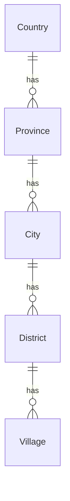

### Business Logic

- Province requires valid Country reference
- City requires valid Province reference
- District requires valid City reference
- Village requires valid District reference
- Deleting parent should be blocked if children exist

---

## Sprint 2: Master Data - Organization

### Deliverables

- [x] **API:** Organization management endpoints
- [x] **Frontend:** Organization management pages

### API Tasks

- [x] `Company` - CRUD + Approve workflow
- [x] `Division` - CRUD + List
- [x] `JobPosition` - CRUD + List
- [x] `BusinessUnit` - CRUD + List
- [x] `BusinessType` - CRUD + List
- [x] `Area` - CRUD + List
- [x] `AreaSupervisor` - CRUD + Assign Areas
- [x] `AreaSupervisorArea` - Many-to-many relation handling
- [x] Migration SQL for organization tables

### Frontend Tasks

- [x] Company management page with approval workflow
- [x] Division list and form
- [x] Job Position list and form
- [x] Business Unit list and form
- [x] Business Type list and form
- [x] Area management page
- [x] Area Supervisor page with area assignment UI

### Success Criteria

- [x] Company approval workflow works (Pending → Approved)
- [x] Area Supervisor can be assigned to multiple Areas
- [x] All CRUD operations complete successfully
- [x] Approval actions require authorized user
- [ ] Company detail shows complete address (using geographic cascade) - *Deferred to Sprint 3 with Employee*

### Integration Requirements

- [x] Permission integration check (RBAC)
- [x] i18n integration check (request.ts)

### Table Relations

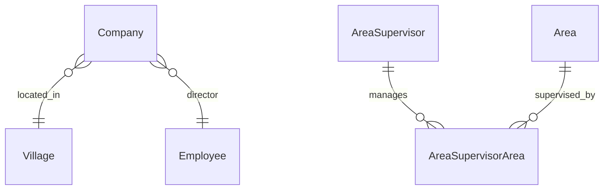

### Business Logic

- Company requires Village (address) reference
- Company requires Director (Employee) reference
- Company has approval workflow: `Draft → Pending → Approved/Rejected`
- AreaSupervisor can manage multiple Areas (M:N relation)
- Area can have multiple Supervisors

---

## Sprint 3: Master Data - Employee

### Deliverables

- [x] **API:** Employee management with approval
- [x] **Frontend:** Employee management pages

### API Tasks

- [x] `Employee` - CRUD + Approve + List with filters
- [x] `EmployeeArea` - Assign employee to areas
- [x] Employee search with multiple filters (division, position, area)
- [x] Employee approval workflow
- [x] Employee replacement logic (ReplacementFor field)
- [x] Migration SQL

### Frontend Tasks

- [x] Employee list with advanced filters
- [x] Employee detail page with tabs (Profile, Areas, Documents)
- [x] Employee form with all fields
- [x] Employee area assignment component
- [x] Employee approval actions
- [x] Employee status display (Active, Inactive, Contract End)

### Success Criteria

- [x] Employee can be filtered by Division, Position, Area
- [x] Employee approval workflow works correctly
- [x] Employee can be assigned to multiple areas
- [x] Employee replacement shows linked employee
- [x] Leave quota calculated based on employee type

### Integration Requirements

- [x] Permission integration check (RBAC)
- [x] i18n integration check (request.ts)

### Table Relations

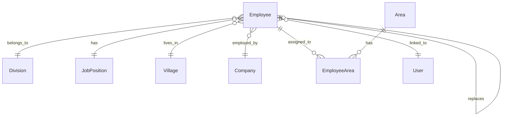

### Business Logic

- Employee requires User account reference
- Employee requires Division and JobPosition
- Employee can replace another Employee (contract takeover)
- Employee leave quota based on `ContractStatus` and `TotalLeaveQuota`
- PTKPStatus affects tax calculation
- IsDisability may affect benefits

---

## Sprint 4: Master Data - Supplier & Product

### Deliverables

- [ ] **API:** Supplier and Product management
- [ ] **Frontend:** Supplier and Product pages

### API Tasks

#### Supplier
- [x] `SupplierType` - CRUD
- [x] `Supplier` - CRUD + Approve
- [x] `SupplierPhoneNumber` - Nested CRUD
- [x] `SupplierBank` - Nested CRUD
- [x] `Bank` - CRUD

#### Product
- [x] `ProductCategory` - CRUD
- [x] `ProductBrand` - CRUD
- [x] `ProductSegment` - CRUD
- [x] `ProductType` - CRUD
- [x] `UnitOfMeasure` - CRUD
- [x] `Packaging` - CRUD
- [x] `ProcurementType` - CRUD
- [x] `Product` - CRUD + Approve + Stock info

#### Others
- [x] `Warehouse` - CRUD
- [x] `PaymentTerms` - CRUD
- [x] `CourierAgency` - CRUD
- [x] `SOSource` - CRUD
- [x] `Leave` (Type) - CRUD

### Frontend Tasks

- [x] Supplier management with inline phone numbers
- [x] Supplier bank accounts management
- [x] Product catalog with category tree
- [x] Product form with all relations
- [x] Warehouse management
- [x] Payment terms configuration
- [x] All lookup tables (Category, Brand, UoM, etc.)

### Success Criteria

- [x] Supplier can have multiple phone numbers and bank accounts
- [x] Product links to all 8 related master data (Category, Brand, UoM, Supplier, etc.)
- [x] Product shows current HPP and stock levels
- [x] Min/Max stock warnings display correctly
- [x] All approval workflows function correctly

### Integration Requirements

- [x] Permission integration check (RBAC)
- [x] i18n integration check (request.ts)

### Table Relations

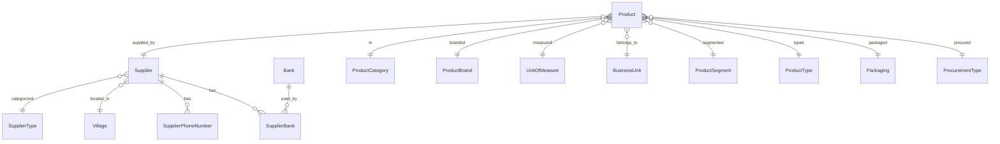

### Business Logic

- Supplier approval required before use in PO
- Product approval required before use in transactions
- Product has `CostPrice` (purchase) vs `SellingPrice` (sales)
- `CurrentHpp` calculated from weighted average of receipts
- `MinStock` triggers reorder alert, `MaxStock` prevents overstock

---

## Sprint 5: Sales - Quotation

### Deliverables

- [x] **API:** Sales Quotation management
- [x] **Frontend:** Quotation workflow UI

### API Tasks

- [x] `SalesQuotation` - CRUD + Status workflow
- [x] `SalesQuotationItem` - Nested CRUD with calculations
- [x] Quotation number generation (auto-increment with prefix)
- [x] Tax calculation (11% PPN default)
- [x] Total calculation (Subtotal + Tax + Delivery + Other - Discount)
- [x] Seeder for SalesQuotation with related data

### Frontend Tasks

- [x] Quotation list with status filters
- [x] Quotation form with item table
- [x] Product search and add to quotation
- [x] Inline item editing (qty, price, discount)
- [x] Auto-calculate totals
- [x] Quotation detail page
- [ ] Print/Export quotation to PDF

### Success Criteria

- [x] Quotation items auto-calculate subtotals
- [x] Tax amount calculated correctly (Subtotal × TaxRate)
- [x] Total = Subtotal + Tax + DeliveryCost + OtherCost
- [x] Status workflow: Draft → Sent → Approved/Rejected → Converted
- [x] Quotation can be converted to Sales Order

### Integration Requirements

- [x] Permission integration check (RBAC)
- [x] i18n integration check (request.ts)

### Table Relations

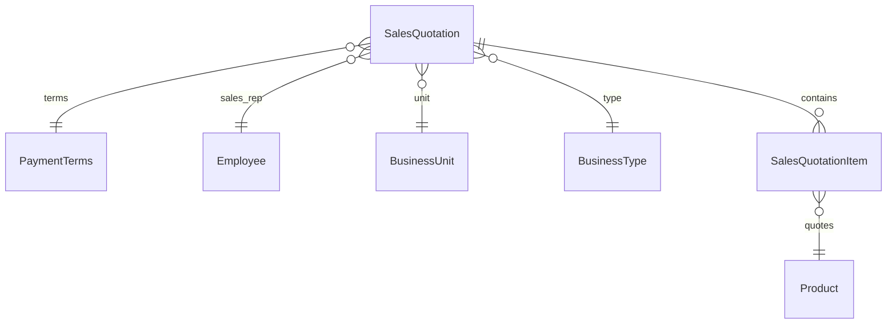

### Business Logic

- Quotation requires assigned Sales Representative (Employee)
- Items inherit default price from Product.SellingPrice
- Discount can be per-item or total
- TaxRate typically 11% (PPN Indonesia)
- Quotation valid for X days based on PaymentTerms

---

## Sprint 6: Sales - Order & Delivery

### Deliverables

- [x] **API:** Sales Order and Delivery Order management
- [ ] **Frontend:** Order and Delivery workflow UI

### API Tasks

#### Sales Order
- [x] `SalesOrder` - CRUD + Convert from Quotation
- [x] `SalesOrderItem` - Nested CRUD
- [x] Order number generation
- [x] Stock reservation on order creation (placeholder - will be fully implemented in Sprint 9)
- [x] Order status workflow

#### Delivery Order
- [x] `DeliveryOrder` - CRUD + Ship/Receive actions
- [x] `DeliveryOrderItem` - Nested with batch selection (batch selection logic placeholder - will be fully implemented in Sprint 9)
- [x] Tracking number management
- [x] Partial delivery support
- [x] Integration with Stock Movement (placeholder - will be fully implemented in Sprint 9)

### Frontend Tasks

- [ ] Sales Order list with filters
- [ ] Create Order from Quotation flow
- [ ] Order form with item management
- [ ] Delivery Order creation from Sales Order
- [ ] Delivery status tracking UI
- [ ] Batch selection modal (FIFO/FEFO) - UI ready, backend logic pending Sprint 9
- [ ] Signature capture for receiver

### Success Criteria

- [x] Order created from Quotation copies all items
- [x] Stock reserved when order confirmed (placeholder - full implementation in Sprint 9)
- [x] Delivery Order reduces reserved stock (placeholder - full implementation in Sprint 9)
- [x] Partial delivery creates multiple DOs
- [ ] DO updates InventoryBatch quantities (pending Sprint 9 - InventoryBatch module)
- [x] Tracking number links to courier

### Integration Requirements

- [x] Permission integration check (RBAC)
- [ ] i18n integration check (request.ts)

### Notes

**Backend Status:** ✅ Complete
- All models, repositories, DTOs, mappers, usecases, handlers, and routers implemented
- Migrations and seeders created
- Stock reservation and batch selection logic are placeholders that will be fully implemented in Sprint 9 when InventoryBatch and StockMovement modules are ready

**Frontend Status:** ⏳ In Progress
- Types, schemas, services, hooks, and components need to be implemented
- Batch selection UI will be ready but backend logic depends on Sprint 9

**Dependencies:**
- Sprint 9 (Stock - Inventory, Movement, Opname) must implement:
  - `InventoryBatch` model and repository
  - Stock reservation logic in `SalesOrderUsecase.Create()` and `SalesOrderUsecase.UpdateStatus()`
  - Batch selection logic (FIFO/FEFO) in `DeliveryOrderUsecase.SelectBatches()`
  - Stock reduction logic in `DeliveryOrderUsecase.Ship()`
  - `StockMovement` creation on delivery order shipment

### Table Relations

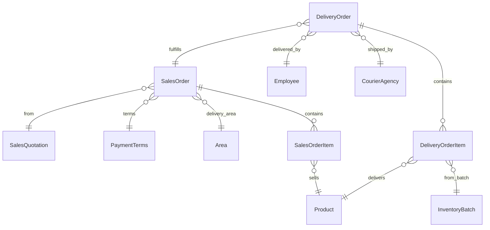

### Business Logic

- Sales Order can have multiple Delivery Orders (partial fulfillment)
- Each DO item must specify source InventoryBatch
- Batch selection follows FIFO (First In First Out) or FEFO (First Expired First Out)
- DO reduces batch quantity on shipment
- Installation/Function test status tracked for equipment products

---

## Sprint 7: Sales - Invoice & Visit

### Deliverables

- [x] **API:** Customer Invoice management ✅
- [ ] **Frontend:** Invoice tracking UI (Visit pending)

### API Tasks

#### Invoice
- [x] `CustomerInvoice` - CRUD + Payment tracking
- [x] `CustomerInvoiceItem` - Nested with HPP calculation
- [x] Invoice number generation (Faktur)
- [x] Payment status workflow
- [x] Due date calculation from PaymentTerms
- [x] HPP view permission (`customer_invoice.view_hpp`)

#### Sales Visit
- [x] `SalesVisit` - CRUD + Activity tracking
- [x] `SalesVisitDetail` - Products discussed
- [x] `SalesVisitProgressHistory` - Auto-track changes
- [x] `SalesVisitInterestQuestion/Option/Answer` - Survey handling

#### Estimation & Target
- [x] `SalesEstimation` - CRUD + Convert to Quotation
- [x] `YearlyTarget` - Target setting per area
- [x] `MonthlyTarget` - Monthly breakdown

### Frontend Tasks

- [x] Invoice list with payment status filter
- [x] Invoice generation from Sales Order
- [x] Payment recording UI
- [x] HPP field blur with permission check
- [x] Discount display in summary
- [x] Sales Visit calendar view
- [x] Visit form with product interest survey
- [x] Visit progress timeline
- [x] Sales target dashboard
- [x] Target vs Actual comparison

### Success Criteria

- [x] Invoice created from Sales Orders
- [x] HPP calculated and stored per invoice item
- [x] Payment status updates (Unpaid → Partial → Paid)
- [x] HPP visibility controlled by permission
- [x] Visit tracks all product discussions
- [x] Interest survey scoring works correctly
- [x] Target achievement shows real vs plan

### Integration Requirements

- [x] Permission integration check (RBAC)
- [x] i18n integration check (request.ts)

### Table Relations

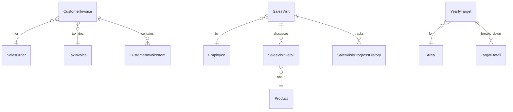

### Business Logic

- Invoice due date = Invoice date + PaymentTerms.Days
- HPPAmount = Quantity × Product.CurrentHpp at invoice time
- Gross Profit = InvoiceAmount - HPPAmount
- Sales Visit sentiment analysis based on survey answers
- Target can be broken down by month/product/customer

---

## Sprint 8: Purchase Module

### Deliverables

- [ ] **API:** Complete purchase workflow
- [ ] **Frontend:** Purchase management UI

### API Tasks

- [ ] `PurchaseRequisition` - CRUD + Approve
- [ ] `PurchaseRequisitionItem` - Nested
- [ ] `PurchaseOrder` - CRUD + Convert from PR
- [ ] `PurchaseOrderItem` - Nested
- [ ] `GoodsReceipt` - CRUD + Receive items
- [ ] `GoodsReceiptItem` - Create InventoryBatch
- [ ] `SupplierInvoice` - CRUD + Payment status
- [ ] `SupplierInvoiceItem` - Nested

### Frontend Tasks

- [ ] Purchase Requisition form and approval
- [ ] PO creation from approved PR
- [ ] PO form with supplier selection
- [ ] Goods Receipt from PO
- [ ] Batch/Lot number entry
- [ ] Expiry date entry
- [ ] Supplier Invoice matching
- [ ] 3-way match verification (PO-GR-Invoice)

### Success Criteria

- [ ] PR approval required before PO creation
- [ ] PO can be created from approved PR
- [ ] GR creates InventoryBatch records
- [ ] GR updates Product.CurrentHpp (weighted average)
- [ ] Supplier Invoice matches PO and GR
- [ ] 3-way match validates quantities and prices

### Integration Requirements

- [ ] Permission integration check (RBAC)
- [ ] i18n integration check (request.ts)

### Table Relations

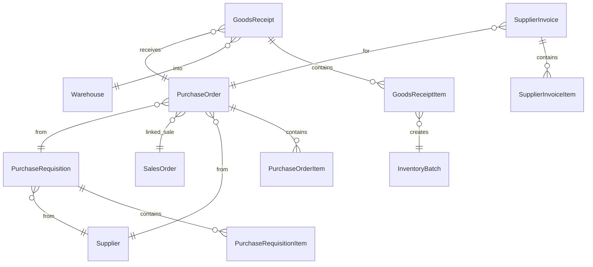

### Business Logic

- PR can be linked to SalesOrder (indent/special order)
- PO IsIndent flag for special order items
- GR creates new InventoryBatch with LotNumber and ExpiryDate
- CurrentHpp = ((Old Qty × Old Hpp) + (New Qty × New Price)) / Total Qty
- 3-way match: PO Qty = GR Qty = Invoice Qty

---

## Sprint 9: Stock Module

### Deliverables

- [ ] **API:** Inventory and stock management
- [ ] **Frontend:** Stock management UI

### API Tasks

- [ ] `InventoryBatch` - List + Detail + History
- [ ] `StockMovement` - Auto-create on GR/DO
- [ ] `StockOpname` - CRUD + Approve + Adjust
- [ ] `StockOpnameItem` - Count entry + Variance
- [ ] Stock adjustment journal creation
- [ ] Low stock alert calculation

### Audit & Opname
- [ ] Stock Opname creation wizard
- [ ] Count entry form with variance display
- [ ] Opname approval workflow
- [ ] Low stock alerts list
- [ ] Expiry alerts list

#### Integration with Sprint 6 (Sales Order & Delivery Order) - CRITICAL
- [ ] **CRITICAL:** Implement stock reservation logic in `SalesOrderUsecase.Create()` and `SalesOrderUsecase.UpdateStatus()`
- [ ] **CRITICAL:** Implement batch selection logic (FIFO/FEFO) in `DeliveryOrderUsecase.SelectBatches()`
- [ ] **CRITICAL:** Implement stock reduction logic in `DeliveryOrderUsecase.Ship()`
- [ ] **CRITICAL:** Create `StockMovement` (OUT) records when delivery order is shipped
- [ ] **CRITICAL:** Update `SalesOrderItem.DeliveredQuantity` when delivery order is delivered
- [ ] **CRITICAL:** Link `DeliveryOrderItem.InventoryBatchID` to actual batch records

### Frontend Tasks

- [x] Inventory dashboard with warehouse filter
- [ ] Batch detail with movement history
- [x] Stock Movement timeline view
- [ ] Stock Opname creation wizard
- [ ] Count entry form with variance display
- [ ] Opname approval workflow
- [ ] Low stock alerts list
- [ ] Expiry alerts list

### Success Criteria

- [ ] Stock movements auto-created on GR (IN) and DO (OUT)
- [ ] Movement tracks unit cost and running balance
- [ ] Opname variance calculated (Counted - System)
- [ ] Opname adjustment creates correcting movement
- [ ] Low stock alert when Qty < Product.MinStock
- [ ] Expiry alert for batches expiring within 30 days

### Integration Requirements

- [ ] Permission integration check (RBAC)
- [ ] i18n integration check (request.ts)

### Table Relations

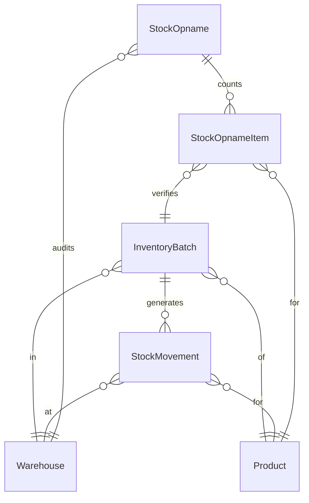

### Business Logic

- MovementType: IN (GR), OUT (DO), ADJUST (Opname), TRANSFER
- ReferenceType links to source document (GoodsReceipt, DeliveryOrder, StockOpname)
- HppAvg updated on each IN movement
- Stock field shows running balance after movement
- Opname difference auto-creates ADJUST movement on approval

---

## Sprint 10: Finance - Chart of Accounts & Journal

### Deliverables

- [ ] **API:** COA and Journal Entry management
- [ ] **Frontend:** Financial entry UI

### API Tasks

- [ ] `ChartOfAccount` - CRUD + Tree structure
- [ ] `JournalEntry` - CRUD + Post
- [ ] `JournalLine` - Nested with Debit/Credit
- [ ] Account balance calculation
- [ ] Trial balance report
- [ ] Journal posting validation

### Frontend Tasks

- [ ] COA tree view with expand/collapse
- [ ] COA form with parent selection
- [ ] Journal Entry list with date filter
- [ ] Journal Entry form with debit/credit lines
- [ ] Balance validation (Debit = Credit)
- [ ] Journal posting action
- [ ] Trial Balance report

### Success Criteria

- [ ] COA displays as hierarchical tree
- [ ] Account types: Asset, Liability, Equity, Revenue, Expense
- [ ] Journal Entry validates Debit = Credit before posting
- [ ] Posted journals cannot be edited
- [ ] Trial Balance shows all accounts with balances

### Integration Requirements

- [ ] Permission integration check (RBAC)
- [ ] i18n integration check (request.ts)

### Table Relations

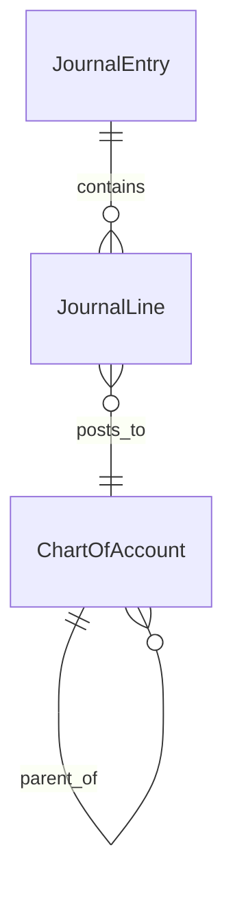

### Business Logic

- COA follows Indonesian standard (PSAK) or custom chart
- Account code convention: 1xxx (Asset), 2xxx (Liability), 3xxx (Equity), 4xxx (Revenue), 5xxx (Expense)
- Journal Entry must balance: ΣDebit = ΣCredit
- ReferenceType links to source (Invoice, Payment, GR, etc.)
- Posted entries are immutable (reversing entry for corrections)

---

## Sprint 11: Finance - Payment & Bank

### Deliverables

- [ ] **API:** Payment and Bank Account management
- [ ] **Frontend:** Payment recording UI

### API Tasks

- [ ] `BankAccount` - CRUD
- [ ] `Payment` - CRUD + Allocation
- [ ] `PaymentAllocation` - Split payment across invoices
- [ ] Auto-journal creation on payment
- [ ] AR/AP aging calculation
- [ ] `Budget` - CRUD + Approve
- [ ] `BudgetItem` - Monthly allocation
- [ ] `CashBankJournal` - CRUD + Post

### Frontend Tasks

- [ ] Bank Account management
- [ ] Payment recording from invoice
- [ ] Payment allocation UI (partial payments)
- [ ] AR Aging report
- [ ] AP Aging report
- [ ] Budget creation by division
- [ ] Budget vs Actual comparison
- [ ] Cash/Bank journal entry

### Success Criteria

- [ ] Payment can be allocated to multiple invoices
- [ ] Remaining amount calculated correctly
- [ ] Auto-journal created: Dr Bank, Cr AR (customer payment)
- [ ] AR Aging groups by 0-30, 31-60, 61-90, >90 days
- [ ] Budget approval required before posting
- [ ] Budget vs Actual shows variance

### Integration Requirements

- [ ] Permission integration check (RBAC)
- [ ] i18n integration check (request.ts)

### Table Relations

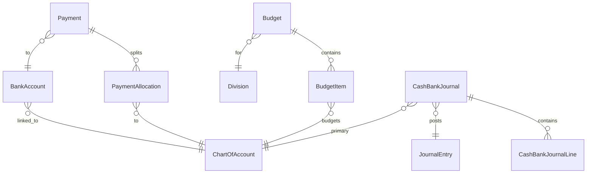

### Business Logic

- BankAccount linked to COA (typically Asset account)
- Payment ReferenceType: CustomerInvoice (AR) or SupplierInvoice (AP)
- RemainingAmount = Amount - ΣAllocations
- Aging calculated from DueDate vs today
- Budget by division, broken down by month and account

---

## Sprint 12: Finance - Asset & Closing

### Deliverables

- [ ] **API:** Fixed Asset and Period Closing
- [ ] **Frontend:** Asset management and closing UI

### API Tasks

- [ ] `AssetCategory` - CRUD with depreciation settings
- [ ] `AssetLocation` - CRUD
- [ ] `Asset` - CRUD + Depreciate
- [ ] `AssetDepreciation` - Monthly calculation
- [ ] `AssetTransaction` - Track all changes
- [ ] `FinancialClosing` - Period closing process
- [ ] `TaxInvoice` - CRUD for e-Faktur
- [ ] `NonTradePayable` - CRUD for expenses

### Frontend Tasks

- [ ] Asset Category with depreciation method
- [ ] Asset register (list with search)
- [ ] Asset detail with depreciation schedule
- [ ] Run depreciation action
- [ ] Asset disposal/transfer
- [ ] Period closing wizard
- [ ] Tax Invoice list (Faktur Pajak)
- [ ] Non-trade payable entry

### Success Criteria

- [ ] Depreciation calculated based on category method (SL/DB)
- [ ] Depreciation journal auto-created
- [ ] Asset book value = Acquisition - AccumulatedDepreciation
- [ ] Period closing prevents backdated entries
- [ ] Tax Invoice links to Customer/Supplier Invoice

### Integration Requirements

- [ ] Permission integration check (RBAC)
- [ ] i18n integration check (request.ts)

### Table Relations

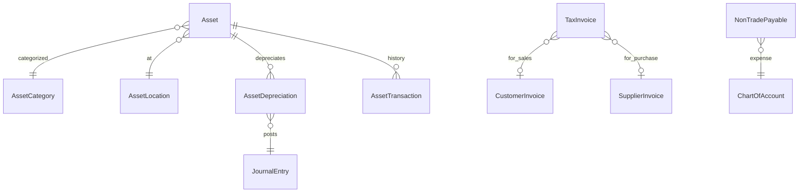

### Business Logic

- Depreciation Methods: Straight Line (SL), Declining Balance (DB)
- SL: AcquisitionCost / UsefulLife per period
- DB: BookValue × DepreciationRate per period
- Closing prevents entries before closing date
- TaxInvoice for Indonesian e-Faktur compliance

---

## Sprint 13: HRD - Attendance

### Deliverables

- [x] **API:** Attendance management ✅
- [x] **Frontend:** Attendance tracking UI ✅

### API Tasks

- [x] `AttendanceRecord` - Clock In/Out with GPS validation
- [x] `WorkSchedule` - Weekly schedule definition with flexible hours
- [x] `Holiday` - CRUD + Batch import + Calendar view
- [x] `OvertimeRequest` - CRUD + Approval workflow + Auto-detection
- [x] Attendance calculation (late, early leave, overtime)
- [x] Attendance summary report (monthly stats)
- [x] GPS validation using Haversine formula
- [x] Migration SQL for HRD tables
- [x] Seeder for work schedules and holidays

### Frontend Tasks

- [x] Types, schemas, services, and hooks created
- [x] i18n translations (en, id)
- [x] Clock In/Out interface with GPS
- [x] Attendance calendar view
- [x] Work schedule configuration
- [x] Holiday management
- [x] Overtime request/approval UI
- [x] Attendance report by employee/department
- [x] Late/Absent summary dashboard (HRD Dashboard)

### Success Criteria

- [x] Clock In/Out records timestamp, GPS coordinates, and type
- [x] Late calculated from WorkSchedule.StartTime with tolerance
- [x] Early leave calculated from WorkSchedule.EndTime with tolerance
- [x] Holidays marked as non-working days
- [x] Attendance summary shows present/absent/late counts
- [x] Overtime auto-detected on clock out
- [x] GPS radius validation for office attendance

### Integration Requirements

- [x] Permission integration check (RBAC)
- [x] i18n integration check (request.ts)

### Table Relations

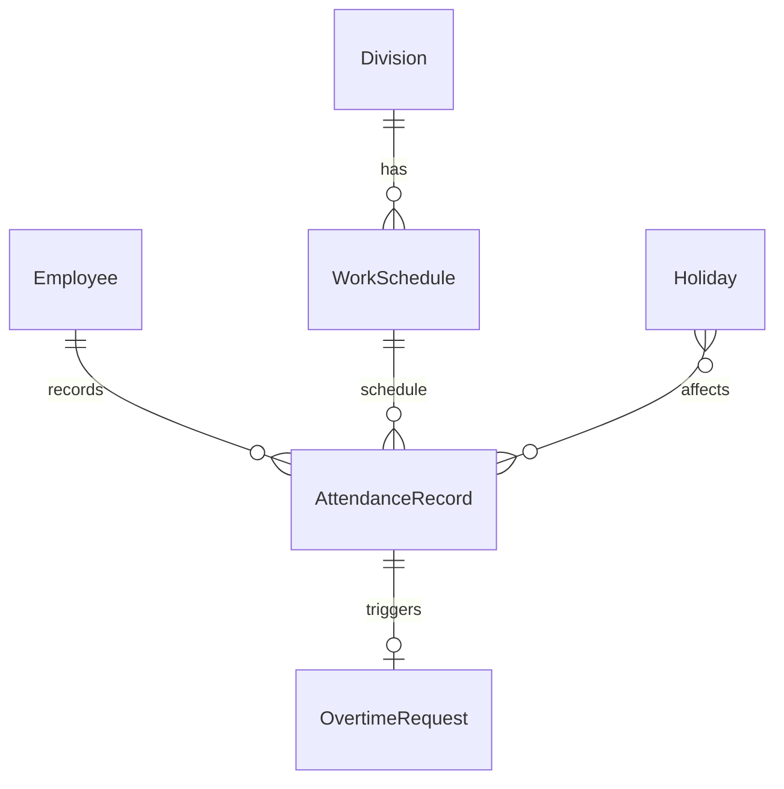

### Business Logic

- CheckInType: NORMAL, WFH, FIELD_WORK
- Status: PRESENT, ABSENT, LATE, HALF_DAY, LEAVE, WFH, OFF_DAY, HOLIDAY
- Late = CheckInTime > (WorkSchedule.StartTime + LateToleranceMinutes)
- Overtime = CheckOutTime > WorkSchedule.EndTime (auto-detected or manual claim)
- Holiday check before marking absent
- GPS validation: Haversine formula with configurable radius per schedule
- Working days: Bitmask (1=Mon, 2=Tue, 4=Wed, 8=Thu, 16=Fri, 32=Sat, 64=Sun)
- Overtime rates: 1.5x weekday, 2.0x weekend/holiday

### API Endpoints

| Method | Endpoint | Permission | Description |
|--------|----------|------------|-------------|
| GET | `/hrd/attendance/today` | Auth | Get today's attendance |
| POST | `/hrd/attendance/clock-in` | Auth | Clock in with GPS |
| POST | `/hrd/attendance/clock-out` | Auth | Clock out with GPS |
| GET | `/hrd/attendance/my-stats` | Auth | Get monthly stats |
| GET | `/hrd/attendance` | attendance.read | List all records |
| GET | `/hrd/attendance/:id` | attendance.read | Get by ID |
| POST | `/hrd/attendance/manual` | attendance.create | Manual entry |
| PUT | `/hrd/attendance/:id` | attendance.update | Update record |
| DELETE | `/hrd/attendance/:id` | attendance.delete | Delete record |
| GET | `/hrd/work-schedules` | work_schedule.read | List schedules |
| GET | `/hrd/work-schedules/default` | work_schedule.read | Get default |
| POST | `/hrd/work-schedules` | work_schedule.create | Create schedule |
| PUT | `/hrd/work-schedules/:id` | work_schedule.update | Update schedule |
| DELETE | `/hrd/work-schedules/:id` | work_schedule.delete | Delete schedule |
| POST | `/hrd/work-schedules/:id/set-default` | work_schedule.update | Set default |
| GET | `/hrd/holidays` | holiday.read | List holidays |
| GET | `/hrd/holidays/check` | holiday.read | Check if date is holiday |
| GET | `/hrd/holidays/year/:year` | holiday.read | Get by year |
| GET | `/hrd/holidays/calendar/:year` | holiday.read | Calendar view |
| POST | `/hrd/holidays` | holiday.create | Create holiday |
| POST | `/hrd/holidays/batch` | holiday.create | Batch create |
| PUT | `/hrd/holidays/:id` | holiday.update | Update holiday |
| DELETE | `/hrd/holidays/:id` | holiday.delete | Delete holiday |
| POST | `/hrd/overtime` | Auth | Submit request |
| GET | `/hrd/overtime/my-summary` | Auth | Get own summary |
| POST | `/hrd/overtime/:id/cancel` | Auth | Cancel request |
| GET | `/hrd/overtime/pending` | overtime.approve | Get pending |
| POST | `/hrd/overtime/:id/approve` | overtime.approve | Approve |
| POST | `/hrd/overtime/:id/reject` | overtime.approve | Reject |
| GET | `/hrd/overtime` | overtime.read | List all |
| GET | `/hrd/overtime/:id` | overtime.read | Get by ID |
| PUT | `/hrd/overtime/:id` | overtime.update | Update |
| DELETE | `/hrd/overtime/:id` | overtime.delete | Delete |
| GET | `/hrd/overtime/notifications` | overtime.approve | Polling |

---

## Sprint 14: HRD - Leave & Documents

### Deliverables

- [ ] **API:** Leave and Employee Document management
- [ ] **Frontend:** Leave request and document UI

### API Tasks

- [ ] `LeaveRequest` - CRUD + Approve workflow
- [ ] Leave balance calculation
- [ ] `EmployeeContract` - CRUD
- [ ] `EmployeeEducationHistory` - CRUD
- [ ] `EmployeeCertification` - CRUD
- [ ] `EmployeeAsset` - CRUD (company assets borrowed)
- [ ] `SalaryStructure` - CRUD
- [ ] `UpCountryCost` - Travel expense

### Frontend Tasks

- [ ] Leave request form with date range
- [ ] Leave approval workflow
- [ ] Leave balance display
- [ ] Employee documents upload
- [ ] Contract management
- [ ] Education history
- [ ] Certification tracking
- [ ] Company asset assignment
- [ ] Salary structure management
- [ ] Travel expense form (Up Country)

### Success Criteria

- [ ] Leave balance = TotalLeaveQuota - UsedLeave
- [ ] Leave approval sends notification
- [ ] Contract end date triggers alert
- [ ] Documents support file upload
- [ ] Asset return tracking (borrowed/returned)

### Integration Requirements

- [ ] Permission integration check (RBAC)
- [ ] i18n integration check (request.ts)

### Table Relations

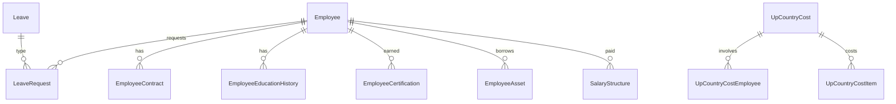

### Business Logic

- Leave types: Annual, Sick, Maternity, etc.
- IsCutAnnualLeave: some leave types deduct from annual quota
- Contract alert X days before EndDate
- Certification expiry tracking
- Up Country Cost for multi-employee travel

---

## Sprint 15: HRD - Evaluation & Recruitment

### Deliverables

- [ ] **API:** Performance and Recruitment management
- [ ] **Frontend:** Evaluation and Recruitment UI

### API Tasks

- [ ] `EvaluationGroup` - CRUD
- [ ] `EvaluationCriteria` - CRUD with weights
- [ ] `EmployeeEvaluation` - CRUD + Score
- [ ] `EmployeeEvaluationCriteria` - Scoring per criteria
- [ ] `RecruitmentRequest` - CRUD + Approve

### Frontend Tasks

- [ ] Evaluation template management
- [ ] Employee evaluation form
- [ ] Score entry with weighted calculation
- [ ] Evaluation history
- [ ] Recruitment request form
- [ ] Recruitment approval workflow
- [ ] Position opening list

### Success Criteria

- [ ] Criteria weights sum to 100%
- [ ] OverallScore = Σ(Score × Weight)
- [ ] Evaluation period validation
- [ ] Recruitment approval workflow complete
- [ ] Position filling status tracked

### Integration Requirements

- [ ] Permission integration check (RBAC)
- [ ] i18n integration check (request.ts)

### Table Relations

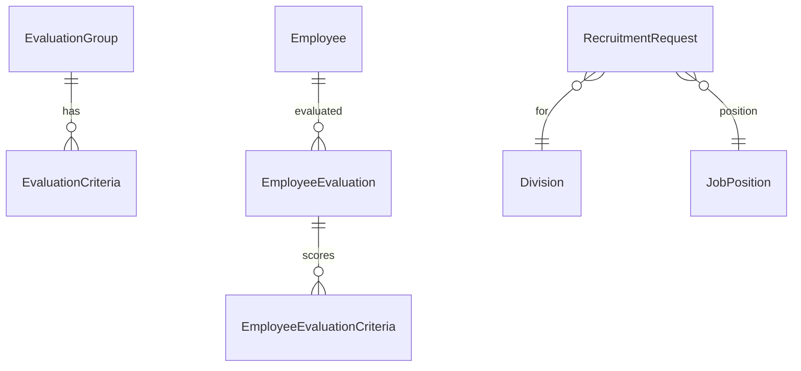

### Business Logic

- Evaluation criteria weighted scoring
- Self-evaluation vs manager evaluation
- Recruitment requires department head approval
- Position count: RequiredCount - FilledCount = OpenPositions

---

## Sprint 16: Reports & Settings

### Deliverables

- [ ] **API:** Reporting endpoints and Settings management
- [ ] **Frontend:** Report dashboards and Settings UI

### API Tasks

#### Reports (Read-Only)
- [ ] Sales Report (by period, product, customer)
- [ ] Purchase Report (by period, supplier, product)
- [ ] Inventory Report (current stock, movement summary)
- [ ] Financial Report (P&L, Balance Sheet)
- [ ] Employee Report (headcount, attendance summary)
- [ ] AR Aging Report
- [ ] AP Aging Report

#### Settings
- [ ] Company Profile API
- [ ] Global Settings API
- [ ] AI Configuration (optional)

### Frontend Tasks

- [ ] Sales Dashboard with charts
- [ ] Purchase Summary dashboard
- [ ] Inventory Dashboard with alerts
- [ ] Financial Statements display
- [ ] HR Dashboard
- [ ] Company profile settings page
- [ ] System settings page
- [ ] User preferences page

### Success Criteria

- [ ] Reports filter by date range
- [ ] Reports exportable to Excel/PDF
- [ ] Dashboard shows key metrics
- [ ] Settings changes take effect immediately
- [ ] Company profile reflects in printed documents

### Integration Requirements

- [ ] Permission integration check (RBAC)
- [ ] i18n integration check (request.ts)

### Business Logic

- P&L: Revenue - COGS - Expenses
- Balance Sheet: Assets = Liabilities + Equity
- Gross Margin: (Revenue - COGS) / Revenue
- AR Turnover: Revenue / Average AR
- Inventory Turnover: COGS / Average Inventory

---

## Development Standards Checklist

### API (Per Entity)
- [ ] Model dengan GORM tags
- [ ] Repository interface + implementation
- [ ] DTO (Request + Response)
- [ ] Mapper (Model ↔ DTO)
- [ ] Usecase dengan business logic
- [ ] Handler dengan validasi
- [ ] Router registration
- [ ] Unit tests
- [ ] Migration SQL

### Frontend (Per Entity)
- [ ] Types (`types/index.d.ts`)
- [ ] Zod Schemas (`schemas/*.schema.ts`)
- [ ] Service (`services/*-service.ts`)
- [ ] Hooks (`hooks/use-*.ts`)
- [ ] List component dengan DataTable
- [ ] Form component dengan RHF + Zod
- [ ] Detail page dengan Tabs
- [ ] Loading skeleton (`loading.tsx`)
- [ ] Empty state
- [ ] Error handling

---

## Priority Legend

| Priority | Definition |
|----------|------------|
| **P0** | Must have - core business flow |
| **P1** | Should have - important features |
| **P2** | Nice to have - can defer |

---

## Notes

1. **Parallel Development:** API dan Frontend dikerjakan paralel per sprint
2. **Testing:** Setiap entitas harus memiliki unit test dan e2e test
3. **Code Review:** Wajib review sebelum merge ke main
4. **Documentation:** Update API docs (Swagger/OpenAPI) per sprint
5. **Demo:** Sprint review setiap akhir sprint dengan stakeholder
