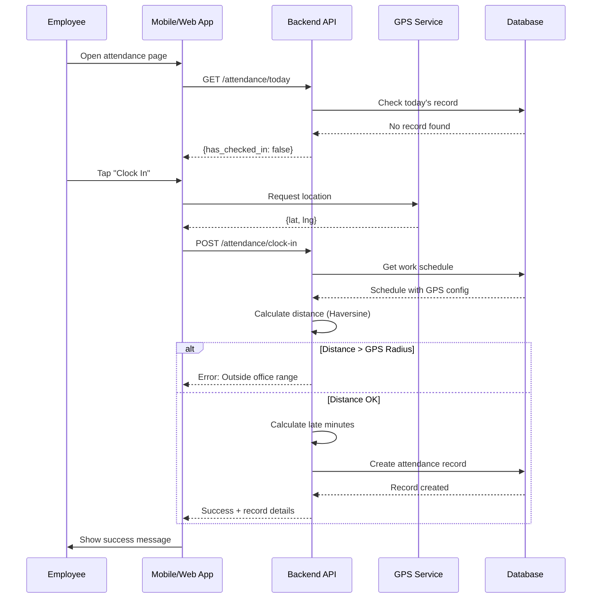
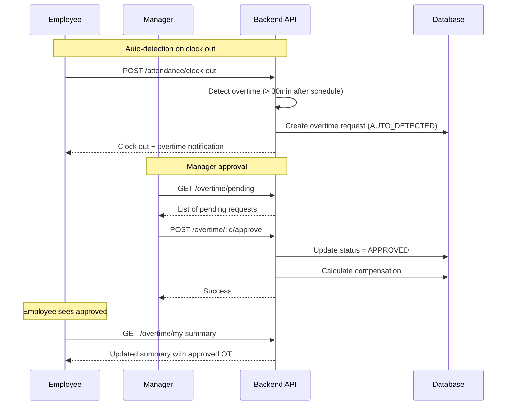
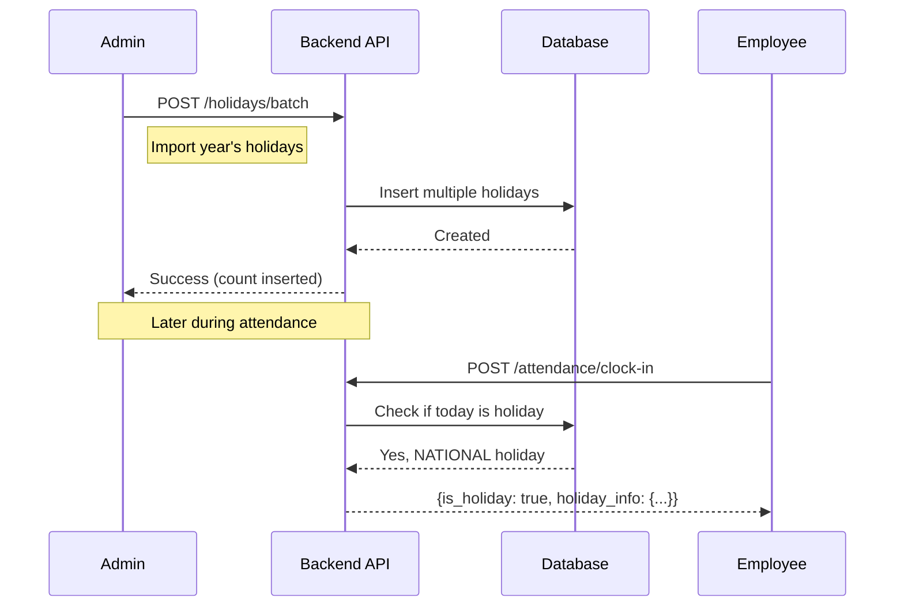

# HRD - Attendance Management

> **Module:** HRD (Human Resource Development)  
> **Sprint:** 13  
> **Version:** 1.3.0  
> **Status:** ✅ Complete (API + Frontend) — Smart form features added in Sprint 18  
> **Last Updated:** March 2026

---

## Table of Contents

1. [Overview](#overview)
2. [Features](#features)
3. [System Architecture](#system-architecture)
4. [Data Models](#data-models)
5. [Business Logic](#business-logic)
6. [API Reference](#api-reference)
7. [Frontend Components](#frontend-components)
8. [User Flows](#user-flows)
9. [Permissions](#permissions)
10. [Configuration](#configuration)
11. [Integration Points](#integration-points)

---

## Overview

The HRD Attendance Management module provides comprehensive attendance tracking for employees, including:

- **Clock In/Out** with GPS validation
- **Overtime** tracking with approval workflow
- **Monthly Statistics** and reporting

> **Related Documentation:**
>
> - [Work Schedule Management](hrd-work-schedules.md) — Schedule configuration, GPS settings, working days
> - [Holiday Management](hrd-holidays.md) — National holidays, collective leave, calendar view

### Key Features

| Feature                 | Description                                                                         |
| ----------------------- | ----------------------------------------------------------------------------------- |
| GPS-Based Attendance    | Validates employee location during clock in/out                                     |
| Flexible Schedules      | Supports flexible working hours per division                                        |
| Division-Based Schedule | Auto-resolves schedule by employee's division, falls back to default                |
| Auto Overtime Detection | Automatically creates overtime requests when working beyond schedule                |
| Multi-Type Holidays     | Supports National, Collective, and Company holidays                                 |
| Real-time Statistics    | Monthly attendance statistics with various metrics                                  |
| Employee Enrichment     | Responses include employee name, code, and division (for HRD views)                 |
| Detail Enrichment       | Get-by-ID returns work schedule name and approver name (not just IDs)               |
| Form Data Endpoint      | Single API call for all attendance form dropdown options                            |
| Auto Absent             | Daily background worker marks absent employees (respects holidays, leave, off-days) |
| Manual Absent Trigger   | Admin endpoint to manually trigger auto-absent processing for a specific date       |
| Holiday Date Warning    | Manual entry form warns when selected date is a holiday (with holiday name & type)  |
| Schedule-Aware Form     | Auto-fills check-in/out times from employee's work schedule when status is PRESENT  |
| Smart Time Fields       | Disables check-in/out fields for ABSENT and LEAVE statuses (not applicable)         |
| Employee Schedule API   | Endpoint to fetch an employee's resolved work schedule (division → default fallback)|

---

## Features

### 1. Attendance Record

Employee attendance tracking with support for multiple check-in types:

| Check-In Type | Description                                                           |
| ------------- | --------------------------------------------------------------------- |
| `NORMAL`      | Regular office attendance (GPS validated)                             |
| `WFH`         | Work from Home (no GPS validation)                                    |
| `FIELD_WORK`  | Field work/client visit (GPS logged but not validated against office) |

#### Attendance Status

| Status     | Description                              |
| ---------- | ---------------------------------------- |
| `PRESENT`  | On-time attendance                       |
| `LATE`     | Arrived after schedule start + tolerance |
| `ABSENT`   | No attendance record for working day     |
| `HALF_DAY` | Partial day attendance                   |
| `LEAVE`    | On approved leave                        |
| `WFH`      | Working from home                        |
| `OFF_DAY`  | Non-working day based on schedule        |
| `HOLIDAY`  | Public/company holiday                   |

### 2. Work Schedule

Configurable work schedules with support for fixed and flexible hours, GPS validation, and division-based assignment. See [Work Schedule Management](hrd-work-schedules.md) for full documentation.

### 3. Holiday Management

Support for National, Collective, and Company holidays. See [Holiday Management](hrd-holidays.md) for full documentation.

### 4. Auto Absent

Automatic attendance marking for employees who don't clock in on working days:

- **Daily Background Worker**: Runs on app startup (for yesterday) and every 24 hours
- **Manual Trigger**: Admin endpoint to process any specific date
- **Validations**: Skips holidays, approved leave, off-days, and employees with existing records
- Creates `ABSENT` records for employees who missed clock-in
- Creates `LEAVE` records for employees on approved leave (with `leave_request_id` linked)

### 5. Overtime Management

Comprehensive overtime tracking with approval workflow:

| Request Type    | Description                                      |
| --------------- | ------------------------------------------------ |
| `AUTO_DETECTED` | System-generated when clock out exceeds schedule |
| `MANUAL_CLAIM`  | Employee-submitted overtime request              |
| `PRE_APPROVED`  | Pre-approved overtime (planned)                  |

#### Approval Status

| Status     | Description          |
| ---------- | -------------------- |
| `PENDING`  | Awaiting approval    |
| `APPROVED` | Approved by manager  |
| `REJECTED` | Rejected by manager  |
| `CANCELED` | Canceled by employee |

#### Overtime Rates

| Condition | Rate |
| --------- | ---- |
| Weekday   | 1.5x |
| Weekend   | 2.0x |
| Holiday   | 2.0x |

---

## System Architecture

### Backend Structure

```
apps/api/internal/hrd/
├── data/
│   ├── models/
│   │   ├── attendance_record.go
│   │   ├── work_schedule.go
│   │   ├── holiday.go
│   │   └── overtime_request.go
│   └── repositories/
│       ├── attendance_record_repository.go
│       ├── work_schedule_repository.go
│       ├── holiday_repository.go
│       ├── leave_request_repository.go
│       └── overtime_request_repository.go
├── domain/
│   ├── dto/
│   │   ├── attendance_record_dto.go   # includes AutoAbsentResult, ProcessAutoAbsentRequest
│   │   ├── work_schedule_dto.go
│   │   ├── holiday_dto.go
│   │   └── overtime_request_dto.go
│   ├── mapper/
│   │   ├── attendance_record_mapper.go
│   │   ├── work_schedule_mapper.go
│   │   ├── holiday_mapper.go
│   │   └── overtime_request_mapper.go
│   └── usecase/
│       ├── attendance_record_usecase.go  # includes ProcessAutoAbsent
│       ├── work_schedule_usecase.go
│       ├── holiday_usecase.go
│       └── overtime_request_usecase.go
├── worker/
│   └── auto_absent_worker.go            # daily background worker
└── presentation/
    ├── handler/
    │   ├── attendance_record_handler.go
    │   ├── work_schedule_handler.go
    │   ├── holiday_handler.go
    │   └── overtime_request_handler.go
    ├── router/
    │   ├── attendance_record_router.go
    │   ├── work_schedule_router.go
    │   ├── holiday_router.go
    │   └── overtime_request_router.go
    └── routers.go
```

### Frontend Structure

```
apps/web/src/features/hrd/
├── attendance-records/
│   ├── types/index.d.ts
│   ├── schemas/attendance.schema.ts
│   ├── services/attendance-record-service.ts
│   ├── hooks/
│   │   ├── use-attendance-records.ts
│   │   ├── use-attendance-calendar.ts
│   │   └── use-geolocation.ts
│   └── components/
│       ├── attendance-record-form.tsx
│       ├── attendance-record-list.tsx
│       ├── attendance-calendar.tsx
│       ├── attendance-day-view.tsx
│       ├── attendance-event-detail.tsx
│       └── index.ts
├── work-schedules/
│   ├── types/index.d.ts
│   ├── schemas/work-schedule.schema.ts
│   ├── services/work-schedule-service.ts
│   ├── hooks/use-work-schedules.ts
│   └── components/
│       ├── work-schedule-list.tsx
│       ├── work-schedule-dialog.tsx
│       ├── work-schedule-page-client.tsx
│       └── index.ts
├── holidays/
│   ├── types/index.d.ts
│   ├── schemas/holiday.schema.ts
│   ├── services/holiday-service.ts
│   ├── hooks/use-holidays.ts
│   └── components/
│       ├── holiday-list.tsx
│       ├── holiday-dialog.tsx
│       ├── holiday-calendar-view.tsx
│       ├── holiday-page-client.tsx
│       └── index.ts
├── overtime/
│   ├── types/index.d.ts
│   ├── schemas/overtime.schema.ts
│   ├── services/overtime-service.ts
│   ├── hooks/use-overtime.ts
│   └── components/
│       ├── overtime-list.tsx
│       ├── overtime-dialog.tsx
│       ├── overtime-approval-dialog.tsx
│       ├── overtime-page-client.tsx
│       └── index.ts
└── i18n/
    ├── en.ts
    └── id.ts
```

### Frontend Pages

```
apps/web/app/[locale]/(dashboard)/hrd/
├── page.tsx                     # HRD Dashboard
├── loading.tsx                  # Loading skeleton
├── hrd-dashboard-client.tsx     # Dashboard client component
├── work-schedules/
│   ├── page.tsx
│   └── loading.tsx
├── holidays/
│   ├── page.tsx
│   └── loading.tsx
└── overtime/
    ├── page.tsx
    └── loading.tsx
```

---

## Data Models

### AttendanceRecord

| Field               | Type   | Description                |
| ------------------- | ------ | -------------------------- |
| id                  | UUID   | Primary key                |
| employee_id         | UUID   | Employee reference         |
| date                | DATE   | Attendance date            |
| check_in_time       | TIME   | Clock in time              |
| check_in_type       | ENUM   | NORMAL, WFH, FIELD_WORK    |
| check_in_latitude   | FLOAT  | GPS latitude at clock in   |
| check_in_longitude  | FLOAT  | GPS longitude at clock in  |
| check_in_address    | STRING | Resolved address           |
| check_in_note       | STRING | Optional note              |
| check_out_time      | TIME   | Clock out time             |
| check_out_latitude  | FLOAT  | GPS latitude at clock out  |
| check_out_longitude | FLOAT  | GPS longitude at clock out |
| check_out_address   | STRING | Resolved address           |
| check_out_note      | STRING | Optional note              |
| status              | ENUM   | Attendance status          |
| working_minutes     | INT    | Total working time         |
| overtime_minutes    | INT    | Overtime worked            |
| late_minutes        | INT    | Minutes late               |
| early_leave_minutes | INT    | Minutes left early         |
| work_schedule_id    | UUID   | Applied schedule           |
| is_manual_entry     | BOOL   | Manual entry flag          |
| manual_entry_reason | STRING | Reason for manual entry    |
| approved_by         | UUID   | Admin who approved         |

### WorkSchedule

See [Work Schedule Management](hrd-work-schedules.md#data-model) for the full WorkSchedule data model.

### Holiday

See [Holiday Management](hrd-holidays.md#data-model) for the full Holiday data model.

### OvertimeRequest

| Field                | Type      | Description                               |
| -------------------- | --------- | ----------------------------------------- |
| id                   | UUID      | Primary key                               |
| employee_id          | UUID      | Employee reference                        |
| date                 | DATE      | Overtime date                             |
| request_type         | ENUM      | AUTO_DETECTED, MANUAL_CLAIM, PRE_APPROVED |
| start_time           | TIME      | Start time                                |
| end_time             | TIME      | End time                                  |
| planned_minutes      | INT       | Requested minutes                         |
| actual_minutes       | INT       | Actual worked                             |
| approved_minutes     | INT       | Approved minutes                          |
| reason               | STRING    | Request reason                            |
| description          | STRING    | Detailed description                      |
| task_details         | STRING    | Tasks performed                           |
| status               | ENUM      | PENDING, APPROVED, REJECTED, CANCELED     |
| approved_by          | UUID      | Approver                                  |
| approved_at          | TIMESTAMP | Approval time                             |
| rejected_by          | UUID      | Rejecter                                  |
| rejected_at          | TIMESTAMP | Rejection time                            |
| reject_reason        | STRING    | Rejection reason                          |
| attendance_record_id | UUID      | Linked attendance                         |
| overtime_rate        | FLOAT     | Rate multiplier                           |
| compensation_amount  | FLOAT     | Calculated compensation                   |

---

## Business Logic

### GPS Validation (Haversine Formula)

The system uses the Haversine formula to calculate the distance between the employee's GPS coordinates and the office location:

```go
func haversineDistance(lat1, lon1, lat2, lon2 float64) float64 {
    const R = 6371000 // Earth's radius in meters

    φ1 := lat1 * math.Pi / 180
    φ2 := lat2 * math.Pi / 180
    Δφ := (lat2 - lat1) * math.Pi / 180
    Δλ := (lon2 - lon1) * math.Pi / 180

    a := math.Sin(Δφ/2)*math.Sin(Δφ/2) +
         math.Cos(φ1)*math.Cos(φ2)*
         math.Sin(Δλ/2)*math.Sin(Δλ/2)

    c := 2 * math.Atan2(math.Sqrt(a), math.Sqrt(1-a))

    return R * c // Distance in meters
}
```

### Late Calculation

```
late_minutes = max(0, check_in_time - (schedule_start_time + late_tolerance_minutes))
```

### Overtime Auto-Detection

When an employee clocks out:

```
if check_out_time > schedule_end_time + 30_minutes_buffer:
    overtime_minutes = check_out_time - schedule_end_time
    create_overtime_request(type=AUTO_DETECTED, minutes=overtime_minutes)
```

### Working Hours Calculation

```
working_minutes = check_out_time - check_in_time - break_duration
```

### Auto Absent Processing

For a given date, the system processes all active employees:

```
1. Check if date is a holiday → skip all employees
2. Get all active employees
3. Batch-query existing attendance records for the date
4. Batch-query approved leave requests covering the date
5. For each employee WITHOUT an existing record:
   a. Get work schedule (division-based, fallback to default)
   b. If NOT a working day → skip (off-day)
   c. If employee has approved leave → create LEAVE record (link leave_request_id)
   d. Otherwise → create ABSENT record
```

**Response (AutoAbsentResult):**

```json
{
  "date": "2026-02-27",
  "total_employees": 50,
  "absent_created": 3,
  "leave_created": 2,
  "skipped": 45,
  "holiday_skipped": false,
  "errors": 0
}
```

---

## API Reference

### Attendance Endpoints

#### Self-Service (Authenticated User)

| Method | Endpoint                            | Description                                                     |
| ------ | ----------------------------------- | --------------------------------------------------------------- |
| GET    | `/api/v1/hrd/attendance/today`      | Get today's attendance status                                   |
| POST   | `/api/v1/hrd/attendance/clock-in`   | Clock in                                                        |
| POST   | `/api/v1/hrd/attendance/clock-out`  | Clock out                                                       |
| GET    | `/api/v1/hrd/attendance/my-stats`   | Get monthly statistics                                          |
| GET    | `/api/v1/hrd/attendance/my-history` | Get authenticated employee attendance history (calendar source) |

`GET /api/v1/hrd/attendance/my-history` supports:

- `date_from` and `date_to` (recommended for monthly calendar range)
- `page` and `per_page` (default pagination from attendance list contract)

#### Admin (Permission Required)

| Method | Endpoint                                | Permission        | Description                                                                    |
| ------ | --------------------------------------- | ----------------- | ------------------------------------------------------------------------------ |
| GET    | `/api/v1/hrd/attendance/form-data`      | attendance.read   | Get form data (employees, schedules, statuses)                                 |
| GET    | `/api/v1/hrd/attendance/employee-schedule/:employeeId` | attendance.read | Get employee's resolved work schedule (start/end times, flexible info) |
| GET    | `/api/v1/hrd/attendance`                | attendance.read   | List all records (enriched with employee names, supports `search` query param) |
| GET    | `/api/v1/hrd/attendance/:id`            | attendance.read   | Get by ID (enriched with employee, work schedule name, approver name)          |
| POST   | `/api/v1/hrd/attendance/manual`         | attendance.create | Manual entry (`reason` is optional)                                            |
| POST   | `/api/v1/hrd/attendance/process-absent` | attendance.create | Trigger auto-absent for a date (defaults to yesterday)                         |
| PUT    | `/api/v1/hrd/attendance/:id`            | attendance.update | Update record                                                                  |
| DELETE | `/api/v1/hrd/attendance/:id`            | attendance.delete | Delete record                                                                  |

### Work Schedule Endpoints

See [Work Schedule Management](hrd-work-schedules.md#api-reference) for full endpoint documentation.

### Holiday Endpoints

See [Holiday Management](hrd-holidays.md#api-reference) for full endpoint documentation.

### Overtime Endpoints

#### Self-Service

| Method | Endpoint                          | Description     |
| ------ | --------------------------------- | --------------- |
| POST   | `/api/v1/hrd/overtime`            | Submit request  |
| GET    | `/api/v1/hrd/overtime/my-summary` | Get own summary |
| POST   | `/api/v1/hrd/overtime/:id/cancel` | Cancel request  |

#### Manager/Admin

| Method | Endpoint                             | Permission       | Description |
| ------ | ------------------------------------ | ---------------- | ----------- |
| GET    | `/api/v1/hrd/overtime/pending`       | overtime.approve | Get pending |
| POST   | `/api/v1/hrd/overtime/:id/approve`   | overtime.approve | Approve     |
| POST   | `/api/v1/hrd/overtime/:id/reject`    | overtime.approve | Reject      |
| GET    | `/api/v1/hrd/overtime`               | overtime.read    | List all    |
| GET    | `/api/v1/hrd/overtime/:id`           | overtime.read    | Get by ID   |
| PUT    | `/api/v1/hrd/overtime/:id`           | overtime.update  | Update      |
| DELETE | `/api/v1/hrd/overtime/:id`           | overtime.delete  | Delete      |
| GET    | `/api/v1/hrd/overtime/notifications` | overtime.approve | Polling     |

---

## Frontend Components

### HRD Dashboard (`/hrd`)

The main HRD dashboard provides an overview of attendance statistics:

| Component                                                | Description                     |
| -------------------------------------------------------- | ------------------------------- |
| `hrd-dashboard-client.tsx`                               | Main dashboard with stats cards |
| Quick access cards to Work Schedules, Holidays, Overtime |
| Module navigation with permission guards                 |

**Features:**

- Overview statistics (employees, schedules, holidays, overtime)
- Quick navigation tiles to sub-modules
- Permission-based visibility

### Work Schedules (`/hrd/work-schedules`)

See [Work Schedule Management](hrd-work-schedules.md#frontend-components) for full component documentation.

### Holidays (`/hrd/holidays`)

See [Holiday Management](hrd-holidays.md#frontend-components) for full component documentation.

### Overtime (`/hrd/overtime`)

| Component                | File                         | Description                        |
| ------------------------ | ---------------------------- | ---------------------------------- |
| `OvertimeList`           | overtime-list.tsx            | Paginated table with status filter |
| `OvertimeDialog`         | overtime-dialog.tsx          | Submit overtime request form       |
| `OvertimeApprovalDialog` | overtime-approval-dialog.tsx | Approve/Reject dialog              |
| `OvertimePageClient`     | overtime-page-client.tsx     | Page wrapper with animations       |

**Features:**

- List all overtime requests with status badges
- Submit manual overtime request
- Approval workflow with approved minutes adjustment
- Rejection with reason
- Request type indicators (Auto-detected, Manual, Pre-approved)
- Status filtering (Pending, Approved, Rejected, Canceled)

### Attendance Records (Shared Components)

| Component               | File                        | Description                                                           |
| ----------------------- | --------------------------- | --------------------------------------------------------------------- |
| `AttendanceRecordForm`  | attendance-record-form.tsx  | Manual entry form with holiday warning, schedule auto-fill, smart time fields |
| `AttendanceList`        | attendance-list.tsx         | Paginated records table with search + calendar toggle                 |
| `AttendanceCalendar`    | attendance-calendar.tsx     | Monthly calendar view                                                 |
| `AttendanceDayView`     | attendance-day-view.tsx     | Single day details                                                    |
| `AttendanceDetailModal` | attendance-detail-modal.tsx | Full detail modal (all API fields, edit action, names instead of IDs) |

**Features:**

- Monthly calendar with attendance events
- Day view with check-in/out times
- Status badges (Present, Late, Absent, WFH, Holiday, etc.)
- GPS coordinates display
- Manual entry form for admins
- Date range filtering
- **Holiday date warning** — Amber alert when selected date is a holiday (shows name and type)
- **Schedule-aware auto-fill** — Check-in/out times auto-fill from employee's work schedule when status is PRESENT
- **Smart time field disabling** — Check-in/out fields disabled with explanation for ABSENT and LEAVE statuses
- **Holiday badge on calendar** — Red badge on calendar dates that are holidays

### Hooks (TanStack Query)

| Hook                    | File                       | Description                  |
| ----------------------- | -------------------------- | ---------------------------- |
| `useAttendanceRecords`  | use-attendance-records.ts  | CRUD operations + stats      |
| `useEmployeeSchedule`   | use-attendance-records.ts  | Fetch employee work schedule |
| `useAttendanceCalendar` | use-attendance-calendar.ts | Calendar data fetching       |
| `useGeolocation`        | use-geolocation.ts         | Browser GPS access       |
| `useWorkSchedules`      | use-work-schedules.ts      | Schedule CRUD            |
| `useHolidays`           | use-holidays.ts            | Holiday CRUD + calendar  |
| `useOvertime`           | use-overtime.ts            | Overtime CRUD + approval |

### i18n Translations

Translations are available in:

- `hrd.dashboard` - Dashboard labels
- `hrd.modules` - Module names
- `hrd.workSchedule` - Work schedule form labels
- `hrd.holiday` - Holiday form labels
- `hrd.overtime` - Overtime form labels
- `hrd.attendance` - Attendance common labels

---

## User Flows

### Employee Clock In Flow



### Overtime Approval Flow



### Holiday Calendar Flow



---

## Permissions

### Required Permissions

| Module        | Permission                                                        | Description             |
| ------------- | ----------------------------------------------------------------- | ----------------------- |
| Attendance    | `attendance.read`                                                 | View attendance records |
| Attendance    | `attendance.create`                                               | Create manual entries   |
| Attendance    | `attendance.update`                                               | Update records          |
| Attendance    | `attendance.delete`                                               | Delete records          |
| Work Schedule | See [Work Schedule Management](hrd-work-schedules.md#permissions) |
| Holiday       | See [Holiday Management](hrd-holidays.md#permissions)             |
| Overtime      | `overtime.read`                                                   | View overtime requests  |
| Overtime      | `overtime.approve`                                                | Approve/reject requests |
| Overtime      | `overtime.update`                                                 | Update requests         |
| Overtime      | `overtime.delete`                                                 | Delete requests         |

### Self-Service Permissions

Authenticated employees can always:

- View their own today's attendance
- Clock in/out
- View their own monthly stats
- View their own attendance history
- Submit overtime requests
- Cancel their own pending overtime requests

---

## Configuration

### Work Schedule Configuration

See [Work Schedule Management](hrd-work-schedules.md#configuration) for full schedule configuration details.

---

## Integration Points

### Integration with Leave Module (Sprint 14 → Sprint 17 → Sprint 18)

- ✅ Check leave status before marking absent (auto-absent feature)
- ✅ Link attendance record to leave request via `leave_request_id`
- ✅ Update attendance status to `LEAVE` when on approved leave
- ✅ **Real-time sync**: Approving a leave request auto-creates `LEAVE` attendance records for each working day
- ✅ **Cancel sync**: Cancelling an approved leave request auto-deletes linked attendance records
- ✅ **Re-approve**: Re-approving a cancelled/rejected leave request recreates attendance records
- Uses `FindApprovedByDateForEmployees` for efficient batch lookup (auto-absent)
- Uses `CreateBatch` / `DeleteByLeaveRequestID` for real-time sync

#### Leave → Attendance Sync Flow

| Leave Action | Attendance Effect                                    | Backend Method                   |
| ------------ | ---------------------------------------------------- | -------------------------------- |
| Approve      | Creates `LEAVE` records for each working day         | `createLeaveAttendanceRecords()` |
| Cancel       | Deletes all attendance records for the leave request | `DeleteByLeaveRequestID()`       |
| Reject       | No attendance change                                 | —                                |
| Re-approve   | Deletes old + creates new `LEAVE` records            | `createLeaveAttendanceRecords()` |

#### Leave Request API (Relevant Endpoints)

| Method | Endpoint                                   | Permission              | Description                                       |
| ------ | ------------------------------------------ | ----------------------- | ------------------------------------------------- |
| POST   | `/api/v1/hrd/leave-requests/:id/approve`   | `leave_request.approve` | Approve + auto-create attendance records          |
| POST   | `/api/v1/hrd/leave-requests/:id/cancel`    | `leave_request.approve` | Cancel (APPROVED only) + delete attendance        |
| POST   | `/api/v1/hrd/leave-requests/:id/reapprove` | `leave_request.approve` | Re-approve CANCELLED/REJECTED + create attendance |

#### Business Rules

- Cancel action is restricted to `APPROVED` leave requests only (PENDING uses delete)
- Re-approve is available for `CANCELLED` and `REJECTED` leave requests
- Attendance records are created only for working days (weekends and holidays excluded)
- Each attendance record is linked via `leave_request_id` for traceability

### Integration with Payroll (Future)

- Overtime compensation calculation
- Late deductions
- Attendance-based allowances

### Integration with Notifications

- Clock in/out reminders
- Late arrival notifications to manager
- Overtime approval notifications
- Holiday announcements

---

## Appendix

### Error Codes

| Code                             | Description                       |
| -------------------------------- | --------------------------------- |
| `ATTENDANCE_ALREADY_CLOCKED_IN`  | Already clocked in today          |
| `ATTENDANCE_NOT_CLOCKED_IN`      | Cannot clock out without clock in |
| `ATTENDANCE_ALREADY_CLOCKED_OUT` | Already clocked out today         |
| `ATTENDANCE_GPS_OUT_OF_RANGE`    | Outside allowed GPS radius        |
| `ATTENDANCE_NOT_WORKING_DAY`     | Today is not a working day        |
| `ATTENDANCE_HOLIDAY`             | Today is a holiday                |
| `OVERTIME_ALREADY_EXISTS`        | Overtime request exists for date  |
| `OVERTIME_CANNOT_CANCEL`         | Cannot cancel non-pending request |
| `OVERTIME_INVALID_STATUS`        | Invalid status transition         |

---

## Keputusan Teknis

- **Mengapa employee enrichment di-batch (buildEmployeeMap)**:
  Untuk menghindari N+1 queries. Semua employee IDs dikumpulkan dulu, lalu di-fetch sekali via `FindByIDs` dengan preload Division/JobPosition/Company. Trade-off: sedikit lebih complex di usecase, tapi jauh lebih performant.

- **Mengapa division-based schedule lookup (bukan hanya default)**:
  Tiap divisi bisa punya jadwal kerja berbeda (misal sales di lapangan vs admin di kantor). `getScheduleForEmployee()` cek divisi dulu, fallback ke default. Trade-off: 1 extra query per clock-in, tapi akurasi jadwal jauh lebih baik.

- **Mengapa FormData endpoint (bukan separate calls)**:
  Mengikuti project convention: single API call untuk semua dropdown options. Mengurangi frontend round-trips dari 3-4 calls menjadi 1.

- **Mengapa overtime GetMonthlySummary di-fix pakai strconv.Atoi**:
  Bug asli: `c.GetQuery()` returns `(string, bool)`, bukan error. Year/month selalu 0. Fix: proper `strconv.Atoi` parsing dengan default `time.Now()`.

---

## Notes & Improvements

- **Sprint 15 Backend Improvements**:
  - Added employee enrichment to attendance and overtime responses (name, code, division)
  - Added `GET /form-data` endpoint following project convention
  - Fixed `GetMonthlySummary` bug (year/month never parsed from query params)
  - Added division-based schedule lookup for ClockIn and GetTodayAttendance
  - Overtime notification enrichment with employee/division names

- **Post-Sprint 15 Enhancements**:
  - Added `search` query parameter to `GET /hrd/attendance` — searches by employee name and employee code via subquery
  - Made `reason` field optional on `POST /hrd/attendance/manual` (was previously required)
  - Integrated POST API into manual attendance form on frontend
  - Employee select format changed to `{employee_code} - {employee_name}`
  - Date field now uses Calendar popover date picker (consistent with sales forms)
  - Detail modal now shows all API response fields: GPS coordinates, approved_by, leave_request_id, work_schedule_id, timestamps
  - Detail modal now has edit action button (opens edit form dialog)
  - `GET /hrd/attendance/:id` now returns `work_schedule_name` and `approved_by_name` (resolved from IDs)
  - Detail modal displays names instead of raw UUIDs for work schedule and approver
  - Separated holiday and work schedule documentation into standalone files
  - Updated Postman collection with search param and optional reason

- **Sprint 16 Bug Fix — Self-Service Attendance History:**
  - **Root Cause:** `ListMyAttendance` and `GetMonthlyStats` handlers were passing `user_id` (from JWT) directly as `employee_id` to the repository query. Because `user_id ≠ employee_id` in the database, the query always returned 0 rows.
  - **Fix:** Introduced `ListSelf` and `GetSelfMonthlyStats` usecase methods. Both call the existing `resolveEmployeeID()` helper to translate `user_id → employee_id` before querying.
  - **Impact:** `GET /hrd/attendance/my-history` and `GET /hrd/attendance/my-stats` now return correct data for the authenticated employee.
  - **Added:** `GET /hrd/attendance/my-history` documented in Postman collection (was missing).

- **Sprint 17 — Auto Absent Feature:**
  - Added `ProcessAutoAbsent` usecase method that creates ABSENT/LEAVE records for employees without clock-in on working days
  - Added `AutoAbsentWorker` background worker (runs daily, 24h interval)
  - Added `POST /api/v1/hrd/attendance/process-absent` manual trigger endpoint
  - Added `FindApprovedByDateForEmployees` to `LeaveRequestRepository` for batch leave lookup
  - Validations: holidays, approved leave, off-days (per work schedule), existing records
  - Creates `LEAVE` records with `leave_request_id` linked for employees on approved leave
  - Worker wired in `main.go` using `hrdDeps.AttendanceUC`

- **Sprint 18 — Leave Request ↔ Attendance Real-time Sync:**
  - Approving a leave request now automatically creates `LEAVE` attendance records for each working day in the leave period
  - Cancelling an approved leave request deletes associated attendance records
  - Added `Reapprove` action: re-approves `CANCELLED`/`REJECTED` leave requests (recreates attendance records)
  - Cancel action restricted to `APPROVED` status only (PENDING uses delete action instead)
  - Added `CreateBatch` and `DeleteByLeaveRequestID` to `AttendanceRecordRepository`
  - Added `POST /hrd/leave-requests/:id/reapprove` endpoint
  - Frontend: Added reapprove button in dropdown for CANCELLED/REJECTED items
  - Frontend: Removed cancel action from dropdown for PENDING items
  - i18n: Added `reapprove` / `Setujui Ulang` translations

- **Future Improvement**:
  - Add attendance report export (CSV/Excel)
  - Add team attendance dashboard for managers
  - Add geofencing with multiple office locations
  - Add shift schedule support (morning/afternoon/night shifts)

---

_Document generated for GIMS Platform - Sprint 13: HRD Attendance (Updated Sprint 15+)_
