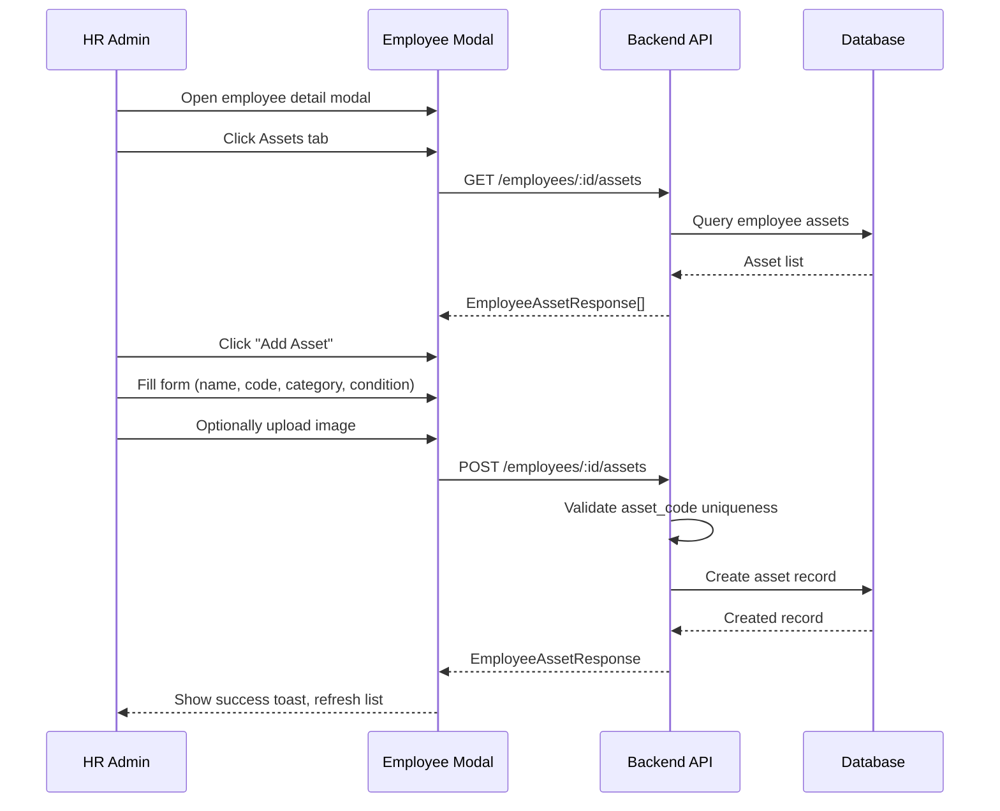
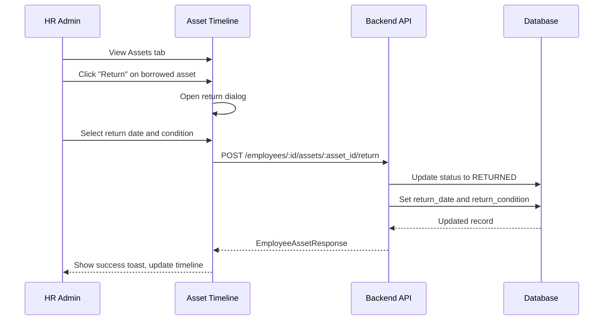

# HRD - Employee Asset Management

> **Module:** Organization (Master Data > Employees)  
> **Sprint:** —  
> **Version:** 1.0.0  
> **Status:** ✅ Complete (API + Frontend)  
> **Last Updated:** February 2026

---

## Table of Contents

1. [Overview](#overview)
2. [Features](#features)
3. [System Architecture](#system-architecture)
4. [Data Models](#data-models)
5. [Business Logic](#business-logic)
6. [API Reference](#api-reference)
7. [Frontend Components](#frontend-components)
8. [User Flows](#user-flows)
9. [Permissions](#permissions)
10. [Configuration](#configuration)
11. [Integration Points](#integration-points)
12. [Testing Strategy](#testing-strategy)
13. [Keputusan Teknis](#keputusan-teknis)
14. [Notes & Improvements](#notes--improvements)
15. [Appendix](#appendix)

---

## Overview

Employee Asset Management is a sub-feature of the Employee Management module that tracks company assets borrowed by employees. This feature allows HR administrators to monitor equipment distribution, track asset conditions, and manage returns.

### Key Features

| Feature            | Description                                                                  |
| ------------------ | ---------------------------------------------------------------------------- |
| Asset Tracking     | Track company assets borrowed by employees (laptops, phones, monitors, etc.) |
| Status Management  | Status tracking: BORROWED (active) vs RETURNED (completed)                   |
| Condition Tracking | Track condition at borrow and return time (NEW, GOOD, FAIR, POOR, DAMAGED)   |
| Image Upload       | Optional asset image upload via `/upload/image` endpoint (converted to WebP) |
| Image Preview      | Clickable image thumbnail opens full-size lightbox preview                   |
| Return Workflow    | Return Asset action with date/condition validation                           |
| Timeline View      | Assets tab with timeline design showing chronological history                |
| Days Counter       | Computed days borrowed calculation                                           |
| Soft Delete        | Soft delete for audit trail preservation                                     |

---

## Features

### 1. Asset Lifecycle Management

Track assets from borrowing through return:

| Stage    | Description                                        |
| -------- | -------------------------------------------------- |
| `Create` | Record new asset borrow with details and condition |
| `Update` | Modify asset details (only for unreturned assets)  |
| `Return` | Mark asset as returned with condition and date     |
| `Delete` | Soft delete asset record                           |

### 2. Asset Status

| Status     | Description                             |
| ---------- | --------------------------------------- |
| `BORROWED` | Asset is currently borrowed by employee |
| `RETURNED` | Asset has been returned                 |

### 3. Asset Condition

| Condition | Description                      |
| --------- | -------------------------------- |
| `NEW`     | Brand new, unused                |
| `GOOD`    | Good working condition           |
| `FAIR`    | Fair condition, minor wear       |
| `POOR`    | Poor condition, significant wear |
| `DAMAGED` | Damaged or non-functional        |

### 4. Image Support

- Asset images can be uploaded via `/upload/image` endpoint
- Supports JPEG, PNG, GIF, WebP (auto-converted to WebP)
- Clickable thumbnail opens lightbox with zoom effect
- Images are optional

---

## System Architecture

### Backend Structure

```
apps/api/internal/organization/
├── data/
│   ├── models/
│   │   └── employee_asset.go          # EmployeeAsset model + enums
│   └── repositories/
│       └── employee_asset_repository.go
├── domain/
│   ├── dto/
│   │   └── employee_asset_dto.go      # Create/Update/Return/Response DTOs
│   ├── mapper/
│   │   └── employee_asset_mapper.go
│   └── usecase/
│       └── employee_usecase.go        # Asset methods embedded in EmployeeUsecase
├── presentation/
│   ├── handler/
│   │   └── employee_handler.go        # Asset handler methods
│   └── router/
│       └── employee_routers.go        # Asset routes under /:id/assets
```

### Frontend Structure

```
apps/web/src/features/master-data/employee/
├── types/
│   └── index.d.ts                   # EmployeeAsset types and interfaces
├── schemas/
│   └── employee.schema.ts           # Asset validation schemas
├── services/
│   └── employee-service.ts          # getEmployeeAssets, createEmployeeAsset, etc.
├── hooks/
│   └── use-employees.ts             # assetKeys, useEmployeeAssets, mutations
├── i18n/
│   ├── en.ts                        # asset.* translations
│   └── id.ts
└── components/
    ├── assets/
    │   ├── index.ts                 # Barrel exports
    │   ├── asset-timeline.tsx       # Timeline with status/condition badges, image
    │   ├── create-asset-dialog.tsx  # Create form with image upload
    │   ├── edit-asset-dialog.tsx    # Edit form (disabled for returned assets)
    │   ├── return-asset-dialog.tsx  # Return form with date/condition
    │   ├── delete-asset-dialog.tsx  # Confirmation dialog
    │   └── image-lightbox.tsx       # Full-size image preview
    └── employee-detail-modal.tsx    # Assets tab integration
```

---

## Data Models

### EmployeeAsset

| Field            | Type        | Description                                              |
| ---------------- | ----------- | -------------------------------------------------------- |
| id               | UUID        | Primary key                                              |
| employee_id      | UUID        | Employee reference (FK)                                  |
| asset_name       | STRING(200) | Asset name/description                                   |
| asset_code       | STRING(100) | Unique asset identifier                                  |
| asset_category   | STRING(100) | Category (Laptop, Phone, etc.)                           |
| borrow_date      | DATE        | Date asset was borrowed                                  |
| return_date      | DATE        | Date asset was returned (nullable)                       |
| borrow_condition | ENUM        | Condition when borrowed (NEW, GOOD, FAIR, POOR, DAMAGED) |
| return_condition | ENUM        | Condition when returned (nullable)                       |
| asset_image      | STRING(255) | Path to uploaded image (nullable)                        |
| notes            | TEXT        | Additional notes                                         |
| status           | ENUM        | BORROWED or RETURNED                                     |
| created_at       | TIMESTAMP   | Record creation                                          |
| updated_at       | TIMESTAMP   | Last update                                              |
| deleted_at       | TIMESTAMP   | Soft delete timestamp                                    |

---

## Business Logic

### Asset Creation (Borrow)

```
1. Validate employee exists
2. Validate asset_code is unique globally
3. Set status = BORROWED
4. Set borrow_date (defaults to today)
5. Store optional image if provided
6. Create record
```

### Asset Update

```
1. Verify asset exists and belongs to employee
2. Reject if status = RETURNED (immutable for audit)
3. Allow partial updates
4. Asset image can be set to null/empty to remove
```

### Asset Return

```
1. Verify asset exists and status = BORROWED
2. Reject if already returned
3. Validate return_date >= borrow_date
4. Set status = RETURNED
5. Record return_condition (mandatory)
6. Optional return notes
```

### Days Borrowed Calculation

```
if status = RETURNED:
    days_borrowed = return_date - borrow_date
else:
    days_borrowed = today - borrow_date
```

---

## API Reference

All endpoints are sub-resources under `/api/v1/organization/employees/:employee_id/assets`.

### Asset Endpoints

| Method | Endpoint                                 | Permission      | Description                        |
| ------ | ---------------------------------------- | --------------- | ---------------------------------- |
| GET    | `/employees/:id/assets`                  | employee.read   | Get all assets for an employee     |
| POST   | `/employees/:id/assets`                  | employee.update | Create new asset record            |
| PUT    | `/employees/:id/assets/:asset_id`        | employee.update | Update existing (unreturned) asset |
| POST   | `/employees/:id/assets/:asset_id/return` | employee.update | Mark asset as returned             |
| DELETE | `/employees/:id/assets/:asset_id`        | employee.delete | Soft delete asset record           |

### Request Bodies

**Create Asset:**

```json
{
  "asset_name": "MacBook Pro 16\" M3 Max",
  "asset_code": "LAP-001",
  "asset_category": "Laptop",
  "borrow_date": "2026-02-01",
  "borrow_condition": "NEW",
  "asset_image": "/uploads/asset-image.webp",
  "notes": "For development work"
}
```

**Update Asset:**

```json
{
  "asset_name": "MacBook Pro 16\" M3 Max (Updated)",
  "asset_category": "Laptop - Development",
  "asset_image": "/uploads/new-image.webp",
  "notes": "Updated notes"
}
```

**Return Asset:**

```json
{
  "return_date": "2026-02-17",
  "return_condition": "GOOD",
  "notes": "All accessories returned"
}
```

### Response Schema

**EmployeeAssetResponse:**

```json
{
  "id": "uuid",
  "employee_id": "uuid",
  "asset_name": "MacBook Pro 16\" M3 Max",
  "asset_code": "LAP-001",
  "asset_category": "Laptop",
  "borrow_date": "2026-02-01",
  "return_date": null,
  "borrow_condition": "NEW",
  "return_condition": null,
  "asset_image": "/uploads/asset-image.webp",
  "notes": "For development work",
  "status": "BORROWED",
  "days_borrowed": 16,
  "created_at": "2026-02-01T10:30:00+07:00",
  "updated_at": "2026-02-01T10:30:00+07:00"
}
```

---

## Frontend Components

### Assets Tab (Employee Detail Modal)

| Component           | File                    | Description                                                  |
| ------------------- | ----------------------- | ------------------------------------------------------------ |
| `AssetTimeline`     | asset-timeline.tsx      | Timeline view with status/condition badges, image thumbnails |
| `CreateAssetDialog` | create-asset-dialog.tsx | Form for creating new asset borrow                           |
| `EditAssetDialog`   | edit-asset-dialog.tsx   | Edit form (disabled for returned assets)                     |
| `ReturnAssetDialog` | return-asset-dialog.tsx | Return workflow with date/condition                          |
| `DeleteAssetDialog` | delete-asset-dialog.tsx | Confirmation dialog                                          |
| `ImageLightbox`     | image-lightbox.tsx      | Full-size image preview with zoom                            |

### Features

- Timeline layout with status-colored dots (blue=BORROWED, green=RETURNED)
- Each card shows: asset name, code, category, image thumbnail, dates, conditions, days borrowed
- Clickable image thumbnail opens lightbox dialog
- Action buttons: Return (borrowed only), Edit (borrowed only), Delete
- "Add Asset" button at top right
- Chronological ordering by borrow date (most recent first)

### Create/Edit Asset Dialog

- Fields: Asset Name*, Code*, Category*, Borrow Date*, Borrow Condition\*, Asset Image (optional), Notes
- Borrow Date auto-fills with today's date
- Image upload uses `uploadEndpoint="/upload/image"`

### Return Asset Dialog

- Shows asset summary (code, name, borrowed since)
- Fields: Return Date* (min = borrow date), Return Condition*, Notes
- Return Date auto-fills with today's date
- Calendar prevents selecting dates before borrow date

---

## User Flows

### Asset Borrow Flow



### Asset Return Flow



---

## Permissions

| Action               | Permission        |
| -------------------- | ----------------- |
| View assets          | `employee.read`   |
| Create/Update/Return | `employee.update` |
| Delete               | `employee.delete` |

---

## Configuration

### i18n Keys

All translations nested under `employee.asset`:

| Key Path                      | Description                                         |
| ----------------------------- | --------------------------------------------------- |
| `employee.asset.fields.*`     | Field labels (assetName, assetCode, category, etc.) |
| `employee.asset.conditions.*` | Condition labels (NEW, GOOD, FAIR, POOR, DAMAGED)   |
| `employee.asset.statuses.*`   | Status labels (BORROWED, RETURNED)                  |
| `employee.asset.actions.*`    | Action buttons                                      |
| `employee.asset.form.*`       | Form titles, placeholders, hints                    |
| `employee.asset.success.*`    | Success messages                                    |
| `employee.asset.error.*`      | Error messages                                      |
| `employee.asset.empty.*`      | Empty state messages                                |
| `employee.tabs.assets`        | Tab label                                           |

---

## Integration Points

### With Employee Module

- Assets are sub-resources of employees
- Accessed via employee detail modal
- Permissions inherit from employee permissions
- Asset history is part of employee profile

### With Upload Module

- Asset images uploaded via `/upload/image` endpoint
- Returns path stored in `asset_image` field
- Auto-converted to WebP format

---

## Testing Strategy

### Backend Tests

- Unit tests in `employee_usecase_test.go`
- Repository tests for asset CRUD
- Validation tests for unique asset_code

### Frontend Tests

- Component tests for asset timeline
- Dialog form validation tests
- Image upload integration tests

### Manual Testing

1. Navigate to **Master Data > Employees**
2. Click employee to open detail modal
3. Go to **Assets** tab
4. **Create**: Add asset with image, verify auto-filled borrow date
5. **Image Preview**: Click thumbnail, verify lightbox opens
6. **Return**: Return asset, verify date picker constraints
7. **Edit**: Edit borrowed asset, verify returned assets are immutable
8. **Delete**: Delete asset, verify soft delete

---

## Keputusan Teknis

| Decision                                                   | Rationale                                                                                                                                                  |
| ---------------------------------------------------------- | ---------------------------------------------------------------------------------------------------------------------------------------------------------- |
| **Image upload via `/upload/image`**                       | The document upload endpoint only accepts PDF/Word/Excel; asset images need the image upload endpoint which accepts JPEG/PNG/GIF/WebP and converts to WebP |
| **Borrow/Return date auto-fill with today**                | Most common use-case is recording asset borrow/return on the same day; reduces friction                                                                    |
| **Return date calendar disables dates before borrow date** | Prevents invalid data at the UI level; borrow date normalized to midnight to avoid timezone edge cases                                                     |
| **Image lightbox with DialogTitle sr-only**                | Radix UI requires DialogTitle for accessibility; hidden visually but available to screen readers                                                           |
| **Frontend client-side sort by borrow date**               | Defensive sort ensures correct ordering regardless of API response order                                                                                   |
| **Returned assets immutable**                              | Audit trail requirement; once returned, asset record should not be modified to maintain historical accuracy                                                |
| **Soft delete instead of hard delete**                     | Preserves complete audit trail for compliance and reporting                                                                                                |
| **Global unique asset_code**                               | Enables cross-employee asset tracking and prevents duplicate codes across organization                                                                     |

---

## Notes & Improvements

### Completed Features

- ✅ Timeline view with status and condition badges
- ✅ Image upload with WebP conversion
- ✅ Lightbox image preview
- ✅ Return workflow with validation
- ✅ Days borrowed auto-calculation
- ✅ Soft delete for audit trail

### Future Improvements

- Asset barcode/QR code integration
- Asset inventory report
- Bulk asset import
- Asset depreciation tracking
- Asset maintenance history
- Integration with procurement module

---

## Appendix

### Error Codes

| Code                     | HTTP Status | Description                         |
| ------------------------ | ----------- | ----------------------------------- |
| `VALIDATION_ERROR`       | 400         | Invalid request body                |
| `ASSET_NOT_FOUND`        | 404         | Asset does not exist                |
| `ASSET_ALREADY_RETURNED` | 400         | Cannot update/return returned asset |
| `INVALID_RETURN_DATE`    | 400         | Return date before borrow date      |
| `DUPLICATE_ASSET_CODE`   | 400         | Asset code already exists           |
| `EMPLOYEE_NOT_FOUND`     | 404         | Employee does not exist             |

---

_Document generated for GIMS Platform - Employee Asset Management_
