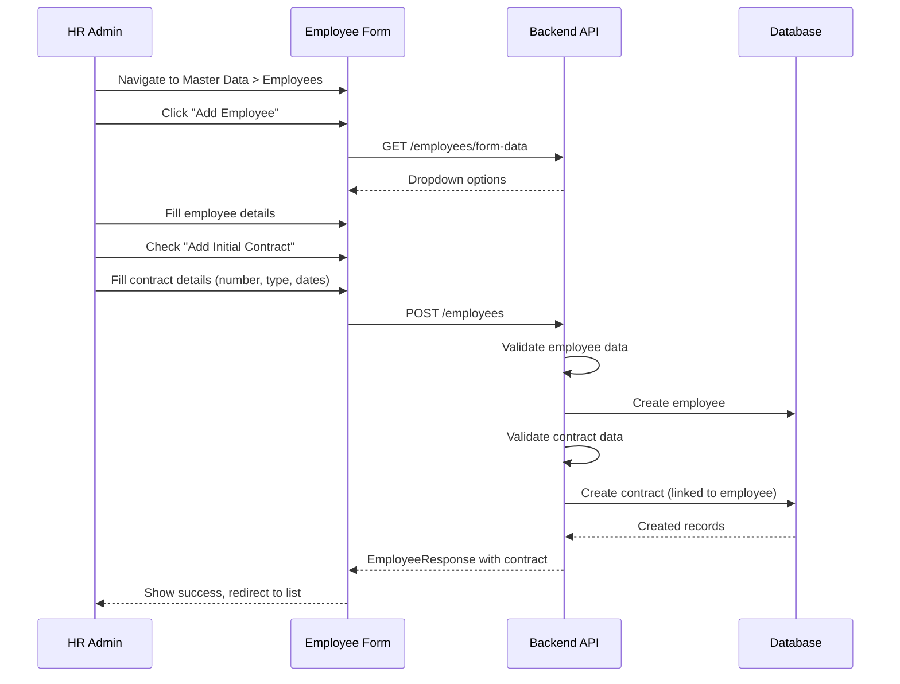
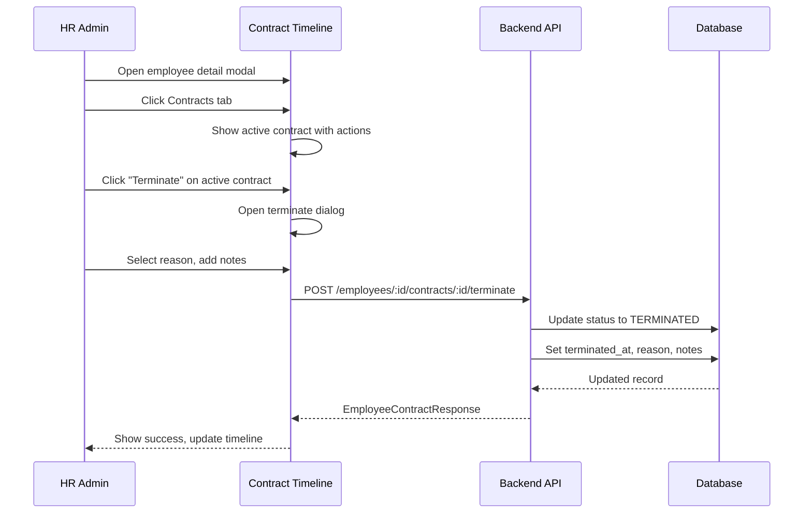
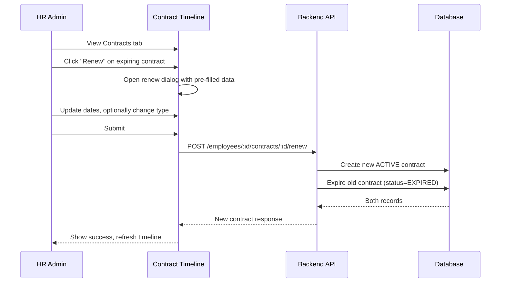

# HRD - Employee Contract Management

> **Module:** Organization (Master Data > Employees)  
> **Sprint:** —  
> **Version:** 3.1.0  
> **Status:** ✅ Complete (API + Frontend)  
> **Last Updated:** February 2026

---

## Table of Contents

1. [Overview](#overview)
2. [Features](#features)
3. [System Architecture](#system-architecture)
4. [Data Models](#data-models)
5. [Business Logic](#business-logic)
6. [API Reference](#api-reference)
7. [Frontend Components](#frontend-components)
8. [User Flows](#user-flows)
9. [Permissions](#permissions)
10. [Configuration](#configuration)
11. [Integration Points](#integration-points)
12. [Testing Strategy](#testing-strategy)
13. [Keputusan Teknis](#keputusan-teknis)
14. [Notes & Improvements](#notes--improvements)
15. [Appendix](#appendix)

---

## Overview

Employee Contract Management handles the lifecycle of employee work contracts. A contract is part of the employee master data, managed within the Employee module. This feature supports various contract types commonly used in Indonesia including PKWTT, PKWT, and internship contracts.

### Key Features

| Feature                    | Description                                              |
| -------------------------- | -------------------------------------------------------- |
| Contract Creation          | Create employee with optional initial contract (atomic)  |
| Separate Contract Creation | Add contracts to existing employees                      |
| Contract Update            | Edit contract details (number, type, dates, document)    |
| Contract Termination       | End contract (resignation, termination, etc.)            |
| Contract Renewal           | Create new contract while expiring the old one           |
| Contract Correction        | Fix active contract data without changing history        |
| Contract History           | Timeline view of all contracts with download capability  |
| Document Upload            | Upload and download contract documents                   |
| Validation                 | End date validation and contract number uniqueness       |
| i18n Support               | Full EN & ID support including Indonesian contract types |

---

## Features

### 1. Contract Types

| Type     | Full Name                             | End Date    | Description                   |
| -------- | ------------------------------------- | ----------- | ----------------------------- |
| `PKWTT`  | Perjanjian Kerja Waktu Tidak Tertentu | Not allowed | Permanent employment contract |
| `PKWT`   | Perjanjian Kerja Waktu Tertentu       | Required    | Fixed-term contract           |
| `Intern` | Magang                                | Required    | Internship contract           |

### 2. Contract Status

| Status       | Description                                        |
| ------------ | -------------------------------------------------- |
| `ACTIVE`     | Contract is currently in effect                    |
| `EXPIRED`    | Contract has been replaced or corrected            |
| `TERMINATED` | Contract ended manually (resignation, termination) |

### 3. Contract Actions

| Action      | Description                                 |
| ----------- | ------------------------------------------- |
| `Create`    | Add new contract to employee                |
| `Update`    | Modify contract details                     |
| `Terminate` | End contract with reason                    |
| `Renew`     | Create new contract, expire old one         |
| `Correct`   | Create corrected version of active contract |

### 4. Document Management

- Upload contract documents (PDF, DOC, DOCX)
- Download documents from timeline
- Display original filename in UI
- Stored as `{uuid}_{sanitized_original_name}.{ext}`

---

## System Architecture

### Backend Structure

```
apps/api/internal/organization/
├── data/
│   ├── models/
│   │   ├── employee.go
│   │   └── employee_contract.go
│   └── repositories/
│       ├── employee_repository.go
│       └── employee_contract_repository.go
├── domain/
│   ├── dto/
│   │   ├── employee_dto.go
│   │   └── employee_contract_dto.go
│   ├── mapper/
│   │   └── employee_mapper.go
│   └── usecase/
│       └── employee_usecase.go
└── presentation/
    ├── handler/
    │   └── employee_handler.go
    ├── router/
    │   └── employee_routers.go
    └── routers.go
```

### Frontend Structure

```
apps/web/src/features/master-data/employee/
├── components/
│   ├── contracts/
│   │   ├── index.ts                        # Barrel exports
│   │   ├── contract-info-card.tsx          # Active contract info card
│   │   ├── contract-timeline.tsx           # Contract history timeline
│   │   ├── create-contract-dialog.tsx      # Create new contract
│   │   ├── correct-contract-dialog.tsx     # Correct active contract
│   │   ├── edit-contract-dialog.tsx        # Edit contract (auto-prefill)
│   │   ├── renew-contract-dialog.tsx       # Renew contract
│   │   └── terminate-contract-dialog.tsx   # Terminate contract
│   ├── employee-detail-modal.tsx
│   ├── employee-form.tsx
│   └── employee-list.tsx
├── hooks/
│   └── use-employees.ts
├── i18n/
│   ├── en.ts
│   └── id.ts
├── schemas/
│   └── employee.schema.ts
├── services/
│   └── employee-service.ts
└── types/
    └── index.d.ts
```

---

## Data Models

### EmployeeContract

| Field                      | Type        | Description                            |
| -------------------------- | ----------- | -------------------------------------- |
| id                         | UUID        | Primary key                            |
| employee_id                | UUID        | Employee reference (FK)                |
| contract_number            | STRING(50)  | Unique contract identifier             |
| contract_type              | ENUM        | PKWTT, PKWT, Intern                    |
| start_date                 | DATE        | Contract start date                    |
| end_date                   | DATE        | Contract end date (nullable for PKWTT) |
| document_path              | STRING(255) | Path to uploaded document              |
| status                     | ENUM        | ACTIVE, EXPIRED, TERMINATED            |
| is_expiring_soon           | BOOL        | Computed flag                          |
| days_until_expiry          | INT         | Computed days to expiry                |
| terminated_at              | TIMESTAMP   | Termination timestamp                  |
| termination_reason         | STRING(100) | Termination reason                     |
| termination_notes          | TEXT        | Termination details                    |
| expired_at                 | TIMESTAMP   | Expiration timestamp                   |
| corrected_from_contract_id | UUID        | Reference to corrected contract        |
| created_by                 | UUID        | Creator user ID                        |
| updated_by                 | UUID        | Last updater user ID                   |
| created_at                 | TIMESTAMP   | Record creation                        |
| updated_at                 | TIMESTAMP   | Last update                            |
| deleted_at                 | TIMESTAMP   | Soft delete timestamp                  |

### Database Indexes

```sql
CREATE INDEX idx_employee_contracts_employee ON employee_contracts(employee_id);
CREATE UNIQUE INDEX idx_employee_contracts_number ON employee_contracts(contract_number);
CREATE INDEX idx_employee_contracts_type ON employee_contracts(contract_type);
CREATE INDEX idx_employee_contracts_dates ON employee_contracts(start_date, end_date);
CREATE INDEX idx_employee_contracts_status ON employee_contracts(status);
CREATE INDEX idx_employee_contracts_deleted ON employee_contracts(deleted_at);
```

---

## Business Logic

### Contract Validation Rules

| Rule                     | Description                                         |
| ------------------------ | --------------------------------------------------- |
| Contract Number Required | Must be manually entered (no auto-generation)       |
| PKWTT Restriction        | Cannot have end_date                                |
| PKWT/Intern Requirement  | Must have end_date                                  |
| End Date Validation      | end_date cannot be on or before start_date          |
| Single Active Contract   | Only one ACTIVE contract per employee at a time     |
| Terminated Immutable     | TERMINATED contracts cannot be modified             |
| Global Uniqueness        | contract_number must be unique across all contracts |

### Contract Creation Flow

```
1. Validate employee exists
2. Validate contract_number is unique
3. Validate contract_type rules (PKWTT vs PKWT/Intern)
4. Validate start_date and end_date relationship
5. Check no other ACTIVE contract exists
6. Create contract with status = ACTIVE
```

### Contract Termination Flow

```
1. Verify contract exists and is ACTIVE
2. Set status = TERMINATED
3. Set terminated_at = now()
4. Record termination_reason and termination_notes
```

### Contract Renewal Flow

```
1. Verify contract exists and is ACTIVE
2. Create new contract with:
   - New contract_number
   - Same or different type
   - New start_date and end_date
   - status = ACTIVE
3. Set old contract:
   - status = EXPIRED
   - expired_at = now()
```

### Contract Correction Flow

```
1. Verify active contract exists
2. Create new contract with:
   - contract_number = "{old_number}-C"
   - Same type, updated dates
   - status = ACTIVE
   - corrected_from_contract_id = old_contract.id
3. Set old contract:
   - status = EXPIRED
   - expired_at = now()
```

### Expiry Calculation

```
if end_date exists:
    days_until_expiry = end_date - today
    is_expiring_soon = days_until_expiry <= 30
else:
    days_until_expiry = null
    is_expiring_soon = false
```

---

## API Reference

Base URL: `/api/v1/organization/employees`

### Employee CRUD (with contract support)

| Method | Endpoint               | Permission      | Description                                   |
| ------ | ---------------------- | --------------- | --------------------------------------------- |
| POST   | `/employees`           | employee.create | Create employee (+ optional initial contract) |
| GET    | `/employees`           | employee.read   | List employees                                |
| GET    | `/employees/:id`       | employee.read   | Get employee detail                           |
| PUT    | `/employees/:id`       | employee.update | Update employee                               |
| DELETE | `/employees/:id`       | employee.delete | Delete employee (soft)                        |
| GET    | `/employees/form-data` | employee.read   | Get form dropdown options                     |

### Contract Management

| Method | Endpoint                                          | Permission      | Description             |
| ------ | ------------------------------------------------- | --------------- | ----------------------- |
| GET    | `/employees/:id/contracts`                        | employee.read   | List all contracts      |
| POST   | `/employees/:id/contracts`                        | employee.update | Create new contract     |
| GET    | `/employees/:id/contracts/active`                 | employee.read   | Get active contract     |
| PUT    | `/employees/:id/contracts/:contract_id`           | employee.update | Update contract         |
| DELETE | `/employees/:id/contracts/:contract_id`           | employee.delete | Delete contract (soft)  |
| POST   | `/employees/:id/contracts/:contract_id/terminate` | employee.update | Terminate contract      |
| POST   | `/employees/:id/contracts/:contract_id/renew`     | employee.update | Renew contract          |
| PATCH  | `/employees/:id/contracts/active`                 | employee.update | Correct active contract |

### Request Body Examples

**Create Employee with Contract:**

```json
{
  "employee_code": "EMP001",
  "name": "John Doe",
  "email": "john.doe@example.com",
  "division_id": "uuid",
  "job_position_id": "uuid",
  "initial_contract": {
    "contract_number": "CTR-EMP001-001",
    "contract_type": "PKWTT",
    "start_date": "2026-02-01",
    "document_path": "/uploads/uuid_contract.pdf"
  }
}
```

**Create Contract:**

```json
{
  "contract_number": "CTR-EMP001-002",
  "contract_type": "PKWT",
  "start_date": "2026-03-01",
  "end_date": "2027-03-01",
  "document_path": "/uploads/uuid_contract.pdf"
}
```

**Update Contract:**

```json
{
  "contract_number": "CTR-EMP001-002-REV",
  "contract_type": "PKWT",
  "start_date": "2026-03-01",
  "end_date": "2027-06-01",
  "document_path": "/uploads/uuid_new_doc.pdf"
}
```

**Terminate Contract:**

```json
{
  "reason": "RESIGN",
  "notes": "Employee resigned voluntarily"
}
```

**Renew Contract:**

```json
{
  "contract_number": "CTR-EMP001-003",
  "contract_type": "PKWT",
  "start_date": "2027-03-01",
  "end_date": "2028-03-01",
  "document_path": "/uploads/uuid_renewal.pdf"
}
```

**Correct Active Contract:**

```json
{
  "end_date": "2027-06-01",
  "document_path": "/uploads/uuid_corrected.pdf"
}
```

### Response Schema

**EmployeeContractResponse:**

```json
{
  "id": "uuid",
  "employee_id": "uuid",
  "contract_number": "CTR-EMP001-001",
  "contract_type": "PKWTT",
  "start_date": "2026-02-01",
  "end_date": null,
  "document_path": "/uploads/uuid_contract.pdf",
  "status": "ACTIVE",
  "is_expiring_soon": false,
  "days_until_expiry": null,
  "terminated_at": null,
  "termination_reason": "",
  "termination_notes": "",
  "expired_at": null,
  "corrected_from_contract_id": null,
  "created_at": "2026-02-22T10:00:00Z",
  "updated_at": "2026-02-22T10:00:00Z"
}
```

---

## Frontend Components

### Contract Tab (Employee Detail Modal)

| Component                 | File                          | Description                            |
| ------------------------- | ----------------------------- | -------------------------------------- |
| `ContractInfoCard`        | contract-info-card.tsx        | Active contract summary card           |
| `ContractTimeline`        | contract-timeline.tsx         | Historical contract list with timeline |
| `CreateContractDialog`    | create-contract-dialog.tsx    | Form for creating new contract         |
| `EditContractDialog`      | edit-contract-dialog.tsx      | Edit contract form (auto-prefill)      |
| `CorrectContractDialog`   | correct-contract-dialog.tsx   | Correct active contract data           |
| `RenewContractDialog`     | renew-contract-dialog.tsx     | Renew existing contract                |
| `TerminateContractDialog` | terminate-contract-dialog.tsx | Terminate active contract              |

### Contract Timeline Features

- Chronological list of all contracts
- Status badges (ACTIVE, EXPIRED, TERMINATED)
- Contract type badges (PKWTT, PKWT, Intern)
- Expiry warnings for active contracts
- Document download links
- Action buttons based on status

### Create/Edit Contract Form

- Fields: Contract Number*, Type*, Start Date\*, End Date (conditional), Document
- Real-time validation
- End date picker constraints (cannot be before start date)
- Document upload with progress

### i18n Keys

All translations under `employee.contract`:

| Key Path                       | Description                                              |
| ------------------------------ | -------------------------------------------------------- |
| `employee.contract.types.*`    | Contract type labels (PKWTT, PKWT, Intern)               |
| `employee.contract.statuses.*` | Status labels (ACTIVE, EXPIRED, TERMINATED)              |
| `employee.contract.fields.*`   | Form field labels                                        |
| `employee.contract.actions.*`  | Action buttons (create, edit, terminate, renew, correct) |

---

## User Flows

### Create Employee with Contract Flow



### Contract Termination Flow



### Contract Renewal Flow



---

## Permissions

| Permission         | Description                                                      |
| ------------------ | ---------------------------------------------------------------- |
| `employee.read`    | View employee and contract info                                  |
| `employee.create`  | Create employee (with optional contract)                         |
| `employee.update`  | Update employee, create/update/terminate/renew/correct contracts |
| `employee.delete`  | Delete employee or contract (soft delete)                        |
| `employee.approve` | Approve/reject employee                                          |

---

## Configuration

### Contract Type Configuration

Contract types are hardcoded enums:

- PKWTT (Permanent)
- PKWT (Fixed-term)
- Intern (Internship)

### Document Storage

- Path format: `/uploads/{uuid}_{sanitized_name}.{ext}`
- Supported formats: PDF, DOC, DOCX
- Original filename preserved for display

---

## Integration Points

### With Employee Module

- Contracts are sub-resources of employees
- Accessed through employee detail modal
- Contract history is part of employee profile
- Initial contract can be created with employee

### With Upload Module

- Contract documents uploaded via upload endpoints
- Returns path stored in `document_path` field

---

## Testing Strategy

### Backend Tests

Run unit tests:

```bash
cd apps/api && go test ./internal/organization/...
```

### Manual Testing

1. **Create Employee with Contract:**

```bash
curl -X POST http://localhost:8080/api/v1/organization/employees \
  -H "Authorization: Bearer $TOKEN" \
  -H "Content-Type: application/json" \
  -d '{
    "employee_code": "EMP001",
    "name": "John Doe",
    "email": "john@example.com",
    "gender": "male",
    "initial_contract": {
      "contract_number": "CTR-EMP001-001",
      "contract_type": "PKWTT",
      "start_date": "2026-02-01"
    }
  }'
```

2. **Create Employee without Contract:**

```bash
curl -X POST http://localhost:8080/api/v1/organization/employees \
  -H "Authorization: Bearer $TOKEN" \
  -H "Content-Type: application/json" \
  -d '{
    "employee_code": "EMP002",
    "name": "Jane Smith",
    "email": "jane@example.com",
    "gender": "female"
  }'
```

3. **Create Contract for Existing Employee:**

```bash
curl -X POST http://localhost:8080/api/v1/organization/employees/:id/contracts \
  -H "Authorization: Bearer $TOKEN" \
  -H "Content-Type: application/json" \
  -d '{
    "contract_number": "CTR-EMP002-001",
    "contract_type": "PKWT",
    "start_date": "2026-03-01",
    "end_date": "2027-03-01"
  }'
```

4. **Terminate Contract:**

```bash
curl -X POST http://localhost:8080/api/v1/organization/employees/:id/contracts/:contractId/terminate \
  -H "Authorization: Bearer $TOKEN" \
  -H "Content-Type: application/json" \
  -d '{
    "reason": "RESIGN",
    "notes": "Employee resigned voluntarily"
  }'
```

5. **Renew Contract:**

```bash
curl -X POST http://localhost:8080/api/v1/organization/employees/:id/contracts/:contractId/renew \
  -H "Authorization: Bearer $TOKEN" \
  -H "Content-Type: application/json" \
  -d '{
    "contract_number": "CTR-EMP001-002",
    "contract_type": "PKWT",
    "start_date": "2027-03-01",
    "end_date": "2028-03-01"
  }'
```

6. **Correct Active Contract:**

```bash
curl -X PATCH http://localhost:8080/api/v1/organization/employees/:id/contracts/active \
  -H "Authorization: Bearer $TOKEN" \
  -H "Content-Type: application/json" \
  -d '{
    "end_date": "2027-06-01",
    "document_path": "/uploads/uuid_corrected.pdf"
  }'
```

---

## Keputusan Teknis

| Decision                                      | Rationale                                                                                                                                                                                                     |
| --------------------------------------------- | ------------------------------------------------------------------------------------------------------------------------------------------------------------------------------------------------------------- |
| **Atomic Employee + Contract Creation**       | Frontend sends `initial_contract` nested in create employee request. Backend creates both in one operation for better UX. Trade-off: larger request body, but simpler flow.                                   |
| **No Salary/JobTitle/Department in Contract** | These fields exist in employee data (`job_position_id`, `division_id`). Salary excluded for privacy. Trade-off: contract is simpler, data normalized.                                                         |
| **Contract Type Simplification**              | Reduced from 4 types (PERMANENT, CONTRACT, INTERNSHIP, PROBATION) to 3 (PKWTT, PKWT, Intern). Probation considered a status within PKWT. Trade-off: aligned with Indonesian labor law terms.                  |
| **Contract Number Manual Entry**              | No auto-generation based on employee code. HR has full control over numbering scheme. Trade-off: requires manual input, but flexible for different company policies.                                          |
| **Correct = Create New + Expire Old**         | Correction creates new contract (with `-C` suffix) and expires old one. Field `corrected_from_contract_id` maintains audit trail. Trade-off: more records, but complete history preserved.                    |
| **Renew = Create New + Expire Old**           | Similar to correct, but for intentional renewal. Trade-off: maintains full contract history.                                                                                                                  |
| **End Date Validation**                       | Datepicker prevents selecting dates on or before start_date. Applied in create employee, create contract, and edit contract forms. Trade-off: client-side validation for UX, backend validation for security. |
| **Edit Contract Pre-fill**                    | Dialog auto-fills with existing data when opened. Trade-off: requires data fetch, but better UX.                                                                                                              |
| **Filename UX**                               | Backend stores `{uuid}_{sanitized_original_name}.{ext}` so frontend can display and download with original name. Trade-off: longer paths, but user-friendly.                                                  |
| **Single Active Contract Rule**               | Only one ACTIVE contract per employee prevents conflicts. Trade-off: requires expiring old contract before creating new one.                                                                                  |

---

## Notes & Improvements

### Version History

| Version | Changes                                                                                                                                         |
| ------- | ----------------------------------------------------------------------------------------------------------------------------------------------- |
| 3.1.0   | Contract number required (removed auto-generate), end date validation, edit contract auto-prefill, document download in timeline, complete i18n |

### Completed Features

- ✅ Create employee with optional initial contract
- ✅ Create separate contract for existing employee
- ✅ Update/edit contract with form auto-prefill
- ✅ Terminate contract with reason
- ✅ Renew contract (new + expire old)
- ✅ Correct active contract (audit trail preserved)
- ✅ Contract history timeline
- ✅ Document upload and download
- ✅ End date validation
- ✅ i18n support (EN & ID)
- ✅ PKWTT, PKWT, Intern contract types

### Future Improvements

- Contract template system
- Automatic expiry notifications
- Contract reporting and analytics
- Bulk contract renewal
- Integration with payroll for contract-based salary rules
- Electronic signature integration
- Contract approval workflow

---

## Appendix

### Error Codes

| Code                       | HTTP Status | Description                             |
| -------------------------- | ----------- | --------------------------------------- |
| `CONTRACT_NOT_FOUND`       | 404         | Contract does not exist                 |
| `CONTRACT_NUMBER_EXISTS`   | 400         | Contract number already in use          |
| `INVALID_CONTRACT_TYPE`    | 400         | Invalid contract type                   |
| `INVALID_DATE_RANGE`       | 400         | End date before or equal to start date  |
| `ACTIVE_CONTRACT_EXISTS`   | 400         | Employee already has an active contract |
| `CANNOT_MODIFY_TERMINATED` | 400         | Cannot modify terminated contract       |
| `CONTRACT_NOT_ACTIVE`      | 400         | Action requires active contract         |
| `EMPLOYEE_NOT_FOUND`       | 404         | Employee does not exist                 |

---

_Document generated for GIMS Platform - Employee Contract Management v3.1.0_
