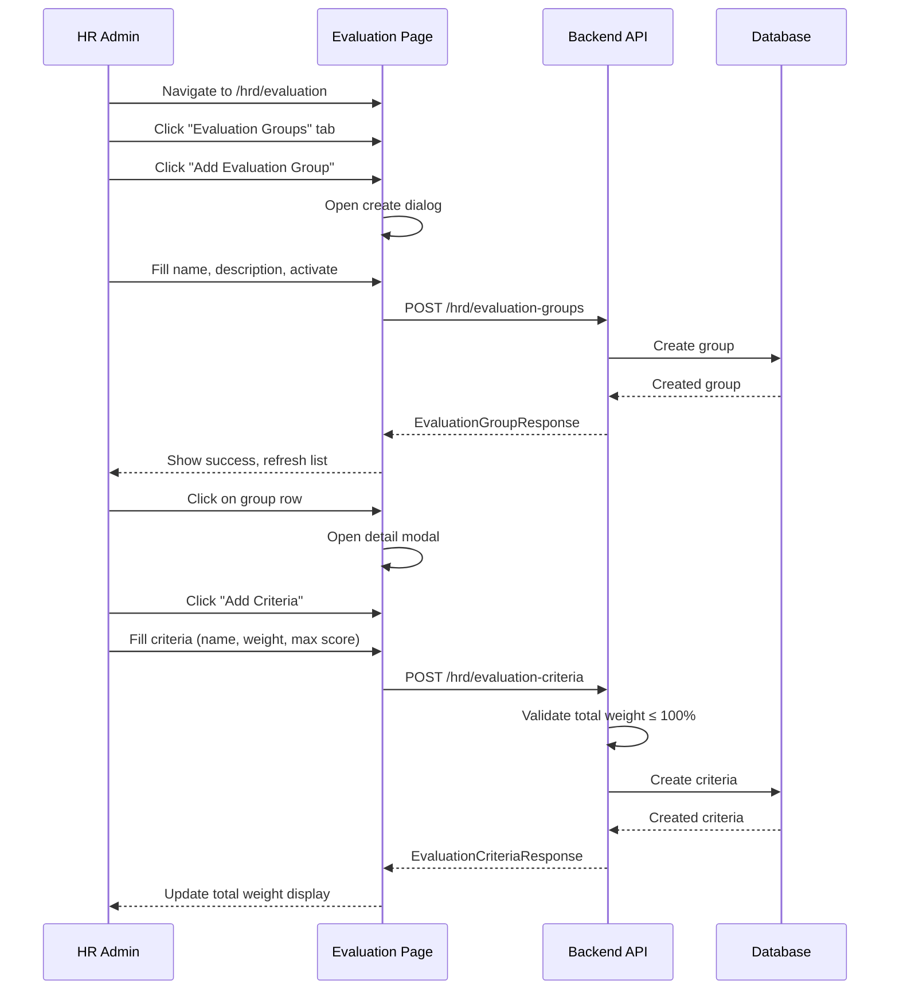
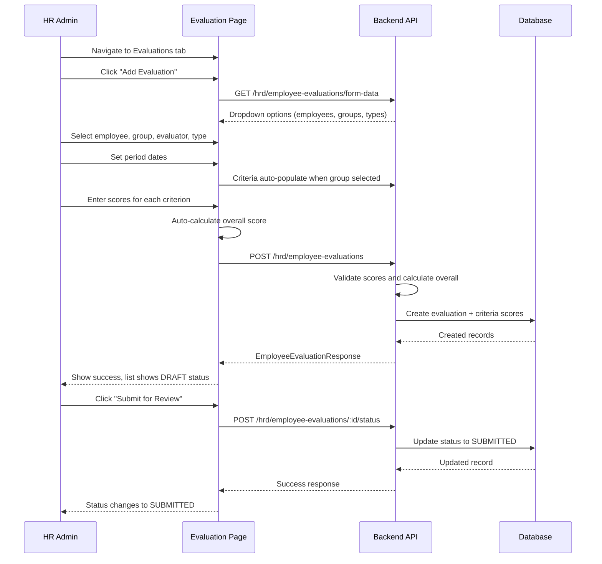
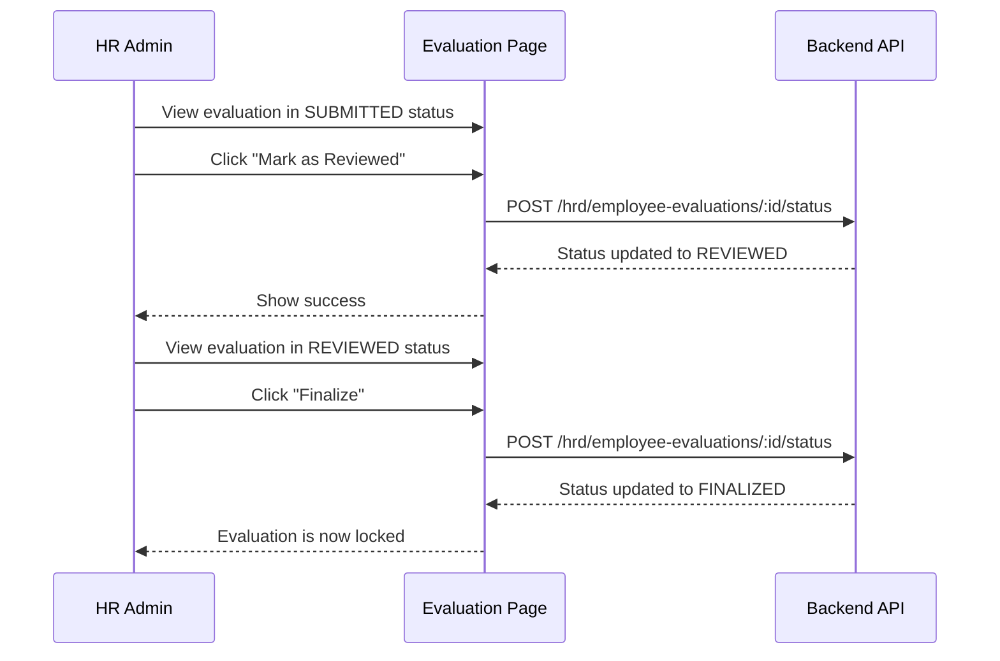

# HRD - Employee Evaluation Management

> **Module:** HRD (Human Resource Development)  
> **Sprint:** —  
> **Version:** 1.0.0  
> **Status:** ✅ Complete (API + Frontend)  
> **Last Updated:** February 2026

---

## Table of Contents

1. [Overview](#overview)
2. [Features](#features)
3. [System Architecture](#system-architecture)
4. [Data Models](#data-models)
5. [Business Logic](#business-logic)
6. [API Reference](#api-reference)
7. [Frontend Components](#frontend-components)
8. [User Flows](#user-flows)
9. [Permissions](#permissions)
10. [Configuration](#configuration)
11. [Integration Points](#integration-points)
12. [Testing Strategy](#testing-strategy)
13. [Keputusan Teknis](#keputusan-teknis)
14. [Notes & Improvements](#notes--improvements)
15. [Appendix](#appendix)

---

## Overview

Employee Evaluation Management provides comprehensive performance evaluation tools for HR teams. The system supports creating evaluation templates with weighted criteria, conducting employee evaluations with per-criteria scoring, and managing evaluation workflows from draft to finalized status.

### Key Features

| Feature              | Description                                                      |
| -------------------- | ---------------------------------------------------------------- |
| Evaluation Templates | Create evaluation groups with weighted criteria                  |
| Weight Validation    | Ensure total criteria weights ≤ 100%                             |
| Employee Evaluation  | Score employees per criterion with automatic overall calculation |
| Score Calculation    | Overall score = Σ(score × weight / 100)                          |
| Evaluation Types     | Support SELF and MANAGER evaluations                             |
| Workflow Status      | DRAFT → SUBMITTED → REVIEWED → FINALIZED                         |
| Form Data Endpoint   | Single API call for all dropdown options                         |
| Search & Filter      | Pagination, search, and multi-parameter filtering                |

---

## Features

### 1. Evaluation Groups (Templates)

Create reusable evaluation templates:

| Feature             | Description                                           |
| ------------------- | ----------------------------------------------------- |
| Group Name          | Template identifier (e.g., "Performance Review FY25") |
| Active Status       | Enable/disable group for use                          |
| Criteria Management | Add/edit/delete criteria within group                 |
| Weight Validation   | Total criteria weight cannot exceed 100%              |

### 2. Evaluation Criteria

Define scoring criteria within groups:

| Field       | Description                            |
| ----------- | -------------------------------------- |
| Name        | Criterion name (e.g., "Communication") |
| Description | Detailed explanation                   |
| Weight      | Importance percentage (e.g., 30%)      |
| Max Score   | Maximum possible score                 |
| Order       | Display order                          |

### 3. Employee Evaluations

Conduct evaluations with scoring:

| Field            | Description                         |
| ---------------- | ----------------------------------- |
| Employee         | Person being evaluated              |
| Evaluation Group | Template used                       |
| Evaluator        | Person conducting evaluation        |
| Type             | SELF or MANAGER                     |
| Period           | Evaluation period (start/end dates) |
| Criteria Scores  | Score per criterion                 |
| Notes            | Additional comments                 |

### 4. Evaluation Workflow Status

| Status      | Description              |
| ----------- | ------------------------ |
| `DRAFT`     | Can be edited or deleted |
| `SUBMITTED` | Awaiting review          |
| `REVIEWED`  | Review completed         |
| `FINALIZED` | Final and locked         |

### 5. Evaluation Types

| Type      | Description                    |
| --------- | ------------------------------ |
| `SELF`    | Self-evaluation by employee    |
| `MANAGER` | Manager evaluation of employee |

---

## System Architecture

### Backend Structure

```
apps/api/internal/hrd/
├── data/
│   ├── models/
│   │   ├── evaluation_group.go           # EvaluationGroup model
│   │   ├── evaluation_criteria.go        # EvaluationCriteria model
│   │   └── employee_evaluation.go        # EmployeeEvaluation + EmployeeEvaluationCriteria
│   └── repositories/
│       ├── evaluation_group_repository.go          # Interface
│       ├── evaluation_group_repository_impl.go     # GORM implementation
│       ├── evaluation_criteria_repository.go       # Interface
│       ├── evaluation_criteria_repository_impl.go  # GORM implementation
│       ├── employee_evaluation_repository.go       # Interface
│       └── employee_evaluation_repository_impl.go  # GORM implementation
├── domain/
│   ├── dto/
│   │   └── evaluation_dto.go             # All evaluation DTOs
│   ├── mapper/
│   │   └── evaluation_mapper.go          # All evaluation mappers
│   └── usecase/
│       ├── evaluation_group_usecase.go           # Interface
│       ├── evaluation_group_usecase_impl.go      # Implementation
│       ├── evaluation_criteria_usecase.go        # Interface
│       ├── evaluation_criteria_usecase_impl.go   # Implementation
│       ├── employee_evaluation_usecase.go        # Interface
│       └── employee_evaluation_usecase_impl.go   # Implementation
└── presentation/
    ├── handler/
    │   ├── evaluation_group_handler.go
    │   ├── evaluation_criteria_handler.go
    │   └── employee_evaluation_handler.go
    ├── router/
    │   ├── evaluation_group_router.go
    │   ├── evaluation_criteria_router.go
    │   └── employee_evaluation_router.go
    └── routers.go                         # Domain aggregator
```

### Frontend Structure

```
apps/web/src/features/hrd/evaluation/
├── types/
│   └── index.d.ts                         # All TypeScript interfaces & types
├── schemas/
│   └── evaluation.schema.ts               # Zod schemas with i18n
├── services/
│   └── evaluation-service.ts              # API service (3 service objects)
├── hooks/
│   └── use-evaluations.ts                 # TanStack Query hooks (CRUD + form data)
├── components/
│   ├── evaluation-page.tsx                # Main page with tabs
│   ├── evaluation-group-list.tsx          # Group list with search/filter/pagination
│   ├── evaluation-group-form.tsx          # Create/edit group dialog
│   ├── evaluation-group-detail-modal.tsx  # Group detail + criteria management
│   ├── evaluation-criteria-form.tsx       # Create/edit criteria dialog
│   ├── employee-evaluation-list.tsx       # Evaluation list with status workflow
│   ├── employee-evaluation-form.tsx       # Create/edit evaluation with scores
│   └── employee-evaluation-detail-modal.tsx # Evaluation detail with score breakdown
└── i18n/
    ├── en.ts                              # English translations
    └── id.ts                              # Indonesian translations

apps/web/app/[locale]/(dashboard)/hrd/evaluation/
├── page.tsx                               # Route page with PermissionGuard
└── loading.tsx                            # Loading skeleton
```

---

## Data Models

### EvaluationGroup

| Field        | Type        | Description                        |
| ------------ | ----------- | ---------------------------------- |
| id           | UUID        | Primary key                        |
| name         | STRING(200) | Group/template name                |
| description  | TEXT        | Optional description               |
| is_active    | BOOL        | Whether group is available for use |
| total_weight | INT         | Computed sum of criteria weights   |
| created_at   | TIMESTAMP   | Record creation                    |
| updated_at   | TIMESTAMP   | Last update                        |
| deleted_at   | TIMESTAMP   | Soft delete timestamp              |

### EvaluationCriteria

| Field               | Type        | Description               |
| ------------------- | ----------- | ------------------------- |
| id                  | UUID        | Primary key               |
| evaluation_group_id | UUID        | FK to EvaluationGroup     |
| name                | STRING(200) | Criterion name            |
| description         | TEXT        | Detailed description      |
| weight              | INT         | Weight percentage (1-100) |
| max_score           | INT         | Maximum score possible    |
| display_order       | INT         | Sort order                |
| created_at          | TIMESTAMP   | Record creation           |
| updated_at          | TIMESTAMP   | Last update               |
| deleted_at          | TIMESTAMP   | Soft delete timestamp     |

### EmployeeEvaluation

| Field               | Type      | Description                           |
| ------------------- | --------- | ------------------------------------- |
| id                  | UUID      | Primary key                           |
| employee_id         | UUID      | FK to Employee (evaluatee)            |
| evaluation_group_id | UUID      | FK to EvaluationGroup                 |
| evaluator_id        | UUID      | FK to Employee (evaluator)            |
| evaluation_type     | ENUM      | SELF or MANAGER                       |
| period_start        | DATE      | Evaluation period start               |
| period_end          | DATE      | Evaluation period end                 |
| overall_score       | FLOAT     | Calculated overall score              |
| status              | ENUM      | DRAFT, SUBMITTED, REVIEWED, FINALIZED |
| notes               | TEXT      | General notes                         |
| submitted_at        | TIMESTAMP | When submitted                        |
| reviewed_at         | TIMESTAMP | When reviewed                         |
| finalized_at        | TIMESTAMP | When finalized                        |
| created_at          | TIMESTAMP | Record creation                       |
| updated_at          | TIMESTAMP | Last update                           |
| deleted_at          | TIMESTAMP | Soft delete timestamp                 |

### EmployeeEvaluationCriteria

| Field                  | Type      | Description                          |
| ---------------------- | --------- | ------------------------------------ |
| id                     | UUID      | Primary key                          |
| employee_evaluation_id | UUID      | FK to EmployeeEvaluation             |
| evaluation_criteria_id | UUID      | FK to EvaluationCriteria             |
| score                  | FLOAT     | Score achieved                       |
| weight                 | INT       | Weight at evaluation time (snapshot) |
| notes                  | TEXT      | Criterion-specific notes             |
| created_at             | TIMESTAMP | Record creation                      |
| updated_at             | TIMESTAMP | Last update                          |

---

## Business Logic

### Weight Validation

```
Total weight of all criteria in a group must be ≤ 100%
On create/update criteria: validate new total weight
Error if total > 100
```

### Overall Score Calculation

```
overall_score = Σ(criteria_score × criteria_weight / 100)

Example:
- Communication: score 85, weight 30% → 85 × 30 / 100 = 25.5
- Technical: score 90, weight 40% → 90 × 40 / 100 = 36.0
- Teamwork: score 80, weight 30% → 80 × 30 / 100 = 24.0
- Overall: 25.5 + 36.0 + 24.0 = 85.5
```

### Status Workflow

```
DRAFT → SUBMITTED → REVIEWED → FINALIZED

Rules:
- Only DRAFT can be edited or deleted
- Evaluation cannot be submitted without criteria scores
- Status transitions are one-way (forward only)
- FINALIZED evaluations are immutable
```

### Weight Snapshot

```
When evaluation is created:
- Copy current weight from each criteria to EmployeeEvaluationCriteria
- This preserves historical accuracy if template weights change later
```

### Period Validation

```
period_end must be after period_start
Both dates required
```

---

## API Reference

### Evaluation Groups

| Method | Endpoint                     | Permission        | Description                     |
| ------ | ---------------------------- | ----------------- | ------------------------------- |
| GET    | `/hrd/evaluation-groups`     | evaluation.read   | List all groups (paginated)     |
| GET    | `/hrd/evaluation-groups/:id` | evaluation.read   | Get group by ID (with criteria) |
| POST   | `/hrd/evaluation-groups`     | evaluation.create | Create evaluation group         |
| PUT    | `/hrd/evaluation-groups/:id` | evaluation.update | Update evaluation group         |
| DELETE | `/hrd/evaluation-groups/:id` | evaluation.delete | Delete group (soft)             |

### Evaluation Criteria

| Method | Endpoint                                   | Permission        | Description                        |
| ------ | ------------------------------------------ | ----------------- | ---------------------------------- |
| GET    | `/hrd/evaluation-criteria/group/:group_id` | evaluation.read   | Get criteria by group              |
| GET    | `/hrd/evaluation-criteria/:id`             | evaluation.read   | Get criteria by ID                 |
| POST   | `/hrd/evaluation-criteria`                 | evaluation.create | Create criteria (validates weight) |
| PUT    | `/hrd/evaluation-criteria/:id`             | evaluation.update | Update criteria (validates weight) |
| DELETE | `/hrd/evaluation-criteria/:id`             | evaluation.delete | Delete criteria (soft)             |

### Employee Evaluations

| Method | Endpoint                               | Permission        | Description                            |
| ------ | -------------------------------------- | ----------------- | -------------------------------------- |
| GET    | `/hrd/employee-evaluations`            | evaluation.read   | List evaluations (paginated, filtered) |
| GET    | `/hrd/employee-evaluations/:id`        | evaluation.read   | Get evaluation with full details       |
| GET    | `/hrd/employee-evaluations/form-data`  | Auth              | Get form dropdown data                 |
| POST   | `/hrd/employee-evaluations`            | evaluation.create | Create evaluation with scores          |
| PUT    | `/hrd/employee-evaluations/:id`        | evaluation.update | Update evaluation (DRAFT only)         |
| POST   | `/hrd/employee-evaluations/:id/status` | evaluation.update | Transition status                      |
| DELETE | `/hrd/employee-evaluations/:id`        | evaluation.delete | Delete evaluation (DRAFT only)         |

### Query Parameters (List)

| Parameter    | Type   | Description                                              |
| ------------ | ------ | -------------------------------------------------------- |
| page         | int    | Page number (default: 1)                                 |
| per_page     | int    | Items per page (default: 20, max: 100)                   |
| search       | string | Search by employee name, group name, or notes            |
| status       | string | Filter by status (DRAFT, SUBMITTED, REVIEWED, FINALIZED) |
| type         | string | Filter by type (SELF, MANAGER)                           |
| employee_id  | uuid   | Filter by employee                                       |
| evaluator_id | uuid   | Filter by evaluator                                      |

---

## Frontend Components

### Evaluation Page (`/hrd/evaluation`)

| Component                       | File                                 | Description                              |
| ------------------------------- | ------------------------------------ | ---------------------------------------- |
| `EvaluationPage`                | evaluation-page.tsx                  | Main page with tab navigation            |
| `EvaluationGroupList`           | evaluation-group-list.tsx            | Group list with search/filter/pagination |
| `EvaluationGroupForm`           | evaluation-group-form.tsx            | Create/edit group dialog                 |
| `EvaluationGroupDetailModal`    | evaluation-group-detail-modal.tsx    | Group detail + criteria management       |
| `EvaluationCriteriaForm`        | evaluation-criteria-form.tsx         | Create/edit criteria dialog              |
| `EmployeeEvaluationList`        | employee-evaluation-list.tsx         | Evaluation list with status workflow     |
| `EmployeeEvaluationForm`        | employee-evaluation-form.tsx         | Create/edit evaluation with scores       |
| `EmployeeEvaluationDetailModal` | employee-evaluation-detail-modal.tsx | Evaluation detail with score breakdown   |

### Features

- Tab-based navigation (Evaluations | Evaluation Groups)
- Group list with total weight display
- Criteria management within group detail
- Weight validation with real-time feedback
- Evaluation list with status badges and actions
- Score auto-clamping to max_score on input
- Status workflow actions (Submit, Review, Finalize)
- Detail modal with tabs for Overview and Criteria Scores
- Search by employee name, group name, notes

### i18n Keys

| Key Path                   | Description                                           |
| -------------------------- | ----------------------------------------------------- |
| `evaluation.groups.*`      | Evaluation group labels                               |
| `evaluation.criteria.*`    | Criteria labels                                       |
| `evaluation.evaluations.*` | Evaluation labels                                     |
| `evaluation.statuses.*`    | Status labels (DRAFT, SUBMITTED, REVIEWED, FINALIZED) |
| `evaluation.types.*`       | Type labels (SELF, MANAGER)                           |

---

## User Flows

### Create Evaluation Group Flow



### Conduct Employee Evaluation Flow



### Status Workflow Flow



---

## Permissions

| Permission          | Description                                          |
| ------------------- | ---------------------------------------------------- |
| `evaluation.read`   | View evaluation groups, criteria, and evaluations    |
| `evaluation.create` | Create evaluation groups, criteria, and evaluations  |
| `evaluation.update` | Update all evaluation entities and transition status |
| `evaluation.delete` | Delete evaluation groups, criteria, and evaluations  |

---

## Configuration

### Database Indexes

```sql
-- GIN indexes for text search
CREATE INDEX idx_evaluation_groups_name_gin ON evaluation_groups USING gin(name gin_trgm_ops);
CREATE INDEX idx_evaluation_criteria_name_gin ON evaluation_criteria USING gin(name gin_trgm_ops);

-- B-tree indexes for foreign keys and filtering
CREATE INDEX idx_employee_evaluations_employee ON employee_evaluations(employee_id);
CREATE INDEX idx_employee_evaluations_group ON employee_evaluations(evaluation_group_id);
CREATE INDEX idx_employee_evaluations_evaluator ON employee_evaluations(evaluator_id);
CREATE INDEX idx_employee_evaluations_status ON employee_evaluations(status);
CREATE INDEX idx_employee_evaluations_type ON employee_evaluations(evaluation_type);
```

---

## Integration Points

### With Employee Module

- Employee data used for evaluatee and evaluator selection
- Employee repository provides employee lookup
- Employee IDs validated against employee table

### With Organization Module

- Division and position data available for context
- Job position information can be included in reports

---

## Testing Strategy

### Backend Tests

- Unit tests: `apps/api/internal/hrd/domain/usecase/evaluation_group_usecase_test.go`
- Integration tests: `apps/api/test/hrd/evaluation_integration_test.go`

Run tests:

```bash
cd apps/api && go test ./internal/hrd/...
```

### Manual Testing

1. **Create Evaluation Group:**
   - POST `/hrd/evaluation-groups`
   - Verify created with correct data

2. **Add Criteria:**
   - POST `/hrd/evaluation-criteria`
   - Try to exceed 100% total weight → should fail
   - Verify weight validation works

3. **Create Evaluation:**
   - POST `/hrd/employee-evaluations`
   - Verify overall_score calculation
   - Verify criteria scores created

4. **Status Transitions:**
   - Submit DRAFT → SUBMITTED
   - Review SUBMITTED → REVIEWED
   - Finalize REVIEWED → FINALIZED
   - Try to edit FINALIZED → should fail

5. **Search & Filter:**
   - Search by employee name
   - Filter by status
   - Filter by type

---

## Keputusan Teknis

| Decision                                           | Rationale                                                                                                                                       |
| -------------------------------------------------- | ----------------------------------------------------------------------------------------------------------------------------------------------- |
| **Weight copied to evaluation criteria score**     | Template weight changes don't affect existing evaluations. Preserves historical accuracy. Trade-off: minimal data duplication.                  |
| **No REJECTED status**                             | One-way forward flow. If reviewer disagrees, they can add notes without advancing status. Trade-off: cannot return to draft.                    |
| **Criteria scores managed with parent evaluation** | Delete/recreate on update rather than independent soft delete. Trade-off: more writes, simpler logic.                                           |
| **Snapshot weights at evaluation creation**        | Weight changes to template don't retroactively affect past evaluations. Trade-off: data duplication for accuracy.                               |
| **Status transition one-way only**                 | Prevents confusion and maintains clear audit trail. Trade-off: less flexibility.                                                                |
| **GIN indexes for text search**                    | Enable fast prefix search on group names, criteria names, and employee names. Trade-off: slightly more storage, much better search performance. |
| **Zod UUID regex instead of strict RFC 4122**      | Accepts any UUID-formatted hex string (including seeders). Trade-off: looser validation, better compatibility.                                  |
| **Criteria scores editable in edit mode**          | Allows corrections before submission. Trade-off: more complex form handling.                                                                    |
| **Real-time weight info in criteria form**         | Shows current total and remaining capacity. Auto-caps input if exceeded. Trade-off: additional API calls, better UX.                            |

---

## Notes & Improvements

### Bugs Fixed

| Bug                                 | Fix                                                             | Files Changed                            |
| ----------------------------------- | --------------------------------------------------------------- | ---------------------------------------- |
| Detail modal horizontal overflow    | Added `overflow-x-hidden`, `flex-wrap`, `table-fixed`           | `employee-evaluation-detail-modal.tsx`   |
| Evaluation group name missing       | Added `.Preload("EvaluationGroup")` to FindAll                  | `employee_evaluation_repository_impl.go` |
| Search only worked on notes         | Extended search to employee name and group name with subqueries | `employee_evaluation_repository_impl.go` |
| Edit form missing read-only fields  | Display Employee, Group, Evaluator as read-only in edit mode    | `employee-evaluation-form.tsx`           |
| Status transition method mismatch   | Changed PATCH to POST to match backend                          | `evaluation-service.ts`                  |
| `is_active` always `true`           | Removed `default:true` GORM tag                                 | `evaluation_group.go`                    |
| "Invalid Selection" on seeder UUIDs | Replaced `.uuid()` with regex pattern                           | `evaluation.schema.ts`                   |

### Completed Features

- ✅ Evaluation groups with criteria management
- ✅ Weight validation (total ≤ 100%)
- ✅ Employee evaluations with scoring
- ✅ Automatic overall score calculation
- ✅ Status workflow (DRAFT → SUBMITTED → REVIEWED → FINALIZED)
- ✅ Form data endpoint
- ✅ Search and filter
- ✅ i18n support (EN & ID)
- ✅ Real-time weight info in criteria form
- ✅ Score auto-clamping
- ✅ Detail modal with tabs

### Future Improvements

- Evaluation period templates (quarterly, annual auto-generation)
- PDF export for finalized evaluations
- Notification system for pending reviews
- Dashboard with evaluation score trends
- 360-degree evaluation support (PEER type)
- Bulk evaluation creation for all employees in a group
- Evaluation comparison view (side-by-side periods)
- Performance metrics and analytics
- Integration with promotion workflows

---

## Appendix

### Error Codes

| Code                            | HTTP Status | Description                        |
| ------------------------------- | ----------- | ---------------------------------- |
| `EVALUATION_GROUP_NOT_FOUND`    | 404         | Evaluation group not found         |
| `EVALUATION_CRITERIA_NOT_FOUND` | 404         | Criteria not found                 |
| `EMPLOYEE_EVALUATION_NOT_FOUND` | 404         | Evaluation not found               |
| `WEIGHT_EXCEEDS_100`            | 400         | Total criteria weight exceeds 100% |
| `INVALID_STATUS_TRANSITION`     | 400         | Invalid workflow status transition |
| `EVALUATION_NOT_EDITABLE`       | 400         | Cannot edit non-DRAFT evaluation   |
| `EMPLOYEE_NOT_FOUND`            | 404         | Employee not found                 |
| `EVALUATOR_NOT_FOUND`           | 404         | Evaluator not found                |
| `INVALID_PERIOD`                | 400         | Period end before period start     |
| `VALIDATION_ERROR`              | 400         | Request body validation failed     |

---

_Document generated for GIMS Platform - Employee Evaluation Management_
