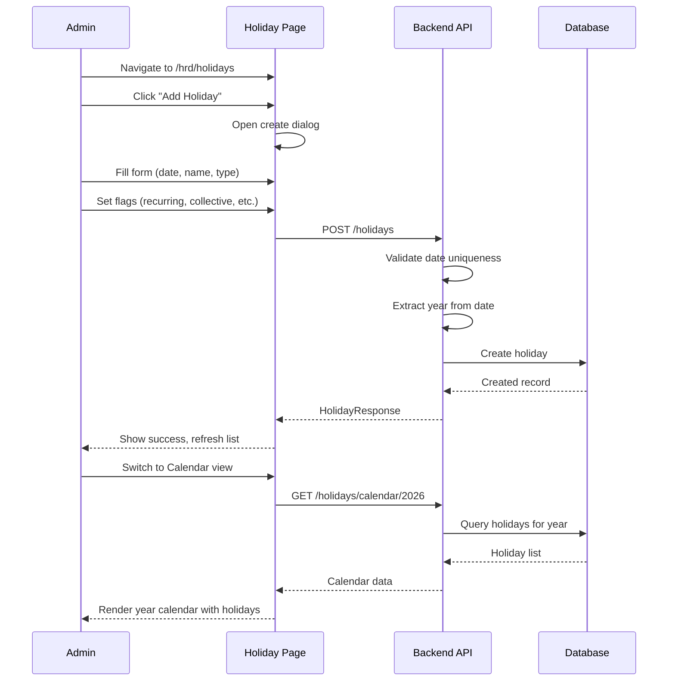
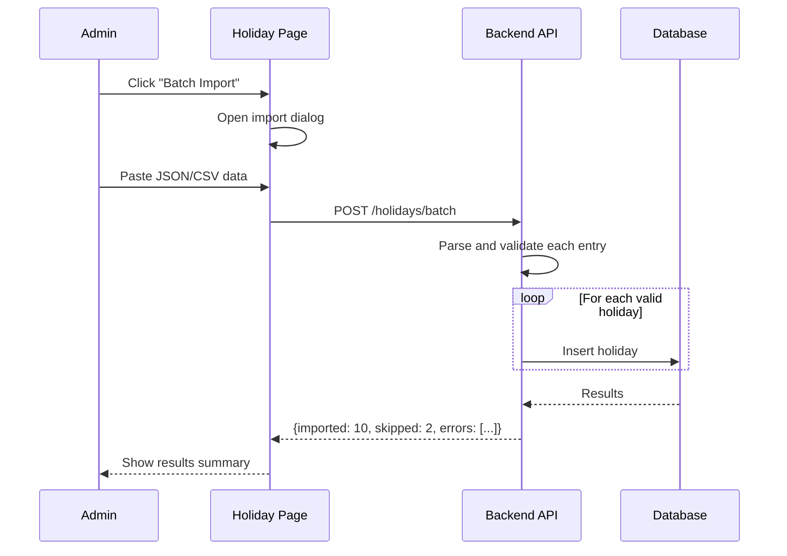
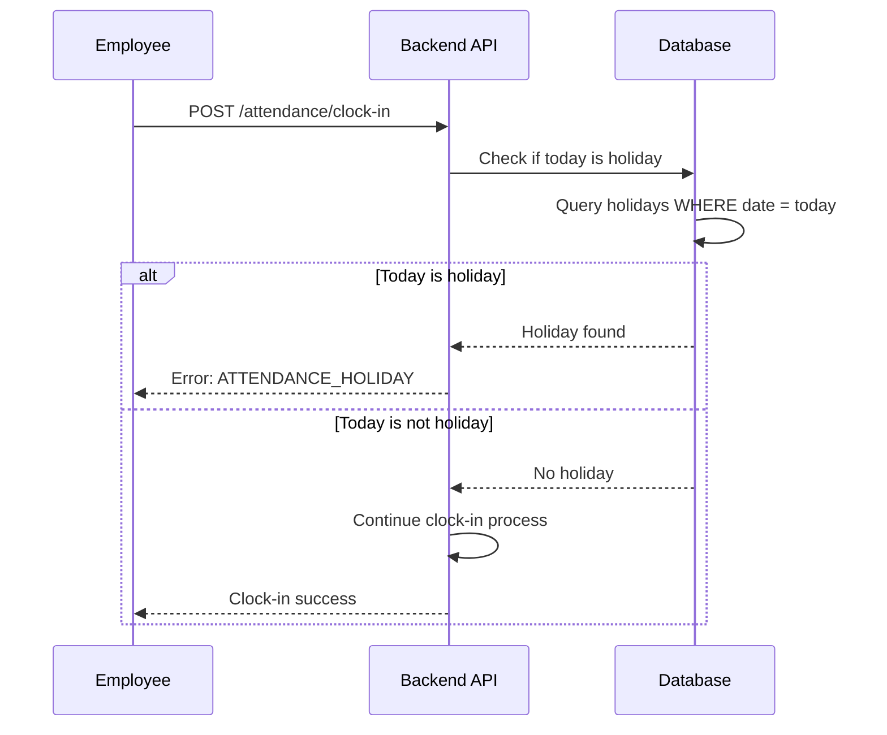

# HRD - Holiday Management

> **Module:** HRD (Human Resource Development)  
> **Sprint:** 13  
> **Version:** 1.0.0  
> **Status:** ✅ Complete (API + Frontend)  
> **Last Updated:** February 2026

---

## Table of Contents

1. [Overview](#overview)
2. [Features](#features)
3. [System Architecture](#system-architecture)
4. [Data Models](#data-models)
5. [Business Logic](#business-logic)
6. [API Reference](#api-reference)
7. [Frontend Components](#frontend-components)
8. [User Flows](#user-flows)
9. [Permissions](#permissions)
10. [Configuration](#configuration)
11. [Integration Points](#integration-points)
12. [Testing Strategy](#testing-strategy)
13. [Keputusan Teknis](#keputusan-teknis)
14. [Notes & Improvements](#notes--improvements)
15. [Appendix](#appendix)

---

## Overview

Holiday Management allows administrators to configure company holidays, national holidays, and collective leave days. Holidays impact attendance tracking by preventing clock-in on national holidays and marking employees as holiday status automatically.

### Key Features

| Feature                | Description                                            |
| ---------------------- | ------------------------------------------------------ |
| Multi-Type Holidays    | Support for National, Collective, and Company holidays |
| Calendar View          | Full year calendar visualization                       |
| Batch Import           | Import multiple holidays at once                       |
| Recurring Holidays     | Flag holidays that repeat annually                     |
| Leave Integration      | Collective leave can deduct from annual leave quota    |
| Holiday Check          | API to verify if specific date is a holiday            |
| Attendance Integration | Prevents clock-in on national holidays                 |

---

## Features

### 1. Holiday Types

| Type         | Description                                  |
| ------------ | -------------------------------------------- |
| `NATIONAL`   | Government-mandated public holidays          |
| `COLLECTIVE` | Company-wide collective leave (Cuti Bersama) |
| `COMPANY`    | Company-specific holidays                    |

### 2. Holiday Flags

| Flag                  | Description                                         |
| --------------------- | --------------------------------------------------- |
| `is_collective_leave` | Marks the day as collective leave                   |
| `cuts_annual_leave`   | Deducts from employee's annual leave quota          |
| `is_recurring`        | Repeats annually (e.g., New Year, Independence Day) |
| `is_active`           | Controls whether holiday is currently active        |

### 3. Holiday Views

| View          | Description                                      |
| ------------- | ------------------------------------------------ |
| List View     | Paginated table with year filter and type badges |
| Calendar View | Full year calendar grid showing all holidays     |

### 4. Batch Operations

| Operation       | Description                           |
| --------------- | ------------------------------------- |
| Batch Import    | Import multiple holidays via JSON/CSV |
| Partial Success | Validates each entry individually     |

---

## System Architecture

### Backend Structure

```
apps/api/internal/hrd/
├── data/
│   ├── models/
│   │   └── holiday.go
│   └── repositories/
│       └── holiday_repository.go
├── domain/
│   ├── dto/
│   │   └── holiday_dto.go
│   ├── mapper/
│   │   └── holiday_mapper.go
│   └── usecase/
│       └── holiday_usecase.go
└── presentation/
    ├── handler/
    │   └── holiday_handler.go
    └── router/
        └── holiday_router.go
```

### Frontend Structure

```
apps/web/src/features/hrd/holidays/
├── types/
│   └── index.d.ts
├── schemas/
│   └── holiday.schema.ts
├── services/
│   └── holiday-service.ts
├── hooks/
│   └── use-holidays.ts
├── i18n/
│   ├── en.ts
│   └── id.ts
└── components/
    ├── holiday-list.tsx
    ├── holiday-dialog.tsx
    ├── holiday-calendar-view.tsx
    ├── holiday-page-client.tsx
    └── index.ts

apps/web/app/[locale]/(dashboard)/hrd/holidays/
├── page.tsx
└── loading.tsx
```

---

## Data Models

### Holiday

| Field               | Type        | Description                             |
| ------------------- | ----------- | --------------------------------------- |
| id                  | UUID        | Primary key                             |
| date                | DATE        | Holiday date                            |
| name                | STRING(100) | Holiday name                            |
| description         | STRING(255) | Optional description                    |
| type                | ENUM        | `NATIONAL`, `COLLECTIVE`, `COMPANY`     |
| year                | INT         | Year (extracted from date)              |
| is_collective_leave | BOOL        | Collective leave flag                   |
| cuts_annual_leave   | BOOL        | Deducts from annual leave quota         |
| is_recurring        | BOOL        | Repeats annually                        |
| is_active           | BOOL        | Active status                           |
| company_id          | UUID        | Company reference (nullable for global) |
| created_at          | TIMESTAMP   | Creation timestamp                      |
| updated_at          | TIMESTAMP   | Last update timestamp                   |
| deleted_at          | TIMESTAMP   | Soft delete timestamp                   |

### Database Indexes

| Index                | Type   | Columns               |
| -------------------- | ------ | --------------------- |
| idx_holidays_date    | B-tree | date                  |
| idx_holidays_year    | B-tree | year                  |
| idx_holidays_type    | B-tree | type                  |
| idx_holidays_company | B-tree | company_id            |
| idx_holidays_active  | B-tree | is_active, deleted_at |

---

## Business Logic

### Year Extraction

```
year = EXTRACT(YEAR FROM date)
Auto-populated on create/update
Used for efficient filtering
```

### Date Uniqueness

```
Holiday dates must be unique per year per company
Cannot have duplicate holidays on same date
Global holidays (company_id=null) and company-specific holidays can coexist
```

### Batch Import Validation

```
For each entry in batch:
  1. Validate date format
  2. Check date uniqueness
  3. Validate type
  4. Create if valid, skip if invalid
Return count of imported vs skipped
```

### Recurring Holidays

```
Holidays marked is_recurring=true are candidates for annual seeding
Can be used as templates for next year's holidays
```

### Collective Leave Quota

```
If is_collective_leave=true AND cuts_annual_leave=true:
  Deduct 1 day from employee's annual leave quota
Applied during attendance processing
```

---

## API Reference

### Holiday Endpoints

| Method | Endpoint                              | Permission     | Description                           |
| ------ | ------------------------------------- | -------------- | ------------------------------------- |
| GET    | `/api/v1/hrd/holidays`                | holiday.read   | List holidays (paginated, filterable) |
| GET    | `/api/v1/hrd/holidays/check`          | holiday.read   | Check if specific date is a holiday   |
| GET    | `/api/v1/hrd/holidays/year/:year`     | holiday.read   | Get all holidays for specific year    |
| GET    | `/api/v1/hrd/holidays/calendar/:year` | holiday.read   | Calendar view data for year           |
| GET    | `/api/v1/hrd/holidays/:id`            | holiday.read   | Get holiday by ID                     |
| POST   | `/api/v1/hrd/holidays`                | holiday.create | Create single holiday                 |
| POST   | `/api/v1/hrd/holidays/batch`          | holiday.create | Batch create holidays                 |
| PUT    | `/api/v1/hrd/holidays/:id`            | holiday.update | Update holiday                        |
| DELETE | `/api/v1/hrd/holidays/:id`            | holiday.delete | Delete holiday                        |

### Query Parameters (List)

| Parameter  | Type   | Description                                    |
| ---------- | ------ | ---------------------------------------------- |
| page       | int    | Page number (default: 1)                       |
| per_page   | int    | Items per page (default: 20, max: 100)         |
| year       | int    | Filter by year                                 |
| type       | string | Filter by type (NATIONAL, COLLECTIVE, COMPANY) |
| is_active  | bool   | Filter by active status                        |
| company_id | uuid   | Filter by company (null for global)            |

### Request Body Examples

**Create Holiday:**

```json
{
  "date": "2026-08-17",
  "name": "Hari Kemerdekaan",
  "description": "Indonesia Independence Day",
  "type": "NATIONAL",
  "is_recurring": true,
  "is_active": true
}
```

**Create Collective Leave:**

```json
{
  "date": "2026-04-12",
  "name": "Cuti Bersama Idul Fitri",
  "type": "COLLECTIVE",
  "is_collective_leave": true,
  "cuts_annual_leave": true,
  "is_active": true
}
```

**Batch Import:**

```json
{
  "holidays": [
    {
      "date": "2026-01-01",
      "name": "Tahun Baru",
      "type": "NATIONAL",
      "is_recurring": true
    },
    {
      "date": "2026-02-10",
      "name": "Tahun Baru Imlek",
      "type": "NATIONAL"
    }
  ]
}
```

### Response: Holiday Check

```json
{
  "is_holiday": true,
  "holiday": {
    "id": "uuid",
    "name": "Hari Kemerdekaan",
    "type": "NATIONAL",
    "is_collective_leave": false
  }
}
```

---

## Frontend Components

### Holidays Page (`/hrd/holidays`)

| Component             | File                      | Description                                      |
| --------------------- | ------------------------- | ------------------------------------------------ |
| `HolidayList`         | holiday-list.tsx          | Paginated table with year filter and type badges |
| `HolidayDialog`       | holiday-dialog.tsx        | Create/Edit holiday form dialog                  |
| `HolidayCalendarView` | holiday-calendar-view.tsx | Full year calendar visualization                 |
| `HolidayPageClient`   | holiday-page-client.tsx   | Page wrapper with tab navigation                 |

### Features

- List view with year filter and holiday type badges
- Calendar view showing all holidays in full year grid
- Create single holiday with type, date, and flags
- Batch import holidays (JSON/CSV format)
- Holiday type selection (National, Collective, Company)
- Recurring holiday flag
- Collective leave and annual leave deduction flags

### i18n Keys

| Key Path                | Description         |
| ----------------------- | ------------------- |
| `hrd.holiday.title`     | Page title          |
| `hrd.holiday.types.*`   | Holiday type labels |
| `hrd.holiday.fields.*`  | Form field labels   |
| `hrd.holiday.actions.*` | Action buttons      |

---

## User Flows

### Create Holiday Flow



### Batch Import Flow



### Holiday Check Flow (Attendance Integration)



---

## Permissions

| Permission       | Description     |
| ---------------- | --------------- |
| `holiday.read`   | View holidays   |
| `holiday.create` | Create holidays |
| `holiday.update` | Update holidays |
| `holiday.delete` | Delete holidays |

---

## Configuration

### Default Holiday Types

Hardcoded ENUM values:

- NATIONAL
- COLLECTIVE
- COMPANY

### Seeded National Holidays (Indonesia 2024)

| Date       | Name                 | Type     |
| ---------- | -------------------- | -------- |
| 2024-01-01 | Tahun Baru           | NATIONAL |
| 2024-02-08 | Isra Mi'raj          | NATIONAL |
| 2024-02-10 | Tahun Baru Imlek     | NATIONAL |
| 2024-03-11 | Hari Raya Nyepi      | NATIONAL |
| 2024-03-29 | Wafat Isa Almasih    | NATIONAL |
| 2024-04-10 | Hari Raya Idul Fitri | NATIONAL |
| 2024-04-11 | Hari Raya Idul Fitri | NATIONAL |
| 2024-05-01 | Hari Buruh           | NATIONAL |
| 2024-05-09 | Kenaikan Isa Almasih | NATIONAL |
| 2024-05-23 | Hari Raya Waisak     | NATIONAL |
| 2024-06-01 | Hari Lahir Pancasila | NATIONAL |
| 2024-06-17 | Hari Raya Idul Adha  | NATIONAL |
| 2024-07-07 | Tahun Baru Islam     | NATIONAL |
| 2024-08-17 | Hari Kemerdekaan     | NATIONAL |
| 2024-09-16 | Maulid Nabi Muhammad | NATIONAL |
| 2024-12-25 | Hari Natal           | NATIONAL |

---

## Integration Points

### With Attendance Module

- Clock-in API checks if today is holiday
- National holidays block NORMAL check-in type
- Attendance status auto-set to HOLIDAY on holiday dates
- Uses `IsHolidayForCompany()` and `FindByDateRangeForCompany()` methods

### With Leave Module

- Collective leave holidays can deduct from annual leave quotas
- Integration for automatic leave deduction
- Uses `cuts_annual_leave` flag

### With Company Module

- Company-scoped holidays supported
- Global holidays (company_id=null) apply to all companies
- Company-specific holidays override or supplement global holidays

---

## Testing Strategy

### Manual Testing

1. Login as admin
2. Navigate to `/hrd/holidays`
3. Click "Add Holiday" → fill name, date, type
4. Submit → verify success toast, holiday appears in list
5. Switch to Calendar view → verify holiday visible
6. Click holiday in list → edit dialog opens
7. Test batch import with multiple holidays
8. Verify clock-in is blocked on national holiday

### API Testing

```bash
# Check if date is holiday
curl http://localhost:8080/api/v1/hrd/holidays/check?date=2026-08-17 \
  -H "Authorization: Bearer $TOKEN"

# Get holidays for year
curl http://localhost:8080/api/v1/hrd/holidays/year/2026 \
  -H "Authorization: Bearer $TOKEN"

# Get calendar data
curl http://localhost:8080/api/v1/hrd/holidays/calendar/2026 \
  -H "Authorization: Bearer $TOKEN"
```

---

## Keputusan Teknis

| Decision                                  | Rationale                                                                                                                                    |
| ----------------------------------------- | -------------------------------------------------------------------------------------------------------------------------------------------- |
| **Batch import supports partial success** | Better UX — if 1-2 holidays fail (duplicate dates), rest still saved. Response returns imported vs skipped counts.                           |
| **Year extracted from date**              | Simplifies per-year queries without parsing date each time. Trade-off: slight redundancy, better query performance with index on `year`.     |
| **Company-scoped holidays**               | NULL company_id = global holiday, non-NULL = company-specific. Allows different holidays per company while maintaining global defaults.      |
| **Soft delete**                           | Preserves historical data for audit and reporting. Trade-off: more complex queries.                                                          |
| **Separate collective leave flag**        | `is_collective_leave` distinct from type allows marking any type as collective leave. Trade-off: extra field, more flexibility.              |
| **GIN indexes for text search**           | Fast search on holiday names. Trade-off: slightly more storage.                                                                              |
| **Recurring flag (not auto-generation)**  | Flag indicates candidates for next year seeding, but doesn't auto-create. Trade-off: manual action required, full control over annual setup. |

---

## Notes & Improvements

### Completed Features

- ✅ Multi-type holidays (National, Collective, Company)
- ✅ Calendar view
- ✅ Batch import with partial success
- ✅ Recurring holiday flag
- ✅ Collective leave with quota deduction
- ✅ Holiday check API
- ✅ Year-based filtering
- ✅ i18n support

### Known Limitations

- No automatic holiday sync with external calendars
- Manual entry required for each year's holidays
- No regional holiday support per office location

### Future Improvements

- Integration with external holiday API for auto-population
- Holiday notification system for upcoming holidays
- Regional holiday support (different holidays per office location)
- Export holidays to iCal/ICS format
- Auto-generation of recurring holidays for next year
- Holiday conflict detection
- Mobile app holiday calendar view

---

## Appendix

### Error Codes

| Code                   | HTTP Status | Description                         |
| ---------------------- | ----------- | ----------------------------------- |
| `HOLIDAY_NOT_FOUND`    | 404         | Holiday not found                   |
| `HOLIDAY_DATE_EXISTS`  | 400         | Holiday already exists on this date |
| `INVALID_HOLIDAY_TYPE` | 400         | Invalid holiday type                |
| `INVALID_DATE`         | 400         | Invalid date format                 |
| `BATCH_IMPORT_FAILED`  | 400         | Batch import validation failed      |

---

_Document generated for GIMS Platform - Holiday Management v1.0.0_
