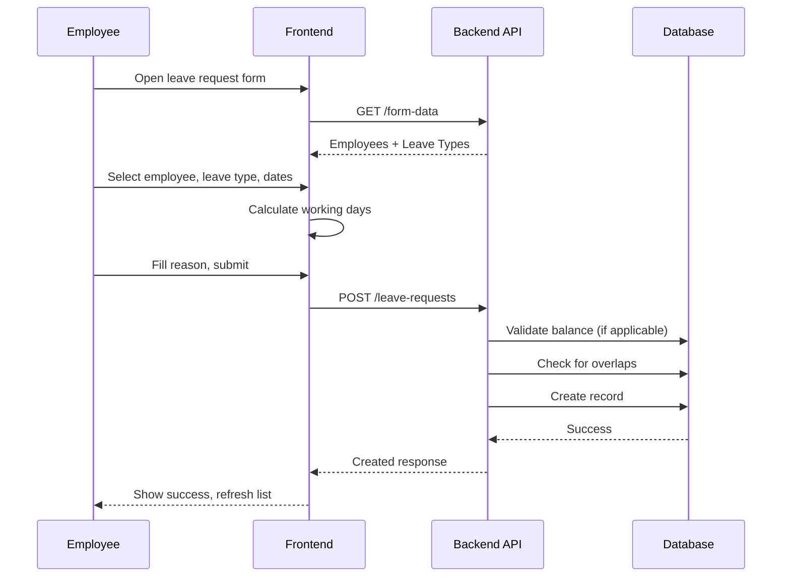
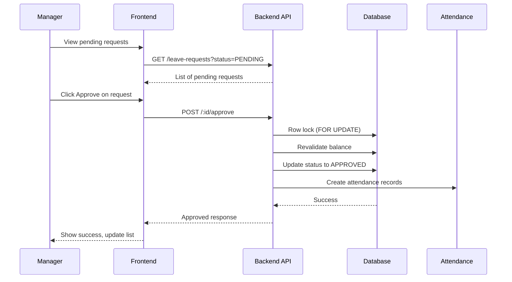
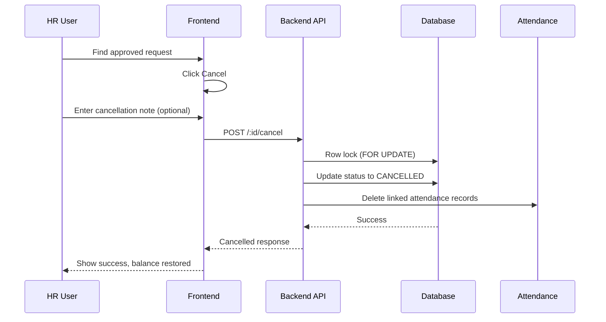

# HRD - Leave Request Management

> **Module:** HRD (Human Resource Development)  
> **Sprint:** 13+  
> **Version:** 1.5.1  
> **Status:** ✅ Complete (API + Frontend)  
> **Last Updated:** March 2026

---

## Table of Contents

1. [Overview](#overview)
2. [Features](#features)
3. [System Architecture](#system-architecture)
4. [Data Models](#data-models)
5. [Business Logic](#business-logic)
6. [API Reference](#api-reference)
7. [Frontend Components](#frontend-components)
8. [User Flows](#user-flows)
9. [Permissions](#permissions)
10. [Integration Points](#integration-points)
11. [Testing Strategy](#testing-strategy)

---

## Overview

The Leave Request Management module provides comprehensive leave management for employees with approval workflow, quota tracking, and integration with attendance system.

> **Related Documentation:**
>
> - [Attendance Management](hrd-attendance.md) — Attendance rules, clock-in/out flow, and integration details
> - [Self Service Header (Attendance & Leave)](hrd-self-service-header-attendance-leave.md) — Header drawer/self-service optimization and query strategy

### Key Features

| Feature                      | Description                                                  |
| ---------------------------- | ------------------------------------------------------------ |
| **Multi-Type Leave**         | Support for annual, sick, maternity, and custom leave types  |
| **Approval Workflow**        | Multi-state workflow (Pending → Approved/Rejected/Cancelled) |
| **Quota Management**         | Automatic balance calculation with carry-over support        |
| **Working Days Calculation** | Excludes weekends and holidays for multi-day leaves          |
| **Row-Level Locking**        | Prevents race conditions during concurrent approvals         |
| **Self-Service Portal**      | Employees can view balance and request history               |
| **Attendance Integration**   | Auto-creates attendance records for approved leaves          |
| **Search & Filter**          | Search by employee, leave type, or reason                    |

---

## Features

### 1. Leave Types

| Type            | Code | Description         | Cuts Annual Leave |
| --------------- | ---- | ------------------- | ----------------- |
| Annual Leave    | `AL` | Regular paid leave  | ✅ Yes            |
| Sick Leave      | `SL` | Medical leave       | ❌ No             |
| Maternity Leave | `ML` | Maternity/paternity | ❌ No             |
| Emergency Leave | `EL` | Urgent matters      | ✅ Yes            |
| Unpaid Leave    | `UL` | Without pay         | ❌ No             |

### 2. Duration Types

| Duration    | Days     | Use Case                  |
| ----------- | -------- | ------------------------- |
| `HALF_DAY`  | 0.5      | Partial day absence       |
| `FULL_DAY`  | 1.0      | Single full day           |
| `MULTI_DAY` | Variable | Multiple consecutive days |

### 3. Status State Machine

```
PENDING ──▶ APPROVED (by approver)
     │
     ├──▶ REJECTED (by approver)
     │
     └──▶ CANCELLED (by approver/employee)

APPROVED ──▶ CANCELLED

REJECTED ──▶ PENDING (after edit/resubmit)
```

**Status Rules:**

- Only `PENDING` can be approved or rejected
- Only `PENDING` or `APPROVED` can be cancelled (must be before start date)
- `CANCELLED` is final state (cannot be changed)
- **Editing only allowed for `PENDING` (REJECTED cannot be edited, must create new request)**

### 4. Cancel Validation Rules

**Before Start Date Rule:**

```
Cancel can only be performed when: today < start_date

If today >= start_date:
  Return Error: "Leave request can only be cancelled before the start date"
```

**Applies to:**

- Self-service cancel (employee canceling own request)
- Admin cancel (HR/approver canceling any request)

### 4. Leave Balance Calculation

**Formula:**

```
remaining_balance = total_quota - used_leave - pending_leave

Where:
- used_leave = Sum of APPROVED requests (only types with is_cut_annual_leave = true)
- pending_leave = Sum of PENDING requests
```

**Carry-Over Rules:**

- Maximum 5 days carry-over from previous year
- Expires on March 31 of current year
- Automatically added to total quota until expiry

### 5. Working Days Calculation

For `MULTI_DAY` duration:

```
working_days = total_days - weekends - holidays

Where:
- Weekends = Saturday and Sunday
- Holidays = Records from holidays table in date range
```

---

## System Architecture

### Backend Structure

```
apps/api/internal/hrd/
├── data/
│   ├── models/
│   │   ├── leave_request.go
│   │   └── holiday.go
│   └── repositories/
│       ├── leave_request_repository.go
│       └── holiday_repository.go
├── domain/
│   ├── dto/
│   │   └── leave_request_dto.go
│   ├── mapper/
│   │   └── leave_request_mapper.go
│   └── usecase/
│       └── leave_request_usecase.go
└── presentation/
    ├── handler/
    │   └── leave_request_handler.go
    └── router/
        └── leave_request_router.go
```

### Frontend Structure

```
apps/web/src/features/hrd/leave-request/
├── types/
│   └── index.d.ts
├── schemas/
│   └── leave-request.schema.ts
├── services/
│   └── leave-request-service.ts
├── hooks/
│   └── use-leave-requests.ts
├── components/
│   ├── leave-request-list.tsx
│   ├── leave-request-form.tsx
│   ├── leave-request-detail-modal.tsx
│   └── self-leave-request-tab.tsx
└── i18n/
    ├── en.ts
    └── id.ts
```

---

## Data Models

### LeaveRequest

| Field                | Type         | Description                            |
| -------------------- | ------------ | -------------------------------------- |
| id                   | UUID         | Primary key                            |
| employee_id          | UUID         | Employee reference                     |
| leave_type_id        | UUID         | Leave type reference                   |
| start_date           | DATE         | Leave start date                       |
| end_date             | DATE         | Leave end date                         |
| duration             | ENUM         | HALF_DAY, FULL_DAY, MULTI_DAY          |
| total_days           | DECIMAL(4,1) | Calculated working days                |
| status               | ENUM         | PENDING, APPROVED, REJECTED, CANCELLED |
| reason               | TEXT         | Leave reason/description               |
| rejection_note       | TEXT         | Rejection/cancellation reason          |
| approved_by          | UUID         | Approver user ID                       |
| approved_at          | TIMESTAMP    | Approval timestamp                     |
| rejected_by          | UUID         | Rejecter user ID                       |
| rejected_at          | TIMESTAMP    | Rejection timestamp                    |
| **rejected_by_name** | STRING       | **Rejecter employee name (enriched)**  |
| is_carry_over        | BOOLEAN      | Whether from previous year             |
| created_at           | TIMESTAMP    | Creation timestamp                     |
| updated_at           | TIMESTAMP    | Last update timestamp                  |
| deleted_at           | TIMESTAMP    | Soft delete timestamp                  |

### LeaveType

| Field               | Type         | Description               |
| ------------------- | ------------ | ------------------------- |
| id                  | UUID         | Primary key               |
| name                | VARCHAR(100) | Leave type name           |
| code                | VARCHAR(10)  | Short code (e.g., "AL")   |
| description         | TEXT         | Description               |
| max_days            | INTEGER      | Maximum days allowed      |
| is_paid             | BOOLEAN      | Whether paid leave        |
| is_cut_annual_leave | BOOLEAN      | Deducts from annual quota |
| is_active           | BOOLEAN      | Active status             |

---

## Business Logic

### 1. Leave Balance Validation

Before approval:

```go
if leave_type.is_cut_annual_leave {
    if requested_days > remaining_balance {
        return Error: "Insufficient leave balance"
    }
}
```

### 2. Overlap Validation

Prevent double-booking:

```go
existing = FindApprovedOrPendingRequests(employee_id, start_date, end_date)
if existing.count > 0 {
    return Error: "OVERLAPPING_LEAVE_REQUEST: Employee already has a leave request for these dates"
}
```

**Error Message Format:**

Backend returns errors in format: `ERROR_CODE: Human readable message`

Frontend strips the error code prefix and displays only the human-readable message:

- Backend: `"OVERLAPPING_LEAVE_REQUEST: Employee already has a leave request for these dates"`
- Frontend Display: `"Employee already has a leave request for these dates"`

### 3. Row-Level Locking

Prevent race conditions:

```sql
SELECT * FROM leave_requests
WHERE id = ?
FOR UPDATE
```

### 4. Attendance Integration

When leave is approved:

```
1. Create attendance record for each working day
2. Status = LEAVE
3. Link to leave_request_id
```

When leave is cancelled (if was APPROVED):

```
1. Delete linked attendance records
2. Free up leave balance immediately
```

---

## API Reference

### Self-Service Endpoints

| Method | Endpoint                                     | Auth | Description                                    |
| ------ | -------------------------------------------- | ---- | ---------------------------------------------- |
| GET    | `/api/v1/hrd/leave-requests/self`            | JWT  | List own leave requests                        |
| POST   | `/api/v1/hrd/leave-requests/self`            | JWT  | Submit own request                             |
| GET    | `/api/v1/hrd/leave-requests/self/:id`        | JWT  | Get own request detail                         |
| PUT    | `/api/v1/hrd/leave-requests/self/:id`        | JWT  | Update own request                             |
| POST   | `/api/v1/hrd/leave-requests/self/:id/cancel` | JWT  | Cancel own request (must be before start date) |
| GET    | `/api/v1/hrd/leave-requests/my-balance`      | JWT  | Get own leave balance                          |
| GET    | `/api/v1/hrd/leave-requests/my-form-data`    | JWT  | Get form dropdown data                         |

### Admin Endpoints

| Method | Endpoint                                          | Permission    | Description                                |
| ------ | ------------------------------------------------- | ------------- | ------------------------------------------ |
| GET    | `/api/v1/hrd/leave-requests/form-data`            | leave.read    | Get dropdown data (employees, leave types) |
| POST   | `/api/v1/hrd/leave-requests`                      | leave.create  | Create leave request                       |
| GET    | `/api/v1/hrd/leave-requests`                      | leave.read    | List all requests with filters             |
| GET    | `/api/v1/hrd/leave-requests/:id`                  | leave.read    | Get request detail                         |
| PUT    | `/api/v1/hrd/leave-requests/:id`                  | leave.update  | Update request                             |
| DELETE | `/api/v1/hrd/leave-requests/:id`                  | leave.delete  | Soft delete request                        |
| GET    | `/api/v1/hrd/leave-requests/balance/:employee_id` | Auth          | Get employee balance                       |
| POST   | `/api/v1/hrd/leave-requests/:id/approve`          | leave.approve | Approve request                            |
| POST   | `/api/v1/hrd/leave-requests/:id/reject`           | leave.approve | Reject request                             |
| POST   | `/api/v1/hrd/leave-requests/:id/cancel`           | leave.approve | Cancel request                             |

### Query Parameters (List Endpoint)

| Parameter     | Type   | Description                                    |
| ------------- | ------ | ---------------------------------------------- |
| `page`        | int    | Page number (default: 1)                       |
| `per_page`    | int    | Items per page (default: 20, max: 100)         |
| `employee_id` | UUID   | Filter by employee                             |
| `status`      | string | PENDING, APPROVED, REJECTED, CANCELLED         |
| `start_date`  | date   | Filter: start_date >=                          |
| `end_date`    | date   | Filter: end_date <=                            |
| `search`      | string | Search by employee name, leave type, or reason |

---

## Frontend Components

### Leave Request List (`/hrd/leave-requests`)

| Component                 | File                           | Description                               |
| ------------------------- | ------------------------------ | ----------------------------------------- |
| `LeaveRequestList`        | leave-request-list.tsx         | Main list with table, filters, pagination |
| `LeaveRequestForm`        | leave-request-form.tsx         | Create/edit form with validation          |
| `LeaveRequestDetailModal` | leave-request-detail-modal.tsx | Detail view with tabs                     |
| `SelfLeaveRequestTab`     | self-leave-request-tab.tsx     | Self-service drawer tab                   |

### Key Features

**List View:**

- Paginated table with sortable columns
- Status badges with color coding
- Search by employee name or reason
- Filter by status, date range, employee
- Action buttons (view, edit, approve, reject, cancel, delete)

**Form:**

- Employee selector with balance display
- Leave type selector
- Duration type selection
- Date range picker
- Working days calculation preview
- Reason text area (min 10 chars)
- Form caching to localStorage

**Detail Modal:**

- Employee details card
- Leave details card
- Approval/Rejection info (conditional)
- Cancellation info (conditional)
- Timeline/history
- Action buttons based on status

### Hooks (TanStack Query)

| Hook               | File                  | Description        |
| ------------------ | --------------------- | ------------------ |
| `useLeaveRequests` | use-leave-requests.ts | CRUD operations    |
| `useLeaveRequest`  | use-leave-requests.ts | Get single request |
| `useLeaveBalance`  | use-leave-requests.ts | Balance queries    |
| `useLeaveFormData` | use-leave-requests.ts | Dropdown data      |

---

## User Flows

### Submit Leave Request Flow



### Approval Flow



### Cancellation Flow (Approved → Cancelled)



---

## Permissions

| Permission      | Description                         |
| --------------- | ----------------------------------- |
| `leave.read`    | View leave requests and details     |
| `leave.create`  | Create new leave requests           |
| `leave.update`  | Edit pending/rejected requests      |
| `leave.delete`  | Soft delete requests                |
| `leave.approve` | Approve, reject, or cancel requests |

### Access Control Rules

- **Employees**: Can only view own requests via self-service endpoints
- **HR/Approvers**: Full CRUD access via admin endpoints
- **Managers**: Typically have `leave.approve` permission
- **Admins**: Bypass all permission checks

---

## Integration Points

### Integration with Attendance Module

| Action            | Attendance Effect                                 |
| ----------------- | ------------------------------------------------- |
| Approve           | Creates LEAVE attendance records for working days |
| Cancel (Approved) | Deletes linked attendance records                 |
| Cancel (Pending)  | No attendance records exist (skip)                |
| Re-approve        | Recreates attendance records                      |

**API Integration:**

```
POST /hrd/leave-requests/:id/approve
  → Creates attendance records

POST /hrd/leave-requests/:id/cancel
  → Deletes attendance records (if approved)
```

### Integration with Holidays

- Working days calculation excludes holidays
- Holidays fetched from `holidays` table
- Holiday types: NATIONAL, COLLECTIVE, COMPANY

### Integration with Employee Master Data

- Employee details fetched from employees table
- Employee code displayed in selectors
- Department info for filtering

---

## Testing Strategy

### Unit Tests

**Location:** `apps/api/internal/hrd/domain/usecase/leave_request_usecase_test.go`

**Coverage:**

- Balance calculation logic
- Working days calculation
- Overlap validation
- State transition validation

**Run:** `cd apps/api && go test ./internal/hrd/domain/usecase/...`

### Integration Tests

**Location:** `apps/api/test/hrd/leave_request_integration_test.go`

**Coverage:**

- Full CRUD flow with database
- Approval workflow
- Concurrent approval (row-locking test)

**Run:** `cd apps/api && go test ./test/hrd/...`

### E2E Tests

**Location:** `apps/web/tests/e2e/hrd/leave-request.spec.ts`

**Coverage:**

- Submit leave request from frontend
- Approval workflow
- Balance display

**Run:** `cd apps/web && pnpm test:e2e hrd`

### Manual Testing Checklist

**Backend:**

- [ ] Create leave request with valid data
- [ ] Attempt create with insufficient balance (should fail)
- [ ] Attempt create with overlapping dates (should fail)
- [ ] Approve request and verify balance deducted
- [ ] Cancel approved request and verify balance restored
- [ ] Search by employee name, leave type, reason
- [ ] Test row-level locking (concurrent approvals)

**Frontend:**

- [ ] Form loads with fresh dropdown data
- [ ] Working days calculate correctly
- [ ] Edit form auto-populates correctly
- [ ] Status badges display correctly
- [ ] Detail modal shows all info
- [ ] Cancellation vs rejection display correct
- [ ] Self-service tab shows balance card
- [ ] i18n translations work (EN/ID)

---

## Keputusan Teknis

### 1. Soft Delete vs Hard Delete

**Keputusan:** Menggunakan soft delete (deleted_at timestamp)

**Alasan:**

- Audit trail untuk compliance HR
- Data cuti bersifat sensitive dan harus bisa di-trace
- Historical reporting membutuhkan data lama

**Trade-off:** Query lebih kompleks (filter deleted_at IS NULL), tapi GORM handles automatically

### 2. Manual State Machine vs Library

**Keputusan:** State validation manual di usecase layer

**Alasan:**

- Flow status relatif sederhana (4 states)
- State machine library akan overkill
- Lebih mudah dipahami dan maintain

**Trade-off:** Manual validation, tapi code lebih explicit

### 3. Row-Level Locking

**Keputusan:** Gunakan `SELECT FOR UPDATE` saat approval/rejection/cancellation

**Alasan:**

- Prevent race condition concurrent approvals
- Critical untuk data integrity (balance deduction)

**Trade-off:** Slightly slower (lock acquisition), tapi necessary untuk consistency

### 4. Split DTOs (List vs Detail)

**Keputusan:** DTO terpisah untuk list dan detail

**Alasan:**

- List view: Simplified response (strings only)
- Detail view: Full nested objects
- API response optimized

**Trade-off:** Lebih banyak DTOs, tapi performance gain signifikan

### 5. Form Data Endpoint

**Keputusan:** Dedicated endpoint `/form-data` untuk dropdown

**Alasan:**

- Frontend butuh employee list + leave types untuk form
- Lebih efficient daripada fetch full list dengan pagination
- UX better (fast dropdown population)

**Trade-off:** Extra endpoint, tapi prevents pagination handling complexity

### 6. Cancel vs Reject Endpoint Terpisah

**Keputusan:** Endpoint terpisah untuk cancel dan reject

**Alasan:**

- Semantics berbeda (cancel = batalkan yang disetujui, reject = tolak pengajuan)
- Cancel bisa dari PENDING atau APPROVED, reject hanya dari PENDING
- Cancel note optional, reject note required
- Cancel delete attendance records (if approved)

**Trade-off:** Extra endpoint, tapi clearer business logic

### 7. ILIKE Search dengan JOIN

**Keputusan:** Search menggunakan ILIKE dengan JOIN ke employees dan leave_types

**Alasan:**

- Search across multiple fields (employee name, leave type, reason)
- Case-insensitive untuk better UX
- GIN indexes ditambahkan untuk performance

**Trade-off:** JOIN setiap search query, tapi acceptable dengan indexes

### 8. Permission-Based Access Control

**Keputusan:** Hanya HR/Approvers yang bisa CRUD leave requests

**Alasan:**

- Business process: Employee request verbally → HR input ke system
- Centralized control untuk attendance tracking
- Prevent manipulation oleh employee
- Audit compliance: all changes traceable ke HR users

**Implementation:**

- Router-level permission middleware
- Admin role bypasses all checks
- 2-tier caching (L1: in-memory 1min, L2: Redis 1hr)

**Trade-off:** HR harus manual input (more work), tapi compliance lebih baik

---

## Notes & Improvements

### Recent Updates (March 2026) 🆕

**Cancel Date Validation:**

- Cancel hanya bisa dilakukan sebelum tanggal cuti dimulai (today < start_date)
- Validasi di backend dan frontend untuk konsistensi
- Error message yang jelas: "Leave request can only be cancelled before the start date"

**Edit Status Restriction:**

- REJECTED status tidak bisa di-edit lagi
- Hanya PENDING yang bisa di-edit
- Alasan: REJECTED harus diajukan ulang (create new request)

**Rejected By Name Enhancement:**

- Menambahkan field `rejected_by_name` di API response
- Menampilkan nama penolak di UI card leave request
- Menampilkan reject reason dengan icon dan styling

**Error Handling Improvements:**

- Backend: Format error `CODE: message` untuk parsing mudah
- Frontend: Strip error code prefix untuk pesan yang bersih
- Contoh: `OVERLAPPING_LEAVE_REQUEST: Employee already has...` → `Employee already has...`

### Completed Features ✅

**Backend:**

- ✅ Search functionality dengan ILIKE + GIN indexes
- ✅ Cancel endpoint dengan row-level locking
- ✅ Cancel date validation (before start date only)
- ✅ Form data dengan employee_code dan remaining_balance
- ✅ Permission middleware integration
- ✅ Soft delete untuk audit trail
- ✅ Working days calculation (exclude weekends & holidays)
- ✅ Overlap validation dengan error message yang jelas
- ✅ Balance validation
- ✅ Rejected by name enrichment

**Frontend:**

- ✅ Fresh form data fetching
- ✅ Auto-populate edit form
- ✅ Employee balance in selector
- ✅ Cancel/Reject action dengan note dialog
- ✅ Cancel button hidden after leave start date
- ✅ Edit button hanya untuk PENDING (tidak untuk REJECTED)
- ✅ Rejected info display (rejected_by_name + reject_reason)
- ✅ Self-service leave request tab
- ✅ Leave quota display dengan color coding
- ✅ Auto-fill end date
- ✅ Form caching ke localStorage
- ✅ Comprehensive detail modal
- ✅ i18n translations (EN/ID)
- ✅ Error message parsing (strip code prefix)

### Planned Improvements ⏳

**Backend:**

- [ ] Email notification on approval/rejection/cancellation
- [ ] Automatic carry-over calculation di awal tahun
- [ ] Redis caching untuk leave balance
- [ ] GIN full-text search untuk dataset besar

**Frontend:**

- [ ] Permission-based UI (hide/show features)
- [ ] Calendar view untuk leave schedule
- [ ] Bulk approval/cancellation
- [ ] Attachment upload untuk medical certificates
- [ ] Real-time updates dengan WebSocket/SSE

### Performance Considerations

**Backend:**

- Pagination default 20 items, max 100
- Batch fetching prevent N+1 queries
- GIN indexes untuk search
- Row-level locking untuk concurrent operations

**Frontend:**

- TanStack Query caching (5 min stale time)
- Optimistic updates untuk approve/reject/cancel
- Form caching di localStorage
- Debounced search (500ms)

---

## Appendix

### Error Codes

| Code                         | Description                                        |
| ---------------------------- | -------------------------------------------------- |
| `INSUFFICIENT_LEAVE_BALANCE` | Requested days > remaining balance                 |
| `OVERLAPPING_LEAVE_REQUEST`  | Employee already has leave for these dates         |
| `INVALID_STATUS`             | Invalid status transition (e.g., editing REJECTED) |
| `INVALID_DATE`               | Cancel attempted on or after start date            |
| `INVALID_DATE_FORMAT`        | Date format must be YYYY-MM-DD                     |
| `INVALID_DATE_RANGE`         | Start date > end date                              |
| `NOT_FOUND`                  | Leave request not found                            |
| `LEAVE_REQUEST_NOT_FOUND`    | Leave request with given ID not found              |
| `VALIDATION_ERROR`           | General validation error                           |
| `FORBIDDEN`                  | User does not have permission for this action      |
| `UNAUTHORIZED`               | User not authenticated                             |

### Database Indexes

```sql
CREATE INDEX idx_leave_requests_employee ON leave_requests(employee_id);
CREATE INDEX idx_leave_requests_status ON leave_requests(status);
CREATE INDEX idx_leave_requests_dates ON leave_requests(start_date, end_date);
CREATE INDEX idx_leave_requests_search ON leave_requests USING gin (reason gin_trgm_ops);
```

---

_Document generated for GIMS Platform - HRD Leave Request Management (v1.5.0)_
