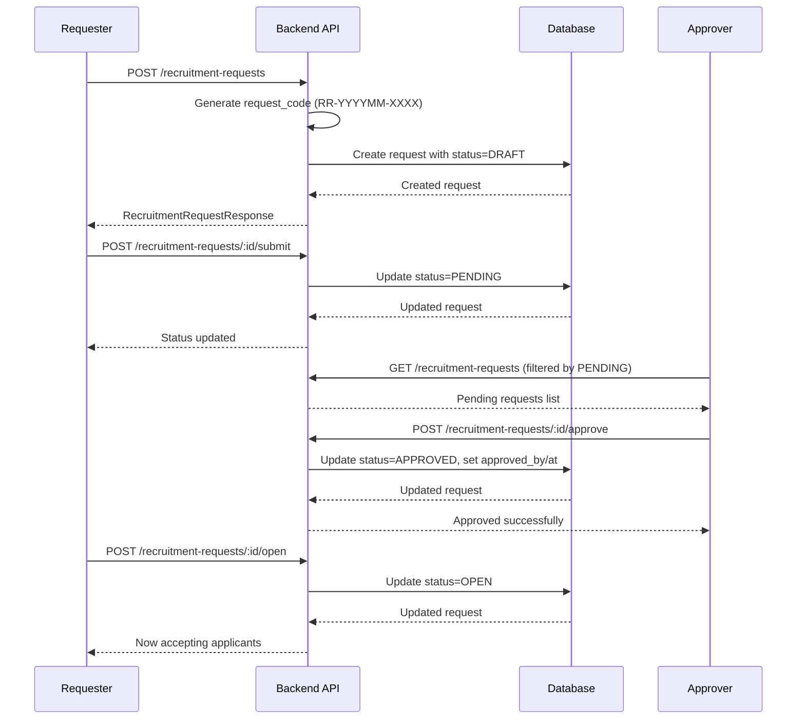
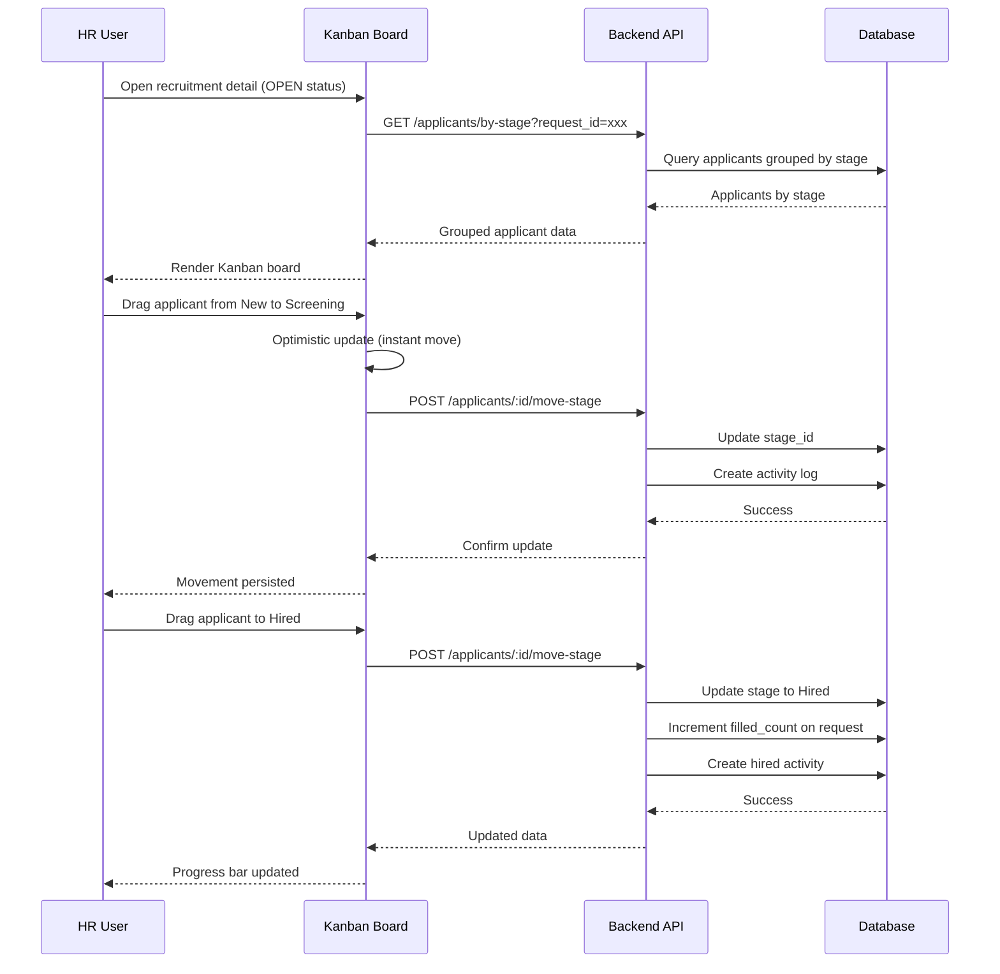

# HRD - Recruitment Management

> **Module:** HRD (Human Resource Development)  
> **Sprint:** 15-16  
> **Version:** 2.1.0  
> **Status:** ✅ Complete (API + Frontend — including Kanban Board Applicant Management)  
> **Last Updated:** March 2026

---

## Table of Contents

1. [Overview](#overview)
2. [Features](#features)
3. [System Architecture](#system-architecture)
4. [Data Models](#data-models)
5. [Business Logic](#business-logic)
6. [API Reference](#api-reference)
7. [Frontend Components](#frontend-components)
8. [User Flows](#user-flows)
9. [Permissions](#permissions)
10. [Configuration](#configuration)
11. [Integration Points](#integration-points)
12. [Testing Strategy](#testing-strategy)
13. [Keputusan Teknis](#keputusan-teknis)
14. [Notes & Improvements](#notes--improvements)
15. [Appendix](#appendix)

---

## Overview

Recruitment Management enables companies to manage job requisitions and candidate tracking through a comprehensive approval workflow and visual Kanban board. The system standardizes the recruitment request process while providing an intuitive interface for tracking applicants through the hiring pipeline.

### Key Features

| Feature                | Description                                                           |
| ---------------------- | --------------------------------------------------------------------- |
| Recruitment Requests   | Job requisitions with detailed requirements and approval workflow     |
| Approval Workflow      | DRAFT → PENDING → APPROVED → OPEN → CLOSED (also REJECTED, CANCELLED) |
| Kanban Board           | Visual applicant pipeline with drag-and-drop functionality            |
| Applicant Tracking     | Full candidate information with resume upload                         |
| Activity Logging       | Complete audit trail for all applicant actions                        |
| Auto Progress Tracking | Filled count auto-updates when applicants are hired                   |
| Priority Levels        | LOW, MEDIUM, HIGH, URGENT priorities                                  |
| Currency Formatting    | Rupiah auto-formatting for salary ranges                              |

---

## Features

### 1. Recruitment Request

Job requisition management:

| Feature           | Description                                    |
| ----------------- | ---------------------------------------------- |
| Request Details   | Position, division, requirements, salary range |
| Priority          | LOW, MEDIUM, HIGH, URGENT                      |
| Employment Type   | FULL_TIME, PART_TIME, CONTRACT, INTERN         |
| Auto Code         | Format: `RR-YYYYMM-XXXX`                       |
| Progress Tracking | RequiredCount - FilledCount = OpenPositions    |
| Form Data         | Single endpoint for all dropdowns              |

### 2. Request Status Workflow

| Status      | Description                  |
| ----------- | ---------------------------- |
| `DRAFT`     | Can be edited or deleted     |
| `PENDING`   | Awaiting approval            |
| `APPROVED`  | Approved, ready to open      |
| `REJECTED`  | Rejected, can be resubmitted |
| `OPEN`      | Active for hiring            |
| `CLOSED`    | Hiring completed             |
| `CANCELLED` | Cancelled by requester       |

### 3. Applicant Management

Candidate tracking through pipeline:

| Feature             | Description                                     |
| ------------------- | ----------------------------------------------- |
| Kanban Board        | Visual pipeline with drag-and-drop              |
| Applicant Info      | Full name, email, phone, resume, source, rating |
| Stage Movement      | Move between any stages (no terminal lock)      |
| Activity Log        | Audit trail for all actions                     |
| File Upload         | Resume/CV upload (PDF, DOC, DOCX)               |
| Bidirectional Count | Filled count updates on hire/un-hire            |

### 4. Applicant Pipeline Stages

| Stage       | Color  | Description                     |
| ----------- | ------ | ------------------------------- |
| `New`       | Gray   | Initial application             |
| `Screening` | Blue   | Under initial review            |
| `Interview` | Orange | Interview phase                 |
| `Offer`     | Purple | Offer extended                  |
| `Hired`     | Green  | Successfully hired (IsWon=true) |
| `Rejected`  | Red    | Not selected (IsLost=true)      |

### 5. Applicant Sources

| Source      | Description         |
| ----------- | ------------------- |
| `linkedin`  | LinkedIn platform   |
| `jobstreet` | JobStreet Indonesia |
| `glints`    | Glints platform     |
| `referral`  | Employee referral   |
| `direct`    | Direct application  |
| `other`     | Other sources       |

---

## System Architecture

### Backend Structure

```
apps/api/internal/hrd/
├── data/
│   ├── models/
│   │   ├── recruitment_request.go        # GORM entity + status enums + domain methods
│   │   ├── recruitment_applicant.go      # GORM entity for applicants
│   │   ├── applicant_stage.go            # Pipeline stage definitions
│   │   └── applicant_activity.go         # Activity log for applicants
│   └── repositories/
│       ├── recruitment_request_repository.go       # Interface
│       ├── recruitment_request_repository_impl.go  # GORM implementation
│       └── recruitment_applicant_repository.go     # Applicant repository
├── domain/
│   ├── dto/
│   │   ├── recruitment_request_dto.go    # Create/Update/Status/FilledCount DTOs
│   │   └── recruitment_applicant_dto.go  # Applicant DTOs
│   ├── mapper/
│   │   └── recruitment_request_mapper.go # Model ↔ DTO conversion + enrichment
│   └── usecase/
│       ├── recruitment_request_usecase.go       # Interface
│       ├── recruitment_request_usecase_impl.go  # Business logic
│       ├── recruitment_applicant_usecase.go     # Applicant usecase interface
│       └── recruitment_applicant_usecase_impl.go # Applicant business logic
└── presentation/
    ├── handler/
    │   ├── recruitment_request_handler.go  # HTTP handlers
    │   └── recruitment_applicant_handler.go # Applicant HTTP handlers
    ├── router/
    │   ├── recruitment_request_router.go   # Route definitions
    │   └── recruitment_applicant_router.go # Applicant routes
    └── routers.go                          # Domain aggregator
```

### Seeder Structure

```
apps/api/seeders/
├── recruitment_request_seeder.go      # 5 sample records with various statuses
├── recruitment_applicant_seeder.go    # Sample applicants for RR-202602-0002 & RR-202602-0003
└── seed_all.go                        # Calls SeedApplicantStages() and SeedRecruitmentApplicants()
```

**Seeded Applicants:**

- RR-202602-0002 (Junior Developer): 1 applicant in Screening stage
- RR-202602-0003 (Sales Representative): 2 applicants (1 in Interview, 1 in New)

### Frontend Structure

```
apps/web/src/features/hrd/recruitment/
├── types/
│   └── index.d.ts                     # TypeScript interfaces
├── schemas/
│   └── recruitment.schema.ts          # Zod schemas with i18n
├── services/
│   ├── recruitment-service.ts         # API client calls
│   └── applicant-service.ts           # Applicant API client calls
├── hooks/
│   ├── use-recruitment.ts             # TanStack Query hooks for requests
│   └── use-applicants.ts              # TanStack Query hooks for applicants
├── components/
│   ├── recruitment-list.tsx           # Smart list with search/filter
│   ├── recruitment-card.tsx           # Card view with progress
│   ├── recruitment-overview.tsx       # Statistics cards
│   ├── recruitment-form.tsx           # Dialog form (2 tabs)
│   ├── recruitment-detail-page.tsx    # Detail page with Kanban
│   ├── applicant-kanban-board.tsx     # Main Kanban board with DnD
│   ├── applicant-card.tsx             # Individual applicant card
│   ├── applicant-form.tsx             # Add/edit applicant dialog
│   ├── applicant-detail-sheet.tsx     # Applicant detail slide-out
│   └── rupiah-input.tsx               # Rupiah currency input
└── i18n/
    ├── en.ts                          # English translations
    └── id.ts                          # Indonesian translations

apps/web/app/[locale]/(dashboard)/hrd/
└── recruitment/
    ├── page.tsx                       # Recruitment list
    ├── loading.tsx                    # Skeleton loading
    └── [id]/
        └── page.tsx                   # Detail page with Kanban board
```

---

## Data Models

### RecruitmentRequest

| Field               | Type          | Description                                                 |
| ------------------- | ------------- | ----------------------------------------------------------- |
| id                  | UUID          | Primary key                                                 |
| request_code        | STRING(50)    | Unique auto-generated code (RR-YYYYMM-XXXX)                 |
| requested_by_id     | UUID          | Requester employee (FK)                                     |
| request_date        | DATE          | Date of request                                             |
| division_id         | UUID          | Target division (FK)                                        |
| position_id         | UUID          | Target position (FK)                                        |
| required_count      | INT           | Number of positions needed (min: 1)                         |
| filled_count        | INT           | Number of positions filled (default: 0)                     |
| employment_type     | ENUM          | FULL_TIME, PART_TIME, CONTRACT, INTERN                      |
| expected_start_date | DATE          | Expected start date                                         |
| salary_range_min    | DECIMAL(15,2) | Minimum salary                                              |
| salary_range_max    | DECIMAL(15,2) | Maximum salary                                              |
| job_description     | TEXT          | Position description                                        |
| qualifications      | TEXT          | Required qualifications                                     |
| notes               | TEXT          | Additional notes                                            |
| priority            | ENUM          | LOW, MEDIUM, HIGH, URGENT                                   |
| status              | ENUM          | DRAFT, PENDING, APPROVED, REJECTED, OPEN, CLOSED, CANCELLED |
| approved_by_id      | UUID          | Approver employee (FK)                                      |
| approved_at         | TIMESTAMP     | Approval timestamp                                          |
| rejected_by_id      | UUID          | Rejector employee (FK)                                      |
| rejected_at         | TIMESTAMP     | Rejection timestamp                                         |
| rejection_notes     | TEXT          | Rejection reason                                            |
| closed_at           | TIMESTAMP     | Closing timestamp                                           |
| created_at          | TIMESTAMP     | Record creation                                             |
| updated_at          | TIMESTAMP     | Last update                                                 |
| deleted_at          | TIMESTAMP     | Soft delete timestamp                                       |
| created_by          | UUID          | Audit: creator                                              |
| updated_by          | UUID          | Audit: updater                                              |

### RecruitmentApplicant

| Field                  | Type        | Description                                          |
| ---------------------- | ----------- | ---------------------------------------------------- |
| id                     | UUID        | Primary key                                          |
| recruitment_request_id | UUID        | Linked recruitment request (FK)                      |
| stage_id               | UUID        | Current pipeline stage (FK)                          |
| full_name              | STRING(255) | Candidate full name                                  |
| email                  | STRING(255) | Email address                                        |
| phone                  | STRING(20)  | Phone number                                         |
| resume_url             | STRING(500) | CV/Resume file URL or path                           |
| source                 | ENUM        | linkedin, jobstreet, glints, referral, direct, other |
| applied_at             | TIMESTAMP   | Application date                                     |
| last_activity_at       | TIMESTAMP   | Last update timestamp                                |
| rating                 | TINYINT     | 1-5 star rating                                      |
| notes                  | TEXT        | Internal notes                                       |
| created_at             | TIMESTAMP   | Record creation                                      |
| updated_at             | TIMESTAMP   | Last update                                          |
| deleted_at             | TIMESTAMP   | Soft delete timestamp                                |
| created_by             | UUID        | Who added the applicant                              |
| updated_by             | UUID        | Who last updated                                     |

### ApplicantStage

| Field      | Type        | Description                       |
| ---------- | ----------- | --------------------------------- |
| id         | UUID        | Primary key                       |
| name       | STRING(100) | Stage name (New, Screening, etc.) |
| color      | STRING(7)   | Hex color for UI (#3b82f6, etc.)  |
| order      | INT         | Display order                     |
| is_won     | BOOL        | Terminal success stage (Hired)    |
| is_lost    | BOOL        | Terminal failure stage (Rejected) |
| is_active  | BOOL        | Whether stage is enabled          |
| created_at | TIMESTAMP   | Record creation                   |
| updated_at | TIMESTAMP   | Last update                       |

### ApplicantActivity

| Field        | Type       | Description                                        |
| ------------ | ---------- | -------------------------------------------------- |
| id           | UUID       | Primary key                                        |
| applicant_id | UUID       | Linked applicant (FK)                              |
| type         | STRING(50) | Activity type (created, stage_change, hired, etc.) |
| description  | TEXT       | Human-readable description                         |
| metadata     | JSONB      | Additional data (from_stage, to_stage, etc.)       |
| created_at   | TIMESTAMP  | When action occurred                               |
| created_by   | UUID       | Who performed the action                           |

### Database Indexes

| Index                               | Type   | Columns                |
| ----------------------------------- | ------ | ---------------------- |
| idx_recruitment_requester           | B-tree | requested_by_id        |
| idx_recruitment_date                | B-tree | request_date           |
| idx_recruitment_division            | B-tree | division_id            |
| idx_recruitment_position            | B-tree | position_id            |
| idx_recruitment_priority            | B-tree | priority               |
| idx_recruitment_status              | B-tree | status                 |
| idx_recruitment_requests_code_gin   | GIN    | request_code           |
| idx_recruitment_requests_desc_gin   | GIN    | job_description        |
| idx_recruitment_applicants_request  | B-tree | recruitment_request_id |
| idx_recruitment_applicants_stage    | B-tree | stage_id               |
| idx_recruitment_applicants_name_gin | GIN    | full_name              |
| idx_applicant_activities_applicant  | B-tree | applicant_id           |

### Default Applicant Stages

```go
[
    {Name: "New",        Color: "#6b7280", Order: 0, IsWon: false, IsLost: false},
    {Name: "Screening",  Color: "#3b82f6", Order: 1, IsWon: false, IsLost: false},
    {Name: "Interview",  Color: "#f59e0b", Order: 2, IsWon: false, IsLost: false},
    {Name: "Offer",      Color: "#8b5cf6", Order: 3, IsWon: false, IsLost: false},
    {Name: "Hired",      Color: "#22c55e", Order: 4, IsWon: true,  IsLost: false},
    {Name: "Rejected",   Color: "#ef4444", Order: 5, IsWon: false, IsLost: true}
]
```

---

## Business Logic

### Request Code Generation

```
Format: RR-YYYYMM-XXXX
- RR: Recruitment Request prefix
- YYYYMM: Current year and month
- XXXX: Sequential counter (0001, 0002, ...)

Example: RR-202602-0001, RR-202602-0002
```

### Request Validation Rules

| Rule              | Description                                       |
| ----------------- | ------------------------------------------------- |
| Editability       | DRAFT or REJECTED can be edited                   |
| Salary Range      | If both filled, min ≤ max                         |
| Required Count    | Minimum 1, required field                         |
| Expected Start    | Must be ≥ request_date                            |
| Status Transition | Only valid transitions allowed                    |
| Filled Count      | Auto-updates via applicant hires                  |
| Requester         | Auto-filled from JWT user_id → employee           |
| Approval          | Sets approved_by_id and approved_at               |
| Rejection         | Sets rejected_by_id, rejected_at, rejection_notes |
| Close             | Sets closed_at timestamp                          |
| Soft Delete       | Preserves audit trail                             |

### Status Transition Rules

```
Valid Transitions:
DRAFT → PENDING, CANCELLED
PENDING → APPROVED, REJECTED, CANCELLED
APPROVED → OPEN
OPEN → CLOSED
REJECTED → PENDING (resubmit)
```

### Applicant Stage Movement

```
Rules:
- Applicant can move between any stages (no terminal lock)
- Moving TO Hired: filled_count++
- Moving FROM Hired: filled_count--
- Activity logged for all movements
```

### Open Positions Calculation

```
open_positions = required_count - filled_count

Progress percentage = (filled_count / required_count) × 100
```

---

## API Reference

### Recruitment Request Endpoints

| Method | Endpoint                                     | Permission          | Description                               |
| ------ | -------------------------------------------- | ------------------- | ----------------------------------------- |
| GET    | `/hrd/recruitment-requests`                  | recruitment.read    | List all requests (paginated, filterable) |
| GET    | `/hrd/recruitment-requests/:id`              | recruitment.read    | Get request by ID                         |
| GET    | `/hrd/recruitment-requests/form-data`        | recruitment.read    | Get form dropdown data                    |
| POST   | `/hrd/recruitment-requests`                  | recruitment.create  | Create new request                        |
| PUT    | `/hrd/recruitment-requests/:id`              | recruitment.update  | Update request (DRAFT or REJECTED only)   |
| DELETE | `/hrd/recruitment-requests/:id`              | recruitment.delete  | Soft delete (DRAFT only)                  |
| POST   | `/hrd/recruitment-requests/:id/status`       | recruitment.update  | Update status                             |
| POST   | `/hrd/recruitment-requests/:id/submit`       | recruitment.update  | Submit for approval                       |
| POST   | `/hrd/recruitment-requests/:id/approve`      | recruitment.approve | Approve request                           |
| POST   | `/hrd/recruitment-requests/:id/reject`       | recruitment.approve | Reject request                            |
| POST   | `/hrd/recruitment-requests/:id/open`         | recruitment.update  | Open for hiring                           |
| POST   | `/hrd/recruitment-requests/:id/close`        | recruitment.update  | Close request                             |
| POST   | `/hrd/recruitment-requests/:id/cancel`       | recruitment.update  | Cancel request                            |
| PUT    | `/hrd/recruitment-requests/:id/filled-count` | recruitment.update  | Manual update filled count                |
| GET    | `/hrd/recruitment-requests/:id/applicants`   | recruitment.read    | Get applicants for this request           |

### Recruitment Applicant Endpoints

| Method | Endpoint                         | Permission         | Description                              |
| ------ | -------------------------------- | ------------------ | ---------------------------------------- |
| GET    | `/hrd/applicants`                | recruitment.read   | List applicants (paginated, searchable)  |
| GET    | `/hrd/applicants/by-stage`       | recruitment.read   | Get applicants grouped by stage (Kanban) |
| GET    | `/hrd/applicants/:id`            | recruitment.read   | Get applicant by ID                      |
| POST   | `/hrd/applicants`                | recruitment.create | Create new applicant                     |
| PUT    | `/hrd/applicants/:id`            | recruitment.update | Update applicant                         |
| DELETE | `/hrd/applicants/:id`            | recruitment.delete | Delete applicant                         |
| POST   | `/hrd/applicants/:id/move-stage` | recruitment.update | Move applicant to different stage        |
| GET    | `/hrd/applicants/:id/activities` | recruitment.read   | Get activity history                     |
| POST   | `/hrd/applicants/:id/activities` | recruitment.update | Add manual activity                      |
| GET    | `/hrd/applicant-stages`          | recruitment.read   | Get all pipeline stages                  |

### Query Parameters (GET List)

| Parameter   | Type   | Description                                             |
| ----------- | ------ | ------------------------------------------------------- |
| page        | int    | Page number (default: 1)                                |
| per_page    | int    | Items per page (default: 20, max: 100)                  |
| search      | string | Search by request_code, job_description, requester name |
| status      | string | Filter by status                                        |
| division_id | string | Filter by division UUID                                 |
| position_id | string | Filter by position UUID                                 |
| priority    | string | Filter by priority                                      |

### Request Body Examples

**Create Recruitment Request:**

```json
{
  "division_id": "uuid",
  "position_id": "uuid",
  "required_count": 2,
  "employment_type": "FULL_TIME",
  "expected_start_date": "2026-04-01",
  "salary_range_min": 15000000,
  "salary_range_max": 25000000,
  "job_description": "Looking for experienced developer...",
  "qualifications": "- 3+ years experience\n- Bachelor's degree",
  "priority": "HIGH",
  "notes": "Urgent replacement for resigned employee"
}
```

**Update Status:**

```json
{
  "status": "APPROVED",
  "notes": "Approved by HR Director"
}
```

**Update Filled Count:**

```json
{
  "filled_count": 1
}
```

**Create Applicant:**

```json
{
  "recruitment_request_id": "uuid",
  "stage_id": "uuid",
  "full_name": "John Doe",
  "email": "john@example.com",
  "phone": "+6281234567890",
  "source": "linkedin",
  "resume_url": "/uploads/resume_abc123.pdf",
  "notes": "Strong React experience"
}
```

---

## Frontend Components

### Recruitment List Page (`/hrd/recruitment`)

| Component             | File                     | Description                                     |
| --------------------- | ------------------------ | ----------------------------------------------- |
| `RecruitmentList`     | recruitment-list.tsx     | Smart list with search, filter, table/card view |
| `RecruitmentCard`     | recruitment-card.tsx     | Card view with progress indicator               |
| `RecruitmentOverview` | recruitment-overview.tsx | Statistics cards                                |
| `RecruitmentForm`     | recruitment-form.tsx     | Dialog form (2 tabs: basic info + requirements) |
| `RupiahInput`         | rupiah-input.tsx         | Rupiah currency input with auto-formatting      |

### Recruitment Detail Page (`/hrd/recruitment/[id]`)

| Component               | File                        | Description                      |
| ----------------------- | --------------------------- | -------------------------------- |
| `RecruitmentDetailPage` | recruitment-detail-page.tsx | Detail page with Kanban board    |
| `ApplicantKanbanBoard`  | applicant-kanban-board.tsx  | Main Kanban with drag-and-drop   |
| `ApplicantCard`         | applicant-card.tsx          | Individual applicant card        |
| `ApplicantForm`         | applicant-form.tsx          | Add/edit applicant dialog        |
| `ApplicantDetailSheet`  | applicant-detail-sheet.tsx  | Applicant detail slide-out panel |

### Kanban Board Features

- 6 columns: New, Screening, Interview, Offer, Hired, Rejected
- Drag-and-drop between stages
- Optimistic updates for smooth UX
- Infinite scroll per stage
- Applicant count per column
- Color-coded cards by stage

### i18n Keys

| Key Path                        | Description             |
| ------------------------------- | ----------------------- |
| `recruitment.requests.*`        | Request labels          |
| `recruitment.applicants.*`      | Applicant labels        |
| `recruitment.statuses.*`        | Status labels           |
| `recruitment.priorities.*`      | Priority labels         |
| `recruitment.employmentTypes.*` | Employment type labels  |
| `recruitment.sources.*`         | Applicant source labels |

---

## User Flows

### Recruitment Request Approval Flow



### Applicant Kanban Flow



---

## Permissions

| Permission            | Description                                        |
| --------------------- | -------------------------------------------------- |
| `recruitment.read`    | View recruitment requests and applicants           |
| `recruitment.create`  | Create recruitment requests and applicants         |
| `recruitment.update`  | Update requests, applicants, and transition status |
| `recruitment.delete`  | Delete requests and applicants                     |
| `recruitment.approve` | Approve or reject pending requests                 |

---

## Configuration

### Default Stages Configuration

Stages are seeded in database and can be customized:

```go
var DefaultApplicantStages = []ApplicantStage{
    {Name: "New", Color: "#6b7280", Order: 0},
    {Name: "Screening", Color: "#3b82f6", Order: 1},
    {Name: "Interview", Color: "#f59e0b", Order: 2},
    {Name: "Offer", Color: "#8b5cf6", Order: 3},
    {Name: "Hired", Color: "#22c55e", Order: 4, IsWon: true},
    {Name: "Rejected", Color: "#ef4444", Order: 5, IsLost: true},
}
```

### i18n Employment Type Keys

```typescript
employmentType: {
  label: "Employment Type",
  fullTime: "Full Time",
  partTime: "Part Time",
  contract: "Contract",
  intern: "Intern",
  FULL_TIME: "Full Time",
  PART_TIME: "Part Time",
  CONTRACT: "Contract",
  INTERN: "Intern",
}
```

---

## Integration Points

### With Employee Module

- Requester and approver linked to Employee records
- Hired applicants can be converted to employees (future)
- Employee data used for form dropdowns

### With Organization Module

- Division and Position data for requests
- Division and position validation
- Organization structure integration

### With File Upload Module

- Resume upload via upload endpoints
- Supports PDF, DOC, DOCX formats
- Returns path stored in `resume_url`

---

## Testing Strategy

### Backend Tests

- Unit tests: `recruitment_request_usecase_test.go` (planned)
- Integration tests: `recruitment_integration_test.go` (planned)

Run tests:

```bash
cd apps/api && go test ./internal/hrd/...
```

### Manual Testing

**Backend (API):**

1. Login as admin
2. Create request: POST `/hrd/recruitment-requests`
3. Verify auto-generated `request_code` format
4. Submit, approve, open, close workflow
5. Create applicant: POST `/hrd/applicants`
6. Move applicant between stages
7. Verify filled_count updates

**Frontend (UI):**

1. Navigate to `/hrd/recruitment`
2. Create request with salary range
3. Submit for approval
4. Approve and open request
5. Go to detail page
6. Add applicants to Kanban
7. Drag applicants through pipeline
8. Verify progress bar updates

---

## Keputusan Teknis

| Decision                                      | Rationale                                                                                                                         |
| --------------------------------------------- | --------------------------------------------------------------------------------------------------------------------------------- |
| **Status enum as string**                     | Readability in database and API responses. Trade-off: slightly more storage, but helps debugging and logging.                     |
| **Request code auto-generated in repository** | Ensures consistent format (RR-YYYYMM-XXXX) and atomic counter per month. Trade-off: extra query for code generation.              |
| **Approval info in same model**               | Single approval step doesn't need separate table. Trade-off: if multi-level approval needed later, requires refactor.             |
| **Enrichment via map-building pattern**       | Batch-fetch related entities for O(1) lookup. Avoids N+1 queries. Trade-off: extra memory for maps.                               |
| **Soft delete**                               | Preserves audit trail and compliance. Trade-off: more complex queries.                                                            |
| **Bidirectional filled_count update**         | Hiring increments, un-hiring decrements. Ensures accurate position tracking. Trade-off: more complex stage change logic.          |
| **No terminal stage lock**                    | Hired/Rejected can still be moved. Allows corrections for input errors or changed decisions. Trade-off: less strict workflow.     |
| **Optimistic updates for Kanban**             | UI updates immediately, API called in background. Rollback on failure. Trade-off: potential temporary inconsistency.              |
| **Progressive loading per stage**             | Each Kanban column loads independently with pagination. Prevents slow load times with many applicants. Trade-off: more API calls. |
| **Activity logging in separate table**        | Complete audit trail without bloating applicant table. Trade-off: separate query for history.                                     |
| **Rupiah currency formatting**                | Auto-formats numbers like `20000` → `20.000`. Trade-off: additional formatting logic.                                             |

---

## Notes & Improvements

### Version 2.1.0 Changes

- ✅ Applicant Management with Kanban Board
- ✅ Drag-and-drop applicant movement
- ✅ Auto-updating filled count
- ✅ Activity logging
- ✅ Bidirectional filled count updates
- ✅ Removed terminal stage restriction
- ✅ Rupiah currency formatting
- ✅ Editing enabled for REJECTED status
- ✅ File upload for resume/CV
- ✅ Fixed i18n translation keys
- ✅ Fixed resume URL handling

### Completed Features

- ✅ Job requisitions with approval workflow
- ✅ Auto-generated request codes
- ✅ Priority levels
- ✅ Employment types
- ✅ Kanban board for applicants
- ✅ Applicant pipeline stages
- ✅ Stage movement with activity logging
- ✅ Search and filter
- ✅ File upload for resumes
- ✅ Progress tracking

### Known Limitations

- Single-level approval (one approver). No multi-level approval chain yet.
- No email notifications for status changes.
- File upload has no preview, only download link.

### Future Improvements

- Multi-level approval workflow (Department Head → HR → Director)
- Auto-close when filled_count == required_count
- Email notifications for status changes
- Dashboard with recruitment metrics
- Auto-convert hired applicant to employee
- Integration with calendar for interview scheduling
- Candidate scoring/rating system enhancements
- Referral tracking and rewards
- Job posting integration with external platforms

---

## Appendix

### Error Codes

| Code                            | HTTP Status | Description                       |
| ------------------------------- | ----------- | --------------------------------- |
| `RECRUITMENT_REQUEST_NOT_FOUND` | 404         | Request with given ID not found   |
| `APPLICANT_NOT_FOUND`           | 404         | Applicant with given ID not found |
| `STAGE_NOT_FOUND`               | 404         | Stage with given ID not found     |
| `RECRUITMENT_NOT_EDITABLE`      | 400         | Request not in DRAFT status       |
| `RECRUITMENT_NOT_OPEN`          | 400         | Request not in OPEN status        |
| `INVALID_SALARY_RANGE`          | 400         | Salary min > max                  |
| `FILLED_EXCEEDS_REQUIRED`       | 400         | Filled count > required count     |
| `DIVISION_NOT_FOUND`            | 404         | Division ID does not exist        |
| `POSITION_NOT_FOUND`            | 404         | Position ID does not exist        |
| `INVALID_STATUS_TRANSITION`     | 400         | Invalid status transition         |
| `INVALID_APPLICANT_SOURCE`      | 400         | Source not in allowed list        |
| `VALIDATION_ERROR`              | 400         | Request body validation failed    |

### Status Workflow Diagram

```
┌─────────┐    submit    ┌─────────┐    approve   ┌──────────┐    open    ┌──────┐    close   ┌────────┐
│  DRAFT  │────────────→│ PENDING │────────────→│ APPROVED │────────→│ OPEN │────────→│ CLOSED │
└─────────┘              └─────────┘              └──────────┘          └──────┘          └────────┘
     │                        │
     │    cancel              │    reject
     ▼                        ▼
┌───────────┐          ┌──────────┐
│ CANCELLED │          │ REJECTED │
└───────────┘          └──────────┘
     ▲
     │    cancel
     │
     └────────────── can also cancel from PENDING
```

---

_Document generated for GIMS Platform - Recruitment Management v2.1.0_
