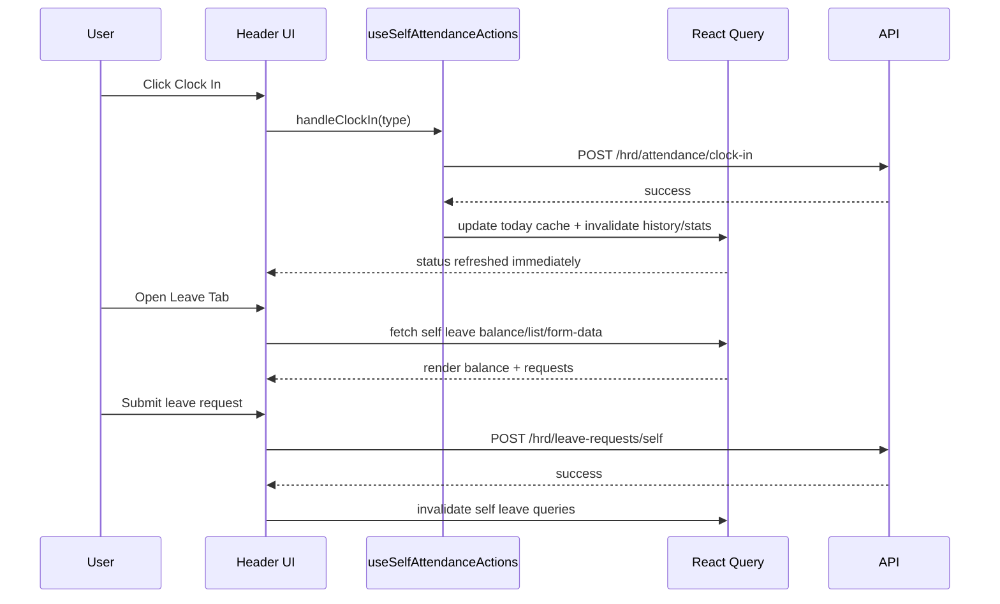

# HRD - Self Service Header (Attendance & Leave)

> **Module:** HRD (Human Resource Development)
> **Sprint:** 14+
> **Version:** 1.0.1
> **Status:** ✅ Complete (Frontend optimization)
> **Last Updated:** March 2026

---

## Table of Contents

1. [Overview](#overview)
2. [Features](#features)
3. [System Architecture](#system-architecture)
4. [Data Models](#data-models)
5. [Business Logic](#business-logic)
6. [API Reference](#api-reference)
7. [Frontend Components](#frontend-components)
8. [User Flows](#user-flows)
9. [Permissions](#permissions)
10. [Configuration](#configuration)
11. [Integration Points](#integration-points)
12. [Testing Strategy](#testing-strategy)
13. [Keputusan Teknis](#keputusan-teknis)
14. [Notes & Improvements](#notes--improvements)
15. [Appendix](#appendix)

---

## Overview

This feature documents the dashboard header self-service experience for:

- Employee clock-in/clock-out (attendance)
- Employee leave request quick actions from right drawer

The optimization focuses on consistency, responsiveness, and maintainability by centralizing attendance action logic in a shared hook and tuning React Query behavior for frequent header interactions.

### Key Features

| Feature                         | Description                                                           |
| ------------------------------- | --------------------------------------------------------------------- |
| Shared Attendance Orchestrator  | Header attendance button and user-menu attendance use one shared hook |
| Optimistic Today Cache Sync     | Clock in/out updates `today` state immediately in query cache         |
| Rollback Safety                 | Mutation error restores previous attendance cache snapshot            |
| Granular Pending States         | Separate pending flags for clock-in and clock-out flows               |
| Header Leave Fast Reload        | Self leave balance/list/form-data use tuned stale times               |
| Localized Self Leave Validation | Self leave form schema uses translation-aware schema factory          |

---

## Features

### 1. Header Attendance Actions

- Unified flow for `NORMAL`, `WFH`, and `FIELD_WORK`
- Late reason dialog for late `NORMAL` check-in
- Camera proof dialog for `WFH` and `FIELD_WORK`
- Geolocation permission guidance and fallback

### 2. Header Leave Self-Service

- Open leave tab directly from attendance header actions
- View personal leave balance and recent self requests
- Create, edit, and cancel own leave requests in drawer tab

### 3. Query Freshness Optimizations

- Immediate cache sync for `today` attendance after clock actions
- Invalidates `my-history` and `my-stats` after successful attendance mutation
- Tuned `staleTime` and `placeholderData` for self leave hooks

---

## System Architecture

### Frontend Structure

```
apps/web/src/features/hrd/
├── attendance-records/
│   ├── hooks/
│   │   ├── use-attendance-records.ts
│   │   └── use-self-attendance-actions.ts
│   └── components/
│       ├── header-attendance-button.tsx
│       ├── user-menu-attendance.tsx
│       └── attendance-right-drawer.tsx
└── leave-request/
    ├── hooks/
    │   └── use-leave-requests.ts
    ├── schemas/
    │   └── leave-request.schema.ts
    └── components/
        └── self-leave-request-tab.tsx
```

### Runtime Composition

1. Header trigger opens attendance actions or right drawer tabs.
2. Shared attendance hook controls permission, geolocation, dialogs, and mutations.
3. Leave tab consumes self leave hooks with tuned cache policy for repeated open/close usage.

---

## Data Models

This feature reuses existing models and DTO responses from attendance and leave modules.

### Attendance (Read/Write in Header)

| Field                            | Description                            |
| -------------------------------- | -------------------------------------- |
| has_checked_in                   | Whether employee has clocked in today  |
| has_checked_out                  | Whether employee has clocked out today |
| attendance_record.check_in_time  | Displayed in header status             |
| attendance_record.check_out_time | Displayed in header status             |
| is_holiday                       | Used to block unsupported actions      |
| is_working_day                   | Used to detect off-day behavior        |
| late_minutes                     | Used by late reason dialog             |

### Leave (Self Drawer Tab)

| Field                 | Description                        |
| --------------------- | ---------------------------------- |
| remaining_balance     | Visible quick balance in leave tab |
| pending_requests_days | Pending leave impact indicator     |
| status                | Drives edit/cancel availability    |
| duration              | Self form behavior for date ranges |

---

## Business Logic

### Attendance Header Rules

- Clock-in menu is disabled on denied location permission.
- Late reason is required for late `NORMAL` check-in.
- Camera proof is required for `WFH` and `FIELD_WORK` check-in.
- Dialog submit button should bind to clock-in pending state only.

### Cache Consistency Rules

- On clock-in/out success, `today` cache is updated immediately.
- On mutation failure, `today` cache is rolled back from snapshot.
- History/statistics queries are invalidated post-success.

### Leave Drawer Rules

- Leave list keeps previous data while fetching next response to avoid visual jumps.
- Form schema uses i18n-aware factory to avoid hardcoded validation strings.
- **Edit hanya untuk status PENDING**: REJECTED tidak bisa di-edit, harus buat request baru.
- **Cancel hanya sebelum start date**: Cancel button hidden setelah tanggal cuti dimulai.
- **Rejected info display**: Menampilkan rejected_by_name dan reject_reason untuk status REJECTED.

---

## API Reference

| Method | Endpoint                              | Permission  | Description                                               |
| ------ | ------------------------------------- | ----------- | --------------------------------------------------------- |
| GET    | `/hrd/attendance/today`               | Auth (Self) | Get today's attendance summary for current user           |
| POST   | `/hrd/attendance/clock-in`            | Auth (Self) | Submit clock-in with type/location/late reason/photo      |
| POST   | `/hrd/attendance/clock-out`           | Auth (Self) | Submit clock-out with location                            |
| GET    | `/hrd/attendance/my-history`          | Auth (Self) | Get personal attendance history (drawer/calendar)         |
| GET    | `/hrd/attendance/my-stats`            | Auth (Self) | Get personal attendance monthly stats                     |
| GET    | `/hrd/leave-requests/my-balance`      | Auth (Self) | Get personal leave balance snapshot                       |
| GET    | `/hrd/leave-requests/my-form-data`    | Auth (Self) | Get leave types and self form options                     |
| GET    | `/hrd/leave-requests/self`            | Auth (Self) | Get personal leave requests                               |
| POST   | `/hrd/leave-requests/self`            | Auth (Self) | Create personal leave request                             |
| PUT    | `/hrd/leave-requests/self/:id`        | Auth (Self) | Update personal leave request                             |
| POST   | `/hrd/leave-requests/self/:id/cancel` | Auth (Self) | Cancel personal leave request (must be before start date) |

---

## Frontend Components

| Name                     | File                                                                                   | Description                                       |
| ------------------------ | -------------------------------------------------------------------------------------- | ------------------------------------------------- |
| HeaderAttendanceButton   | `apps/web/src/features/hrd/attendance-records/components/header-attendance-button.tsx` | Header pill/dropdown attendance actions           |
| UserMenuAttendance       | `apps/web/src/features/hrd/attendance-records/components/user-menu-attendance.tsx`     | Compact attendance actions in user menu           |
| AttendanceRightDrawer    | `apps/web/src/features/hrd/attendance-records/components/attendance-right-drawer.tsx`  | Right drawer with attendance calendar + leave tab |
| SelfLeaveRequestTab      | `apps/web/src/features/hrd/leave-request/components/self-leave-request-tab.tsx`        | Employee self leave requests and form             |
| useSelfAttendanceActions | `apps/web/src/features/hrd/attendance-records/hooks/use-self-attendance-actions.ts`    | Shared attendance orchestration logic             |
| useAttendanceRecords     | `apps/web/src/features/hrd/attendance-records/hooks/use-attendance-records.ts`         | Attendance query/mutation and cache invalidation  |
| useLeaveRequests         | `apps/web/src/features/hrd/leave-request/hooks/use-leave-requests.ts`                  | Self leave list/balance/form-data cache behavior  |

---

## User Flows



---

## Permissions

| Permission/Scope   | Description                                                     |
| ------------------ | --------------------------------------------------------------- |
| Authenticated User | Required for all header self-service attendance endpoints       |
| Authenticated User | Required for all self leave endpoints under `/self` and `/my-*` |

---

## Configuration

| Key                             | Description                                              |
| ------------------------------- | -------------------------------------------------------- |
| Browser Geolocation Permission  | Required for accurate location-based attendance behavior |
| Upload Endpoint `/upload/image` | Required for camera proof upload in WFH/field-work flow  |
| React Query cache options       | Tuned via hook options (`staleTime`, `placeholderData`)  |

---

## Integration Points

- Attendance module (today status, clock actions, stats/history)
- Leave Request module (self list, balance, create/edit/cancel)
- Core upload service for photo capture flow
- Header layout/drawer composition in dashboard shell

---

## Testing Strategy

### Manual Testing

1. Login as employee user.
2. Open header attendance dropdown and verify status line loaded from today attendance.
3. Clock in (`NORMAL`) when late and verify late reason dialog appears.
4. Clock in (`WFH`) and verify camera dialog appears before submit.
5. Verify status updates immediately without manual refresh.
6. Open leave tab from header and verify balance/list rendered.
7. Create self leave request and verify list refresh.
8. **Edit PENDING request dan verify update success** (REJECTED tidak bisa di-edit).
9. **Cancel PENDING request sebelum start date dan verify status changes** (Cancel button hidden setelah tanggal cuti).
10. **Verify rejected info display**: Submit request, reject as approver, verify rejected_by_name dan reject_reason muncul di card.

### Automated Testing

Current state:

- No dedicated component-level automated test file for this specific header orchestration yet.

Recommended additions:

- `apps/web/src/features/hrd/attendance-records/hooks/use-self-attendance-actions.test.ts`
- `apps/web/src/features/hrd/attendance-records/components/header-attendance-button.test.tsx`
- `apps/web/src/features/hrd/leave-request/components/self-leave-request-tab.test.tsx`

Quick validation commands:

```bash
cd apps/web
npx pnpm lint
npx pnpm check-types
```

---

## Keputusan Teknis

1. **Shared orchestrator hook for attendance actions**
   - Alasan: Menghilangkan duplikasi logic di dua komponen entry point.
   - Trade-off: Hook menjadi lebih besar dan perlu boundary yang jelas.

2. **Optimistic sync + rollback pada query `today`**
   - Alasan: UX header membutuhkan status update instan.
   - Trade-off: Butuh snapshot/rollback management yang disiplin.

3. **Granular pending flags (`isClockInPending` vs global pending)**
   - Alasan: Dialog late reason/camera hanya terkait clock-in mutation.
   - Trade-off: Menambah surface API hook.

4. **Translation-aware schema factory untuk self leave form**
   - Alasan: Menjaga konsistensi i18n dan menghindari hardcoded validation messages.
   - Trade-off: Perlu memoization schema per locale.

---

## Notes & Improvements

### Recent Updates (March 2026) 🆕

**Leave Request Cancel Enhancement:**

- Cancel hanya bisa dilakukan sebelum tanggal cuti dimulai (today < start_date)
- Backend validation dengan error code: `INVALID_DATE`
- Frontend menyembunyikan tombol cancel setelah tanggal cuti

**Leave Request Edit Restriction:**

- REJECTED status tidak bisa di-edit (hanya PENDING yang bisa)
- UI menyesuaikan: tombol edit hanya muncul untuk status PENDING
- Alasan: REJECTED harus diajukan ulang sebagai request baru

**Error Handling Improvements:**

- Backend: Format error `CODE: message` untuk parsing mudah
- Frontend: Strip error code prefix untuk pesan yang bersih
- Contoh: `OVERLAPPING_LEAVE_REQUEST: Employee already has...` → `Employee already has...`

**Rejected Info Display:**

- Menampilkan `rejected_by_name` di card leave request (jika status REJECTED)
- Menampilkan reject reason dengan icon AlertCircle
- UI cleanup: menghapus title redundant pada self leave drawer

### Known Limitations

- Header self-service flow belum memiliki dedicated e2e automation.

### Future Improvements

- Add component tests for dialog transitions and permission fallback states.
- Add telemetry event hooks for clock action latency and failure rate.
- Add stale-while-revalidate indicator for leave list refresh.

---

## Appendix

### Related Documentation

- `docs/features/HRD/hrd-attendance.md`
- `docs/features/HRD/hrd-leave-request.md`

### Files Changed in This Optimization

- `apps/web/src/features/hrd/attendance-records/hooks/use-attendance-records.ts`
- `apps/web/src/features/hrd/attendance-records/hooks/use-self-attendance-actions.ts`
- `apps/web/src/features/hrd/attendance-records/components/header-attendance-button.tsx`
- `apps/web/src/features/hrd/attendance-records/components/user-menu-attendance.tsx`
- `apps/web/src/features/hrd/leave-request/schemas/leave-request.schema.ts`
- `apps/web/src/features/hrd/leave-request/components/self-leave-request-tab.tsx`
- `apps/web/src/features/hrd/leave-request/hooks/use-leave-requests.ts`
