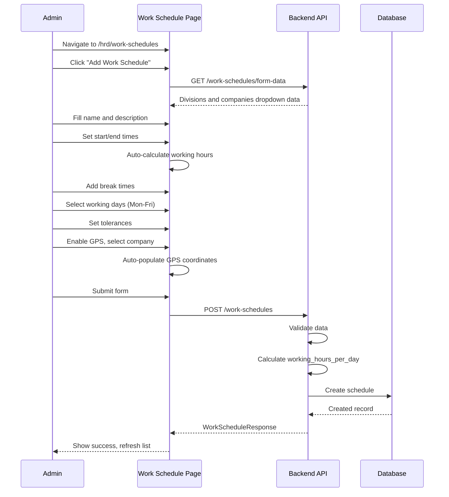
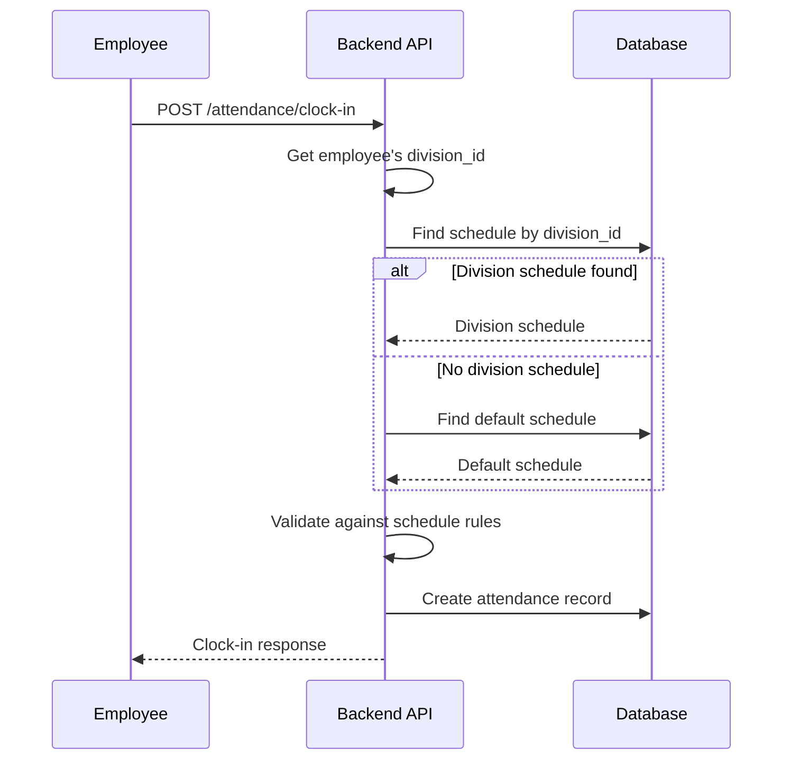

# HRD - Work Schedule Management

> **Module:** HRD (Human Resource Development)  
> **Sprint:** 13  
> **Version:** 1.3.0  
> **Status:** ✅ Complete (API + Frontend)  
> **Last Updated:** February 2026

---

## Table of Contents

1. [Overview](#overview)
2. [Features](#features)
3. [System Architecture](#system-architecture)
4. [Data Models](#data-models)
5. [Business Logic](#business-logic)
6. [API Reference](#api-reference)
7. [Frontend Components](#frontend-components)
8. [User Flows](#user-flows)
9. [Permissions](#permissions)
10. [Configuration](#configuration)
11. [Integration Points](#integration-points)
12. [Testing Strategy](#testing-strategy)
13. [Keputusan Teknis](#keputusan-teknis)
14. [Notes & Improvements](#notes--improvements)
15. [Appendix](#appendix)

---

## Overview

Work Schedule Management enables administrators to create and manage work schedules for employees across different divisions. Schedules define working hours, break times, GPS validation requirements, and tolerance settings for late arrival and early departure.

### Key Features

| Feature                   | Description                                               |
| ------------------------- | --------------------------------------------------------- |
| Fixed & Flexible Hours    | Support for standard 9-to-5 and flexible start/end times  |
| Division-Based Assignment | Assign schedules to specific divisions                    |
| Company-Based GPS         | Select company to auto-populate GPS coordinates           |
| GPS Validation            | Configurable office coordinates and radius                |
| Working Days Bitmask      | Flexible working day selection (Mon-Fri, Mon-Sat, custom) |
| Tolerance Settings        | Grace periods for late arrival and early departure        |
| Multiple Break Times      | Support for multiple break periods                        |
| Auto-Calculated Hours     | Working hours automatically calculated                    |
| Default Schedule          | One general schedule can be marked as default             |
| Form Data Endpoint        | Fetch divisions and companies for form dropdowns          |
| Detail Modal              | View detailed schedule information                        |

---

## Features

### 1. Schedule Types

| Type             | Description                                              |
| ---------------- | -------------------------------------------------------- |
| `Fixed Hours`    | Standard start/end time (e.g., 08:00–17:00)              |
| `Flexible Hours` | Allowed range for clock-in/out (e.g., 07:00–10:00 start) |

### 2. Working Days Bitmask

Working days stored as bitmask integer:

| Day          | Bit Value                  |
| ------------ | -------------------------- |
| Monday       | 1                          |
| Tuesday      | 2                          |
| Wednesday    | 4                          |
| Thursday     | 8                          |
| Friday       | 16                         |
| Saturday     | 32                         |
| Sunday       | 64                         |
| **Mon-Fri**  | **31** (1+2+4+8+16)        |
| **Mon-Sat**  | **63** (1+2+4+8+16+32)     |
| **All Days** | **127** (1+2+4+8+16+32+64) |

### 3. GPS Configuration

| Setting            | Description                            |
| ------------------ | -------------------------------------- |
| `require_gps`      | Toggle GPS validation on/off           |
| `gps_radius_meter` | Allowed distance from office (meters)  |
| `office_latitude`  | Office GPS latitude                    |
| `office_longitude` | Office GPS longitude                   |
| `company_id`       | Auto-populate coordinates from company |

### 4. Break Times

- Multiple break periods supported
- Each break has start and end time
- Total break duration calculated automatically
- Stored as JSONB array

### 5. Tolerance Settings

| Setting                         | Description                      |
| ------------------------------- | -------------------------------- |
| `late_tolerance_minutes`        | Grace period for late arrival    |
| `early_leave_tolerance_minutes` | Grace period for early departure |

---

## System Architecture

### Backend Structure

```
apps/api/internal/hrd/
├── data/
│   ├── models/
│   │   └── work_schedule.go
│   └── repositories/
│       └── work_schedule_repository.go
├── domain/
│   ├── dto/
│   │   └── work_schedule_dto.go
│   ├── mapper/
│   │   └── work_schedule_mapper.go
│   └── usecase/
│       └── work_schedule_usecase.go
└── presentation/
    ├── handler/
    │   └── work_schedule_handler.go
    └── router/
        └── work_schedule_router.go
```

### Frontend Structure

```
apps/web/src/features/hrd/work-schedules/
├── types/
│   └── index.d.ts
├── schemas/
│   └── work-schedule.schema.ts
├── services/
│   └── work-schedule-service.ts
├── hooks/
│   └── use-work-schedules.ts
├── i18n/
│   ├── en.ts
│   └── id.ts
└── components/
    ├── work-schedule-list.tsx
    ├── work-schedule-dialog.tsx
    ├── work-schedule-detail-dialog.tsx
    ├── work-schedule-page-client.tsx
    └── index.ts

apps/web/app/[locale]/(dashboard)/hrd/work-schedules/
├── page.tsx
└── loading.tsx
```

---

## Data Models

### WorkSchedule

| Field                         | Type        | Description                            |
| ----------------------------- | ----------- | -------------------------------------- |
| id                            | UUID        | Primary key                            |
| name                          | STRING(100) | Schedule name                          |
| description                   | STRING(255) | Optional description                   |
| division_id                   | UUID        | Optional division link (nullable)      |
| is_default                    | BOOL        | Default schedule flag                  |
| is_active                     | BOOL        | Active status                          |
| start_time                    | STRING(5)   | Work start time ("HH:MM")              |
| end_time                      | STRING(5)   | Work end time ("HH:MM")                |
| is_flexible                   | BOOL        | Flexible hours flag                    |
| flexible_start_time           | STRING(5)   | Earliest allowed clock-in              |
| flexible_end_time             | STRING(5)   | Latest allowed clock-in                |
| breaks                        | JSONB       | Array of break periods                 |
| working_days                  | INT         | Bitmask for working days (default: 31) |
| working_hours_per_day         | FLOAT       | Auto-calculated from start/end         |
| late_tolerance_minutes        | INT         | Grace period for late arrival          |
| early_leave_tolerance_minutes | INT         | Grace period for early departure       |
| require_gps                   | BOOL        | GPS validation required                |
| gps_radius_meter              | FLOAT       | Allowed radius from office (meters)    |
| office_latitude               | FLOAT       | Office GPS latitude                    |
| office_longitude              | FLOAT       | Office GPS longitude                   |
| company_id                    | UUID        | Company for GPS coordinates            |
| created_at                    | TIMESTAMP   | Creation timestamp                     |
| updated_at                    | TIMESTAMP   | Last update timestamp                  |
| deleted_at                    | TIMESTAMP   | Soft delete timestamp                  |

### BreakTime Structure

```go
type BreakTime struct {
    StartTime string `json:"start_time"` // Format: "HH:MM"
    EndTime   string `json:"end_time"`   // Format: "HH:MM"
}
```

### Database Indexes

| Index                       | Type   | Columns     |
| --------------------------- | ------ | ----------- |
| idx_work_schedules_division | B-tree | division_id |
| idx_work_schedules_default  | B-tree | is_default  |
| idx_work_schedules_active   | B-tree | is_active   |
| idx_work_schedules_flexible | B-tree | is_flexible |
| idx_work_schedules_gps      | B-tree | require_gps |

---

## Business Logic

### Default Schedule Rules

```
Rules:
1. Only ONE default schedule allowed system-wide
2. Only general (non-division) schedules can be default
3. Setting new default automatically unsets previous
4. Cannot delete the default schedule
```

### Schedule Resolution (Clock-In)

```
When employee clocks in:
1. Get employee's division_id
2. Look for schedule WHERE division_id = employee.division_id
3. If not found, use default schedule (WHERE is_default = true)
4. If no default, error: NO_SCHEDULE_FOUND
```

### Working Hours Calculation

```
working_hours_per_day = end_time - start_time (in hours)

Examples:
- 08:00 to 17:00 = 9 hours
- 09:00 to 18:00 = 9 hours
- 20:00 to 04:00 = 8 hours (overnight shift)
```

### Total Break Minutes

```
total_break_minutes = Σ(break.end_time - break.start_time)

Example:
- Break 1: 12:00-13:00 = 60 minutes
- Break 2: 15:00-15:15 = 15 minutes
- Total: 75 minutes
```

### Late Calculation

```
schedule_start = start_time + late_tolerance_minutes
late_minutes = max(0, check_in_time - schedule_start)

Example:
- Start: 08:00
- Tolerance: 15 minutes
- Check-in: 08:30
- Late: 30 - 15 = 15 minutes
```

### Early Leave Calculation

```
schedule_end = end_time - early_leave_tolerance_minutes
early_leave_minutes = max(0, schedule_end - check_out_time)

Example:
- End: 17:00
- Tolerance: 0 minutes
- Check-out: 16:45
- Early leave: 15 minutes
```

### Working Minutes

```
working_minutes = (check_out_time - check_in_time) - total_break_minutes
```

### Overtime Detection

```
overtime_threshold = end_time + 30 minutes
if check_out_time > overtime_threshold:
    overtime_minutes = check_out_time - end_time
    create overtime_request
```

### Working Days Check

```
today_bit = 1 << weekday  // 0=Mon, 1=Tue, etc.
is_working_day = (working_days & today_bit) != 0

Example:
- Working days: 31 (Mon-Fri)
- Today: Wednesday (bit 4)
- 31 & 4 = 4 != 0 → Working day
```

---

## API Reference

### Work Schedule Endpoints

| Method | Endpoint                                     | Permission           | Description                            |
| ------ | -------------------------------------------- | -------------------- | -------------------------------------- |
| GET    | `/api/v1/hrd/work-schedules`                 | work_schedule.read   | List schedules (paginated, filterable) |
| GET    | `/api/v1/hrd/work-schedules/form-data`       | work_schedule.read   | Get form data (divisions + companies)  |
| GET    | `/api/v1/hrd/work-schedules/default`         | work_schedule.read   | Get the default schedule               |
| GET    | `/api/v1/hrd/work-schedules/:id`             | work_schedule.read   | Get schedule by ID                     |
| POST   | `/api/v1/hrd/work-schedules`                 | work_schedule.create | Create new schedule                    |
| PUT    | `/api/v1/hrd/work-schedules/:id`             | work_schedule.update | Update schedule                        |
| DELETE | `/api/v1/hrd/work-schedules/:id`             | work_schedule.delete | Delete schedule                        |
| POST   | `/api/v1/hrd/work-schedules/:id/set-default` | work_schedule.update | Set as default (general only)          |

### Query Parameters (List)

| Parameter   | Type   | Description                            |
| ----------- | ------ | -------------------------------------- |
| page        | int    | Page number (default: 1)               |
| per_page    | int    | Items per page (default: 20, max: 100) |
| search      | string | Search by name or description          |
| is_active   | bool   | Filter by active status                |
| is_flexible | bool   | Filter by flexible hours               |
| division_id | uuid   | Filter by division                     |

### Request Body (Create/Update)

```json
{
  "name": "Standard Office Hours",
  "description": "Standard 9-to-5 schedule",
  "start_time": "08:00",
  "end_time": "17:00",
  "is_flexible": false,
  "breaks": [{ "start_time": "12:00", "end_time": "13:00" }],
  "working_days": 31,
  "late_tolerance_minutes": 15,
  "early_leave_tolerance_minutes": 0,
  "require_gps": false,
  "gps_radius_meter": 100,
  "office_latitude": -6.2088,
  "office_longitude": 106.8456,
  "division_id": null,
  "company_id": null
}
```

**Notes:**

- `working_hours_per_day` is auto-calculated and should not be sent
- `company_id` is optional — if provided, GPS coordinates auto-populate
- Response includes `division_name` resolved from `division_id`

### Form Data Response

```json
{
  "success": true,
  "data": {
    "divisions": [{ "id": "uuid", "name": "Engineering" }],
    "companies": [
      {
        "id": "uuid",
        "name": "PT Example",
        "latitude": -6.2088,
        "longitude": 106.8456
      }
    ]
  }
}
```

---

## Frontend Components

### Work Schedules Page (`/hrd/work-schedules`)

| Component                  | File                            | Description                                               |
| -------------------------- | ------------------------------- | --------------------------------------------------------- |
| `WorkScheduleList`         | work-schedule-list.tsx          | Paginated table with CRUD, default badge, division column |
| `WorkScheduleDialog`       | work-schedule-dialog.tsx        | Create/Edit form with all config fields                   |
| `WorkScheduleDetailDialog` | work-schedule-detail-dialog.tsx | Read-only detail modal                                    |
| `WorkSchedulePageClient`   | work-schedule-page-client.tsx   | Page wrapper with animations                              |

### Features

- Paginated list with search and filters
- Default schedule badge indicator
- Clickable schedule names open detail modal
- Division selection dropdown
- Company-based GPS auto-population
- Working days bitmask selector (Mon-Sun checkboxes)
- Multiple break times (add/remove dynamically)
- Auto-calculated working hours display
- GPS configuration with manual fallback
- Late/Early tolerance settings
- Set default action (general schedules only)
- Active/Inactive toggle

### Detail Modal Features

- Schedule name with default badge
- Status badges (Active/Inactive, Flexible, GPS, Division)
- Assignment section (division or "All Divisions")
- Work hours and flexible range
- All break times listed
- Working days display
- Auto-calculated working hours
- Tolerance settings
- GPS configuration (if enabled)

### i18n Keys

| Key Path                          | Description       |
| --------------------------------- | ----------------- |
| `hrd.workSchedule.title`          | Page title        |
| `hrd.workSchedule.fields.*`       | Form field labels |
| `hrd.workSchedule.placeholders.*` | Form placeholders |
| `hrd.workSchedule.sections.*`     | Section headers   |
| `hrd.workSchedule.days.*`         | Day abbreviations |

---

## User Flows

### Create Work Schedule Flow



### Set Default Schedule Flow

```
mermaid
sequenceDiagram
    participant Admin as Admin
    participant UI as Work Schedule List
    participant API as Backend API
    participant DB as Database

    Admin->>UI: Find general (non-division) schedule
    Admin->>UI: Click "Set as Default" in dropdown
    UI->>API: POST /work-schedules/:id/set-default
    API->>DB: Unset previous default
    API->>DB: Set new default
    DB-->>API: Updated records
    API-->>UI: Success response
    UI-->>Admin: Default badge moved to new schedule
```

### Schedule Usage (Clock-In) Flow



---

## Permissions

| Permission             | Description                    |
| ---------------------- | ------------------------------ |
| `work_schedule.read`   | View work schedules            |
| `work_schedule.create` | Create work schedules          |
| `work_schedule.update` | Update schedules + set default |
| `work_schedule.delete` | Delete work schedules          |

---

## Configuration

### Default Schedules (Seeder)

Two schedules are seeded by default:

**Standard Office Hours:**

```yaml
name: Standard Office Hours
start_time: "08:00"
end_time: "17:00"
breaks: [{ "start_time": "12:00", "end_time": "13:00" }]
working_days: 31 (Mon-Fri)
late_tolerance_minutes: 15
early_leave_tolerance_minutes: 0
gps_required: true
gps_radius: 200m
office: Jakarta coordinates
is_default: true
```

**Flexible Hours:**

```yaml
name: Flexible Hours
start_time: "08:00"
end_time: "17:00"
flexible_start_time: "07:00"
flexible_end_time: "09:00"
is_flexible: true
breaks: [{ "start_time": "12:00", "end_time": "13:00" }]
working_days: 31 (Mon-Fri)
gps_required: false
is_default: false
```

### Configuration Impact on Attendance

| Setting                         | Impact                                          |
| ------------------------------- | ----------------------------------------------- |
| `late_tolerance_minutes`        | Determines when employee is marked LATE         |
| `early_leave_tolerance_minutes` | Determines early departure penalty              |
| `require_gps`                   | Enables GPS distance check on NORMAL clock-in   |
| `gps_radius_meter`              | Maximum distance from office for valid clock-in |
| `breaks`                        | Total break time deducted from working minutes  |
| `working_hours_per_day`         | Used for overtime baseline calculation          |

---

## Integration Points

### With Attendance Module (Primary)

- Schedule resolved per employee (division → default fallback)
- Clock-in validates GPS based on `require_gps` and `gps_radius_meter`
- Late minutes calculated against `start_time + late_tolerance_minutes`
- Early leave against `end_time - early_leave_tolerance_minutes`
- Overtime auto-detected when clock-out > `end_time + 30 min`
- Working minutes reduced by total break minutes
- `work_schedule_id` stored on each attendance record
- `work_schedule_name` enriched in detail response

### With Overtime Module

- Overtime auto-detection uses schedule end time as baseline
- Overtime rate can differ by schedule type (weekday vs weekend)

### With Form Data Endpoint

- Active schedules returned in attendance form data
- `GET /work-schedules/form-data` returns divisions and companies

### With Company Module

- Companies with GPS coordinates available in form
- Selecting company auto-populates latitude/longitude

---

## Testing Strategy

### Manual Testing

1. Login as admin
2. Navigate to `/hrd/work-schedules`
3. Verify default schedule shows "Default" badge
4. Click schedule name → detail modal opens
5. Click "Add Work Schedule" → fill all fields
6. Toggle "Flexible Hours" → flexible fields appear
7. Add multiple break times
8. Verify working hours auto-calculated
9. Select working days via checkboxes
10. Submit → verify success toast
11. Select Division → verify saves correctly
12. Select Company for GPS → verify coordinates auto-populate
13. Test "Manual Coordinates" option
14. Test "Set as Default" on general schedule
15. Verify old default lost badge
16. Verify "Set as Default" hidden for division schedules
17. Test GPS settings
18. Test View from dropdown → detail modal opens
19. Verify schedule used during attendance clock-in

### API Testing

```bash
# Get form data
curl http://localhost:8080/api/v1/hrd/work-schedules/form-data \
  -H "Authorization: Bearer $TOKEN"

# Get default schedule
curl http://localhost:8080/api/v1/hrd/work-schedules/default \
  -H "Authorization: Bearer $TOKEN"

# Set as default
curl -X POST http://localhost:8080/api/v1/hrd/work-schedules/:id/set-default \
  -H "Authorization: Bearer $TOKEN"
```

---

## Keputusan Teknis

| Decision                                                  | Rationale                                                                                                                                                                        |
| --------------------------------------------------------- | -------------------------------------------------------------------------------------------------------------------------------------------------------------------------------- |
| **Division-based schedule lookup**                        | Different divisions can have different schedules (sales vs admin). Fallback to default if no division schedule. Trade-off: 1 extra query per clock-in, better schedule accuracy. |
| **Working days as bitmask**                               | Efficient storage and comparison. Check working day: `schedule.WorkingDays & (1 << weekday) != 0`. Trade-off: less readable, standard in ERP systems.                            |
| **GPS validation only for NORMAL check-in**               | WFH and FIELD_WORK by definition not in office. GPS logged for FIELD_WORK (audit) but not validated. Trade-off: appropriate validation per type.                                 |
| **Multiple break times as array**                         | Some companies have multiple breaks (morning, afternoon). Flexibility for various break structures. Trade-off: slightly more complex storage.                                    |
| **Working hours auto-calculated**                         | Prevents inconsistency when start/end times change. Formula: `end_time - start_time` in hours. Trade-off: derived field, always consistent.                                      |
| **GPS default false**                                     | Not all companies need GPS validation. Admin must consciously enable. Trade-off: conscious configuration required.                                                               |
| **Custom Breaks type with Value/Scan methods**            | PostgreSQL JSONB can't directly scan to slice struct. Custom methods handle JSONB ↔ Go struct conversion. Trade-off: custom code for GORM compatibility.                        |
| **Company-based GPS**                                     | Company data already has coordinates. Reduces human error from manual input. Trade-off: depends on company data accuracy.                                                        |
| **Default schedule restricted to general (non-division)** | Default serves as fallback for all employees. Division-specific schedules shouldn't be general fallback. Prevents logic conflicts.                                               |

---

## Notes & Improvements

### Version History

| Version | Changes                                                                                                        |
| ------- | -------------------------------------------------------------------------------------------------------------- |
| 1.3.0   | Multiple break times, company-based GPS, form-data endpoint, division selection, default schedule restrictions |

### Completed Features

- ✅ Fixed and flexible hours support
- ✅ Division-based assignment
- ✅ Company-based GPS coordinates
- ✅ Working days bitmask
- ✅ Multiple break times
- ✅ Auto-calculated working hours
- ✅ Default schedule management
- ✅ Tolerance settings
- ✅ Form data endpoint
- ✅ Detail modal
- ✅ i18n support

### Known Limitations

- Schedule changes don't retroactively affect existing attendance records
- No shift schedule support (morning/afternoon/night)
- No schedule effective date range

### Future Improvements

- Shift schedule support (morning/afternoon/night shifts)
- Schedule calendar view for division assignments
- Schedule effective date range (validity period)
- Schedule override for specific dates (half-day)
- Schedule templates for quick creation
- Schedule conflict detection
- Bulk schedule assignment to employees
- Schedule analytics and reporting

---

## Appendix

### Error Codes

| Code                                      | HTTP Status | Description                          |
| ----------------------------------------- | ----------- | ------------------------------------ |
| `WORK_SCHEDULE_NOT_FOUND`                 | 404         | Schedule not found                   |
| `DEFAULT_SCHEDULE_NOT_FOUND`              | 404         | No default schedule set              |
| `CANNOT_SET_DIVISION_SCHEDULE_AS_DEFAULT` | 400         | Division schedules cannot be default |
| `CANNOT_DELETE_DEFAULT_SCHEDULE`          | 400         | Must set another default first       |
| `INVALID_TIME_FORMAT`                     | 400         | Invalid time format (must be HH:MM)  |
| `INVALID_BREAK_TIME`                      | 400         | Break end before break start         |
| `INVALID_WORKING_DAYS`                    | 400         | Invalid working days bitmask         |
| `DIVISION_NOT_FOUND`                      | 404         | Division ID does not exist           |
| `COMPANY_NOT_FOUND`                       | 404         | Company ID does not exist            |

---

_Document generated for GIMS Platform - Work Schedule Management v1.3.0_
