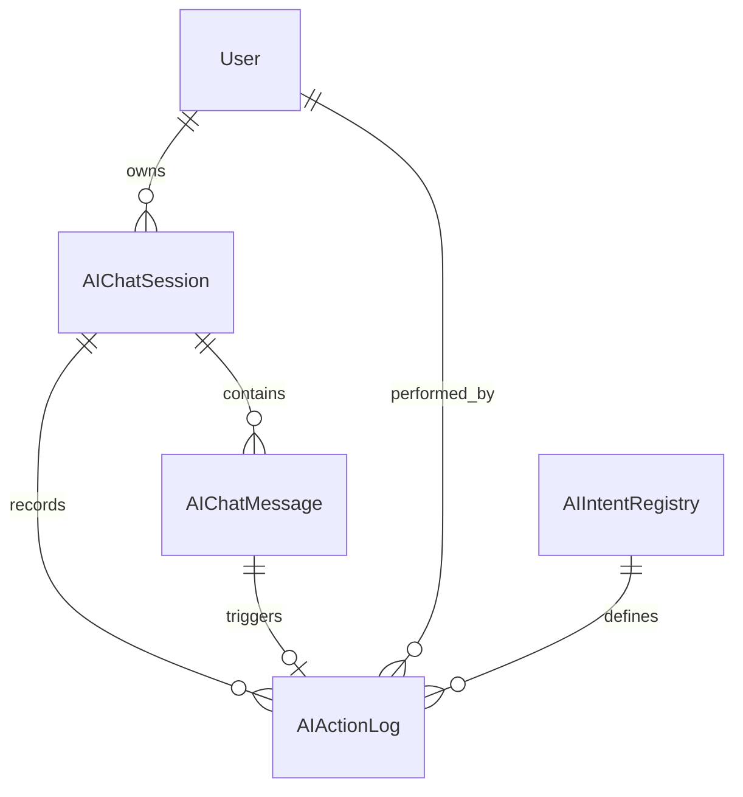

# Sprint 17: AI Chat Assistant (GIMS AI Agent)

> **Module**: AI / Core Infrastructure
> **Priority**: P1
> **Dependencies**: All existing modules (Sales, Purchase, HRD, Stock, Finance, Master Data)
> **AI Provider**: Cerebras (OpenAI-compatible API)
> **Reference**: [erp-sprint-planning.md](../erp-sprint-planning.md), [erp-database-relations.mmd](../erp-database-relations.mmd)

---

## Ringkasan Singkat Fitur

GIMS AI Agent adalah chat assistant berbasis LLM (Cerebras) yang terintegrasi langsung ke dalam ERP. AI Agent ini memungkinkan user berinteraksi dengan sistem menggunakan bahasa natural (Bahasa Indonesia/English) untuk melakukan operasi CRUD, generate report, dan query data — **terbatas pada scope RBAC user yang sedang login**.

Arsitektur menggunakan pola **Intent → Validation → Confirmation → Execution** untuk menjamin keamanan dan akurasi operasi enterprise. Semua action yang dilakukan AI tercatat dalam audit log.

---

## Fitur Utama

- Chat widget floating di pojok kanan bawah (collapsible, resizable)
- Natural language processing via Cerebras LLM API
- RBAC-scoped: AI hanya bisa mengakses endpoint sesuai permission user yang login
- Intent extraction & structured action dispatch
- Smart confirmation layer sebelum mutating operations (POST/PUT/DELETE)
- Auto-fill default values untuk field opsional
- Multi-turn conversation support (context awareness per session)
- Chat session history tersimpan di database
- Action audit log (semua operasi AI tercatat)
- Hybrid memory: short-term (in-session context) + long-term (DB history)
- Streaming response support untuk UX yang responsif
- Support Bahasa Indonesia dan English

---

## Business Rules

### 1. RBAC Enforcement (NON-NEGOTIABLE)
- AI Agent **wajib** menjalankan setiap action menggunakan JWT dan permission user yang login
- Sebelum dispatch action, backend **wajib** validasi permission user terhadap intent yang diminta
- Jika user tidak punya permission, AI wajib menolak dengan pesan yang jelas
- Admin role tetap memiliki bypass (sama seperti middleware existing)
- AI **tidak boleh** escalate privilege atau bypass permission check

### 2. Intent Classification
- Setiap user message di-parse oleh LLM menjadi structured intent
- Intent categories:
  - `QUERY_*` — Read operations (GET) — memerlukan `*.read` permission
  - `CREATE_*` — Create operations (POST) — memerlukan `*.create` permission
  - `UPDATE_*` — Update operations (PUT) — memerlukan `*.update` permission
  - `DELETE_*` — Delete operations (DELETE) — memerlukan `*.delete` permission
  - `APPROVE_*` — Approval operations — memerlukan `*.approve` permission
  - `REPORT_*` — Report/analytics operations — memerlukan `*.read` permission
  - `GENERAL` — Chitchat/help — tidak memerlukan permission khusus
- Jika LLM gagal extract intent, AI reply dengan klarifikasi

### 3. Confirmation Layer (Enterprise Safe Mode)
- **Read operations** (QUERY/REPORT): langsung execute, tidak perlu konfirmasi
- **Mutating operations** (CREATE/UPDATE/DELETE/APPROVE): **wajib** konfirmasi user sebelum execute
- Confirmation message menampilkan summary data yang akan di-proses
- User harus reply "ya"/"yes"/"lanjut"/"confirm" untuk proceed
- User bisa reply "tidak"/"cancel"/"batal" untuk membatalkan
- Timeout konfirmasi: 5 menit (setelah itu intent di-discard)

### 4. Data Resolution
- AI harus resolve entity references dari natural language ke database IDs
  - Contoh: "PT Maju Jaya" → lookup `customers` table → `customer_id`
  - Contoh: "AC 2PK" → lookup `products` table → `product_id`
  - Contoh: "Gudang Pusat" → lookup `warehouses` table → `warehouse_id`
- Jika resolution ambigu (multiple matches), AI wajib tanya klarifikasi
- Jika resolution tidak ditemukan, AI inform user dan minta koreksi

### 5. Required Field Validation
- Backend schema menentukan field mana yang required vs optional
- Jika required field belum terisi dari user message:
  - AI **wajib tanya** user untuk field yang required
  - AI **boleh auto-fill** default untuk field yang optional (contoh: tanggal hari ini, currency IDR)
- AI inform user tentang default values yang digunakan

### 6. Session & Memory Management
- Setiap conversation memiliki `session_id` unik
- Short-term memory: context window dari conversation aktif (max 20 messages)
- Long-term memory: semua sessions tersimpan di database
- User bisa melihat history chat sessions sebelumnya
- User bisa melihat action log (apa saja yang AI lakukan di server)
- Session auto-expire setelah 30 menit inaktivitas (bisa di-resume)

### 7. Rate Limiting
- Max 30 messages per menit per user (prevent abuse)
- Max 10 mutating actions per menit per user
- Rate limit menggunakan Redis (consistent dengan existing rate limiter)

### 8. Error Handling
- Jika Cerebras API down/timeout → AI reply "Layanan AI sedang tidak tersedia, silakan coba lagi."
- Jika action execution gagal → AI reply dengan error detail dari backend
- Jika data tidak ditemukan → AI inform dan suggest alternatif
- Semua error di-log ke `ai_action_logs` table

---

## Architecture Overview

### Flow Diagram

```
User Input (Natural Language)
       │
       ▼
┌──────────────┐
│  Frontend    │  Chat Widget (WebSocket/SSE)
│  Next.js     │
└──────┬───────┘
       │ POST /api/v1/ai/chat
       ▼
┌──────────────┐
│  AI Gateway  │  Handler + Auth Middleware (JWT + RBAC)
│  (Go/Gin)    │
└──────┬───────┘
       │
       ▼
┌──────────────┐     ┌─────────────────┐
│  AI Usecase  │────▶│  Cerebras LLM   │
│  (Intent     │◀────│  (Chat API)     │
│   Extraction)│     └─────────────────┘
└──────┬───────┘
       │ Structured Intent + Parameters
       ▼
┌──────────────┐
│  Permission  │  Check user RBAC for intent
│  Validator   │
└──────┬───────┘
       │ (Authorized)
       ▼
┌──────────────┐
│  Entity      │  Resolve names → IDs via DB lookup
│  Resolver    │
└──────┬───────┘
       │
       ▼
┌──────────────┐
│  Confirmation│  (For mutating ops only)
│  Layer       │  Wait for user confirmation
└──────┬───────┘
       │ (Confirmed)
       ▼
┌──────────────┐
│  Action      │  Call internal service/usecase layer
│  Executor    │  (Same as handler logic)
└──────┬───────┘
       │
       ▼
┌──────────────┐
│  Action Log  │  Store to ai_action_logs table
│  + Response  │  Return result to user
└──────────────┘
```

### System Prompt Strategy

AI mendapatkan system prompt yang berisi:
1. Daftar domain/module yang tersedia beserta capabilities
2. Daftar permission yang dimiliki user saat ini
3. Format structured intent yang harus dihasilkan
4. Business rules summary per domain
5. Instruksi untuk selalu confirm sebelum mutating operations
6. Instruksi untuk menggunakan bahasa sesuai user (ID/EN)

---

## Database Models

### 1. AIChatSession

```sql
CREATE TABLE ai_chat_sessions (
    id              UUID PRIMARY KEY DEFAULT gen_random_uuid(),
    user_id         UUID NOT NULL REFERENCES users(id),
    title           VARCHAR(255),           -- Auto-generated dari first message
    status          VARCHAR(20) DEFAULT 'ACTIVE',  -- ACTIVE, CLOSED, EXPIRED
    last_activity   TIMESTAMP WITH TIME ZONE,
    message_count   INT DEFAULT 0,
    metadata        JSONB,                  -- Additional session context
    created_at      TIMESTAMP WITH TIME ZONE DEFAULT NOW(),
    updated_at      TIMESTAMP WITH TIME ZONE DEFAULT NOW(),
    deleted_at      TIMESTAMP WITH TIME ZONE  -- Soft delete
);

CREATE INDEX idx_ai_chat_sessions_user_id ON ai_chat_sessions(user_id);
CREATE INDEX idx_ai_chat_sessions_status ON ai_chat_sessions(status);
CREATE INDEX idx_ai_chat_sessions_created ON ai_chat_sessions(created_at DESC);
```

### 2. AIChatMessage

```sql
CREATE TABLE ai_chat_messages (
    id              UUID PRIMARY KEY DEFAULT gen_random_uuid(),
    session_id      UUID NOT NULL REFERENCES ai_chat_sessions(id) ON DELETE CASCADE,
    role            VARCHAR(20) NOT NULL,    -- 'user', 'assistant', 'system'
    content         TEXT NOT NULL,           -- Message content (user text or AI response)
    intent          JSONB,                   -- Extracted intent (null for user messages)
    token_usage     JSONB,                   -- { prompt_tokens, completion_tokens, total_tokens }
    model           VARCHAR(100),            -- Model used (e.g., "llama-4-scout-17b-16e-instruct")
    duration_ms     INT,                     -- LLM response time in milliseconds
    created_at      TIMESTAMP WITH TIME ZONE DEFAULT NOW()
);

CREATE INDEX idx_ai_chat_messages_session ON ai_chat_messages(session_id, created_at);
```

### 3. AIActionLog

```sql
CREATE TABLE ai_action_logs (
    id              UUID PRIMARY KEY DEFAULT gen_random_uuid(),
    session_id      UUID NOT NULL REFERENCES ai_chat_sessions(id),
    message_id      UUID REFERENCES ai_chat_messages(id),
    user_id         UUID NOT NULL REFERENCES users(id),
    intent          VARCHAR(100) NOT NULL,   -- e.g., 'CREATE_HOLIDAY', 'CREATE_SALES_QUOTATION'
    entity_type     VARCHAR(100),            -- e.g., 'Holiday', 'SalesQuotation'
    entity_id       UUID,                    -- ID of created/updated/deleted entity
    action          VARCHAR(20) NOT NULL,    -- 'CREATE', 'UPDATE', 'DELETE', 'APPROVE', 'QUERY'
    request_payload JSONB,                   -- What was sent to the internal service
    response_payload JSONB,                  -- What was returned (success/error)
    status          VARCHAR(20) NOT NULL,    -- 'SUCCESS', 'FAILED', 'PENDING_CONFIRMATION', 'CANCELLED'
    error_message   TEXT,                    -- Error detail if failed
    permission_used VARCHAR(100),            -- Which permission was checked
    duration_ms     INT,                     -- Execution time
    ip_address      VARCHAR(45),
    user_agent      TEXT,
    created_at      TIMESTAMP WITH TIME ZONE DEFAULT NOW()
);

CREATE INDEX idx_ai_action_logs_session ON ai_action_logs(session_id);
CREATE INDEX idx_ai_action_logs_user ON ai_action_logs(user_id);
CREATE INDEX idx_ai_action_logs_intent ON ai_action_logs(intent);
CREATE INDEX idx_ai_action_logs_status ON ai_action_logs(status);
CREATE INDEX idx_ai_action_logs_created ON ai_action_logs(created_at DESC);
```

### 4. AIIntentRegistry (Configuration Table)

```sql
CREATE TABLE ai_intent_registry (
    id              UUID PRIMARY KEY DEFAULT gen_random_uuid(),
    intent_code     VARCHAR(100) UNIQUE NOT NULL,  -- e.g., 'CREATE_HOLIDAY'
    display_name    VARCHAR(255) NOT NULL,
    description     TEXT,
    module          VARCHAR(50) NOT NULL,            -- e.g., 'hrd', 'sales', 'stock'
    action_type     VARCHAR(20) NOT NULL,            -- 'CREATE', 'UPDATE', 'DELETE', 'QUERY', 'REPORT'
    required_permission VARCHAR(100) NOT NULL,       -- e.g., 'holiday.create'
    requires_confirmation BOOLEAN DEFAULT true,
    endpoint_path   VARCHAR(255),                    -- Internal API path if applicable
    parameter_schema JSONB,                          -- JSON Schema for required/optional params
    is_active       BOOLEAN DEFAULT true,
    created_at      TIMESTAMP WITH TIME ZONE DEFAULT NOW(),
    updated_at      TIMESTAMP WITH TIME ZONE DEFAULT NOW()
);

CREATE UNIQUE INDEX idx_ai_intent_code ON ai_intent_registry(intent_code);
```

### Table Relations



---

## API Endpoints

### Chat Endpoints

| Method | Endpoint | Permission | Description |
|--------|----------|------------|-------------|
| POST | `/api/v1/ai/chat` | Auth | Send message & get AI response |
| POST | `/api/v1/ai/chat/stream` | Auth | Send message with SSE streaming response |
| POST | `/api/v1/ai/chat/confirm` | Auth | Confirm or cancel pending action |
| GET | `/api/v1/ai/sessions` | Auth | List user's chat sessions |
| GET | `/api/v1/ai/sessions/:id` | Auth | Get session with messages |
| DELETE | `/api/v1/ai/sessions/:id` | Auth | Delete/close a session |
| GET | `/api/v1/ai/sessions/:id/actions` | Auth | Get action logs for a session |

### Admin Endpoints

| Method | Endpoint | Permission | Description |
|--------|----------|------------|-------------|
| GET | `/api/v1/ai/admin/actions` | ai.admin | List all AI action logs (admin view) |
| GET | `/api/v1/ai/admin/stats` | ai.admin | AI usage statistics (tokens, actions) |
| GET | `/api/v1/ai/admin/intents` | ai.admin | List registered intents |
| PUT | `/api/v1/ai/admin/intents/:id` | ai.admin | Enable/disable specific intents |

---

## Request/Response Schemas

### 1. POST /api/v1/ai/chat — Send Message

**Request Body:**
```json
{
  "session_id": "uuid | null",
  "message": "Bantu saya daftarkan holiday untuk imlek tahun ini"
}
```

**Response (Query/General — immediate):**
```json
{
  "success": true,
  "data": {
    "session_id": "uuid",
    "message": {
      "id": "uuid",
      "role": "assistant",
      "content": "Berikut data holiday yang sudah terdaftar di tahun 2026:\n\n1. Tahun Baru - 1 Jan 2026\n2. ...",
      "intent": {
        "type": "QUERY_HOLIDAY",
        "parameters": { "year": 2026 }
      },
      "created_at": "2026-02-20T10:30:00+07:00"
    },
    "action": null,
    "requires_confirmation": false,
    "token_usage": {
      "prompt_tokens": 450,
      "completion_tokens": 120,
      "total_tokens": 570
    }
  },
  "timestamp": "2026-02-20T10:30:00+07:00",
  "request_id": "req_abc123"
}
```

**Response (Mutating — requires confirmation):**
```json
{
  "success": true,
  "data": {
    "session_id": "uuid",
    "message": {
      "id": "uuid",
      "role": "assistant",
      "content": "Saya akan mendaftarkan holiday berikut:\n\n- **Imlek** — Selasa, 17 Februari 2026\n\nApakah Anda ingin melanjutkan?",
      "intent": {
        "type": "CREATE_HOLIDAY",
        "parameters": {
          "name": "Imlek (Tahun Baru China)",
          "date": "2026-02-17",
          "is_national": true,
          "description": "Hari Raya Imlek"
        }
      },
      "created_at": "2026-02-20T10:30:00+07:00"
    },
    "action": {
      "id": "uuid",
      "intent": "CREATE_HOLIDAY",
      "status": "PENDING_CONFIRMATION",
      "payload_preview": {
        "name": "Imlek (Tahun Baru China)",
        "date": "2026-02-17"
      }
    },
    "requires_confirmation": true,
    "token_usage": {
      "prompt_tokens": 520,
      "completion_tokens": 180,
      "total_tokens": 700
    }
  },
  "timestamp": "2026-02-20T10:30:01+07:00",
  "request_id": "req_def456"
}
```

### 2. POST /api/v1/ai/chat/confirm — Confirm/Cancel Action

**Request Body:**
```json
{
  "session_id": "uuid",
  "action_id": "uuid",
  "confirmed": true
}
```

**Response (Confirmed — execution result):**
```json
{
  "success": true,
  "data": {
    "session_id": "uuid",
    "message": {
      "id": "uuid",
      "role": "assistant",
      "content": "Holiday **Imlek (Tahun Baru China)** pada 17 Februari 2026 berhasil didaftarkan.",
      "created_at": "2026-02-20T10:31:00+07:00"
    },
    "action": {
      "id": "uuid",
      "intent": "CREATE_HOLIDAY",
      "status": "SUCCESS",
      "entity_type": "Holiday",
      "entity_id": "uuid-of-created-holiday",
      "duration_ms": 45
    }
  },
  "timestamp": "2026-02-20T10:31:00+07:00",
  "request_id": "req_ghi789"
}
```

### 3. GET /api/v1/ai/sessions — List Sessions

**Query Parameters:**
- `page` (int, default: 1)
- `per_page` (int, default: 20, max: 100)
- `status` (string, optional) — ACTIVE, CLOSED, EXPIRED
- `search` (string, optional) — Search by session title

**Response:**
```json
{
  "success": true,
  "data": [
    {
      "id": "uuid",
      "title": "Daftarkan holiday Imlek",
      "status": "ACTIVE",
      "message_count": 5,
      "last_activity": "2026-02-20T10:31:00+07:00",
      "created_at": "2026-02-20T10:28:00+07:00"
    }
  ],
  "meta": {
    "pagination": {
      "page": 1,
      "per_page": 20,
      "total": 12,
      "total_pages": 1
    }
  },
  "timestamp": "2026-02-20T11:00:00+07:00",
  "request_id": "req_jkl012"
}
```

### 4. GET /api/v1/ai/sessions/:id — Session Detail with Messages

**Response:**
```json
{
  "success": true,
  "data": {
    "id": "uuid",
    "title": "Daftarkan holiday Imlek",
    "status": "ACTIVE",
    "messages": [
      {
        "id": "uuid",
        "role": "user",
        "content": "Bantu saya daftarkan holiday untuk imlek tahun ini",
        "created_at": "2026-02-20T10:28:00+07:00"
      },
      {
        "id": "uuid",
        "role": "assistant",
        "content": "Saya tidak memiliki data terbaru tentang tanggal pasti Imlek 2026. Bisakah Anda memberikan tanggalnya?",
        "intent": { "type": "GENERAL", "parameters": {} },
        "created_at": "2026-02-20T10:28:05+07:00"
      },
      {
        "id": "uuid",
        "role": "user",
        "content": "Baiklah, imlek hari selasa 17 feb 2026",
        "created_at": "2026-02-20T10:29:00+07:00"
      },
      {
        "id": "uuid",
        "role": "assistant",
        "content": "Saya akan mendaftarkan holiday berikut:\n\n- **Imlek** — Selasa, 17 Februari 2026\n\nApakah Anda ingin melanjutkan?",
        "intent": {
          "type": "CREATE_HOLIDAY",
          "parameters": { "name": "Imlek", "date": "2026-02-17" }
        },
        "created_at": "2026-02-20T10:29:05+07:00"
      }
    ],
    "actions": [
      {
        "id": "uuid",
        "intent": "CREATE_HOLIDAY",
        "action": "CREATE",
        "entity_type": "Holiday",
        "entity_id": "uuid",
        "status": "SUCCESS",
        "created_at": "2026-02-20T10:31:00+07:00"
      }
    ]
  },
  "timestamp": "2026-02-20T11:00:00+07:00",
  "request_id": "req_mno345"
}
```

### 5. GET /api/v1/ai/sessions/:id/actions — Session Action Logs

**Response:**
```json
{
  "success": true,
  "data": [
    {
      "id": "uuid",
      "intent": "CREATE_HOLIDAY",
      "action": "CREATE",
      "entity_type": "Holiday",
      "entity_id": "uuid",
      "status": "SUCCESS",
      "request_payload": {
        "name": "Imlek (Tahun Baru China)",
        "date": "2026-02-17",
        "is_national": true
      },
      "response_payload": {
        "id": "uuid",
        "name": "Imlek (Tahun Baru China)",
        "date": "2026-02-17"
      },
      "permission_used": "holiday.create",
      "duration_ms": 45,
      "created_at": "2026-02-20T10:31:00+07:00"
    }
  ],
  "timestamp": "2026-02-20T11:00:00+07:00",
  "request_id": "req_pqr678"
}
```

---

## Use Cases (Detail)

### USE CASE 1 — Create Holiday via Chat

**User**: Admin (has `holiday.create` permission)

```
User: "Bantu saya daftarkan holiday untuk imlek tahun ini dan hari libur indonesia lainnya"

AI:   "Saya tidak memiliki akses internet untuk mendapatkan data terbaru mengenai 
       tanggal resmi hari libur nasional Indonesia 2026. Bisakah Anda memberikan 
       tanggal-tanggal yang ingin didaftarkan?"

User: "Baiklah, imlek hari selasa 17 feb 2026"

AI:   "Saya akan mendaftarkan holiday berikut:
       
       - **Imlek (Tahun Baru China)** — Selasa, 17 Februari 2026
       
       Apakah Anda ingin melanjutkan?"

User: "Ya"

AI:   [POST /api/v1/hrd/holidays — via internal service call]
      "Holiday **Imlek (Tahun Baru China)** pada 17 Februari 2026 berhasil didaftarkan. ✔
       
       Apakah ada hari libur lainnya yang ingin Anda tambahkan?"
```

**Intent Flow:**
1. Extract intent: `CREATE_HOLIDAY`
2. Check permission: `holiday.create` → Authorized
3. Missing data: AI doesn't know exact date → ask user
4. User provides date → Confirm
5. User confirms → Execute `HolidayUsecase.Create()`
6. Log action to `ai_action_logs`

---

### USE CASE 2 — Create Sales Quotation via Chat

**User**: Sales Admin (has `sales-quotation.create` permission)

```
User: "Tambahkan SQ untuk customer PT Maju Jaya, item AC 2PK qty 3 dan jasa instalasi 1x"

AI:   [Resolve entities]
      - "PT Maju Jaya" → customers table → customer_id: "uuid-abc"
      - "AC 2PK" → products table → product_id: "uuid-def" (harga: Rp 8.500.000)
      - "Jasa Instalasi" → products table → product_id: "uuid-ghi" (harga: Rp 500.000)
      
      "Saya menemukan beberapa informasi belum lengkap:
       - Tanggal quotation belum diisi
       - Mata uang belum ditentukan
       - Warehouse belum ditentukan
       
       Apakah ingin menggunakan tanggal hari ini (20 Feb 2026), mata uang IDR, 
       dan warehouse default?"

User: "Ya pakai default saja"

AI:   "Saya akan membuat Sales Quotation berikut:
       
       **Customer:** PT Maju Jaya
       **Tanggal:** 20 Februari 2026
       **Mata Uang:** IDR
       
       | Item            | Qty | Harga Satuan   | Subtotal        |
       |-----------------|-----|----------------|-----------------|
       | AC 2PK          | 3   | Rp 8.500.000   | Rp 25.500.000   |
       | Jasa Instalasi  | 1   | Rp 500.000     | Rp 500.000      |
       
       **Total: Rp 26.000.000**
       
       Apakah Anda ingin melanjutkan?"

User: "Ya"

AI:   [POST /api/v1/sales/quotations — via internal service call]
      "Sales Quotation **SQ-2026-0042** untuk PT Maju Jaya berhasil dibuat 
       dengan total Rp 26.000.000. ✔"
```

**Intent Flow:**
1. Extract intent: `CREATE_SALES_QUOTATION`
2. Check permission: `sales-quotation.create` → Authorized
3. Resolve entities: customer, products → DB lookup
4. Missing fields: date, currency → suggest defaults
5. User accepts defaults → full confirmation with pricing table
6. User confirms → Execute `SalesQuotationUsecase.Create()`
7. Log action

---

### USE CASE 3 — Adjust Stock via Chat

**User**: Warehouse Manager (has `stock.update` permission)

```
User: "Kurangi stok AC 2PK di gudang pusat sebanyak 2 unit karena rusak"

AI:   [Resolve entities]
      - "AC 2PK" → products table → product_id
      - "Gudang Pusat" → warehouses table → warehouse_id
      
      "Saya akan mengurangi stok berikut:
       
       **Produk:** AC 2PK
       **Gudang:** Gudang Pusat
       **Jumlah:** -2 unit
       **Alasan:** Barang rusak
       **Tipe:** Stock Adjustment
       
       Stok saat ini: 45 unit → Setelah adjustment: 43 unit
       
       Apakah Anda ingin melanjutkan?"

User: "Ya"

AI:   [POST /api/v1/stock/movements — via internal service call]
      "Stock adjustment berhasil. Stok AC 2PK di Gudang Pusat berkurang 2 unit 
       (45 → 43 unit). Reference: ADJ-2026-0015. ✔"
```

---

### USE CASE 4 — Generate Report via Chat

**User**: Manager (has `sales.read` permission, scope: DIVISION)

```
User: "Tampilkan total penjualan bulan ini per area"

AI:   [QUERY — no confirmation needed]
      [Apply RBAC scope: user's division only]
      
      "Total penjualan Februari 2026 (Divisi Sales):
       
       | Area          | Total Transaksi | Total Penjualan  |
       |---------------|-----------------|------------------|
       | Area Barat    | 28              | Rp 120.500.000   |
       | Area Timur    | 19              | Rp 85.200.000    |
       | Area Selatan  | 12              | Rp 40.800.000    |
       
       **Grand Total: Rp 246.500.000**
       
       *Data dibatasi sesuai akses Anda (Divisi Sales).*"
```

---

### USE CASE 5 — Permission Denied

**User**: Staff (no `holiday.create` permission)

```
User: "Daftarkan hari libur New Year 1 Januari 2027"

AI:   "Maaf, Anda tidak memiliki izin untuk membuat data holiday. 
       Permission yang dibutuhkan: `holiday.create`.
       
       Silakan hubungi administrator untuk mendapatkan akses."
```

---

## Backend Implementation

### Domain Structure

```
apps/api/internal/ai/
├── data/
│   ├── models/
│   │   ├── ai_chat_session.go
│   │   ├── ai_chat_message.go
│   │   ├── ai_action_log.go
│   │   └── ai_intent_registry.go
│   ├── repositories/
│   │   ├── chat_session_repository.go
│   │   ├── chat_message_repository.go
│   │   ├── action_log_repository.go
│   │   └── intent_registry_repository.go
│   └── seeders/
│       └── intent_registry_seeder.go
├── domain/
│   ├── dto/
│   │   ├── chat_dto.go
│   │   ├── session_dto.go
│   │   └── action_log_dto.go
│   ├── mapper/
│   │   ├── chat_mapper.go
│   │   ├── session_mapper.go
│   │   └── action_log_mapper.go
│   └── usecase/
│       ├── ai_chat_usecase.go          # Core chat logic
│       ├── intent_resolver.go          # LLM → structured intent
│       ├── permission_validator.go     # Check RBAC for intent
│       ├── entity_resolver.go          # Name → ID resolution
│       ├── action_executor.go          # Execute confirmed actions
│       └── cerebras_client.go          # Cerebras API client
└── presentation/
    ├── handler/
    │   ├── chat_handler.go
    │   ├── session_handler.go
    │   └── admin_handler.go
    ├── router/
    │   ├── chat_router.go
    │   ├── session_router.go
    │   └── admin_router.go
    └── routers.go
```

### Key Implementation Details

#### 1. Cerebras Client (`cerebras_client.go`)

```go
// CerebrasClient wraps the Cerebras Chat Completion API (OpenAI-compatible)
type CerebrasClient struct {
    baseURL    string
    apiKey     string
    httpClient *http.Client
    model      string // e.g., "llama-4-scout-17b-16e-instruct"
}

type ChatMessage struct {
    Role    string `json:"role"`    // "system", "user", "assistant"
    Content string `json:"content"`
}

type ChatCompletionRequest struct {
    Model       string        `json:"model"`
    Messages    []ChatMessage `json:"messages"`
    Temperature float64       `json:"temperature,omitempty"`
    MaxTokens   int           `json:"max_tokens,omitempty"`
    Stream      bool          `json:"stream,omitempty"`
}

type ChatCompletionResponse struct {
    ID      string `json:"id"`
    Choices []struct {
        Message ChatMessage `json:"message"`
    } `json:"choices"`
    Usage struct {
        PromptTokens     int `json:"prompt_tokens"`
        CompletionTokens int `json:"completion_tokens"`
        TotalTokens      int `json:"total_tokens"`
    } `json:"usage"`
}
```

#### 2. System Prompt Template

```go
const systemPromptTemplate = `You are GIMS AI Assistant, an enterprise ERP assistant for GILABS Integrated Management System.

CURRENT USER CONTEXT:
- User: {{.UserName}}
- Role: {{.RoleName}}
- Permissions: {{.Permissions}}
- Language: {{.Language}}
- Current Date: {{.CurrentDate}}

AVAILABLE MODULES & INTENTS:
{{range .AvailableIntents}}
- {{.IntentCode}}: {{.Description}} (requires: {{.RequiredPermission}})
{{end}}

RULES:
1. ALWAYS respond in the same language as the user (Indonesian or English).
2. For MUTATING operations (CREATE/UPDATE/DELETE), ALWAYS extract intent as JSON and ask for confirmation.
3. For READ operations, execute immediately and present results clearly.
4. If you cannot determine the user's intent, ask for clarification.
5. If required data is missing, ask the user to provide it.
6. For optional fields, suggest sensible defaults.
7. When resolving entity names, suggest possible matches if ambiguous.
8. NEVER fabricate data. If you don't know, say so.
9. Format monetary values with "Rp" prefix and thousand separators.
10. Format dates as "DD Month YYYY" (e.g., "17 Februari 2026").

INTENT EXTRACTION FORMAT (embed in your response as hidden JSON):
When you identify a mutating action, structure your response with the intent data.
Return intent as: {"type": "INTENT_CODE", "parameters": {...}}

ENTITY RESOLUTION:
When user mentions entity names, I will resolve them against the database.
If multiple matches found, present options to user.
If no match found, inform user.`
```

#### 3. Intent Resolver (`intent_resolver.go`)

```go
type IntentResult struct {
    Type       string                 `json:"type"`       // e.g., "CREATE_HOLIDAY"
    Parameters map[string]interface{} `json:"parameters"` // Extracted params
    Confidence float64                `json:"confidence"`  // 0.0 - 1.0
    Module     string                 `json:"module"`      // e.g., "hrd"
}

// ResolveIntent sends user message + context to Cerebras and extracts structured intent
func (r *IntentResolver) ResolveIntent(ctx context.Context, messages []ChatMessage, userPermissions []string) (*IntentResult, string, error)
```

#### 4. Permission Validator (`permission_validator.go`)

```go
// ValidateIntentPermission checks if the user has permission to execute the given intent
func (v *PermissionValidator) ValidateIntentPermission(
    intentCode string,
    userPermissions map[string]bool,
    userRole string,
) (bool, string, error) {
    // Lookup intent in registry
    // Check required_permission against user's permissions
    // Admin bypass for role == "admin"
}
```

#### 5. Action Executor (`action_executor.go`)

```go
// ActionExecutor dispatches confirmed intents to the appropriate domain usecase
type ActionExecutor struct {
    // Inject all domain usecases needed
    holidayUsecase         holiday.HolidayUsecase
    salesQuotationUsecase  sales.SalesQuotationUsecase
    stockMovementUsecase   stock.StockMovementUsecase
    // ... other usecases
}

// Execute runs the confirmed action and returns the result
func (e *ActionExecutor) Execute(ctx context.Context, intent IntentResult, userContext ScopeContext) (*ActionResult, error) {
    switch intent.Type {
    case "CREATE_HOLIDAY":
        return e.createHoliday(ctx, intent.Parameters)
    case "CREATE_SALES_QUOTATION":
        return e.createSalesQuotation(ctx, intent.Parameters, userContext)
    case "ADJUST_STOCK":
        return e.adjustStock(ctx, intent.Parameters, userContext)
    // ... more intent handlers
    default:
        return nil, fmt.Errorf("unknown intent: %s", intent.Type)
    }
}
```

---

## Frontend Implementation

### Feature Structure

```
apps/web/src/features/ai-assistant/
├── types/
│   └── index.d.ts              # TS interfaces for chat, sessions, actions
├── schemas/
│   └── ai-assistant.schema.ts  # Zod schemas
├── services/
│   └── ai-assistant-service.ts # API calls (chat, sessions, actions)
├── stores/
│   └── useAIAssistantStore.ts  # Zustand store (UI state only)
├── hooks/
│   ├── use-ai-chat.ts          # Core chat hook (send, receive, confirm)
│   ├── use-ai-sessions.ts      # Session list & management
│   ├── use-ai-actions.ts       # Action log queries
│   └── use-ai-stream.ts        # SSE streaming hook
├── components/
│   ├── ai-chat-widget.tsx       # Floating widget (entry point)
│   ├── ai-chat-window.tsx       # Expanded chat window
│   ├── ai-message-list.tsx      # Message list with scroll
│   ├── ai-message-bubble.tsx    # Individual message bubble
│   ├── ai-message-input.tsx     # Text input + send button
│   ├── ai-confirmation-card.tsx # Action confirmation UI
│   ├── ai-action-badge.tsx      # Action status badge
│   ├── ai-session-list.tsx      # Session history sidebar
│   ├── ai-action-log.tsx        # Action log viewer
│   └── ai-typing-indicator.tsx  # Typing/loading animation
├── i18n/
│   ├── en.ts
│   └── id.ts
└── lib/
    └── intent-formatter.ts      # Format intent results for display
```

### UI/UX Specifications

#### Chat Widget (Floating Button)
- **Position**: Fixed, bottom-right corner (`bottom: 24px, right: 24px`)
- **Size**: 56px circle button with AI icon
- **Badge**: Notification dot for pending action responses
- **Animation**: Smooth expand/collapse with framer-motion
- **Z-index**: 50 (above page content, below modals)

#### Chat Window (Expanded)
- **Size**: 420px width x 600px height (desktop), full-screen (mobile)
- **Header**: Session title + close/minimize + session history toggle
- **Body**: Scrollable message list with auto-scroll to bottom
- **Footer**: Text input with send button, loading indicator
- **Sidebar** (toggleable): Session history list

#### Message Bubbles
- **User messages**: Aligned right, primary color background
- **AI messages**: Aligned left, neutral background, supports markdown rendering
- **Action cards**: Inline confirmation cards with "Yes"/"No" buttons
- **Action badges**: SUCCESS (green), FAILED (red), PENDING (yellow)

#### Session History
- **List view**: Title, date, message count, status badge
- **Search**: Filter by title
- **Action log**: Expandable per-session, shows all actions taken

### Zustand Store

```typescript
interface AIAssistantState {
  // UI state only
  isOpen: boolean;
  isMinimized: boolean;
  activeSessionId: string | null;
  showSessionHistory: boolean;
  pendingConfirmation: PendingAction | null;
  
  // Actions
  toggleOpen: () => void;
  minimize: () => void;
  setActiveSession: (id: string | null) => void;
  toggleSessionHistory: () => void;
  setPendingConfirmation: (action: PendingAction | null) => void;
}
```

### i18n Keys

```typescript
// en.ts
export const aiAssistantEn = {
  aiAssistant: {
    title: "AI Assistant",
    placeholder: "Type your message...",
    send: "Send",
    thinking: "Thinking...",
    confirm: {
      title: "Confirm Action",
      yes: "Yes, proceed",
      no: "Cancel",
      timeout: "Confirmation expired. Please try again.",
    },
    session: {
      title: "Chat History",
      empty: "No chat history yet",
      newChat: "New Chat",
      close: "Close Session",
    },
    action: {
      success: "Action completed successfully",
      failed: "Action failed",
      pending: "Awaiting confirmation",
      cancelled: "Action cancelled",
      log: "Action Log",
    },
    error: {
      unavailable: "AI service is currently unavailable. Please try again later.",
      noPermission: "You don't have permission to perform this action.",
      rateLimited: "Too many requests. Please wait a moment.",
    },
  },
};

// id.ts
export const aiAssistantId = {
  aiAssistant: {
    title: "Asisten AI",
    placeholder: "Ketik pesan Anda...",
    send: "Kirim",
    thinking: "Sedang berpikir...",
    confirm: {
      title: "Konfirmasi Aksi",
      yes: "Ya, lanjutkan",
      no: "Batalkan",
      timeout: "Konfirmasi kedaluwarsa. Silakan coba lagi.",
    },
    session: {
      title: "Riwayat Chat",
      empty: "Belum ada riwayat chat",
      newChat: "Chat Baru",
      close: "Tutup Sesi",
    },
    action: {
      success: "Aksi berhasil dilakukan",
      failed: "Aksi gagal",
      pending: "Menunggu konfirmasi",
      cancelled: "Aksi dibatalkan",
      log: "Log Aksi",
    },
    error: {
      unavailable: "Layanan AI sedang tidak tersedia. Silakan coba lagi nanti.",
      noPermission: "Anda tidak memiliki izin untuk melakukan aksi ini.",
      rateLimited: "Terlalu banyak permintaan. Silakan tunggu sebentar.",
    },
  },
};
```

---

## Registered Intents (Initial Seed)

| Intent Code | Module | Action | Permission Required | Requires Confirmation |
|-------------|--------|--------|--------------------|-----------------------|
| `QUERY_HOLIDAY` | hrd | QUERY | holiday.read | No |
| `CREATE_HOLIDAY` | hrd | CREATE | holiday.create | Yes |
| `UPDATE_HOLIDAY` | hrd | UPDATE | holiday.update | Yes |
| `DELETE_HOLIDAY` | hrd | DELETE | holiday.delete | Yes |
| `QUERY_EMPLOYEE` | hrd | QUERY | employee.read | No |
| `QUERY_LEAVE_REQUEST` | hrd | QUERY | leave.read | No |
| `CREATE_LEAVE_REQUEST` | hrd | CREATE | leave.create | Yes |
| `QUERY_ATTENDANCE` | hrd | QUERY | attendance.read | No |
| `QUERY_SALES_QUOTATION` | sales | QUERY | sales-quotation.read | No |
| `CREATE_SALES_QUOTATION` | sales | CREATE | sales-quotation.create | Yes |
| `QUERY_SALES_ORDER` | sales | QUERY | sales-order.read | No |
| `CREATE_SALES_ORDER` | sales | CREATE | sales-order.create | Yes |
| `QUERY_PRODUCT` | product | QUERY | product.read | No |
| `QUERY_CUSTOMER` | sales | QUERY | customer.read | No |
| `QUERY_SUPPLIER` | purchase | QUERY | supplier.read | No |
| `CREATE_PURCHASE_ORDER` | purchase | CREATE | purchase-order.create | Yes |
| `QUERY_STOCK` | stock | QUERY | stock.read | No |
| `ADJUST_STOCK` | stock | UPDATE | stock.update | Yes |
| `QUERY_INVOICE` | finance | QUERY | invoice.read | No |
| `REPORT_SALES_SUMMARY` | sales | REPORT | sales.read | No |
| `REPORT_STOCK_SUMMARY` | stock | REPORT | stock.read | No |
| `REPORT_FINANCE_SUMMARY` | finance | REPORT | finance.read | No |
| `REPORT_EMPLOYEE_SUMMARY` | hrd | REPORT | employee.read | No |
| `GENERAL` | core | QUERY | — | No |

> **Note**: Intent registry bisa ditambah seiring fitur baru. Seeder menyediakan initial intents.

---

## Environment Configuration

```env
# Cerebras AI Configuration
CEREBRAS_BASE_URL=https://api.cerebras.ai
CEREBRAS_API_KEY=your-cerebras-api-key-here
CEREBRAS_MODEL=llama-4-scout-17b-16e-instruct
CEREBRAS_MAX_TOKENS=4096
CEREBRAS_TEMPERATURE=0.3
CEREBRAS_TIMEOUT=30

# AI Assistant Configuration
AI_ENABLED=true
AI_MAX_MESSAGES_PER_MINUTE=30
AI_MAX_ACTIONS_PER_MINUTE=10
AI_SESSION_TIMEOUT_MINUTES=30
AI_MAX_CONTEXT_MESSAGES=20
AI_CONFIRMATION_TIMEOUT_MINUTES=5
```

---

## Security Considerations

### AI-Specific Security
1. **Prompt Injection Prevention**: Sanitize user input before sending to LLM; strip system-like instructions
2. **RBAC Enforcement**: Double-check permissions at both intent resolution AND action execution
3. **Rate Limiting**: Redis-backed per-user rate limiting for AI endpoints
4. **Data Scope**: AI queries respect `ScopeMiddleware` (OWN/DIVISION/ALL) same as regular endpoints
5. **Audit Trail**: Every AI action logged with full payload for compliance
6. **No Data Leakage**: AI response must not include data outside user's scope
7. **Token Limits**: Enforce max tokens per request to prevent cost explosion
8. **Input Sanitization**: Max message length 2000 characters, strip HTML/scripts
9. **Confirmation Timeout**: Pending actions expire after 5 minutes
10. **Session Isolation**: Users can only access their own sessions (enforced by user_id filter)

### Existing Security (Maintained)
- JWT in HttpOnly cookies
- CSRF double-submit cookie
- Request size limits
- Security headers (X-Content-Type-Options, HSTS, etc.)

---

## Performance Considerations

1. **Streaming**: Use SSE for streaming LLM responses (better UX for longer answers)
2. **Connection Pooling**: Reuse HTTP client for Cerebras API calls
3. **Context Window Optimization**: Only send last N messages to LLM (not entire history)
4. **Database Indexes**: GIN indexes on `ai_action_logs` for fast querying
5. **Message Pagination**: Load messages lazily (latest 20, load more on scroll up)
6. **Entity Resolution Cache**: Cache frequent lookups (customer names, product names) in Redis (TTL: 5 min)
7. **Timeout**: 30s context timeout for LLM calls; 5s for entity resolution
8. **Background Logging**: AI action logs written asynchronously (don't block response)

---

## Testing Strategy

### Backend Unit Tests
```
apps/api/internal/ai/domain/usecase/
├── ai_chat_usecase_test.go
├── intent_resolver_test.go
├── permission_validator_test.go
├── entity_resolver_test.go
└── action_executor_test.go
```

**Key Test Cases:**
- `TestIntentResolver_ShouldExtractCreateHoliday_WhenUserAsksToRegisterHoliday`
- `TestPermissionValidator_ShouldDeny_WhenUserLacksPermission`
- `TestPermissionValidator_ShouldAllow_WhenAdminRole`
- `TestEntityResolver_ShouldFindCustomer_WhenNameMatchesExactly`
- `TestEntityResolver_ShouldReturnMultiple_WhenNameIsAmbiguous`
- `TestActionExecutor_ShouldCreateHoliday_WhenIntentIsCreateHoliday`
- `TestActionExecutor_ShouldLogAction_AfterExecution`
- `TestChatUsecase_ShouldRequireConfirmation_ForMutatingActions`
- `TestChatUsecase_ShouldNotRequireConfirmation_ForReadActions`
- `TestChatUsecase_ShouldExpireConfirmation_After5Minutes`
- `TestRateLimiter_ShouldBlock_WhenExceedingLimit`

### Frontend Tests
```
apps/web/src/features/ai-assistant/
├── __tests__/
│   ├── ai-chat-widget.test.tsx
│   ├── ai-message-bubble.test.tsx
│   ├── ai-confirmation-card.test.tsx
│   └── use-ai-chat.test.ts
```

### Integration Tests
- End-to-end: Send message → Extract intent → Confirm → Execute → Verify DB
- Permission denied flow
- Session management (create, resume, expire)
- Rate limiting enforcement
- Streaming response handling

---

## Sprint Breakdown (Recommended 3 Sub-Sprints)

### Sprint 17A — Backend Core (Week 1-2)

**Deliverables:**
- [ ] Database models + migrations (4 tables)
- [ ] Cerebras API client with timeout, retry, streaming
- [ ] Chat session CRUD (repositories + usecase + handler + router)
- [ ] Intent resolver with system prompt engineering
- [ ] Permission validator against intent registry
- [ ] Action log repository + usecase
- [ ] Chat endpoint (POST /ai/chat) with basic flow
- [ ] Confirm endpoint (POST /ai/chat/confirm)
- [ ] Session endpoints (GET /ai/sessions, GET :id, DELETE :id)
- [ ] Intent registry seeder (initial 24+ intents)
- [ ] Register models in `migrate.go`
- [ ] Rate limiting middleware for AI endpoints
- [ ] Unit tests for all usecases

**Success Criteria:**
- [ ] Can send message and receive AI response via API
- [ ] Intent extraction returns structured JSON
- [ ] Permission check blocks unauthorized intents
- [ ] Confirmation flow works for mutating ops
- [ ] Sessions persisted in database
- [ ] Action logs recorded

### Sprint 17B — Backend Action Execution + Entity Resolution (Week 3)

**Deliverables:**
- [ ] Entity resolver (customer, product, warehouse, employee name → ID)
- [ ] Action executor for initial intents:
  - [ ] HRD: CREATE_HOLIDAY, QUERY_HOLIDAY, QUERY_EMPLOYEE, QUERY_LEAVE_REQUEST, CREATE_LEAVE_REQUEST
  - [ ] Sales: CREATE_SALES_QUOTATION, QUERY_SALES_QUOTATION, QUERY_CUSTOMER
  - [ ] Stock: ADJUST_STOCK, QUERY_STOCK
  - [ ] Reports: REPORT_SALES_SUMMARY, REPORT_STOCK_SUMMARY
- [ ] SSE streaming endpoint (/ai/chat/stream)
- [ ] Admin endpoints (action logs, stats, intent management)
- [ ] Redis cache for entity resolution
- [ ] Integration tests
- [ ] Update Postman collection

**Success Criteria:**
- [ ] USE CASE 1 (Holiday): Full flow works end-to-end
- [ ] USE CASE 2 (Sales Quotation): Full flow with entity resolution
- [ ] USE CASE 3 (Stock Adjustment): Full flow with confirmation
- [ ] USE CASE 4 (Report): Query executed with RBAC scope
- [ ] USE CASE 5 (Permission Denied): Properly blocked
- [ ] Streaming response works in SSE

### Sprint 17C — Frontend UI + Integration (Week 4)

**Deliverables:**
- [ ] AI Assistant feature folder structure
- [ ] Zustand store for UI state
- [ ] API service layer (TanStack Query hooks)
- [ ] Chat widget (floating button)
- [ ] Chat window (messages, input, header)
- [ ] Message bubbles (user/assistant/action)
- [ ] Confirmation card component
- [ ] Session history sidebar
- [ ] Action log viewer
- [ ] SSE streaming integration
- [ ] Markdown rendering in AI messages
- [ ] i18n translations (en/id)
- [ ] Register i18n in request.ts
- [ ] Register route for session history page (optional)
- [ ] Mobile responsive layout
- [ ] Loading/error/empty states

**Success Criteria:**
- [ ] Chat widget visible on all dashboard pages
- [ ] Messages send/receive correctly
- [ ] Streaming response shows typing effect
- [ ] Confirmation cards render with Yes/No buttons
- [ ] Session history shows past conversations
- [ ] Action log shows what AI did
- [ ] Works on mobile
- [ ] All text translated (ID/EN)

---

## Integration Requirements

- [x] Cerebras API key configured in `.env`
- [ ] New permission seeds: `ai.admin` for admin management endpoints
- [ ] Register AI models in `migrate.go`
- [ ] Register AI seeder in `seed_all.go`
- [ ] Register AI routes in main router
- [ ] Register i18n in `request.ts`
- [ ] Chat widget mounted in root layout (`app/[locale]/(dashboard)/layout.tsx`)

---

## Keputusan Teknis

### Mengapa Cerebras (bukan OpenAI)?
- Cost-effective untuk enterprise deployment
- OpenAI-compatible API, mudah migrasi jika perlu
- Mendukung open-source models (Llama family)
- Lower latency untuk simple intent extraction tasks

### Mengapa Intent Registry di Database (bukan hardcode)?
- Admin bisa enable/disable intents tanpa deploy ulang
- Parameter schema bisa di-update dinamis
- Audit trail: bisa track intent mana yang paling sering digunakan
- Scalable: tambah intent baru cukup insert ke DB + implement executor

### Mengapa Confirmation Layer wajib untuk mutating ops?
- Enterprise safety: prevent accidental data modification
- Compliance: user consciously approves every write operation
- Audit: confirmation log = explicit user consent
- Trade-off: extra step per action, tapi worth it untuk data integrity

### Mengapa Hybrid Memory (Session + DB)?
- Short-term (session): fast context for multi-turn conversation
- Long-term (DB): audit trail, user bisa review history, analytics
- Trade-off: slightly more complex, tapi essential untuk enterprise use case

### Mengapa SSE (bukan WebSocket)?
- Simpler infrastructure (no WebSocket server needed)
- Works through standard HTTP proxies/load balancers
- Sufficient for unidirectional streaming (server → client)
- Trade-off: no bidirectional stream, tapi POST + SSE covers all use cases

---

## Dependencies

### Backend
- **Cerebras API**: LLM inference (OpenAI-compatible endpoints)
- **Redis**: Rate limiting, entity resolution cache
- **PostgreSQL**: Session, messages, action logs, intent registry
- **Existing domain usecases**: Holiday, SalesQuotation, StockMovement, etc.

### Frontend
- **TanStack Query**: Data fetching for sessions, messages
- **Zustand**: UI state management
- **Framer Motion**: Widget animation
- **react-markdown** (or similar): Render markdown in AI responses
- **EventSource API**: SSE streaming

### Integration
- Auth module (JWT, permissions, RBAC)
- All domain modules (invoked via action executor)
- Redis (rate limiting)

---

## Manual Testing

### Flow 1: Basic Chat
1. Login sebagai admin
2. Click floating chat button di pojok kanan bawah
3. Type "Halo, apa yang bisa kamu bantu?"
4. AI should respond with capabilities overview
5. Verify: no action log created (GENERAL intent)

### Flow 2: Create Holiday (Mutating)
1. Login sebagai admin (has holiday.create)
2. Open chat widget
3. Type "Daftarkan hari libur Imlek 17 Februari 2026"
4. AI should show confirmation card
5. Click "Ya, lanjutkan"
6. Verify: holiday created in database
7. Verify: action log shows CREATE_HOLIDAY SUCCESS
8. Navigate to HRD > Holidays, verify data exists

### Flow 3: Permission Denied
1. Login sebagai viewer (no create permissions)
2. Open chat widget
3. Type "Buat sales quotation untuk PT ABC"
4. AI should respond with permission denied message
5. Verify: no action log with SUCCESS status

### Flow 4: Session History
1. Login, create several chat conversations
2. Open session history sidebar
3. Verify all past sessions listed with title, date, message count
4. Click on a session to view full conversation
5. Check action log tab for that session

### Flow 5: Report Query
1. Login sebagai manager (has sales.read, scope: DIVISION)
2. Type "Tampilkan total penjualan bulan ini"
3. AI should return data scoped to user's division
4. Verify: data matches actual sales records for that division

---

## Automated Testing

**Backend:**
```bash
cd apps/api && go test ./internal/ai/...
```

**Frontend:**
```bash
cd apps/web && npx pnpm test ai-assistant
```

---

## Related Links

- Cerebras API Documentation: https://inference-docs.cerebras.ai/
- Cerebras Chat Completions: https://inference-docs.cerebras.ai/api-reference/chat-completions
- OpenAI Compatibility: Cerebras uses OpenAI-compatible API format

---

## Notes & Future Improvements

### Known Limitations (v1)
- No internet access (AI cannot fetch real-time data like holiday dates)
- Limited to registered intents (new modules require new executor implementations)
- No file upload support in chat (v1 is text-only)
- No multi-user collaboration in same chat session

### Future Improvements (v2+)
- **Voice input**: Speech-to-text for mobile users
- **File attachments**: Upload spreadsheet for bulk import via chat
- **Scheduled actions**: "Remind me to approve POs every Monday"
- **Dashboard widgets**: AI-powered quick insights on dashboard
- **Auto-intent discovery**: Auto-register intents from new API routes
- **Multi-model support**: Switch between models based on task complexity
- **Contextual suggestions**: AI proactively suggests actions based on user's current page
- **Bulk operations**: "Create 10 holidays for all national holidays 2027"
- **Export chat**: Export conversation as PDF for documentation
- **Internet access**: Plugin architecture for web search integration
