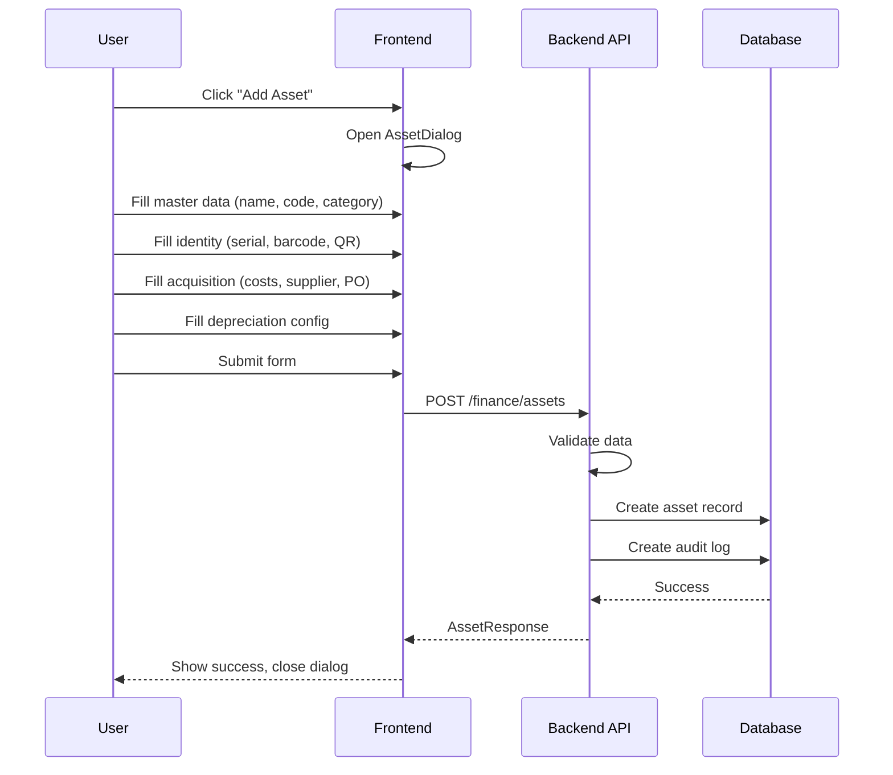
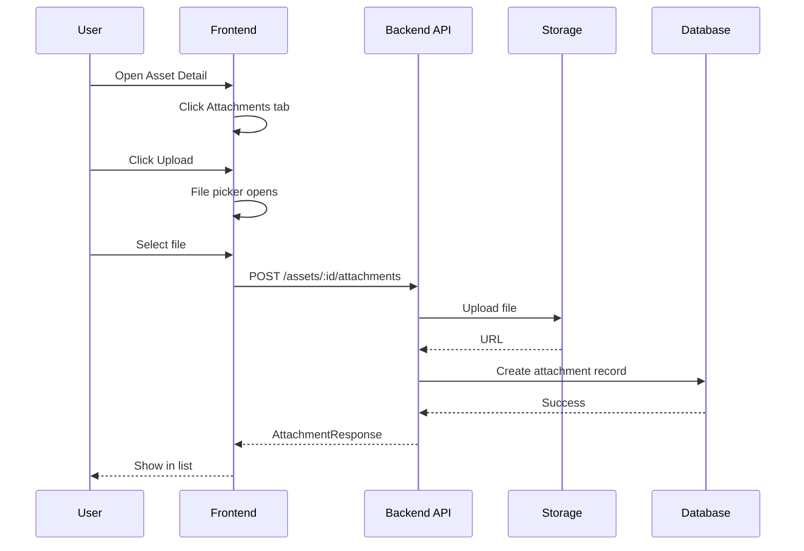
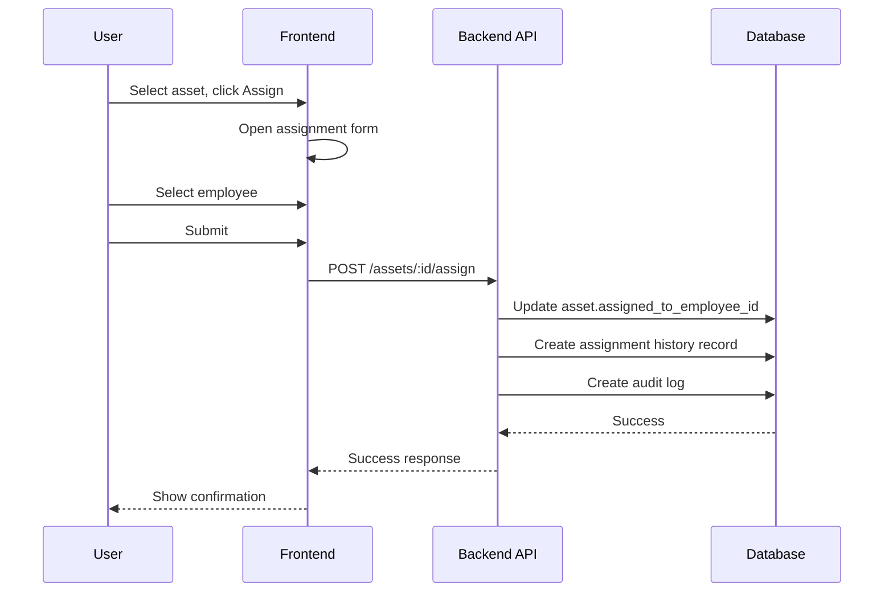

# Finance Assets - Extended Asset Management

> **Module:** Finance - Assets  
> **Sprint:** N/A (Phase Implementation)  
> **Version:** 2.2  
> **Status:** Phase 1 & 2 ✅ Complete (Production Ready)  
> **Last Updated:** March 2026

---

## Table of Contents

1. [Overview](#overview)
2. [Features](#features)
3. [System Architecture](#system-architecture)
4. [Data Models](#data-models)
5. [Business Logic](#business-logic)
6. [API Reference](#api-reference)
7. [Frontend Components](#frontend-components)
8. [User Flows](#user-flows)
9. [Permissions](#permissions)
10. [Integration Points](#integration-points)
11. [Testing Strategy](#testing-strategy)

---

## Overview

The Finance Assets Extended Management module provides comprehensive fixed asset tracking with full lifecycle management, audit trails, file attachments, assignment tracking, and advanced search capabilities.

### Key Features

| Feature                     | Description                                                                       |
| --------------------------- | --------------------------------------------------------------------------------- |
| **Asset Master Data**       | Complete asset identity (serial, barcode, QR code, asset tag)                     |
| **Organization Hierarchy**  | Multi-company, business unit, department, and employee assignment                 |
| **Cost Breakdown**          | Detailed acquisition costs including shipping, installation, tax, and other costs |
| **Depreciation Management** | Multiple methods (SL, DB, SYD, UOP) with category overrides                       |
| **Warranty & Insurance**    | Full warranty tracking and insurance policy management                            |
| **File Attachments**        | Upload and manage invoices, warranties, photos, manuals                           |
| **Audit Trail**             | Complete change history with before/after comparison                              |
| **Assignment Tracking**     | Track asset assignment history to employees                                       |
| **Parent/Child Assets**     | Support for composite assets and components                                       |
| **Advanced Search**         | Complex filters, saved searches, and bulk operations                              |

---

## Features

### 1. Asset Identity Management

Each asset has multiple identifiers for tracking:

| Identifier      | Description                                     |
| --------------- | ----------------------------------------------- |
| `code`          | System-generated unique code (AST-YYYYMM-XXXXX) |
| `serial_number` | Manufacturer serial number                      |
| `barcode`       | Barcode for scanning                            |
| `qr_code`       | QR code URL for quick lookup                    |
| `asset_tag`     | Physical label on the asset                     |

### 2. Organization Hierarchy

| Field                     | Description                 |
| ------------------------- | --------------------------- |
| `company_id`              | Multi-company support       |
| `business_unit_id`        | Business unit ownership     |
| `department_id`           | Department ownership        |
| `assigned_to_employee_id` | Current employee assignment |
| `assignment_date`         | Date of current assignment  |

### 3. Cost Breakdown

| Cost Type           | Description                   |
| ------------------- | ----------------------------- |
| `acquisition_cost`  | Base purchase price           |
| `shipping_cost`     | Delivery/shipping fees        |
| `installation_cost` | Installation/setup fees       |
| `tax_amount`        | Tax/VAT amount                |
| `other_costs`       | Miscellaneous costs           |
| **total_cost**      | Sum of all costs (calculated) |

### 4. Depreciation Configuration

**Depreciation Methods:**

| Method              | Code   | Description              |
| ------------------- | ------ | ------------------------ |
| Straight Line       | `SL`   | Equal amount each period |
| Declining Balance   | `DB`   | Accelerated depreciation |
| Sum of Years Digits | `SYD`  | Accelerated method       |
| Units of Production | `UOP`  | Based on usage           |
| None                | `NONE` | No depreciation          |

**Configuration Hierarchy:**

1. Asset-level config (highest priority)
2. Category-level config (fallback)
3. Company defaults (last resort)

### 5. Lifecycle Stages

| Stage                    | Description                      |
| ------------------------ | -------------------------------- |
| `draft`                  | Initial creation, not yet active |
| `pending_capitalization` | Waiting for approval             |
| `active`                 | In use and depreciating          |
| `in_use`                 | Active but not depreciable       |
| `under_maintenance`      | Temporarily unavailable          |
| `disposed`               | Sold or discarded                |
| `written_off`            | Removed from books               |

### 6. File Attachments

**Supported File Types:**

| Type       | Description         |
| ---------- | ------------------- |
| `invoice`  | Purchase invoices   |
| `warranty` | Warranty documents  |
| `photo`    | Asset photos        |
| `manual`   | User manuals        |
| `other`    | Miscellaneous files |

### 7. Audit Trail

Tracks all changes to asset data:

| Field          | Description                                      |
| -------------- | ------------------------------------------------ |
| `action`       | Type of change (created, updated, deleted, etc.) |
| `changes`      | JSON array of field changes with old/new values  |
| `performed_by` | User who made the change                         |
| `performed_at` | Timestamp of change                              |
| `ip_address`   | IP address for security                          |
| `user_agent`   | Browser/client info                              |

---

## System Architecture

### Backend Structure

```
apps/api/internal/finance/
├── data/
│   ├── models/
│   │   ├── asset.go                      # Extended Asset model
│   │   ├── asset_attachment.go
│   │   ├── asset_audit_log.go
│   │   ├── asset_assignment_history.go
│   │   └── asset_relations.go
│   └── repositories/
│       ├── asset_repository.go
│       ├── asset_attachment_repository.go
│       ├── asset_audit_log_repository.go
│       └── asset_assignment_repository.go
├── domain/
│   ├── dto/
│   │   ├── asset_dto.go
│   │   ├── asset_attachment_dto.go
│   │   ├── asset_audit_log_dto.go
│   │   └── asset_assignment_dto.go
│   ├── mapper/
│   │   ├── asset_mapper.go
│   │   ├── asset_attachment_mapper.go
│   │   ├── asset_audit_log_mapper.go
│   │   └── asset_assignment_mapper.go
│   └── usecase/
│       └── asset_usecase.go              # Extended with 7+ new methods
├── presentation/
│   ├── handler/
│   │   └── asset_handler.go
│   ├── router/
│   │   └── asset_routers.go
│   └── routers.go
└── migrations/
    └── 20260319_extend_fixed_assets_schema.sql
```

### Frontend Structure

```
apps/web/src/features/finance/assets/
├── types/
│   └── index.d.ts                        # Extended TypeScript interfaces
├── i18n/
│   ├── en.ts
│   └── id.ts
├── schemas/
│   └── asset.schema.ts
├── services/
│   └── finance-assets-service.ts
├── hooks/
│   └── use-finance-assets.ts            # 7 new hooks
└── components/
    ├── asset-list.tsx
    ├── asset-detail-modal.tsx           # 9-tab layout
    ├── asset-dialog.tsx
    ├── asset-tabs/
    │   ├── asset-acquisition-tab.tsx
    │   ├── asset-depreciation-config-tab.tsx
    │   ├── asset-components-tab.tsx
    │   ├── asset-attachments-tab.tsx
    │   ├── asset-audit-log-tab.tsx
    │   └── asset-assignment-history-tab.tsx
    ├── forms/
    │   ├── asset-master-data-form.tsx
    │   ├── asset-acquisition-form.tsx
    │   ├── asset-depreciation-config-form.tsx
    │   └── asset-assignment-form.tsx
    └── advanced/
        ├── asset-advanced-search.tsx
        └── asset-bulk-operations.tsx
```

### Database Schema

```
┌─────────────────┐
│  fixed_assets   │
├─────────────────┤
│ id (PK)         │
│ code (unique)   │
│ name            │
│ serial_number   │
│ barcode         │
│ asset_tag       │
│ company_id      │
│ department_id   │
│ employee_id     │
│ supplier_id     │
│ po_id           │
│ invoice_id      │
│ category_id     │
│ location_id     │
│ ... (40+ fields)│
└────────┬────────┘
         │
    ┌────┴────┬────────────┬────────────────┐
    │         │            │                │
    ▼         ▼            ▼                ▼
┌────────┐ ┌──────────┐ ┌────────────────┐ ┌──────────┐
│attach- │ │  audit   │ │  assignment    │ │trans-    │
│ments   │ │  logs    │ │  history       │ │actions   │
└────────┘ └──────────┘ └────────────────┘ └──────────┘
```

---

## Data Models

### Asset

| Field                    | Type          | Description                      |
| ------------------------ | ------------- | -------------------------------- |
| id                       | UUID          | Primary key                      |
| code                     | VARCHAR(50)   | Unique asset code                |
| name                     | VARCHAR(200)  | Asset name                       |
| serial_number            | VARCHAR(100)  | Manufacturer serial              |
| barcode                  | VARCHAR(100)  | Scanning barcode                 |
| asset_tag                | VARCHAR(50)   | Physical label                   |
| company_id               | UUID          | Company ownership                |
| department_id            | UUID          | Department ownership             |
| assigned_to_employee_id  | UUID          | Current assignee                 |
| category_id              | UUID          | Asset category                   |
| location_id              | UUID          | Physical location                |
| supplier_id              | UUID          | Vendor/Supplier                  |
| purchase_order_id        | UUID          | Linked PO                        |
| supplier_invoice_id      | UUID          | Linked invoice                   |
| acquisition_cost         | DECIMAL(15,2) | Base purchase price              |
| shipping_cost            | DECIMAL(15,2) | Delivery cost                    |
| installation_cost        | DECIMAL(15,2) | Setup cost                       |
| tax_amount               | DECIMAL(15,2) | Tax/VAT                          |
| other_costs              | DECIMAL(15,2) | Other fees                       |
| salvage_value            | DECIMAL(15,2) | Residual value                   |
| book_value               | DECIMAL(15,2) | Current book value               |
| accumulated_depreciation | DECIMAL(15,2) | Total depreciation               |
| depreciation_method      | VARCHAR(10)   | SL, DB, SYD, UOP, NONE           |
| useful_life_months       | INTEGER       | Depreciation period              |
| depreciation_start_date  | DATE          | When depreciation starts         |
| status                   | VARCHAR(20)   | active, inactive, sold, disposed |
| lifecycle_stage          | VARCHAR(30)   | draft, active, disposed, etc.    |
| is_capitalized           | BOOLEAN       | In GL?                           |
| is_depreciable           | BOOLEAN       | Can depreciate?                  |
| is_fully_depreciated     | BOOLEAN       | Book value = salvage?            |
| parent_asset_id          | UUID          | Parent asset                     |
| warranty_start           | DATE          | Warranty start                   |
| warranty_end             | DATE          | Warranty end                     |
| insurance_policy_number  | VARCHAR(100)  | Policy number                    |
| insurance_start          | DATE          | Insurance start                  |
| insurance_end            | DATE          | Insurance end                    |

### AssetAttachment

| Field       | Type         | Description                             |
| ----------- | ------------ | --------------------------------------- |
| id          | UUID         | Primary key                             |
| asset_id    | UUID         | Parent asset                            |
| file_name   | VARCHAR(255) | Original filename                       |
| file_path   | VARCHAR(500) | Storage path                            |
| file_url    | VARCHAR(500) | Public URL                              |
| file_type   | ENUM         | invoice, warranty, photo, manual, other |
| file_size   | INTEGER      | Bytes                                   |
| mime_type   | VARCHAR(100) | MIME type                               |
| description | TEXT         | Optional notes                          |
| uploaded_by | UUID         | Uploader                                |
| uploaded_at | TIMESTAMP    | Upload time                             |

### AssetAuditLog

| Field        | Type        | Description                     |
| ------------ | ----------- | ------------------------------- |
| id           | UUID        | Primary key                     |
| asset_id     | UUID        | Target asset                    |
| action       | VARCHAR(50) | created, updated, deleted, etc. |
| changes      | JSONB       | Array of field changes          |
| performed_by | UUID        | Actor                           |
| performed_at | TIMESTAMP   | Action time                     |
| ip_address   | INET        | Source IP                       |
| user_agent   | TEXT        | Client info                     |

### AssetAssignmentHistory

| Field         | Type      | Description        |
| ------------- | --------- | ------------------ |
| id            | UUID      | Primary key        |
| asset_id      | UUID      | Target asset       |
| employee_id   | UUID      | Assigned employee  |
| department_id | UUID      | Department at time |
| location_id   | UUID      | Location at time   |
| assigned_at   | TIMESTAMP | Assignment time    |
| assigned_by   | UUID      | Assigner           |
| returned_at   | TIMESTAMP | Return time        |
| return_reason | TEXT      | Why returned       |

---

## Business Logic

### Total Cost Calculation

```
total_cost = acquisition_cost + shipping_cost + installation_cost + tax_amount + other_costs
```

### Book Value Calculation

```
book_value = total_cost - accumulated_depreciation
```

### Warranty Status

```
is_under_warranty = today >= warranty_start AND today <= warranty_end
warranty_days_remaining = warranty_end - today (if positive)
```

### Depreciation Progress

```
depreciation_progress = (accumulated_depreciation / (total_cost - salvage_value)) * 100
```

### Age Calculation

```
age_in_months = (today - acquisition_date) in months
```

---

## API Reference

### Asset Endpoints

| Method | Endpoint                                | Permission   | Description                         |
| ------ | --------------------------------------- | ------------ | ----------------------------------- |
| GET    | `/api/v1/finance/assets`                | asset.read   | List assets with pagination         |
| GET    | `/api/v1/finance/assets/:id`            | asset.read   | Get asset detail with all relations |
| POST   | `/api/v1/finance/assets`                | asset.create | Create new asset                    |
| PUT    | `/api/v1/finance/assets/:id`            | asset.update | Update asset                        |
| DELETE | `/api/v1/finance/assets/:id`            | asset.delete | Delete asset                        |
| POST   | `/api/v1/finance/assets/:id/depreciate` | asset.update | Run depreciation                    |
| POST   | `/api/v1/finance/assets/:id/transfer`   | asset.update | Transfer location                   |
| POST   | `/api/v1/finance/assets/:id/dispose`    | asset.update | Dispose asset                       |
| POST   | `/api/v1/finance/assets/:id/sell`       | asset.update | Sell asset                          |
| POST   | `/api/v1/finance/assets/:id/revalue`    | asset.update | Revalue asset                       |
| POST   | `/api/v1/finance/assets/:id/adjust`     | asset.update | Adjust value                        |
| POST   | `/api/v1/finance/assets/:id/assign`     | asset.assign | Assign to employee                  |
| POST   | `/api/v1/finance/assets/:id/return`     | asset.assign | Return from employee                |

### Attachment Endpoints

| Method | Endpoint                                               | Permission   | Description       |
| ------ | ------------------------------------------------------ | ------------ | ----------------- |
| GET    | `/api/v1/finance/assets/:id/attachments`               | asset.read   | List attachments  |
| POST   | `/api/v1/finance/assets/:id/attachments`               | asset.update | Upload attachment |
| DELETE | `/api/v1/finance/assets/:id/attachments/:attachmentId` | asset.update | Delete attachment |

### Audit Log Endpoints

| Method | Endpoint                                | Permission | Description     |
| ------ | --------------------------------------- | ---------- | --------------- |
| GET    | `/api/v1/finance/assets/:id/audit-logs` | asset.read | Get audit trail |

### Assignment History Endpoints

| Method | Endpoint                                        | Permission | Description            |
| ------ | ----------------------------------------------- | ---------- | ---------------------- |
| GET    | `/api/v1/finance/assets/:id/assignment-history` | asset.read | Get assignment history |

---

## Frontend Components

### Asset List (`/finance/assets`)

| Component          | File                   | Description                             |
| ------------------ | ---------------------- | --------------------------------------- |
| `AssetList`        | asset-list.tsx         | Paginated table with search and filters |
| `AssetDialog`      | asset-dialog.tsx       | Create/edit asset form                  |
| `AssetDetailModal` | asset-detail-modal.tsx | Full detail with 9 tabs                 |

### Asset Detail Modal

The detail modal uses a tabbed interface with horizontal scrolling:

| Tab                 | Component                    | Description                             |
| ------------------- | ---------------------------- | --------------------------------------- |
| Overview            | Built-in                     | Basic info, identity, values, lifecycle |
| Depreciations       | Built-in                     | Depreciation history table              |
| Transactions        | Built-in                     | Transaction timeline                    |
| Attachments         | Built-in                     | File upload/download                    |
| Assignment History  | Built-in                     | Employee assignment tracking            |
| Audit Log           | Built-in                     | Change history                          |
| Acquisition         | `AssetAcquisitionTab`        | Cost breakdown, supplier info           |
| Depreciation Config | `AssetDepreciationConfigTab` | Override settings                       |
| Components          | `AssetComponentsTab`         | Parent/child relationships              |

### Asset Forms

| Component                     | File                                     | Description                      |
| ----------------------------- | ---------------------------------------- | -------------------------------- |
| `AssetMasterDataForm`         | forms/asset-master-data-form.tsx         | Serial, barcode, QR code         |
| `AssetAcquisitionForm`        | forms/asset-acquisition-form.tsx         | Cost details, supplier dropdowns |
| `AssetDepreciationConfigForm` | forms/asset-depreciation-config-form.tsx | Method, useful life, salvage     |
| `AssetAssignmentForm`         | forms/asset-assignment-form.tsx          | Employee assignment              |

### Hooks (TanStack Query)

| Hook                        | File                  | Description              |
| --------------------------- | --------------------- | ------------------------ |
| `useFinanceAssets`          | use-finance-assets.ts | CRUD operations          |
| `useFinanceAsset`           | use-finance-assets.ts | Get single asset         |
| `useAssetAttachments`       | use-finance-assets.ts | Attachment operations    |
| `useUploadAttachment`       | use-finance-assets.ts | Upload mutation          |
| `useDeleteAttachment`       | use-finance-assets.ts | Delete mutation          |
| `useAssetAuditLogs`         | use-finance-assets.ts | Audit log query          |
| `useAssetAssignmentHistory` | use-finance-assets.ts | Assignment history query |

---

## User Flows

### Asset Creation Flow



### File Attachment Flow



### Asset Assignment Flow



---

## Permissions

| Permission      | Description             |
| --------------- | ----------------------- |
| `asset.read`    | View assets and details |
| `asset.create`  | Create new assets       |
| `asset.update`  | Edit asset data         |
| `asset.delete`  | Delete assets           |
| `asset.approve` | Approve asset changes   |
| `asset.assign`  | Assign/return assets    |
| `asset.export`  | Export asset data       |

---

## Integration Points

### Integration with Purchase Module

- Link to Purchase Orders (`purchase_order_id`)
- Link to Supplier Invoices (`supplier_invoice_id`)
- Supplier reference from Contacts

### Integration with Master Data

- Categories from Asset Categories module
- Locations from Locations module
- Departments from Organization module
- Employees from HRD module

### Integration with Finance

- Journal entries for capitalization
- Depreciation expense posting
- Asset disposal/sale transactions

---

## Testing Strategy

### Unit Tests

- Repository layer tests (CRUD operations)
- Helper method tests (Asset struct methods)
- Mapper tests (DTO conversion)

### Integration Tests

- API endpoint tests
- Database migration tests
- File upload tests

### E2E Tests

- Asset creation flow
- Assignment workflow
- Depreciation calculation
- File upload/download
- Bulk operations

---

## Keputusan Teknis

### 1. Database Schema Extension

**Keputusan:** Extend `fixed_assets` table dengan 26 kolom baru + 3 tabel baru

**Alasan:**

- Menghindari JOIN berlebihan untuk data yang sering diakses
- Maintain referential integrity dengan foreign keys
- Single source of truth untuk asset data

**Trade-off:**

- Tabel menjadi lebih besar (40+ kolom)
- Migration lebih kompleks

### 2. Repository Pattern

**Keputusan:** Separate repository untuk attachments, audit logs, dan assignments

**Alasan:**

- Single Responsibility Principle
- Easier testing dan mocking
- Clear separation of concerns

### 3. Audit Log JSONB Structure

**Keputusan:** Simpan changes sebagai JSONB array: `[{field, old_value, new_value}]`

**Alasan:**

- Flexible schema (tidak perlu migration untuk field baru)
- Queryable dengan PostgreSQL JSON operators
- Compact storage

### 4. Tab-based Detail Modal

**Keputusan:** Gunakan horizontal scrollable tabs untuk 9 tab

**Alasan:**

- Semua informasi accessible tanpa nesting
- User tidak perlu navigate away
- Horizontal scroll dengan hidden scrollbar untuk clean UI

### 5. Depreciation Config Override

**Keputusan:** Asset-level config override category defaults

**Alasan:**

- Fleksibilitas untuk edge cases
- Backward compatible (fallback ke category)
- Support asset-specific depreciation needs

---

## Notes & Improvements

### Phase 1 & 2 Complete ✅

**Database:**

- ✅ 26 kolom baru di `fixed_assets`
- ✅ 3 tabel baru (attachments, audit logs, assignments)
- ✅ Indexes untuk performance
- ✅ Migration file

**Backend:**

- ✅ Extended models dengan helper methods
- ✅ Repository layer untuk semua entities
- ✅ DTOs dan mappers
- ✅ Usecase dengan 7+ new methods
- ✅ Handler dan router updates

**Frontend:**

- ✅ TypeScript interfaces (40+ fields)
- ✅ i18n translations (EN & ID)
- ✅ 6 new tab components
- ✅ 4 new form components
- ✅ Advanced search & bulk operations UI
- ✅ File upload/download
- ✅ Horizontal scrollable tabs

### Phase 3 Planned ⏳

- [ ] Barcode/QR scanner integration
- [ ] Bulk import/export (CSV/Excel)
- [ ] Advanced search filters
- [ ] Asset hierarchy tree view

### Phase 4 Planned ⏳

- [ ] Approval workflow
- [ ] Status transitions
- [ ] Assignment automation

### Phase 5 Planned ⏳

- [ ] Asset register report
- [ ] Depreciation schedule report
- [ ] Warranty expiry report
- [ ] Dashboard cards

---

## Appendix

### Error Codes

| Code                       | Description                       |
| -------------------------- | --------------------------------- |
| `ASSET_NOT_FOUND`          | Asset ID tidak ditemukan          |
| `ASSET_CODE_EXISTS`        | Kode asset sudah digunakan        |
| `ASSET_INVALID_STATUS`     | Status transition tidak valid     |
| `ASSET_DEPRECIATION_ERROR` | Error dalam kalkulasi depresiasi  |
| `ATTACHMENT_NOT_FOUND`     | File attachment tidak ditemukan   |
| `ATTACHMENT_UPLOAD_FAILED` | Gagal upload file                 |
| `ASSIGNMENT_EXISTS`        | Asset sudah di-assign ke employee |

### Asset Code Format

```
Format: AST-{YYYYMM}-{RUNNING_NUMBER}
Contoh: AST-202603-00001
```

---

_Document generated for GIMS Platform - Finance Assets Extended Implementation (Phase 1 & 2 Complete)_
