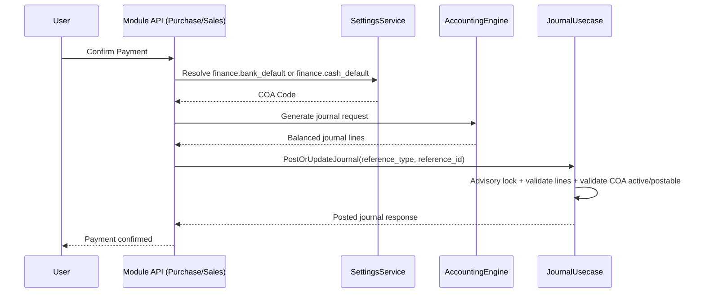
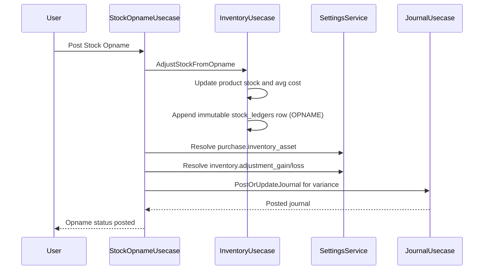

# Finance - Journal Engine, Moving Average, and Cross-Module Mapping Refactor

> **Module:** Finance + Inventory + Purchase + Sales + Stock Opname
> **Sprint:** 10-12 (continuation, hardening phase)
> **Version:** 2.0.0
> **Status:** In Review (implemented in code, validation ongoing)
> **Last Updated:** April 2026

---

## Table of Contents

1. [Overview](#overview)
2. [Features](#features)
3. [System Architecture](#system-architecture)
4. [Data Models](#data-models)
5. [Business Logic](#business-logic)
6. [API Reference](#api-reference)
7. [Frontend Components](#frontend-components)
8. [User Flows](#user-flows)
9. [Permissions](#permissions)
10. [Integration Points](#integration-points)
11. [Testing Strategy](#testing-strategy)
12. [Keputusan Teknis](#keputusan-teknis)
13. [Notes and Improvements](#notes-and-improvements)
14. [Appendix A - Mapping Keys](#appendix-a---mapping-keys)
15. [Appendix B - Complete Changed Files Inventory](#appendix-b---complete-changed-files-inventory)

---

## Overview

This document covers the active refactor set for finance-accounting consistency, inventory valuation hardening, and cross-module journal integrity.

The implementation scope combines:

- COA behavior hardening (postability hierarchy, opening balance governance, validation)
- Journal posting hardening (postable and active checks, advisory lock for idempotency, stronger line validation)
- Weighted moving average inventory tracking with immutable stock ledger trail
- Mandatory configurable account mapping via `system_account_mappings` (hardcoded COA fallback removed in key modules)
- Cross-module dependency wiring so Purchase, Sales, and Stock Opname resolve accounting mappings through one settings service
- Seeder hardening for mapping integrity and validation checkpoints

### Key Outcome Summary

| Area | Outcome |
|---|---|
| Account configurability | Automatic journals no longer rely on hardcoded default COA in payment and stock-opname flows |
| Journal consistency | Posting path uses stronger validation and lock-based idempotency safeguards |
| Inventory valuation | Moving average trail is persisted per stock transaction in immutable ledger rows |
| Cross-module behavior | Purchase, Sales, Stock Opname, and Asset flows integrated through centralized finance posting primitives |
| Data integrity | Seeder validation includes required system mapping checks and postable-account constraints |

---

## Features

### 1. System Account Mapping as First-Class Configuration

- Added/standardized canonical keys in system mapping model
- Added `SettingsService.GetCOAByKey(ctx, key)` for mapping resolution
- Added composite uniqueness by `key + company_id` for multi-company support
- Repository supports company-specific lookup with global fallback (`company_id IS NULL`)

### 2. Hardcoded COA Removal in Critical Posting Flows

Refactored target usecases to resolve accounts from mapping keys:

- Purchase Payment: `finance.bank_default` or `finance.cash_default`
- Sales Payment: `finance.bank_default` or `finance.cash_default`
- Stock Opname: `purchase.inventory_asset`, `inventory.adjustment_gain`, `inventory.adjustment_loss`

### 3. Journal Validation and Posting Hardening

- Posting now enforces account `is_postable = true` and `is_active = true`
- Warning log added for abnormal debit/credit side against normal account type behavior
- Advisory lock (`pg_advisory_xact_lock`) used in idempotent posting path and manual post path when reference exists
- `PostOrUpdateJournal` strengthened to validate lines and account eligibility during both create and update branches

### 4. Inventory Moving Average with Immutable Ledger

- New `stock_ledgers` model/table added
- New helper to calculate weighted moving average cost
- Ledger rows are appended for stock-changing events (`GR`, `GI`, `OPNAME`)
- Product aggregate values (`current_stock`, `current_hpp`) stay synchronized with ledger trail

### 5. Asset Journal Path Centralization

- Asset journal creation now routes through `JournalEntryUsecase.PostOrUpdateJournal`
- Eliminates direct journal-header/line persistence bypass pattern
- Reuses idempotent and validated posting path used by other modules

---

## System Architecture

### Backend Structure (Touched Areas)

```text
apps/api/internal/
├── finance/
│   ├── data/models/
│   │   ├── chart_of_account.go
│   │   ├── journal_entry.go
│   │   └── system_account_mapping.go
│   ├── data/repositories/
│   │   ├── chart_of_account_repository.go
│   │   └── system_account_mapping_repository.go
│   ├── domain/
│   │   ├── accounting/accounting_engine.go
│   │   ├── financesettings/settings_service.go
│   │   ├── usecase/
│   │   │   ├── chart_of_account_usecase.go
│   │   │   ├── journal_entry_usecase.go
│   │   │   └── asset_usecase.go
│   │   └── dto/mapper updates
│   └── presentation/routes.go
├── inventory/
│   ├── data/models/stock_ledger.go
│   └── domain/usecase/inventory_usecase.go
├── purchase/domain/usecase/purchase_payment_usecase.go
├── sales/domain/usecase/sales_payment_usecase.go
├── stock_opname/domain/usecase/stock_opname_usecase.go
└── core/infrastructure/database/migrate.go
```

### Wiring and Dependency Injection

- Finance settings service now receives optional `SystemAccountMappingRepository`
- Finance route registration exports `SettingsUC` and accounting engine to downstream modules
- Main app bootstrap wires `SettingsUC` into Sales, Purchase, and Stock Opname route dependencies

---

## Data Models

### 1. Chart of Account Enhancements

| Field | Type | Purpose |
|---|---|---|
| `is_postable` | bool | Enforces leaf-account-only posting |
| `is_protected` | bool | Protects critical accounts from unsafe mutation |
| `opening_balance` | decimal | Starting balance configuration |
| `opening_date` | date | Opening balance effective date |

### 2. Journal Entry Enhancements

| Field | Type | Purpose |
|---|---|---|
| `journal_type` | enum | Distinguishes `GENERAL` and `OPENING_BALANCE` |
| `reference_type + reference_id` | unique composite | Idempotent posting identity for source document |
| `is_system_generated` | bool | Governance boundary manual vs system-generated |
| `source` / `is_valuation` / `valuation_run_id` | metadata | Traceability for valuation-generated journals |

### 3. System Account Mapping

| Field | Type | Purpose |
|---|---|---|
| `key` | varchar | Mapping key, for example `sales.revenue` |
| `company_id` | uuid nullable | Company-specific override (nullable global default) |
| `coa_code` | varchar | COA code target |
| Unique index | `(key, company_id)` | Multi-company safe uniqueness |

### 4. Stock Ledger (New)

| Field | Type | Purpose |
|---|---|---|
| `product_id` | uuid | Ledger ownership |
| `transaction_id` | string | Source document/transaction linkage |
| `transaction_type` | string | `GR`, `GI`, `OPNAME` |
| `qty` | decimal | Signed quantity delta |
| `unit_cost` | decimal | Unit cost used at event |
| `average_cost` | decimal | Running average after event |
| `stock_value` | decimal | Running stock valuation |
| `running_qty` | decimal | Running quantity after event |
| `created_at` | timestamp | Immutable chronology |

---

## Business Logic

### 1. Weighted Moving Average Formula

For incoming inventory:

- `new_average_cost = ((current_qty * current_avg_cost) + (incoming_qty * incoming_unit_cost)) / (current_qty + incoming_qty)`

For outbound inventory:

- Outbound uses current average as issue cost
- Average cost is preserved unless quantity reaches reset edge-case behavior defined by existing flow

### 2. Posting Validation Rules

- Journal lines must be at least two rows
- Each line must be one-sided (debit xor credit)
- Total debit must equal total credit (rounded tolerance check)
- Posting blocked for non-postable or inactive accounts
- Closed accounting period posting is blocked
- Advisory lock prevents concurrent duplicate upsert/post for same reference

### 3. Mapping-First Resolution Rules

Resolution priority in accounting engine:

1. Try system mapping key (including legacy-key translation alias)
2. If unresolved, fallback to legacy finance settings key

This ensures backward compatibility while shifting default behavior to mapping-based configuration.

### 4. Stock Opname Accounting Rule

- Positive variance: Debit Inventory Asset, Credit Inventory Gain
- Negative variance: Debit Inventory Loss, Credit Inventory Asset
- All accounts resolved from mapping keys, not hardcoded code literals

### 5. Payment Journal Default Account Rule

If payment bank account has no direct COA binding:

- Bank method -> `finance.bank_default`
- Cash method -> `finance.cash_default`

If mapping missing, usecase returns descriptive configuration error and blocks posting.

---

## API Reference

No brand-new public module was introduced in this refactor, but accounting behavior changed in existing endpoints below.

| Method | Endpoint | Permission | Change Impact |
|---|---|---|---|
| GET/POST/PUT/DELETE | `/api/v1/finance/chart-of-accounts` | `coa.read/create/update/delete` | COA hierarchy and opening-balance related validations are stricter |
| POST | `/api/v1/finance/journal-entries/:id/post` | `journal.post` | Added stronger postability/active checks and advisory lock when reference exists |
| POST | `/api/v1/finance/assets/transactions/:tx_id/approve` | `asset.update` | Asset transaction journal now posted through centralized `PostOrUpdateJournal` path |
| POST | `/api/v1/purchase/payments/:id/confirm` | `purchase_payment.confirm` | Payment journal default account now mapping-driven (`finance.bank_default/cash_default`) |
| POST | `/api/v1/sales/payments/:id/confirm` | `sales_payment.confirm` | Payment journal default account now mapping-driven (`finance.bank_default/cash_default`) |
| POST | `/api/v1/stock-opnames/:id/status` | authenticated + scope middleware | Stock opname posting resolves inventory/gain/loss COA by mapping keys |

---

## Frontend Components

This change set is backend-focused.

- No frontend component changes were introduced in the current scope.
- Existing frontend forms continue using existing APIs; behavior differences are in validation outcomes and posting side effects.

---

## User Flows

### 1. Purchase/Sales Payment Posting with Mapping Resolution



### 2. Stock Opname Posting and Inventory Ledger Update



---

## Permissions

| Permission | Area | Notes |
|---|---|---|
| `coa.read`, `coa.create`, `coa.update`, `coa.delete` | Finance COA | Existing permissions, behavior hardened |
| `journal.post` | Finance Journal | Existing endpoint with stricter validation |
| `asset.update` | Finance Asset | Required for asset transaction approval that triggers posting |
| `purchase_payment.confirm` | Purchase Payment | Triggers mapping-based journal posting |
| `sales_payment.confirm` | Sales Payment | Triggers mapping-based journal posting |
| Auth + Scope middleware | Stock Opname | Router currently relies on auth/scope group middleware |

---

## Integration Points

| Source Module | Integration Target | Mechanism |
|---|---|---|
| Purchase Payment | Finance Journal | Accounting engine + PostOrUpdateJournal |
| Sales Payment | Finance Journal | Accounting engine + PostOrUpdateJournal |
| Stock Opname | Finance Journal | Direct journal request posted with mapping-resolved accounts |
| Asset Transaction | Finance Journal | Refactored to centralized PostOrUpdateJournal |
| Inventory | Finance Valuation Trace | Immutable stock ledger rows + updated current average |
| Main bootstrap | Cross-module DI | `SettingsUC` injected into Sales/Purchase/Stock Opname |

---

## Testing Strategy

### Automated Tests Added/Updated

| Test File | Focus |
|---|---|
| `apps/api/internal/finance/domain/financesettings/settings_service_test.go` | `GetCOAByKey` success and missing-key error behavior |
| `apps/api/internal/finance/domain/usecase/cash_bank_journal_restriction_test.go` | Interface compatibility update for settings service mock |
| `apps/api/internal/finance/domain/usecase/journal_entry_usecase_test.go` | Journal hardening behavior coverage (existing suite extended) |
| `apps/api/internal/finance/domain/usecase/journal_entry_integration_test.go` | Integration behavior for posting/idempotency (existing suite) |
| `apps/api/internal/finance/domain/usecase/chart_of_account_usecase_test.go` | COA behavior and opening-balance lifecycle checks |

### Verified Commands (Latest Snapshot)

- `go test ./internal/finance/...` -> pass
- `go test ./internal/purchase/...` -> pass

### Known Environment Gap

- Some module-wide runs in this environment are blocked by external image dependency constraints (`go-webp` build tags), which can mask full package verification for unrelated modules.

---

## Keputusan Teknis

### 1. Mapping-First Account Resolution

- Decision: Resolve COA codes from `system_account_mappings` before legacy settings.
- Alasan: Account ownership must be configurable and auditable without code edits.
- Trade-off: Requires mapping seeding/admin governance to avoid runtime misconfiguration.

### 2. Composite Unique Key for Mapping (`key`, `company_id`)

- Decision: Multi-company aware uniqueness at DB level.
- Alasan: Same key can exist globally and be overridden per company.
- Trade-off: Slightly more complex upsert query logic.

### 3. Immutable Stock Ledger for Moving Average Traceability

- Decision: Append-only ledger entries for each stock-changing event.
- Alasan: Auditability and reproducible valuation trail.
- Trade-off: Additional write volume and storage growth.

### 4. Centralized Journal Posting Through PostOrUpdateJournal

- Decision: Asset and cross-module postings use one idempotent posting primitive.
- Alasan: Prevents inconsistent validation and duplicate posting behavior across modules.
- Trade-off: Requires consistent reference_type/reference_id discipline from all callers.

### 5. Warn-Only for Abnormal Side by Account Type

- Decision: Keep type-side mismatch as warning log, not hard fail.
- Alasan: Some edge accounting adjustments may still be valid with proper authorization.
- Trade-off: Operational monitoring must actively review warnings.

---

## Notes and Improvements

### Completed in This Scope

- Mapping-driven default account resolution for payment and stock-opname posting
- Advisory lock and stronger validation in journal posting paths
- New stock ledger model and moving average write trail
- Asset posting routed to centralized idempotent posting path
- Seeder validation expanded for required mapping and postable checks

### Recommended Next Improvements

1. Add integration tests for `stock_ledgers` value correctness across mixed `GR/GI/OPNAME` sequences.
2. Add API endpoint for managing `system_account_mappings` per company with permission guard and audit log.
3. Add observability dashboard for journal warning logs (abnormal posting side).
4. Add migration verification check to ensure old unique index is dropped safely in all environments.

---

## Appendix A - Mapping Keys

| Key | Default Seeder COA |
|---|---|
| `purchase.inventory_asset` | `1-1310` |
| `purchase.gr_ir_clearing` | `1-1440` |
| `purchase.tax_input` | `1-1420` |
| `purchase.accounts_payable` | `2-1100` |
| `sales.accounts_receivable` | `1-1210` |
| `sales.revenue` | `4-1100` |
| `sales.tax_output` | `2-1210` |
| `sales.cogs` | `5-1000` |
| `sales.sales_return` | `4-1200` |
| `inventory.adjustment_gain` | `4-2400` |
| `inventory.adjustment_loss` | `5-2100` |
| `asset.accumulated_depreciation` | `1-2241` |
| `asset.depreciation_expense` | `6-2430` |
| `finance.opening_balance_equity` | `3-9999` |
| `finance.bank_default` | `1-1111` |
| `finance.cash_default` | `1-1101` |
| `payroll.salary_expense` | `6-2100` |
| `payroll.allowance_expense` | `6-2110` |
| `payroll.payable_salary` | `2-1300` |
| `payroll.tax_pph21` | `2-1220` |

---

## Appendix B - Complete Changed Files Inventory

The following list reflects the current active working-set changes captured at documentation time.

### Core and App Wiring

- `apps/api/cmd/api/main.go`
- `apps/api/cmd/tools/audit_fixer/main.go`
- `apps/api/internal/core/infrastructure/database/migrate.go`

### Finance Models, Repository, Engine, and Usecases

- `apps/api/internal/finance/data/models/chart_of_account.go`
- `apps/api/internal/finance/data/models/journal_entry.go`
- `apps/api/internal/finance/data/models/system_account_mapping.go`
- `apps/api/internal/finance/data/repositories/chart_of_account_repository.go`
- `apps/api/internal/finance/data/repositories/system_account_mapping_repository.go`
- `apps/api/internal/finance/domain/accounting/accounting_engine.go`
- `apps/api/internal/finance/domain/dto/chart_of_account_dto.go`
- `apps/api/internal/finance/domain/dto/journal_entry_dto.go`
- `apps/api/internal/finance/domain/financesettings/settings_service.go`
- `apps/api/internal/finance/domain/mapper/chart_of_account_mapper.go`
- `apps/api/internal/finance/domain/mapper/journal_entry_mapper.go`
- `apps/api/internal/finance/domain/usecase/asset_usecase.go`
- `apps/api/internal/finance/domain/usecase/chart_of_account_usecase.go`
- `apps/api/internal/finance/domain/usecase/journal_entry_usecase.go`
- `apps/api/internal/finance/presentation/routes.go`

### Inventory, Purchase, Sales, Stock Opname

- `apps/api/internal/inventory/domain/usecase/inventory_usecase.go`
- `apps/api/internal/inventory/data/models/stock_ledger.go` (new)
- `apps/api/internal/purchase/domain/usecase/purchase_payment_usecase.go`
- `apps/api/internal/purchase/presentation/routes.go`
- `apps/api/internal/sales/domain/usecase/sales_payment_usecase.go`
- `apps/api/internal/sales/presentation/routers.go`
- `apps/api/internal/stock_opname/domain/usecase/stock_opname_usecase.go`
- `apps/api/internal/stock_opname/presentation/routers.go`

### Seeders

- `apps/api/seeders/bank_account_seeder.go`
- `apps/api/seeders/chart_of_accounts_seeder.go`
- `apps/api/seeders/finance_settings_seeder.go`
- `apps/api/seeders/finance_sprint12_seeder.go`
- `apps/api/seeders/integration_flow_seeder.go`
- `apps/api/seeders/journal_reconciliation_seeder.go`
- `apps/api/seeders/purchase_finance_e2e_seeder.go`
- `apps/api/seeders/sales_finance_e2e_seeder.go`
- `apps/api/seeders/sales_integration_flow_seeder.go`
- `apps/api/seeders/seed_all.go`
- `apps/api/seeders/system_account_mapping_seeder.go`
- `apps/api/seeders/validation_seeder.go`

### Tests

- `apps/api/internal/finance/domain/financesettings/settings_service_test.go` (new)
- `apps/api/internal/finance/domain/usecase/cash_bank_journal_restriction_test.go`
- `apps/api/internal/finance/domain/usecase/journal_entry_integration_test.go`
- `apps/api/internal/finance/domain/usecase/journal_entry_usecase_test.go`
- `apps/api/internal/finance/domain/usecase/chart_of_account_usecase_test.go` (new)
