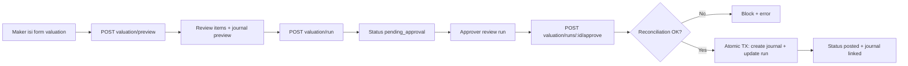

# Journal Valuation

Fitur untuk menjalankan valuasi periodik berbasis data aktual (inventory, FX, depreciation), menyiapkan preview jurnal, lalu memproses approval dan posting secara atomik agar siap audit.

## Fitur Utama
- Preview valuasi per item sebelum run disubmit.
- Workflow status: draft -> pending_approval -> approved -> posted.
- Detail audit granular di tabel valuation_run_details.
- Integrasi posting jurnal via AccountingEngine dan posting profile.
- Mapping COA sepenuhnya dari finance_settings.
- Pemisahan gain dan loss ke akun berbeda.
- Reconciliation check sebelum posting inventory valuation.
- Traceability dua arah antara valuation run dan journal entry.

## Business Rules
- Tidak ada hardcode COA dan nominal; semua mapping akun melalui finance_settings.
- Run valuation menyimpan detail item dan menunggu approval sebelum posting.
- Approve hanya boleh untuk run status pending_approval atau approved.
- Inventory reconciliation wajib lolos: saldo GL inventory asset = subledger inventory.
- Jika tidak ada delta, run ditandai no_difference tanpa posting jurnal.
- Posting jurnal valuation dan update valuation run dilakukan dalam satu transaksi database.

## Keputusan Teknis
- Menggunakan strategy pattern untuk perhitungan valuation agar extensible ke valuation type baru.
- Strategy menghasilkan ValuationResult itemized, bukan langsung jurnal, agar separation of concern jelas.
- Jurnal dibentuk dari hasil valuation melalui AccountingEngine + posting profile, bukan dari strategy.
- Menyimpan valuation_run_details untuk audit trail granular dan drilldown UI.
- Validasi concurrency menggunakan lock status run per type-periode.

## Flow Diagram

## API Endpoints

| Method | Endpoint | Permission | Description |
|--------|----------|------------|-------------|
| POST | /api/v1/finance/journal-entries/valuation/preview | journal_valuation.run | Preview hasil valuation + journal preview |
| POST | /api/v1/finance/journal-entries/valuation/run | journal_valuation.run | Submit run valuation menjadi pending approval |
| POST | /api/v1/finance/journal-entries/valuation/runs/:id/approve | journal_valuation.approve | Approve dan post valuation secara atomik |
| GET | /api/v1/finance/journal-entries/valuation/runs | journal_valuation.read | List run history |
| GET | /api/v1/finance/journal-entries/valuation/runs/:id | journal_valuation.read | Detail run + item breakdown |

## Accounting Mapping

| Valuation Type | Direction | Posting Profile | Finance Settings Keys |
|---------------|-----------|-----------------|-----------------------|
| inventory | gain | ProfileInventoryValuation | coa.inventory_asset, coa.inventory_gain |
| inventory | loss | ProfileInventoryValuationLoss | coa.inventory_loss, coa.inventory_asset |
| fx | gain | ProfileFXValuation | coa.fx_remeasurement, coa.fx_gain |
| fx | loss | ProfileFXValuationLoss | coa.fx_loss, coa.fx_remeasurement |
| depreciation | gain | ProfileDepreciationGain | coa.depreciation_accumulated, coa.depreciation_gain |
| depreciation | loss | ProfileDepreciation | coa.depreciation_expense, coa.depreciation_accumulated |

## User Journey
1. Maker buka Finance -> Journal Valuation.
2. Maker pilih valuation type dan periode, lalu klik Preview.
3. Sistem menampilkan item breakdown, total delta, dan journal preview.
4. Maker submit run, status menjadi pending_approval.
5. Approver membuka run history, cek detail item dan total.
6. Approver klik Approve untuk posting.
7. Sistem validasi reconciliation (inventory), lalu posting jurnal dan mengaitkan journal_entry_id.
8. Auditor dapat telusuri valuation_run -> valuation_run_details -> journal_entry.

## Struktur Data Baru
- valuation_runs: status workflow, total delta, link ke journal.
- valuation_run_details: detail item per reference/product untuk audit trail.

## Manual Testing
1. Login user maker dengan permission journal_valuation.run.
2. Buka halaman valuation, isi type dan period, klik Preview.
3. Pastikan item dan jurnal preview muncul.
4. Klik Submit Run, pastikan run masuk pending_approval.
5. Login user approver dengan permission journal_valuation.approve.
6. Buka run history, klik Approve pada run pending.
7. Pastikan status posted dan link jurnal tersedia.
8. Verifikasi journal entry berisi reference_type valuation dengan reference_id run.

## Automated Testing
- Disarankan menambah unit test untuk:
  - Strategy per valuation type.
  - Preview journal generation per gain/loss.
  - Reconciliation validation.
  - Atomic transaction rollback saat create journal gagal.

## Notes dan Improvement
- FX valuation akan menghasilkan data hanya jika tabel exchange_rates tersedia.
- Tolerance reconciliation dapat diatur lewat finance_settings key valuation.reconciliation_tolerance.
- Dapat ditambah endpoint reject untuk workflow approval yang lebih lengkap.
