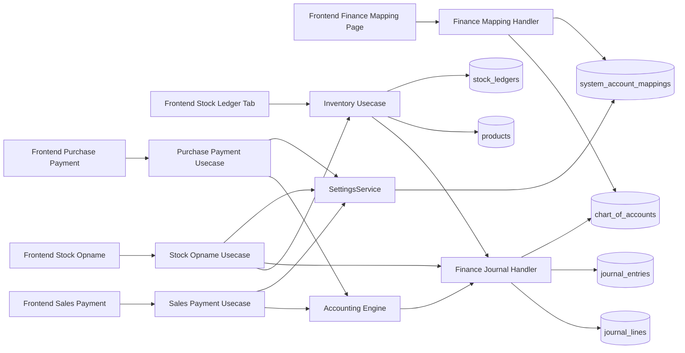
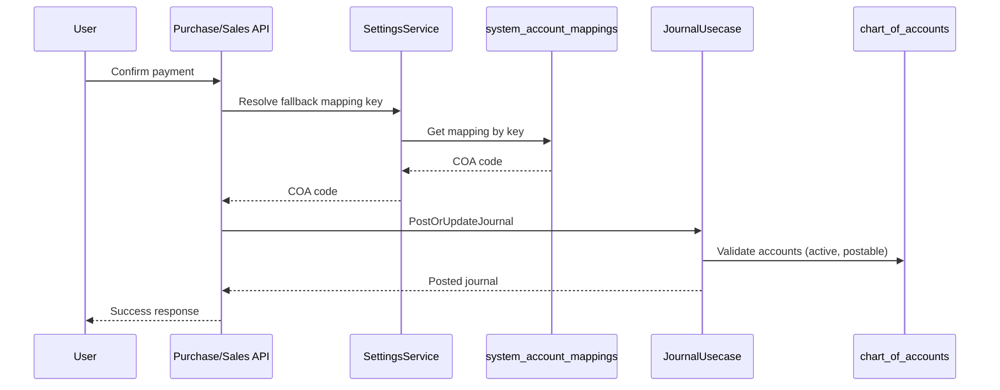
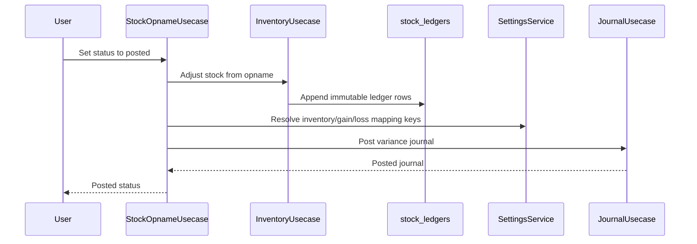

# Module Relationship Diagram

> **Module:** Finance, Inventory, Purchase, Sales, Stock Opname
> **Sprint:** 10-12 (hardening continuation)
> **Version:** 1.0.0
> **Status:** Complete
> **Last Updated:** April 2026

## Overview

This document describes module interactions and data ownership for the four core entities affected by the refactor:
- `journal_entries`
- `system_account_mappings`
- `stock_ledgers`
- `chart_of_accounts`

## References

- Error code catalog: [docs/api-standart/api-error-codes.md](../../api-standart/api-error-codes.md)
- Mapping API routes: [apps/api/internal/finance/presentation/router/system_account_mapping_routers.go](../../../apps/api/internal/finance/presentation/router/system_account_mapping_routers.go)
- Inventory ledger endpoint: [apps/api/internal/inventory/presentation/handler/inventory_handler.go](../../../apps/api/internal/inventory/presentation/handler/inventory_handler.go)
- Frontend mapping UI: [apps/web/src/features/finance/settings/components/accounting-mapping-form.tsx](../../../apps/web/src/features/finance/settings/components/accounting-mapping-form.tsx)

## High-Level Interaction Diagram

## Ownership Matrix

| Entity | Primary Owner | Writers | Readers | Notes |
|---|---|---|---|---|
| `chart_of_accounts` | Finance | COA usecase, seeders | Finance, Purchase, Sales, Inventory | posting constrained by `is_postable` and `is_active` |
| `system_account_mappings` | Finance | Mapping handler/usecase, seeders | Finance settings service, posting modules | supports global and company-scoped rows |
| `journal_entries` | Finance | Journal usecase, engine callers | Reports, payment flows, opname | idempotent by reference and lock-assisted posting |
| `stock_ledgers` | Inventory | Inventory usecase only | Inventory APIs, stock UI | append-only valuation trail |

## Read/Write Ownership by Module

| Module | Reads COA | Writes COA | Reads Mapping | Writes Mapping | Writes Journal | Writes Stock Ledger |
|---|---|---|---|---|---|---|
| Finance | Yes | Yes | Yes | Yes | Yes | No |
| Purchase | Yes | No | Yes via settings service | No | Yes via finance journal flow | No |
| Sales | Yes | No | Yes via settings service | No | Yes via finance journal flow | No |
| Stock Opname | Yes | No | Yes via settings service | No | Yes via finance journal flow | No |
| Inventory | Yes | No | No direct | No | Yes via trigger path | Yes |

## Sequence: Payment Confirmation with Mapping Fallback

## Sequence: Stock Opname Posting

## Error Propagation Map

| Source Layer | Example Condition | Code |
|---|---|---|
| Mapping usecase | mapped account is parent/non-postable | `ACCOUNT_NOT_POSTABLE` |
| Mapping usecase | mapped account is inactive | `ACCOUNT_INACTIVE` |
| Journal posting | closed period | `PERIOD_CLOSED` |
| Journal posting | concurrent lock/serialization | `CONCURRENT_LOCK_CONFLICT` |
| Mapping resolution | key missing | `MAPPING_NOT_CONFIGURED` |
| Request validation | invalid query/uuid/body | `VALIDATION_ERROR` |

## Notes

- Mapping write authority is centralized in Finance module.
- Journal writes can be initiated from multiple modules, but they all converge into finance journal usecase primitives.
- Stock ledger writes are intentionally restricted to inventory usecase for audit consistency.
