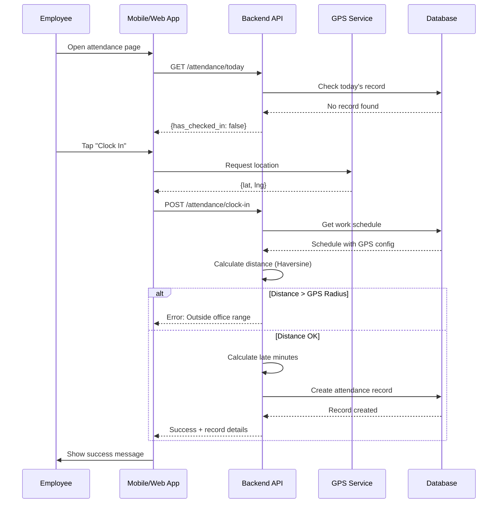
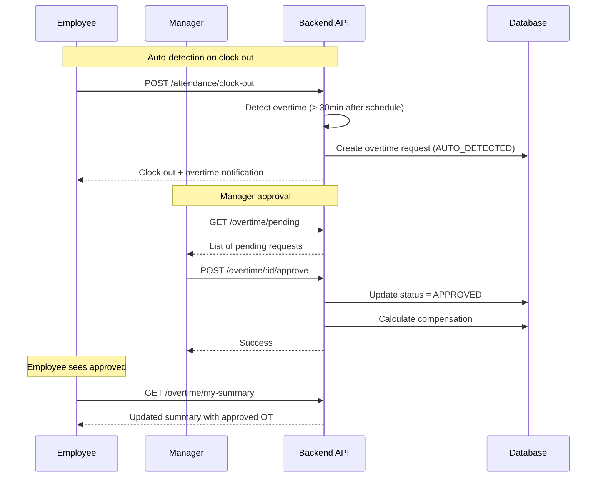
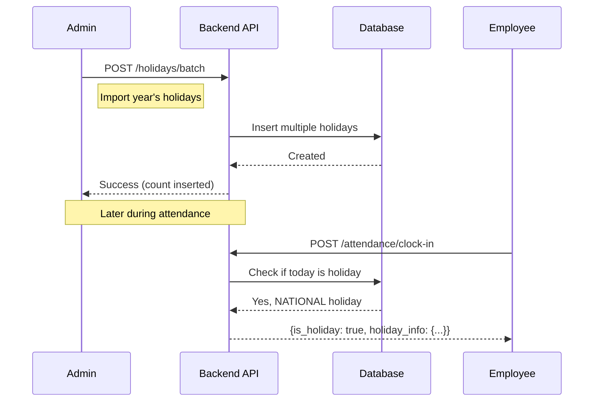

# HRD - Attendance Management

> **Module:** HRD (Human Resource Development)  
> **Sprint:** 13  
> **Version:** 1.0.0  
> **Status:** ✅ Complete (API + Frontend)  
> **Last Updated:** January 2026

---

## Table of Contents

1. [Overview](#overview)
2. [Features](#features)
3. [System Architecture](#system-architecture)
4. [Data Models](#data-models)
5. [Business Logic](#business-logic)
6. [API Reference](#api-reference)
7. [Frontend Components](#frontend-components)
8. [User Flows](#user-flows)
9. [Permissions](#permissions)
10. [Configuration](#configuration)
10. [Integration Points](#integration-points)

---

## Overview

The HRD Attendance Management module provides comprehensive attendance tracking for employees, including:

- **Clock In/Out** with GPS validation
- **Work Schedule** management with flexible hours support
- **Holiday** management with calendar view
- **Overtime** tracking with approval workflow
- **Monthly Statistics** and reporting

### Key Features

| Feature | Description |
|---------|-------------|
| GPS-Based Attendance | Validates employee location during clock in/out |
| Flexible Schedules | Supports flexible working hours per division |
| Auto Overtime Detection | Automatically creates overtime requests when working beyond schedule |
| Multi-Type Holidays | Supports National, Collective, and Company holidays |
| Real-time Statistics | Monthly attendance statistics with various metrics |

---

## Features

### 1. Attendance Record

Employee attendance tracking with support for multiple check-in types:

| Check-In Type | Description |
|---------------|-------------|
| `NORMAL` | Regular office attendance (GPS validated) |
| `WFH` | Work from Home (no GPS validation) |
| `FIELD_WORK` | Field work/client visit (GPS logged but not validated against office) |

#### Attendance Status

| Status | Description |
|--------|-------------|
| `PRESENT` | On-time attendance |
| `LATE` | Arrived after schedule start + tolerance |
| `ABSENT` | No attendance record for working day |
| `HALF_DAY` | Partial day attendance |
| `LEAVE` | On approved leave |
| `WFH` | Working from home |
| `OFF_DAY` | Non-working day based on schedule |
| `HOLIDAY` | Public/company holiday |

### 2. Work Schedule

Configurable work schedules with support for:

- **Fixed Hours**: Standard 9-to-5 schedule
- **Flexible Hours**: Flexible start/end times within a range
- **GPS Validation**: Configurable office location and radius
- **Working Days**: Bitmask-based day selection
- **Late/Early Tolerance**: Grace period for lateness

#### Working Days Bitmask

| Day | Value | Example |
|-----|-------|---------|
| Monday | 1 | |
| Tuesday | 2 | |
| Wednesday | 4 | |
| Thursday | 8 | |
| Friday | 16 | |
| Saturday | 32 | |
| Sunday | 64 | |
| **Mon-Fri** | **31** | 1+2+4+8+16 |
| **Mon-Sat** | **63** | 1+2+4+8+16+32 |
| **All Days** | **127** | 1+2+4+8+16+32+64 |

### 3. Holiday Management

Support for three types of holidays:

| Type | Description |
|------|-------------|
| `NATIONAL` | Government-mandated public holidays |
| `COLLECTIVE` | Company-wide collective leave (Cuti Bersama) |
| `COMPANY` | Company-specific holidays |

#### Special Flags

- **Is Collective Leave**: Marks as collective leave day
- **Cuts Annual Leave**: Deducts from employee's annual leave quota
- **Is Recurring**: Repeats annually (e.g., New Year)

### 4. Overtime Management

Comprehensive overtime tracking with approval workflow:

| Request Type | Description |
|--------------|-------------|
| `AUTO_DETECTED` | System-generated when clock out exceeds schedule |
| `MANUAL_CLAIM` | Employee-submitted overtime request |
| `PRE_APPROVED` | Pre-approved overtime (planned) |

#### Approval Status

| Status | Description |
|--------|-------------|
| `PENDING` | Awaiting approval |
| `APPROVED` | Approved by manager |
| `REJECTED` | Rejected by manager |
| `CANCELED` | Canceled by employee |

#### Overtime Rates

| Condition | Rate |
|-----------|------|
| Weekday | 1.5x |
| Weekend | 2.0x |
| Holiday | 2.0x |

---

## System Architecture

### Backend Structure

```
apps/api/internal/hrd/
├── data/
│   ├── models/
│   │   ├── attendance_record.go
│   │   ├── work_schedule.go
│   │   ├── holiday.go
│   │   └── overtime_request.go
│   └── repositories/
│       ├── attendance_record_repository.go
│       ├── work_schedule_repository.go
│       ├── holiday_repository.go
│       └── overtime_request_repository.go
├── domain/
│   ├── dto/
│   │   ├── attendance_record_dto.go
│   │   ├── work_schedule_dto.go
│   │   ├── holiday_dto.go
│   │   └── overtime_request_dto.go
│   ├── mapper/
│   │   ├── attendance_record_mapper.go
│   │   ├── work_schedule_mapper.go
│   │   ├── holiday_mapper.go
│   │   └── overtime_request_mapper.go
│   └── usecase/
│       ├── attendance_record_usecase.go
│       ├── work_schedule_usecase.go
│       ├── holiday_usecase.go
│       └── overtime_request_usecase.go
└── presentation/
    ├── handler/
    │   ├── attendance_record_handler.go
    │   ├── work_schedule_handler.go
    │   ├── holiday_handler.go
    │   └── overtime_request_handler.go
    ├── router/
    │   ├── attendance_record_router.go
    │   ├── work_schedule_router.go
    │   ├── holiday_router.go
    │   └── overtime_request_router.go
    └── routers.go
```

### Frontend Structure

```
apps/web/src/features/hrd/
├── attendance-records/
│   ├── types/index.d.ts
│   ├── schemas/attendance.schema.ts
│   ├── services/attendance-record-service.ts
│   ├── hooks/
│   │   ├── use-attendance-records.ts
│   │   ├── use-attendance-calendar.ts
│   │   └── use-geolocation.ts
│   └── components/
│       ├── attendance-record-form.tsx
│       ├── attendance-record-list.tsx
│       ├── attendance-calendar.tsx
│       ├── attendance-day-view.tsx
│       ├── attendance-event-detail.tsx
│       └── index.ts
├── work-schedules/
│   ├── types/index.d.ts
│   ├── schemas/work-schedule.schema.ts
│   ├── services/work-schedule-service.ts
│   ├── hooks/use-work-schedules.ts
│   └── components/
│       ├── work-schedule-list.tsx
│       ├── work-schedule-dialog.tsx
│       ├── work-schedule-page-client.tsx
│       └── index.ts
├── holidays/
│   ├── types/index.d.ts
│   ├── schemas/holiday.schema.ts
│   ├── services/holiday-service.ts
│   ├── hooks/use-holidays.ts
│   └── components/
│       ├── holiday-list.tsx
│       ├── holiday-dialog.tsx
│       ├── holiday-calendar-view.tsx
│       ├── holiday-page-client.tsx
│       └── index.ts
├── overtime/
│   ├── types/index.d.ts
│   ├── schemas/overtime.schema.ts
│   ├── services/overtime-service.ts
│   ├── hooks/use-overtime.ts
│   └── components/
│       ├── overtime-list.tsx
│       ├── overtime-dialog.tsx
│       ├── overtime-approval-dialog.tsx
│       ├── overtime-page-client.tsx
│       └── index.ts
└── i18n/
    ├── en.ts
    └── id.ts
```

### Frontend Pages

```
apps/web/app/[locale]/(dashboard)/hrd/
├── page.tsx                     # HRD Dashboard
├── loading.tsx                  # Loading skeleton
├── hrd-dashboard-client.tsx     # Dashboard client component
├── work-schedules/
│   ├── page.tsx
│   └── loading.tsx
├── holidays/
│   ├── page.tsx
│   └── loading.tsx
└── overtime/
    ├── page.tsx
    └── loading.tsx
```

---

## Data Models

### AttendanceRecord

| Field | Type | Description |
|-------|------|-------------|
| id | UUID | Primary key |
| employee_id | UUID | Employee reference |
| date | DATE | Attendance date |
| check_in_time | TIME | Clock in time |
| check_in_type | ENUM | NORMAL, WFH, FIELD_WORK |
| check_in_latitude | FLOAT | GPS latitude at clock in |
| check_in_longitude | FLOAT | GPS longitude at clock in |
| check_in_address | STRING | Resolved address |
| check_in_note | STRING | Optional note |
| check_out_time | TIME | Clock out time |
| check_out_latitude | FLOAT | GPS latitude at clock out |
| check_out_longitude | FLOAT | GPS longitude at clock out |
| check_out_address | STRING | Resolved address |
| check_out_note | STRING | Optional note |
| status | ENUM | Attendance status |
| working_minutes | INT | Total working time |
| overtime_minutes | INT | Overtime worked |
| late_minutes | INT | Minutes late |
| early_leave_minutes | INT | Minutes left early |
| work_schedule_id | UUID | Applied schedule |
| is_manual_entry | BOOL | Manual entry flag |
| manual_entry_reason | STRING | Reason for manual entry |
| approved_by | UUID | Admin who approved |

### WorkSchedule

| Field | Type | Description |
|-------|------|-------------|
| id | UUID | Primary key |
| name | STRING | Schedule name |
| description | STRING | Description |
| division_id | UUID | Optional division link |
| is_default | BOOL | Default schedule flag |
| is_active | BOOL | Active status |
| start_time | TIME | Work start time |
| end_time | TIME | Work end time |
| is_flexible | BOOL | Flexible hours flag |
| flexible_start_time | TIME | Earliest start |
| flexible_end_time | TIME | Latest start |
| break_start_time | TIME | Break start |
| break_end_time | TIME | Break end |
| break_duration | INT | Break in minutes |
| working_days | INT | Bitmask for days |
| working_hours_per_day | FLOAT | Expected hours |
| late_tolerance_minutes | INT | Grace period |
| early_leave_tolerance_minutes | INT | Early leave grace |
| require_gps | BOOL | GPS validation |
| gps_radius_meter | FLOAT | Allowed radius |
| office_latitude | FLOAT | Office location |
| office_longitude | FLOAT | Office location |

### Holiday

| Field | Type | Description |
|-------|------|-------------|
| id | UUID | Primary key |
| date | DATE | Holiday date |
| name | STRING | Holiday name |
| description | STRING | Description |
| type | ENUM | NATIONAL, COLLECTIVE, COMPANY |
| year | INT | Year (extracted) |
| is_collective_leave | BOOL | Collective leave flag |
| cuts_annual_leave | BOOL | Deducts from quota |
| is_recurring | BOOL | Annual recurrence |
| is_active | BOOL | Active status |

### OvertimeRequest

| Field | Type | Description |
|-------|------|-------------|
| id | UUID | Primary key |
| employee_id | UUID | Employee reference |
| date | DATE | Overtime date |
| request_type | ENUM | AUTO_DETECTED, MANUAL_CLAIM, PRE_APPROVED |
| start_time | TIME | Start time |
| end_time | TIME | End time |
| planned_minutes | INT | Requested minutes |
| actual_minutes | INT | Actual worked |
| approved_minutes | INT | Approved minutes |
| reason | STRING | Request reason |
| description | STRING | Detailed description |
| task_details | STRING | Tasks performed |
| status | ENUM | PENDING, APPROVED, REJECTED, CANCELED |
| approved_by | UUID | Approver |
| approved_at | TIMESTAMP | Approval time |
| rejected_by | UUID | Rejecter |
| rejected_at | TIMESTAMP | Rejection time |
| reject_reason | STRING | Rejection reason |
| attendance_record_id | UUID | Linked attendance |
| overtime_rate | FLOAT | Rate multiplier |
| compensation_amount | FLOAT | Calculated compensation |

---

## Business Logic

### GPS Validation (Haversine Formula)

The system uses the Haversine formula to calculate the distance between the employee's GPS coordinates and the office location:

```go
func haversineDistance(lat1, lon1, lat2, lon2 float64) float64 {
    const R = 6371000 // Earth's radius in meters
    
    φ1 := lat1 * math.Pi / 180
    φ2 := lat2 * math.Pi / 180
    Δφ := (lat2 - lat1) * math.Pi / 180
    Δλ := (lon2 - lon1) * math.Pi / 180
    
    a := math.Sin(Δφ/2)*math.Sin(Δφ/2) +
         math.Cos(φ1)*math.Cos(φ2)*
         math.Sin(Δλ/2)*math.Sin(Δλ/2)
    
    c := 2 * math.Atan2(math.Sqrt(a), math.Sqrt(1-a))
    
    return R * c // Distance in meters
}
```

### Late Calculation

```
late_minutes = max(0, check_in_time - (schedule_start_time + late_tolerance_minutes))
```

### Overtime Auto-Detection

When an employee clocks out:

```
if check_out_time > schedule_end_time + 30_minutes_buffer:
    overtime_minutes = check_out_time - schedule_end_time
    create_overtime_request(type=AUTO_DETECTED, minutes=overtime_minutes)
```

### Working Hours Calculation

```
working_minutes = check_out_time - check_in_time - break_duration
```

---

## API Reference

### Attendance Endpoints

#### Self-Service (Authenticated User)

| Method | Endpoint | Description |
|--------|----------|-------------|
| GET | `/api/v1/hrd/attendance/today` | Get today's attendance status |
| POST | `/api/v1/hrd/attendance/clock-in` | Clock in |
| POST | `/api/v1/hrd/attendance/clock-out` | Clock out |
| GET | `/api/v1/hrd/attendance/my-stats` | Get monthly statistics |

#### Admin (Permission Required)

| Method | Endpoint | Permission | Description |
|--------|----------|------------|-------------|
| GET | `/api/v1/hrd/attendance` | attendance.read | List all records |
| GET | `/api/v1/hrd/attendance/:id` | attendance.read | Get by ID |
| POST | `/api/v1/hrd/attendance/manual` | attendance.create | Manual entry |
| PUT | `/api/v1/hrd/attendance/:id` | attendance.update | Update record |
| DELETE | `/api/v1/hrd/attendance/:id` | attendance.delete | Delete record |

### Work Schedule Endpoints

| Method | Endpoint | Permission | Description |
|--------|----------|------------|-------------|
| GET | `/api/v1/hrd/work-schedules` | work_schedule.read | List schedules |
| GET | `/api/v1/hrd/work-schedules/default` | work_schedule.read | Get default |
| GET | `/api/v1/hrd/work-schedules/:id` | work_schedule.read | Get by ID |
| POST | `/api/v1/hrd/work-schedules` | work_schedule.create | Create |
| PUT | `/api/v1/hrd/work-schedules/:id` | work_schedule.update | Update |
| DELETE | `/api/v1/hrd/work-schedules/:id` | work_schedule.delete | Delete |
| POST | `/api/v1/hrd/work-schedules/:id/set-default` | work_schedule.update | Set default |

### Holiday Endpoints

| Method | Endpoint | Permission | Description |
|--------|----------|------------|-------------|
| GET | `/api/v1/hrd/holidays` | holiday.read | List holidays |
| GET | `/api/v1/hrd/holidays/check` | holiday.read | Check date |
| GET | `/api/v1/hrd/holidays/year/:year` | holiday.read | Get by year |
| GET | `/api/v1/hrd/holidays/calendar/:year` | holiday.read | Calendar view |
| GET | `/api/v1/hrd/holidays/:id` | holiday.read | Get by ID |
| POST | `/api/v1/hrd/holidays` | holiday.create | Create |
| POST | `/api/v1/hrd/holidays/batch` | holiday.create | Batch create |
| PUT | `/api/v1/hrd/holidays/:id` | holiday.update | Update |
| DELETE | `/api/v1/hrd/holidays/:id` | holiday.delete | Delete |

### Overtime Endpoints

#### Self-Service

| Method | Endpoint | Description |
|--------|----------|-------------|
| POST | `/api/v1/hrd/overtime` | Submit request |
| GET | `/api/v1/hrd/overtime/my-summary` | Get own summary |
| POST | `/api/v1/hrd/overtime/:id/cancel` | Cancel request |

#### Manager/Admin

| Method | Endpoint | Permission | Description |
|--------|----------|------------|-------------|
| GET | `/api/v1/hrd/overtime/pending` | overtime.approve | Get pending |
| POST | `/api/v1/hrd/overtime/:id/approve` | overtime.approve | Approve |
| POST | `/api/v1/hrd/overtime/:id/reject` | overtime.approve | Reject |
| GET | `/api/v1/hrd/overtime` | overtime.read | List all |
| GET | `/api/v1/hrd/overtime/:id` | overtime.read | Get by ID |
| PUT | `/api/v1/hrd/overtime/:id` | overtime.update | Update |
| DELETE | `/api/v1/hrd/overtime/:id` | overtime.delete | Delete |
| GET | `/api/v1/hrd/overtime/notifications` | overtime.approve | Polling |

---

## Frontend Components

### HRD Dashboard (`/hrd`)

The main HRD dashboard provides an overview of attendance statistics:

| Component | Description |
|-----------|-------------|
| `hrd-dashboard-client.tsx` | Main dashboard with stats cards |
| Quick access cards to Work Schedules, Holidays, Overtime |
| Module navigation with permission guards |

**Features:**
- Overview statistics (employees, schedules, holidays, overtime)
- Quick navigation tiles to sub-modules
- Permission-based visibility

### Work Schedules (`/hrd/work-schedules`)

| Component | File | Description |
|-----------|------|-------------|
| `WorkScheduleList` | work-schedule-list.tsx | Paginated table with CRUD actions |
| `WorkScheduleDialog` | work-schedule-dialog.tsx | Create/Edit form dialog |
| `WorkSchedulePageClient` | work-schedule-page-client.tsx | Page wrapper with animations |

**Features:**
- List all work schedules with pagination
- Create new schedule with flexible hours configuration
- Working days bitmask selector (Mon-Sun checkboxes)
- GPS location and radius configuration
- Break time settings
- Late/Early tolerance configuration
- Set default schedule action

### Holidays (`/hrd/holidays`)

| Component | File | Description |
|-----------|------|-------------|
| `HolidayList` | holiday-list.tsx | Paginated table with year filter |
| `HolidayDialog` | holiday-dialog.tsx | Create/Edit holiday form |
| `HolidayCalendarView` | holiday-calendar-view.tsx | Full year calendar visualization |
| `HolidayPageClient` | holiday-page-client.tsx | Page wrapper with tab navigation |

**Features:**
- List view with year filter and type badges
- Calendar view showing all holidays in a year grid
- Create single holiday
- Batch import holidays (JSON/CSV)
- Holiday type selection (National, Collective, Company)
- Recurring holiday flag
- Collective leave and annual leave deduction flags

### Overtime (`/hrd/overtime`)

| Component | File | Description |
|-----------|------|-------------|
| `OvertimeList` | overtime-list.tsx | Paginated table with status filter |
| `OvertimeDialog` | overtime-dialog.tsx | Submit overtime request form |
| `OvertimeApprovalDialog` | overtime-approval-dialog.tsx | Approve/Reject dialog |
| `OvertimePageClient` | overtime-page-client.tsx | Page wrapper with animations |

**Features:**
- List all overtime requests with status badges
- Submit manual overtime request
- Approval workflow with approved minutes adjustment
- Rejection with reason
- Request type indicators (Auto-detected, Manual, Pre-approved)
- Status filtering (Pending, Approved, Rejected, Canceled)

### Attendance Records (Shared Components)

| Component | File | Description |
|-----------|------|-------------|
| `AttendanceRecordForm` | attendance-record-form.tsx | Manual entry form |
| `AttendanceRecordList` | attendance-record-list.tsx | Paginated records table |
| `AttendanceCalendar` | attendance-calendar.tsx | Monthly calendar view |
| `AttendanceDayView` | attendance-day-view.tsx | Single day details |
| `AttendanceEventDetail` | attendance-event-detail.tsx | Event popup/modal |

**Features:**
- Monthly calendar with attendance events
- Day view with check-in/out times
- Status badges (Present, Late, Absent, WFH, Holiday, etc.)
- GPS coordinates display
- Manual entry form for admins
- Date range filtering

### Hooks (TanStack Query)

| Hook | File | Description |
|------|------|-------------|
| `useAttendanceRecords` | use-attendance-records.ts | CRUD operations + stats |
| `useAttendanceCalendar` | use-attendance-calendar.ts | Calendar data fetching |
| `useGeolocation` | use-geolocation.ts | Browser GPS access |
| `useWorkSchedules` | use-work-schedules.ts | Schedule CRUD |
| `useHolidays` | use-holidays.ts | Holiday CRUD + calendar |
| `useOvertime` | use-overtime.ts | Overtime CRUD + approval |

### i18n Translations

Translations are available in:
- `hrd.dashboard` - Dashboard labels
- `hrd.modules` - Module names
- `hrd.workSchedule` - Work schedule form labels
- `hrd.holiday` - Holiday form labels
- `hrd.overtime` - Overtime form labels
- `hrd.attendance` - Attendance common labels

---

## User Flows

### Employee Clock In Flow



### Overtime Approval Flow



### Holiday Calendar Flow



---

## Permissions

### Required Permissions

| Module | Permission | Description |
|--------|------------|-------------|
| Attendance | `attendance.read` | View attendance records |
| Attendance | `attendance.create` | Create manual entries |
| Attendance | `attendance.update` | Update records |
| Attendance | `attendance.delete` | Delete records |
| Work Schedule | `work_schedule.read` | View schedules |
| Work Schedule | `work_schedule.create` | Create schedules |
| Work Schedule | `work_schedule.update` | Update schedules |
| Work Schedule | `work_schedule.delete` | Delete schedules |
| Holiday | `holiday.read` | View holidays |
| Holiday | `holiday.create` | Create holidays |
| Holiday | `holiday.update` | Update holidays |
| Holiday | `holiday.delete` | Delete holidays |
| Overtime | `overtime.read` | View overtime requests |
| Overtime | `overtime.approve` | Approve/reject requests |
| Overtime | `overtime.update` | Update requests |
| Overtime | `overtime.delete` | Delete requests |

### Self-Service Permissions

Authenticated employees can always:
- View their own today's attendance
- Clock in/out
- View their own monthly stats
- Submit overtime requests
- Cancel their own pending overtime requests

---

## Configuration

### Work Schedule Configuration

| Setting | Type | Default | Description |
|---------|------|---------|-------------|
| `late_tolerance_minutes` | INT | 15 | Grace period for late arrival |
| `early_leave_tolerance_minutes` | INT | 10 | Grace period for early departure |
| `require_gps` | BOOL | true | Enable GPS validation |
| `gps_radius_meter` | FLOAT | 100 | Allowed distance from office |
| `working_hours_per_day` | FLOAT | 8 | Standard working hours |
| `break_duration` | INT | 60 | Break time in minutes |

### Default Schedules (Seeder)

```
Standard Office Hours:
- Start: 08:00
- End: 17:00
- Break: 12:00 - 13:00
- Working Days: Mon-Fri (31)
- Late Tolerance: 15 min
- GPS Required: Yes
- GPS Radius: 100m

Flexible Hours:
- Start: 08:00
- End: 17:00
- Flexible Start: 07:00 - 10:00
- Flexible End: 16:00 - 19:00
- Is Flexible: Yes
```

---

## Integration Points

### Integration with Leave Module (Sprint 14)

- Check leave status before marking absent
- Link attendance record to leave request
- Update attendance status to `LEAVE` when on approved leave

### Integration with Payroll (Future)

- Overtime compensation calculation
- Late deductions
- Attendance-based allowances

### Integration with Notifications

- Clock in/out reminders
- Late arrival notifications to manager
- Overtime approval notifications
- Holiday announcements

---

## Appendix

### Indonesia National Holidays 2024-2025 (Seeded)

| Date | Name | Type |
|------|------|------|
| 2024-01-01 | Tahun Baru | NATIONAL |
| 2024-02-08 | Isra Mi'raj | NATIONAL |
| 2024-02-10 | Tahun Baru Imlek | NATIONAL |
| 2024-03-11 | Hari Raya Nyepi | NATIONAL |
| 2024-03-29 | Wafat Isa Almasih | NATIONAL |
| 2024-04-10 | Hari Raya Idul Fitri | NATIONAL |
| 2024-04-11 | Hari Raya Idul Fitri | NATIONAL |
| 2024-05-01 | Hari Buruh | NATIONAL |
| 2024-05-09 | Kenaikan Isa Almasih | NATIONAL |
| 2024-05-23 | Hari Raya Waisak | NATIONAL |
| 2024-06-01 | Hari Lahir Pancasila | NATIONAL |
| 2024-06-17 | Hari Raya Idul Adha | NATIONAL |
| 2024-07-07 | Tahun Baru Islam | NATIONAL |
| 2024-08-17 | Hari Kemerdekaan | NATIONAL |
| 2024-09-16 | Maulid Nabi Muhammad | NATIONAL |
| 2024-12-25 | Hari Natal | NATIONAL |

### Error Codes

| Code | Description |
|------|-------------|
| `ATTENDANCE_ALREADY_CLOCKED_IN` | Already clocked in today |
| `ATTENDANCE_NOT_CLOCKED_IN` | Cannot clock out without clock in |
| `ATTENDANCE_ALREADY_CLOCKED_OUT` | Already clocked out today |
| `ATTENDANCE_GPS_OUT_OF_RANGE` | Outside allowed GPS radius |
| `ATTENDANCE_NOT_WORKING_DAY` | Today is not a working day |
| `ATTENDANCE_HOLIDAY` | Today is a holiday |
| `OVERTIME_ALREADY_EXISTS` | Overtime request exists for date |
| `OVERTIME_CANNOT_CANCEL` | Cannot cancel non-pending request |
| `OVERTIME_INVALID_STATUS` | Invalid status transition |

---

*Document generated for GIMS Platform - Sprint 13: HRD Attendance*
