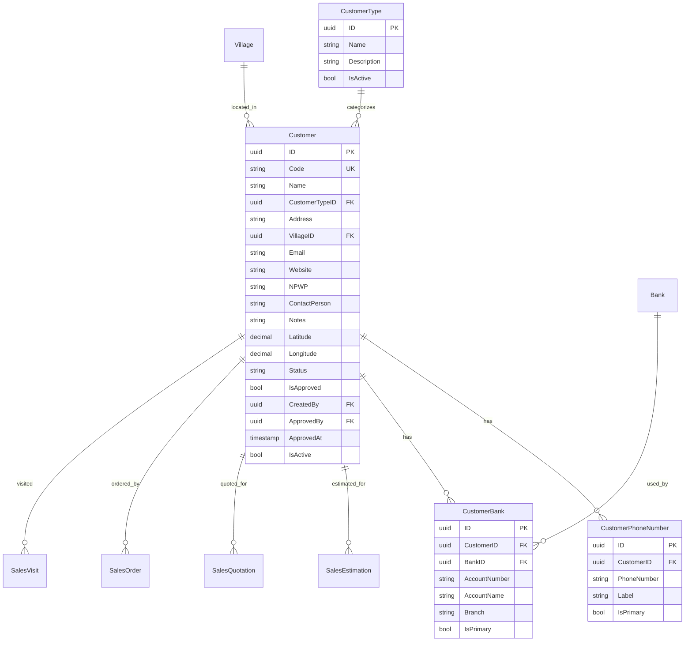

# Master Data - Customer

## Sprint: Customer Master Data & Sales Integration

> **Prerequisite:** Sprint 4 (Supplier & Product), Sprint 5-7 (Sales Module)  
> **Reference:** [erp-database-relations.mmd](../erp-database-relations.mmd), [erp-sprint-planning.md](../erp-sprint-planning.md)

---

## Ringkasan Singkat Fitur

Fitur **Customer Master Data** menambahkan entitas master Customer yang terkelola ke dalam sistem ERP. Saat ini seluruh data customer di modul Sales (Estimation, Quotation, Order, Invoice, Delivery) disimpan sebagai **snapshot string** yang diketik manual tanpa referensi ke master data. Perubahan ini akan:

1. Membuat tabel `Customer` beserta relasi `CustomerPhoneNumber` dan `CustomerBank` (mengikuti pola Supplier)
2. Menambahkan **peta lokasi** dengan `Latitude`/`Longitude` + alamat geografis (`VillageID`)
3. Menambahkan **CustomerID** (FK) di seluruh dokumen Sales, sehingga data customer di-select dari master data
4. Tetap mempertahankan **customer snapshot fields** untuk audit trail / historical record
5. Menyediakan **Customer approval workflow** sebelum customer dapat digunakan di transaksi

**Business Value:**
- Data customer konsisten dan terpusat di satu tempat
- Menghindari duplikasi dan inkonsistensi data customer antar dokumen
- Memungkinkan analisis penjualan per customer (reporting)
- Mempermudah sales rep memilih customer saat membuat dokumen
- Lokasi customer (map) berguna untuk planning sales visit dan delivery

---

## Fitur Utama

- CRUD Customer dengan approval workflow (draft → pending → approved → rejected)
- Customer Type (kategori customer: Hospital, Clinic, Pharmacy, Distributor, dll.)
- Nested phone numbers (multiple per customer, dengan label & primary flag)
- Nested bank accounts (multiple per customer)
- Lokasi geografis (VillageID cascade: Country → Province → City → District → Village)
- Map coordinates (Latitude, Longitude) untuk peta interaktif
- NPWP, Contact Person, Email, Website fields
- Customer code auto-generation
- Integrasi ke seluruh Sales modul (Estimation, Quotation, Order, Visit, Delivery)
- GetFormData endpoint untuk dropdown customer di form sales
- Customer search dan filter (by type, status, area, name)

---

## Business Rules

- Customer **wajib di-approve** sebelum dapat digunakan di transaksi Sales
- Customer yang sudah digunakan di transaksi **tidak boleh dihapus** (soft delete)
- Saat membuat Sales Estimation/Quotation/Order, user **memilih customer dari master data** → snapshot fields otomatis terisi dari data customer
- Snapshot fields (`customer_name`, `customer_contact`, `customer_phone`, `customer_email`) tetap disimpan di dokumen sales untuk **audit trail** (data pada saat transaksi dibuat)
- User masih bisa **override snapshot fields** jika contact person berbeda untuk transaksi tertentu
- Customer dapat memiliki multiple phone numbers dan bank accounts
- Customer Code harus unique, auto-generated dengan prefix `CUST-`
- Delivery Order `ReceiverName`/`ReceiverPhone`/`DeliveryAddress` tetap editable karena penerima bisa berbeda dari customer
- Sales Visit mengganti `CompanyID` menjadi `CustomerID`

---

## Keputusan Teknis

- **Mengapa mengikuti pola Supplier**: Customer dan Supplier adalah entitas bisnis yang serupa (company/organization dengan alamat, phones, banks). Menggunakan pola yang sama menjaga konsistensi arsitektur dan mempercepat development.

- **Mengapa tetap mempertahankan snapshot fields**: Data customer bisa berubah (rename, pindah alamat, ganti contact). Dokumen sales harus mencatat data **pada saat transaksi dibuat** untuk audit dan legal compliance. Trade-off: sedikit data redundan, tapi penting untuk bisnis.

- **Mengapa CustomerID nullable di dokumen sales lama**: Untuk backward compatibility. Data sales yang sudah ada (seeded/existing) tidak memiliki CustomerID. Migration harus aman tanpa merusak data existing.

- **Mengapa Customer terpisah dari Company**: Company di modul Organization adalah entitas internal (perusahaan sendiri). Customer adalah entitas eksternal yang membeli dari kita. Meskipun SalesVisit saat ini menggunakan CompanyID, secara domain ini seharusnya Customer.

---

## Struktur Database

### Table Relations (Mermaid)



### Model Fields Detail (Go GORM)

#### Customer
| Field | Type | GORM Tag | Description |
|-------|------|----------|-------------|
| ID | string | `type:uuid;primary_key;default:gen_random_uuid()` | Primary key |
| Code | string | `type:varchar(50);uniqueIndex` | Auto-generated: `CUST-XXXXX` |
| Name | string | `type:varchar(200);not null;index` | Customer/company name |
| CustomerTypeID | *string | `type:uuid;index` | FK to CustomerType |
| Address | string | `type:text` | Street address |
| VillageID | *string | `type:uuid;index` | FK to Village (geographic) |
| Email | string | `type:varchar(100)` | Email address |
| Website | string | `type:varchar(200)` | Website URL |
| NPWP | string | `type:varchar(30)` | Tax ID number |
| ContactPerson | string | `type:varchar(100)` | Primary contact name |
| Notes | string | `type:text` | Additional notes |
| Latitude | *float64 | `type:decimal(10,8)` | Map latitude |
| Longitude | *float64 | `type:decimal(11,8)` | Map longitude |
| Status | CustomerStatus | `type:varchar(20);default:'draft';index` | draft/pending/approved/rejected |
| IsApproved | bool | `default:false;index` | Quick filter flag |
| CreatedBy | *string | `type:uuid` | Creator employee ID |
| ApprovedBy | *string | `type:uuid` | Approver employee ID |
| ApprovedAt | *time.Time | - | Approval timestamp |
| IsActive | bool | `default:true;index` | Soft active flag |

#### CustomerPhoneNumber
| Field | Type | Description |
|-------|------|-------------|
| ID | string | UUID primary key |
| CustomerID | string | FK to Customer (not null) |
| PhoneNumber | string | Phone number value |
| Label | string | Office/Mobile/Fax/WhatsApp |
| IsPrimary | bool | Primary phone flag |

#### CustomerBank
| Field | Type | Description |
|-------|------|-------------|
| ID | string | UUID primary key |
| CustomerID | string | FK to Customer (not null) |
| BankID | *string | FK to Bank |
| AccountNumber | string | Bank account number |
| AccountName | string | Account holder name |
| Branch | string | Bank branch name |
| IsPrimary | bool | Primary bank flag |

#### CustomerType
| Field | Type | Description |
|-------|------|-------------|
| ID | string | UUID primary key |
| Name | string | Type name (unique) |
| Description | string | Type description |
| IsActive | bool | Active flag |

---

## Perubahan di Sales Models

### Sales Estimation — Tambah CustomerID FK
```go
// Sebelum: CustomerID *string (ada tapi tidak ada relasi GORM)
// Sesudah: CustomerID dengan relasi ke Customer model
CustomerID      *string          `gorm:"type:uuid;index" json:"customer_id"`
Customer        *Customer        `gorm:"foreignKey:CustomerID" json:"customer,omitempty"`
// Snapshot fields tetap dipertahankan
CustomerName    string           `gorm:"type:varchar(255)" json:"customer_name"`
CustomerContact string           `gorm:"type:varchar(255)" json:"customer_contact"`
CustomerPhone   string           `gorm:"type:varchar(50)" json:"customer_phone"`
CustomerEmail   string           `gorm:"type:varchar(255)" json:"customer_email"`
```

### Sales Quotation — Tambah CustomerID FK
```go
// Tambah field baru
CustomerID      *string          `gorm:"type:uuid;index" json:"customer_id"`
Customer        *Customer        `gorm:"foreignKey:CustomerID" json:"customer,omitempty"`
// Snapshot fields tetap ada (sudah existing)
CustomerName    string           `gorm:"type:varchar(255)" json:"customer_name"`
// ... CustomerContact, CustomerPhone, CustomerEmail tetap
```

### Sales Order — Tambah CustomerID FK
```go
// Tambah field baru
CustomerID      *string          `gorm:"type:uuid;index" json:"customer_id"`
Customer        *Customer        `gorm:"foreignKey:CustomerID" json:"customer,omitempty"`
// Snapshot fields tetap ada (sudah existing)
```

### Sales Visit — Ganti CompanyID menjadi CustomerID
```go
// Sebelum:
CompanyID *string `gorm:"type:uuid;index" json:"company_id"`
Company   *orgModels.Company `gorm:"foreignKey:CompanyID" json:"company,omitempty"`

// Sesudah: Tambah CustomerID (pertahankan CompanyID untuk backward compat)
CustomerID *string   `gorm:"type:uuid;index" json:"customer_id"`
Customer   *Customer `gorm:"foreignKey:CustomerID" json:"customer,omitempty"`
```

### Delivery Order — Tidak berubah
Delivery Order tetap menggunakan `ReceiverName`/`ReceiverPhone`/`DeliveryAddress` karena penerima barang bisa berbeda dari customer yang memesan. Customer info diakses via `SalesOrder.Customer`.

### Customer Invoice — Tidak berubah
Customer Invoice sudah linked via `SalesOrderID`. Customer info diakses via `SalesOrder.Customer`.

---

## API Endpoints

| Method | Endpoint | Permission | Description |
|--------|----------|------------|-------------|
| **Customer Type** | | | |
| GET | `/api/v1/customer-types` | `customer.read` | List all customer types |
| GET | `/api/v1/customer-types/:id` | `customer.read` | Get customer type by ID |
| POST | `/api/v1/customer-types` | `customer.create` | Create customer type |
| PUT | `/api/v1/customer-types/:id` | `customer.update` | Update customer type |
| DELETE | `/api/v1/customer-types/:id` | `customer.delete` | Delete customer type |
| **Customer** | | | |
| GET | `/api/v1/customers` | `customer.read` | List customers (paginated, filtered) |
| GET | `/api/v1/customers/:id` | `customer.read` | Get customer detail with nested relations |
| GET | `/api/v1/customers/form-data` | `customer.read` | Get form data (customer types, villages, banks) |
| POST | `/api/v1/customers` | `customer.create` | Create customer |
| PUT | `/api/v1/customers/:id` | `customer.update` | Update customer |
| DELETE | `/api/v1/customers/:id` | `customer.delete` | Delete customer (soft) |
| PATCH | `/api/v1/customers/:id/approve` | `customer.approve` | Approve customer |
| PATCH | `/api/v1/customers/:id/reject` | `customer.approve` | Reject customer |
| **Customer Phone Numbers** | | | |
| POST | `/api/v1/customers/:id/phone-numbers` | `customer.update` | Add phone number |
| PUT | `/api/v1/customers/:id/phone-numbers/:phoneId` | `customer.update` | Update phone number |
| DELETE | `/api/v1/customers/:id/phone-numbers/:phoneId` | `customer.update` | Delete phone number |
| **Customer Bank Accounts** | | | |
| POST | `/api/v1/customers/:id/bank-accounts` | `customer.update` | Add bank account |
| PUT | `/api/v1/customers/:id/bank-accounts/:bankId` | `customer.update` | Update bank account |
| DELETE | `/api/v1/customers/:id/bank-accounts/:bankId` | `customer.update` | Delete bank account |
| **Sales Form Data Update** | | | |
| GET | `/api/v1/sales/estimations/form-data` | (existing) | + customers dropdown |
| GET | `/api/v1/sales/quotations/form-data` | (existing) | + customers dropdown |
| GET | `/api/v1/sales/orders/form-data` | (existing) | + customers dropdown |
| GET | `/api/v1/sales/visits/form-data` | (existing) | + customers dropdown |

---

## Struktur Folder

### Backend
```
apps/api/internal/customer/
├── data/
│   ├── models/
│   │   ├── customer.go              # Customer entity + status enum
│   │   ├── customer_type.go         # CustomerType entity
│   │   ├── customer_phone_number.go # Nested phone numbers
│   │   └── customer_bank.go         # Nested bank accounts
│   ├── repositories/
│   │   ├── customer_repository.go   # Customer repo interface + impl
│   │   └── customer_type_repository.go
│   └── seeders/                     # (opsional, or di apps/api/seeders/)
├── domain/
│   ├── dto/
│   │   ├── customer_dto.go          # Create/Update/Response DTOs
│   │   └── customer_type_dto.go
│   ├── mapper/
│   │   ├── customer_mapper.go
│   │   └── customer_type_mapper.go
│   └── usecase/
│       ├── customer_usecase.go      # Business logic + approval
│       └── customer_type_usecase.go
└── presentation/
    ├── handler/
    │   ├── customer_handler.go
    │   └── customer_type_handler.go
    ├── router/
    │   ├── customer_routers.go
    │   └── customer_type_routers.go
    └── routers.go                   # Domain aggregator
```

### Frontend
```
apps/web/src/features/master-data/customer/
├── types/
│   └── index.d.ts           # Customer, CustomerType, Phone, Bank types
├── schemas/
│   └── customer.schema.ts   # Zod validation schemas
├── services/
│   └── customer-service.ts  # API client calls
├── hooks/
│   ├── use-customers.ts     # TanStack Query: list, detail, CRUD
│   ├── use-customer-types.ts
│   └── use-customer-form-data.ts
├── components/
│   ├── customer-list.tsx     # DataTable with filters
│   ├── customer-form.tsx     # Create/Edit form
│   ├── customer-detail.tsx   # Detail page with tabs
│   ├── customer-map.tsx      # Map component (Lat/Lng picker)
│   ├── customer-type-list.tsx
│   └── customer-type-form.tsx
└── i18n/
    ├── en.ts
    └── id.ts
```

---

## Seed Data

### Customer Types
| ID (hex UUID) | Name | Description |
|---------------|------|-------------|
| `c1000001-0000-0000-0000-000000000001` | Hospital | Rumah Sakit |
| `c1000001-0000-0000-0000-000000000002` | Clinic | Klinik |
| `c1000001-0000-0000-0000-000000000003` | Pharmacy | Apotek |
| `c1000001-0000-0000-0000-000000000004` | Distributor | Distributor |
| `c1000001-0000-0000-0000-000000000005` | Puskesmas | Puskesmas |

### Customers (matching existing estimation seed data)
| ID (hex UUID) | Code | Name | Type |
|---------------|------|------|------|
| `c2000001-0000-0000-0000-000000000001` | CUST-00001 | PT Apotek Sehat Sentosa | Pharmacy |
| `c2000001-0000-0000-0000-000000000002` | CUST-00002 | RS Harapan Kita Jakarta | Hospital |
| `c2000001-0000-0000-0000-000000000003` | CUST-00003 | Klinik Pratama Medika | Clinic |
| `c2000001-0000-0000-0000-000000000004` | CUST-00004 | RS Siloam Hospitals Surabaya | Hospital |
| `c2000001-0000-0000-0000-000000000005` | CUST-00005 | Apotek Kimia Farma Cabang Bekasi | Pharmacy |
| `c2000001-0000-0000-0000-000000000006` | CUST-00006 | Puskesmas Cempaka Putih | Puskesmas |

### Seed Update Strategy
1. **Buat `customer_seeder.go`**: Seed CustomerType dan Customer dengan data yang match dengan customer names di existing sales estimations
2. **Update `sales_estimation_seeder.go`**: Set `CustomerID` FK ke seeded customer records
3. **Update `sales_quotation_seeder.go`**: Propagate `CustomerID` dari estimation ke quotation
4. **Update `sales_order_seeder.go`**: Propagate `CustomerID` dari quotation ke order
5. **Update `delivery_order_seeder.go`**: Tidak perlu ubah (customer via SalesOrder)
6. **Update `customer_invoice_seeder.go`**: Tidak perlu ubah (customer via SalesOrder)
7. **Register di `seed_all.go`**: Customer seeder harus jalan **sebelum** sales estimation seeder

---

## Deliverables

### Backend Tasks

#### Phase 1: Customer Master Data
- [ ] `CustomerType` - Model, Repository, DTO, Mapper, Usecase, Handler, Router
- [ ] `Customer` - Model, Repository, DTO, Mapper, Usecase, Handler, Router
- [ ] `CustomerPhoneNumber` - Nested CRUD (Create, Update, Delete via Customer endpoints)
- [ ] `CustomerBank` - Nested CRUD (Create, Update, Delete via Customer endpoints)
- [ ] Customer approval workflow (draft → pending → approved → rejected)
- [ ] Customer code auto-generation (`CUST-XXXXX`)
- [ ] Customer search: by name, code, type, status, area
- [ ] GetFormData endpoint: customer types, banks, geographic cascade
- [ ] **CRITICAL**: Register models in `migrate.go`
- [ ] **CRITICAL**: Register routes in customer `presentation/routers.go`

#### Phase 2: Sales Integration
- [ ] Tambah `CustomerID` + `Customer` relation di `SalesEstimation` model
- [ ] Tambah `CustomerID` + `Customer` relation di `SalesQuotation` model
- [ ] Tambah `CustomerID` + `Customer` relation di `SalesOrder` model
- [ ] Tambah `CustomerID` + `Customer` relation di `SalesVisit` model
- [ ] Update Sales Estimation DTO: tambah `customer_id` field
- [ ] Update Sales Quotation DTO: tambah `customer_id` field
- [ ] Update Sales Order DTO: tambah `customer_id` field
- [ ] Update Sales Visit DTO: tambah `customer_id` field
- [ ] Update Sales Estimation usecase: auto-populate snapshot dari Customer data
- [ ] Update Sales Quotation usecase: auto-populate snapshot dari Customer data
- [ ] Update Sales Order usecase: propagate CustomerID dari Quotation
- [ ] Update Sales repository preloads: include Customer relation
- [ ] Update Sales GetFormData endpoints: include customers list
- [ ] Update Postman collection

#### Phase 3: Seeder Updates
- [ ] Buat `customer_type_seeder.go`: Seed 5 customer types
- [ ] Buat `customer_seeder.go`: Seed 6+ customers (matching sales estimation data)
- [ ] Update `sales_estimation_seeder.go`: Set `CustomerID` FK
- [ ] Update `sales_quotation_seeder.go`: Propagate `CustomerID`
- [ ] Update `sales_order_seeder.go`: Propagate `CustomerID`
- [ ] Register seeders di `seed_all.go` (before sales seeders)
- [ ] Add customer constants di `constants.go`

### Frontend Tasks

#### Phase 1: Customer Master Data Pages
- [ ] Types: `index.d.ts` (Customer, CustomerType, Phone, Bank interfaces)
- [ ] Schemas: `customer.schema.ts` (Zod validation with i18n)
- [ ] Services: `customer-service.ts` (API client)
- [ ] Hooks: `use-customers.ts`, `use-customer-types.ts`, `use-customer-form-data.ts`
- [ ] Component: Customer list with DataTable (filter by type, status, search)
- [ ] Component: Customer form (create/edit with map, phones, banks)
- [ ] Component: Customer detail page with tabs (Info, Phones, Banks, History)
- [ ] Component: Map picker component (reuse dari Supplier jika ada)
- [ ] Component: CustomerType list & form
- [ ] i18n: `en.ts`, `id.ts`
- [ ] Register i18n di `request.ts`
- [ ] Route: `app/[locale]/(dashboard)/master-data/customer/page.tsx`
- [ ] Route: `app/[locale]/(dashboard)/master-data/customer/loading.tsx`
- [ ] Route: `app/[locale]/(dashboard)/master-data/customer-type/page.tsx`
- [ ] Register routes di `route-validator.ts`

#### Phase 2: Sales Form Updates
- [ ] Update Sales Estimation form: tambah Customer select/search dropdown
- [ ] Update Sales Quotation form: tambah Customer select/search dropdown
- [ ] Update Sales Order form: tambah Customer select (auto-filled from quotation)
- [ ] Update Sales Visit form: ganti Company select ke Customer select
- [ ] Auto-populate customer snapshot fields saat customer dipilih
- [ ] Allow override snapshot fields (editable setelah auto-fill)
- [ ] Update types di sales features: tambah `customer_id` dan `customer` response fields

---

## Success Criteria

- [ ] Customer CRUD berfungsi dengan approval workflow
- [ ] Customer dapat memiliki multiple phone numbers dan bank accounts
- [ ] Map menampilkan lokasi customer berdasarkan Lat/Lng
- [ ] Customer yang belum di-approve **tidak muncul** di dropdown sales form
- [ ] Saat memilih customer di Sales Estimation, snapshot fields terisi otomatis
- [ ] Snapshot fields tetap bisa di-edit (override)
- [ ] CustomerID propagated dari Estimation → Quotation → Order
- [ ] Delivery Order tetap bisa set receiver info berbeda dari customer
- [ ] Data sales existing (tanpa CustomerID) tetap berfungsi normal
- [ ] Seed data customer match dengan data customer di existing sales estimations
- [ ] Customer filter & search berfungsi di list page
- [ ] Sales list pages menampilkan customer info dari relasi (bukan hanya snapshot)

---

## Integration Requirements

- [ ] Permission integration: `customer.read`, `customer.create`, `customer.update`, `customer.delete`, `customer.approve`
- [ ] i18n integration: Register customer translations di `request.ts`
- [ ] Route registration: `route-validator.ts`
- [ ] Migration registration: `migrate.go`
- [ ] Seeder registration: `seed_all.go`
- [ ] Postman collection update: `docs/postman/postman.json`

---

## Dependencies

- **Backend**: GORM (models), Bank entity (from Supplier domain, shared), Geographic model (VillageID)
- **Frontend**: TanStack Query, Zod, Leaflet/MapLibre (map component), shadcn/ui (form components)
- **Shared**: Bank model (`apps/api/internal/supplier/data/models/bank.go`) - perlu dipertimbangkan apakah Bank model dipindah ke `core` domain atau tetap di-import dari supplier

---

## Cara Test Manual

1. **Customer CRUD:**
   - Login sebagai admin
   - Navigate ke `/master-data/customer`
   - Create customer baru dengan semua fields + phone + bank
   - Verify map pin sesuai koordinat
   - Approve customer
   - Verify customer muncul di list dengan status "Approved"

2. **Sales Integration:**
   - Navigate ke `/sales/estimations/create`
   - Pilih customer dari dropdown (hanya approved)
   - Verify snapshot fields terisi otomatis
   - Edit contact person (override)
   - Submit estimation
   - Convert ke quotation → verify CustomerID terbawa
   - Convert ke order → verify CustomerID terbawa

3. **Backward Compatibility:**
   - Verify existing sales data (tanpa CustomerID) tetap tampil normal
   - Verify existing seeders berjalan tanpa error

---

## Catatan Tambahan / Improvement Plan

- **Known Limitation**: Bank model saat ini ada di domain Supplier. Idealnya di-extract ke `core` domain karena digunakan oleh Supplier dan Customer. Untuk sementara, Customer dapat import dari Supplier domain.
- **Future Improvement**:
  - Customer credit limit dan payment terms default
  - Customer group/segmentation untuk discount tiers
  - Customer address book (multiple addresses per customer)
  - Customer activity log (semua transaksi per customer)
  - Customer map view (semua customer di satu peta)
  - Merge duplicate customers
- **Performance**: Tambahkan GIN index pada `customers.name` untuk text search
