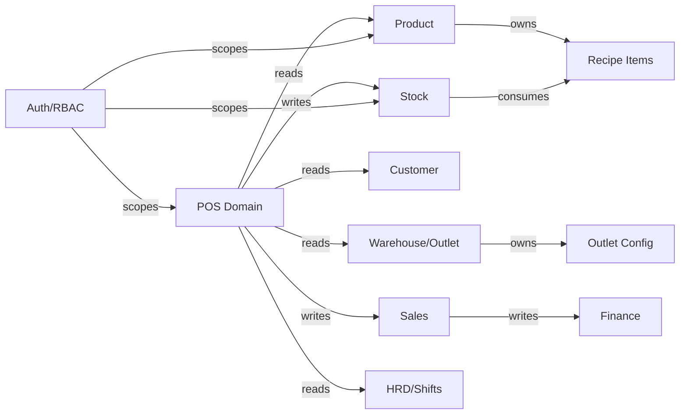

# POS F&B Module Mapping

> **Module:** POS -> Architecture -> Module Mapping
> **Sprint:** Draft Planning
> **Version:** 0.2.0
> **Status:** Draft
> **Last Updated:** April 2026

---

## Table of Contents

1. [Overview](#overview)
2. [Module Registry](#module-registry)
3. [Product Module Extensions](#product-module-extensions)
4. [Warehouse / Outlet Module](#warehouse--outlet-module)
5. [Stock / Inventory Module](#stock--inventory-module)
6. [POS Domain Module](#pos-domain-module)
7. [Sales Transaction Module](#sales-transaction-module)
8. [Customer and Loyalty Module](#customer-and-loyalty-module)
9. [HRD Integration](#hrd-integration)
10. [Finance Integration](#finance-integration)
11. [Module Interaction Diagram](#module-interaction-diagram)
12. [Feature to Module Mapping](#feature-to-module-mapping)
13. [Data Flow per Transaction Type](#data-flow-per-transaction-type)
14. [Notes and Improvements](#notes-and-improvements)

---

## Overview

This document maps every POS feature to its owning GIMS module, clarifying which domain is responsible for what. This prevents duplication and ensures each feature is built in the correct vertical slice.

### Guiding Principle

> The POS domain owns **order orchestration** and **floor management**. It **reads** from Product, Warehouse, and Customer. It **writes** to Stock and Sales. It never owns master data.

## Module Registry

| Module | Backend Path | Responsibilities |
|---|---|---|
| Product | `internal/product/` | Product catalog, product_kind, recipes, categories, pricing |
| Warehouse | `internal/warehouse/` | Warehouses, outlets (is_pos_outlet), geographic scope |
| Stock | `internal/stock/` | InventoryBatch, StockMovement, recipe explosion, FIFO deduction |
| POS | `internal/pos/` | Floor layout, live orders, table management, KDS |
| Sales | `internal/sales/` | Sales transactions, receipts, returns |
| Customer | `internal/customer/` | Customer master, loyalty, membership |
| HRD | `internal/hrd/` | Attendance, shifts, employee scheduling |
| Finance | `internal/finance/` | Revenue posting, payment reconciliation |
| Auth/RBAC | `internal/role/`, `internal/user/` | Permissions, WAREHOUSE scope, user-outlet assignment |

## Product Module Extensions

### New Fields (owned by Product module)

| Field | Table | Purpose |
|---|---|---|
| `product_kind` | `products` | System behavior enum: STOCK, RECIPE, SERVICE |
| `is_inventory_tracked` | `products` | Controls inventory batch tracking |
| `is_pos_available` | `products` | Controls POS catalog visibility |

### Recipe Management (owned by Product module)

| Entity | Table | Purpose |
|---|---|---|
| Recipe Items | `product_recipe_items` | BOM lines linking RECIPE product to STOCK ingredients |

### Endpoints

| Endpoint | Module Owner | POS Reads? |
|---|---|---|
| `GET /product/products` | Product | Yes (catalog) |
| `GET /product/products/:id` | Product | Yes (detail + recipe) |
| `GET /product/products/:id/recipe` | Product | Yes (recipe cost calc) |
| `PUT /product/products/:id/recipe` | Product | No (admin only) |
| `GET /product/products/form-data` | Product | Yes (categories, UOMs) |

## Warehouse / Outlet Module

### Outlet Configuration

POS outlets are warehouses with `is_pos_outlet = true`.

| Field | Table | Purpose |
|---|---|---|
| `is_pos_outlet` | `warehouses` | Marks warehouse as POS outlet |

### User-Outlet Assignment

| Entity | Table | Purpose |
|---|---|---|
| UserWarehouse | `user_warehouses` | Junction: which users can operate which outlets |

### Endpoints

| Endpoint | Module Owner | Description |
|---|---|---|
| `GET /warehouse/warehouses` | Warehouse | List all warehouses |
| `GET /warehouse/warehouses?is_pos_outlet=true` | Warehouse | List POS outlets |
| `GET /pos/outlets` | POS (reads Warehouse) | POS-specific outlet list for logged-in user |

See [warehouse-outlet-rbac.md](shared/warehouse-outlet-rbac.md) for details.

## Stock / Inventory Module

### Inventory Tracking

| Entity | Table | Purpose |
|---|---|---|
| InventoryBatch | `inventory_batches` | Per-product per-warehouse stock balance with batch tracking |
| StockMovement | `stock_movements` | Append-only ledger: IN, OUT, ADJUST, TRANSFER |

### POS Stock Operations

| Operation | Triggered By | Stock Module Action |
|---|---|---|
| Direct sale (STOCK product) | POS order confirmed | StockMovement(OUT), reduce InventoryBatch |
| Recipe sale (RECIPE product) | POS order confirmed | Recipe explosion → per-ingredient StockMovement(OUT) |
| Service sale | POS order confirmed | No stock impact |
| Sale void/return | POS void | StockMovement(IN), increase InventoryBatch |

### Stock Sufficiency Check

Before confirming a sale:
1. For STOCK: Check `inventory_batches` balance >= ordered qty.
2. For RECIPE: Check ALL ingredient balances >= consumed qty (recipe_qty * sale_qty).
3. For SERVICE: Skip stock check.

Insufficient stock on any line item rejects the sale (atomic).

## POS Domain Module

### Owns

| Feature | Description |
|---|---|
| Floor Layout | Zones, tables, seats, visual editor |
| Live Orders | Active order tracking per table/counter |
| Table Management | Status (available, occupied, reserved, cleaning) |
| Kitchen Display | Order routing to kitchen stations |
| POS Session | Shift open/close, cash drawer |

### Does NOT Own

| Feature | Owned By |
|---|---|
| Product catalog | Product |
| Stock deduction | Stock |
| Sales receipt | Sales |
| Customer data | Customer |
| User permissions | Auth/Role |
| Outlet master data | Warehouse |

## Sales Transaction Module

### POS Transaction Flow

```
POS Order Confirmed
    → Stock deduction (Stock module)
    → Sales Transaction created (Sales module)
    → Receipt generated (Sales module)
    → Payment recorded (Finance module)
    → Loyalty points (Customer module, if applicable)
```

### Sales-POS Integration

| Aspect | Handling |
|---|---|
| Transaction type | `POS_SALE` (new enum) |
| Outlet reference | `warehouse_id` on transaction |
| Line items | Product references with qty, price, discount |
| Payment methods | Cash, Card, QRIS, Multi-payment |

## Customer and Loyalty Module

### POS Integration Points

| Feature | Module | POS Usage |
|---|---|---|
| Customer lookup | Customer | Search by phone/name at checkout |
| Loyalty points | Customer | Earn points per transaction |
| Membership tier | Customer | Tier-based discounts |
| Customer history | Customer | View past orders |

See [customer-loyalty-feedback.md](fnb/customer-loyalty-feedback.md) for details.

## HRD Integration

### Shift Management

| Feature | Module | POS Usage |
|---|---|---|
| Employee shifts | HRD | Validate cashier is on-shift |
| Attendance | HRD | Clock-in/out at outlet |
| Scheduling | HRD | Staff assignment per outlet |

## Finance Integration

### Revenue and Payment

| Feature | Module | POS Usage |
|---|---|---|
| Payment processing | Finance | Record payment methods and amounts |
| Revenue posting | Finance | Automatic journal entries per sale |
| Cash reconciliation | Finance | End-of-shift cash count vs system |
| Tax calculation | Finance | VAT/service charge per sale |

## Module Interaction Diagram



## Feature to Module Mapping

| POS Feature | Primary Module | Supporting Modules |
|---|---|---|
| Product catalog display | Product | — |
| Recipe management | Product | — |
| Menu/catalog picker | POS (reads Product) | Product |
| Floor layout editor | POS | — |
| Table management | POS | — |
| Order creation | POS | Product, Stock |
| Stock deduction | Stock | Product (recipe) |
| Payment processing | Finance | Sales |
| Receipt generation | Sales | POS |
| Customer loyalty | Customer | POS |
| Cashier shift | HRD | POS |
| Outlet management | Warehouse | POS |
| User-outlet assignment | Auth/User | Warehouse |
| POS reports | Report | POS, Sales, Stock |
| Kitchen display | POS | — |

## Data Flow per Transaction Type

### Goods Sale (Mode A)

```
1. User scans product (STOCK kind)
2. POS → Product: Get product detail + price
3. POS → Stock: Check availability in outlet warehouse
4. User confirms payment
5. POS → Stock: StockMovement(OUT) per item
6. POS → Sales: Create SalesTransaction
7. POS → Finance: Record payment
8. POS → Customer: Award loyalty points (optional)
```

### F&B Sale (Mode B)

```
1. Staff selects table, takes order (RECIPE + SERVICE items)
2. POS → Product: Get product detail + recipe items
3. POS → Kitchen: Send order ticket
4. Kitchen prepares, marks items ready
5. Staff serves items
6. Customer requests bill
7. POS → Stock: Recipe explosion per RECIPE item
8.   For each recipe_item: StockMovement(OUT) per ingredient
9. POS → Sales: Create SalesTransaction with table reference
10. POS → Finance: Record payment (cash/card/QRIS/split)
11. POS → Customer: Award loyalty points (optional)
12. POS: Release table
```

## Notes and Improvements

### Current State

- Product module extended with product_kind, recipe support.
- Warehouse module extended with is_pos_outlet.
- POS domain has floor layout feature.
- Stock module has InventoryBatch and StockMovement.

### Planned

- Kitchen Display System (KDS) as POS sub-module.
- Real-time WebSocket for live order and kitchen sync.
- Offline-first POS mode with sync queue.
- Multi-printer routing (kitchen, bar, receipt).
- POS analytics dashboard.

### Module Boundaries to Watch

- Stock deduction logic must stay in Stock module, not POS.
- Recipe detail must stay in Product module, not POS.
- Payment processing must stay in Finance module, not POS.
- POS orchestrates but does not own cross-cutting data.
