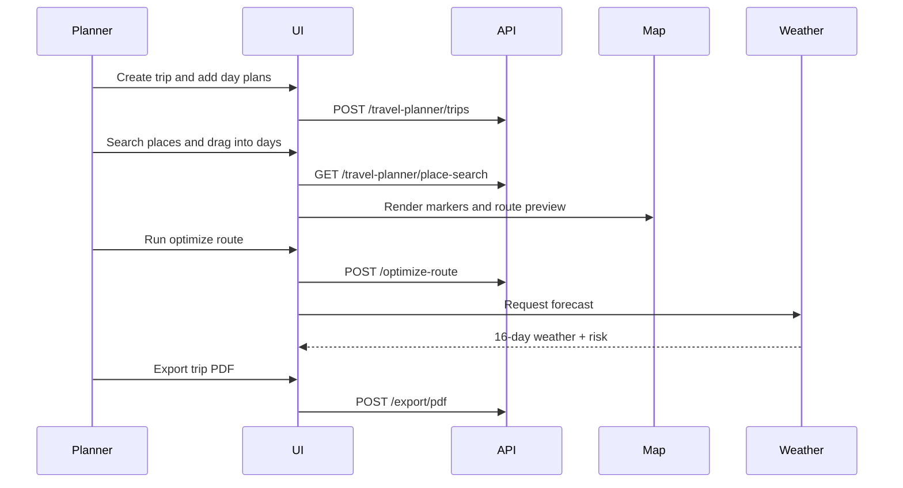
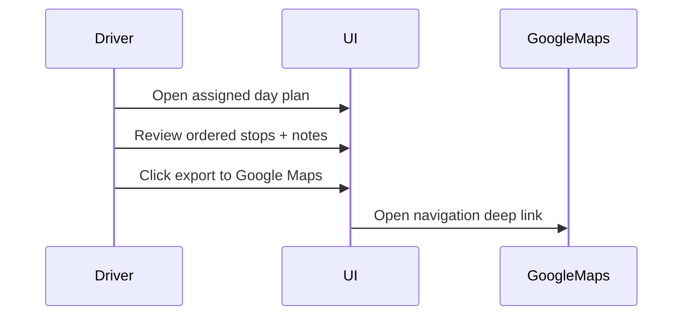

# Travel Planner Collaborative Advance

> **Module:** Travel Planner
> **Sprint:** Post Migration Implementation
> **Version:** 1.0
> **Status:** In Progress
> **Last Updated:** March 2026

---

## Table of Contents

1. [Overview](#overview)
2. [Features](#features)
3. [System Architecture](#system-architecture)
4. [Data Models](#data-models)
5. [Business Logic](#business-logic)
6. [API Reference](#api-reference)
7. [Frontend Components](#frontend-components)
8. [User Flows](#user-flows)
9. [Permissions](#permissions)
10. [Integration Points](#integration-points)
11. [Testing Strategy](#testing-strategy)
12. [Keputusan Teknis](#keputusan-teknis)
13. [Notes and Improvements](#notes-and-improvements)
14. [Appendix](#appendix)

---

## Overview

Travel Planner is the new parent module for multi-role travel planning across logistics driver operations, cargo, vessel routes, and milestone-based travel execution.

Initial strategy:
- Keep existing Up Country Cost workflow operational.
- Move Up Country Cost under Travel Planner parent.
- Incrementally add collaborative planning capabilities.

### Key Features

| Feature | Description |
|--------|-------------|
| Parent Module Migration | Move Up Country Cost from Finance feature namespace into Travel Planner parent domain |
| Day-by-Day Itinerary | Drag-drop planning per day with reorder and cross-day move |
| Interactive Map | Leaflet map with clustering, route lines, tile switching, and category filtering |
| Place Search | Provider strategy: Google Places + OpenStreetMap fallback |
| Route Optimization | Automatic stop order optimization with manual lock support |
| Weather Layer | 16-day forecast from Open-Meteo + historical fallback |
| PDF Export | Full trip and per-day branded export |

---

## Features

### 1. Module Migration (Foundation)

Mandatory first implementation step:
- Move frontend feature path:
  - from `apps/web/src/features/finance/up-country-cost`
  - to `apps/web/src/features/travel/travel-planner/up-country-cost`
- Add parent route `/travel/travel-planner`
- Main child route `/travel/travel-planner/up-country-cost`
- Update navigation, route validation, and notification deep links

### 2. Itinerary Planner

- Day columns with drag-drop board interaction.
- Itinerary items include place/activity type, duration, and priority.
- Day Notes include:
  - timestamp
  - icon tag
  - note text
  - drag-drop reorder support

### 3. Interactive Map

- Cluster markers for dense stop sets.
- Photo-aware marker popup cards.
- Route line rendering based on day order.
- Filter chips to toggle pin categories.
- Tile style switcher integrated with current map architecture.

### 4. Place Search

- Search pipeline:
  1. Google Places (if API key and quota available)
  2. OpenStreetMap fallback
- Search results can be inserted directly into itinerary day slots.

### 5. Route Optimization

- Optimize sequence by minimizing travel time/distance.
- Keep fixed milestone points as locked anchors.
- Export day route to Google Maps deep link.

### 6. Weather and Risk Visibility

- Open-Meteo forecast up to 16 days.
- Historical climate fallback when forecast unavailable.
- Risk badge model:
  - low
  - medium
  - high

### 7. PDF Export

- Full trip export includes cover, summary, itinerary, notes, images.
- Day-specific export action available from day card context menu.

---

## System Architecture

### Frontend Structure (Target)

```text
apps/web/src/features/travel/travel-planner/
├── up-country-cost/                  # existing migrated module
│   ├── components/
│   ├── hooks/
│   ├── i18n/
│   ├── schemas/
│   ├── services/
│   └── types/
├── itinerary/
│   ├── components/
│   ├── hooks/
│   ├── services/
│   └── types/
├── map-planner/
│   ├── components/
│   ├── hooks/
│   └── types/
├── route-optimization/
├── weather/
└── export/
```

### Existing Map Components to Reuse

```text
apps/web/src/components/ui/map/
├── map-view.tsx
├── map-inner.tsx
├── map-sidebar.tsx
├── map-picker.tsx
├── map-picker-modal.tsx
└── marker-cluster-group.tsx
```

### Backend Direction (Planned)

```text
apps/api/internal/travel_planner/
├── data/models/
├── data/repositories/
├── domain/dto/
├── domain/mapper/
├── domain/usecase/
└── presentation/
```

---

## Data Models

| Entity | Purpose | Key Fields |
|-------|---------|------------|
| `travel_plans` | Main plan container | id, code, title, mode, start_date, end_date, status, created_by |
| `travel_plan_days` | Day-level itinerary container | id, travel_plan_id, day_index, day_date, weather_risk |
| `travel_plan_stops` | Place/activity line item | id, travel_plan_day_id, place_name, latitude, longitude, category, order_index |
| `travel_plan_day_notes` | Sortable notes per day | id, travel_plan_day_id, icon_tag, note_text, note_time, order_index |
| `travel_route_snapshot` | Optimization result | id, trip_id/day_plan_id, polyline, total_distance_km, total_duration_min |
| `travel_weather_snapshot` | Forecast and fallback cache | id, day_plan_id, source, forecast_date, rain_prob, temp_min, temp_max |
| `travel_export_job` | PDF generation tracking | id, trip_id/day_plan_id, format, status, file_url |

---

## Business Logic

- Day plan order is canonical for route rendering.
- Locked itinerary items cannot be moved by optimizer.
- Optimizer runs only when a day has at least 3 unlocked stops.
- Weather fallback is used when forecast API fails or date is outside forecast window.
- Export audit log stores who generated file and when.

---

## API Reference

| Method | Endpoint | Permission | Description |
|--------|----------|------------|-------------|
| GET | `/api/v1/travel-planner/form-data` | `up_country_cost.read` | Fetch planner enums (modes/categories/sources) |
| GET | `/api/v1/travel-planner/place-search` | `up_country_cost.read` | Search place providers |
| GET | `/api/v1/travel-planner/plans` | `up_country_cost.read` | List plans |
| POST | `/api/v1/travel-planner/plans` | `up_country_cost.create` | Create plan |
| GET | `/api/v1/travel-planner/plans/:id` | `up_country_cost.read` | Plan detail |
| PUT | `/api/v1/travel-planner/plans/:id` | `up_country_cost.update` | Update plan |
| DELETE | `/api/v1/travel-planner/plans/:id` | `up_country_cost.delete` | Delete plan |
| POST | `/api/v1/travel-planner/plans/:id/optimize-route` | `up_country_cost.update` | Optimize route order |
| GET | `/api/v1/travel-planner/plans/:id/weather` | `up_country_cost.read` | Weather summary |
| GET | `/api/v1/travel-planner/plans/:id/google-maps-links` | `up_country_cost.read` | Day route deep links |
| GET | `/api/v1/travel-planner/plans/:id/export/pdf` | `up_country_cost.read` | Export full/day PDF |

---

## Frontend Components

| Component | File (planned) | Description |
|----------|----------------|-------------|
| `TravelPlannerPage` | `apps/web/src/features/travel-planner/components/travel-planner-page.tsx` | Parent module landing page |
| `ItineraryBoard` | `apps/web/src/features/travel-planner/itinerary/components/itinerary-board.tsx` | Day-by-day drag-drop planner |
| `DayNotesPanel` | `apps/web/src/features/travel-planner/itinerary/components/day-notes-panel.tsx` | Timestamped icon-tag notes per day |
| `TravelMapCanvas` | `apps/web/src/features/travel-planner/map-planner/components/travel-map-canvas.tsx` | Map with markers/route/filter |
| `PlaceSearchDialog` | `apps/web/src/features/travel-planner/itinerary/components/place-search-dialog.tsx` | Search and insert places |
| `RouteOptimizerPanel` | `apps/web/src/features/travel-planner/route-optimization/components/route-optimizer-panel.tsx` | Optimization controls and summary |
| `WeatherStrip` | `apps/web/src/features/travel-planner/weather/components/weather-strip.tsx` | 16-day forecast strip |
| `ExportTripDialog` | `apps/web/src/features/travel-planner/export/components/export-trip-dialog.tsx` | PDF export options |

---

## User Flows

### Collaborative Planning Flow



### Driver Execution Flow



---

## Permissions

| Permission | Description |
|-----------|-------------|
| `travel_planner.read` | View Travel Planner parent menu |
| `up_country_cost.read` | Access migrated Up Country Cost module |

---

## Integration Points

- Existing Up Country Cost module and approval flows.
- Shared map UI layer under `components/ui/map`.
- Google Places API (optional) + OpenStreetMap fallback.
- Open-Meteo for forecast.
- Google Maps deep link export.
- PDF generation service (backend job queue recommended).

---

## Testing Strategy

### Manual Testing

1. Open `/travel-planner` and confirm module cards appear.
2. Open `/travel-planner/up-country-cost` and confirm feature parity with old flow.
3. Validate notification deep link opens new route.
4. Validate legacy `/finance/up-country-cost` route redirects correctly.

### Automated Testing (Planned)

- Unit tests:
  - itinerary reorder logic
  - optimization lock handling
  - weather fallback logic
- Integration tests:
  - place search fallback behavior
  - export job pipeline
- E2E:
  - create trip -> reorder -> optimize -> export

---

## Keputusan Teknis

- **Parent-first migration strategy**:
  - Why: minimize operational disruption while introducing new module structure.
  - Trade-off: temporary naming mismatch (`financeUpCountryCost` namespace) can remain during transition.

- **Map component reuse**:
  - Why: existing Leaflet and marker cluster stack is already stable.
  - Trade-off: advanced map interactions may require extending existing generic components.

- **Dual search provider approach**:
  - Why: resilience against quota and API key constraints.
  - Trade-off: data consistency differs between providers.

- **Asynchronous full PDF export**:
  - Why: heavy rendering should not block UI/API request cycles.
  - Trade-off: users need export job status tracking.

---

## Notes and Improvements

- Existing Up Country Cost APIs remain in finance domain for backward compatibility.
- Permission seeder now maps `up_country_cost.*` to `/travel-planner/up-country-cost` and adds `travel_planner.read` for parent menu visibility.
- Consider collaborative editing conflict strategy (last-write-wins vs optimistic lock).

---

## Appendix

### Implementation Checklist

- [x] Move feature directory to Travel Planner parent namespace.
- [x] Add parent route and child route.
- [x] Update navigation, route validator, and notification deep links.
- [x] Update menu seeder for Travel Planner parent menu.
- [x] Update permission seeder URL bindings and parent menu permission.
- [x] Add baseline seeder for 2 travel plans linked to employee master data (`created_by`).
- [ ] Implement itinerary board and day-note drag-drop.
- [ ] Implement map category filters and route overlays.
- [ ] Implement search provider orchestration.
- [ ] Implement optimization service.
- [ ] Implement weather service and fallback logic.
- [ ] Implement PDF export pipeline.
