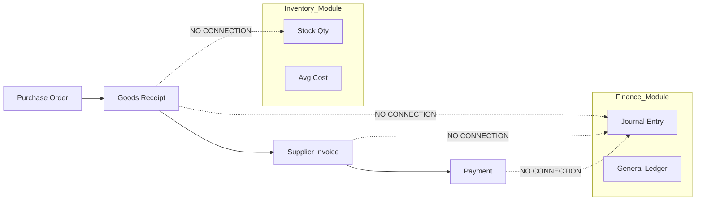
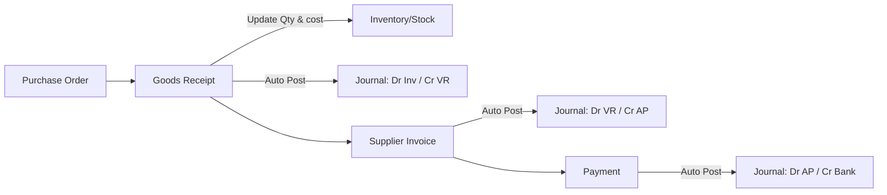

# Gap Analysis: Purchase to Finance & Inventory Flow

> **Date:** 2026-02-17
> **Status:** 🟢 FULLY IMPLEMENTED (Verified)
> **Reviewer:** Antigravity AI

## 1. Executive Summary

The current system **fails** to fulfill the requirement of "integrated data flow from Purchase to Finance". While the **operational flow** (documents moving from PO → GR → SI → Payment) works conceptually in the Purchase module, there is **ZERO integration** with the Finance (General Ledger) and Inventory (Stock) modules.

**The system is currently operating in silos:**
- **Purchase Module:** Tracks document statuses successfully.
- **Finance Module:** Supports manual journaling and direct payments, but **receives no data** from Purchase.
- **Inventory Module:** Standard structure exists, but is **not updated** by Goods Receipts.

---

## 2. Detailed Gap Analysis

### A. Missing Accounting Journals (Finance Integration)

Standard ERP behavior requires automatic journal postings at three key events. None of these exist in the current codebase.

| Event | Required Journal (Standard) | Current Status | Impact |
| :--- | :--- | :--- | :--- |
| **Goods Receipt (GR) Confirm** | **Dr** Inventory (Asset) **Cr** Unbilled Payables (GR/IR) | ❌ **MISSING** No journal created. | Assets & Liabilities understated. Balance Sheet invalid. |
| **Supplier Invoice (SI) Posting** | **Dr** Unbilled Payables (GR/IR) **Dr** Tax (VAT In) **Cr** Accounts Payable (Vendor) | ❌ **MISSING** Status updates to `UNPAID` only. | No debt recorded in GL. Tax report invalid. |
| **Purchase Payment Confirm** | **Dr** Accounts Payable (Vendor) **Cr** Bank/Cash | ❌ **MISSING** Status updates to `CONFIRMED` only. | Cash/Bank balance in GL not reduced. Vendor sub-ledger not updated. |

### B. Missing Stock Updates (Inventory Integration)

| Event | Required Action | Current Status | Impact |
| :--- | :--- | :--- | :--- |
| **Goods Receipt (GR) Confirm** | 1. Increase **Quantity On Hand** 2. Update **Moving Average Cost (HPP)** | ❌ **MISSING** Only document created. | **Stock remains 0** even after buying. **HPP never updates**, causing wrong Profit/Loss in Sales. |

---

## 3. Data Flow Diagram (Current vs Target)

### Current State (Disconnected)

### Target State (Integrated)

---

## 4. Recommendations & Action Plan

To fix this, we need to implement an **Event-Driven** or **Direct Service** integration layer.

### Phase 1: Inventory Integration
1.  **Modify `GoodsReceiptUsecase.Confirm`**:
    *   Inject `InventoryService`.
    *   Call `inventoryService.AddStock(qty, cost)` for each item.
    *   Update `Product.CurrentHpp`.

### Phase 2: Finance Integration (Journaling)
1.  **Create `JournalService` Facade**:
    *   Allow other modules to post standard journals easily.
2.  **Modify `GoodsReceiptUsecase.Confirm`**:
    *   Post **Inventory Accrual** journal.
3.  **Modify `SupplierInvoiceUsecase.Create` (or Approve)**:
    *   Post **AP Recognition** journal.
4.  **Modify `PurchasePaymentUsecase.Confirm`**:
    *   Post **Bank Payment** journal.

### Phase 3: Configuration
*   Ensure **Chart of Accounts (COA)** configuration exists for:
    *   Inventory Account (Asset)
    *   GR/IR Clearing Account (Liability)
    *   Accounts Payable (Liability)
    *   VAT Input (Asset)

## 5. Implementation Status (2026-02-17)

| Feature | Status | Notes |
| :--- | :--- | :--- |
| **Inventory Integration** | ✅ **DONE** | Validated via `InventoryUsecase.ReceiveStockFromGR`. |
| **GR Journal (Accrual)** | ✅ **DONE** | Validated via `GoodsReceiptUsecase.triggerJournalEntry`. |
| **SI Journal (AP)** | ✅ **DONE** | Validated via `SupplierInvoiceUsecase.triggerJournalEntry`. |
| **Payment Journal** | ✅ **DONE** | Validated via `PurchasePaymentUsecase.triggerJournalEntry`. |
